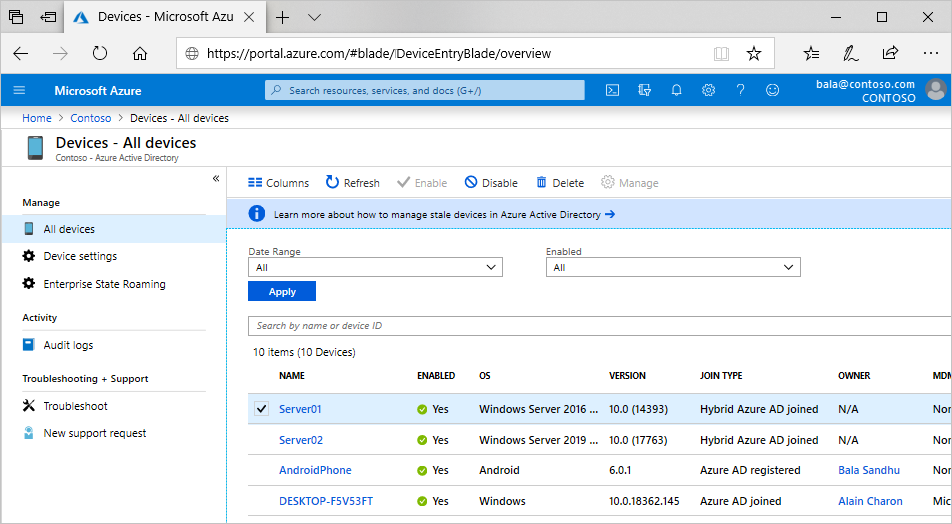

# What is a device identity?

A [device identity](/graph/api/resources/device) is an object in Microsoft Entra ID. This device object is similar to users, groups, or applications. A device identity gives administrators information they can use when making access or configuration decisions.

There are three ways to get a device identity:

- Microsoft Entra registration
- Microsoft Entra join
- Microsoft Entra hybrid join

Device identities are a prerequisite for scenarios like [device-based Conditional Access policies](../conditional-access/concept-conditional-access-grant.md) and [Mobile Device Management with the Microsoft Intune family of products](/mem/endpoint-manager-overview).

## Modern device scenario

The modern device scenario focuses on two of these methods: 

- [Microsoft Entra registration](concept-device-registration.md) 
   - Bring your own device (BYOD)
   - Mobile device (cell phone and tablet)
- [Microsoft Entra join](concept-directory-join.md)
   - Windows 11 and Windows 10 devices owned by your organization
   - [Windows Server 2019 and newer servers in your organization running as VMs in Azure](howto-vm-sign-in-azure-ad-windows.md)

[Microsoft Entra hybrid join](concept-hybrid-join.md) is seen as an interim step on the road to Microsoft Entra join. Microsoft Entra hybrid join provides organizations support for downlevel Windows versions back to Windows 7 and Server 2008. All three scenarios can coexist in a single organization.

## Resource access

Registering and joining devices to Microsoft Entra ID gives users Seamless Sign-on (SSO) to cloud-based resources.

Devices that are Microsoft Entra joined benefit from [SSO to your organization's on-premises resources](device-sso-to-on-premises-resources.md).

## Provisioning

Getting devices in to Microsoft Entra ID can be done in a self-service manner or a controlled process managed by administrators.

## Next steps

- Learn more about [Microsoft Entra registered devices](concept-device-registration.md)
- Learn more about [Microsoft Entra joined devices](concept-directory-join.md)
- Learn more about [Microsoft Entra hybrid joined devices](concept-hybrid-join.md)
- To get an overview of how to manage device identities, see [Managing device identities](manage-device-identities.md).
- To learn more about device-based Conditional Access, see [Configure Microsoft Entra device-based Conditional Access policies](../conditional-access/concept-conditional-access-grant.md).
