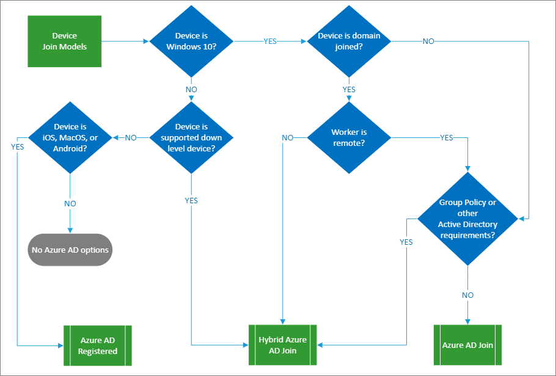

# Plan your Azure Active Directory device deployment

This article helps you evaluate the methods to integrate your device with Azure AD, choose the implementation plan, and provides key links to supported device management tools.

The landscape of devices from which your users sign in is expanding. Organizations may provide desktops, laptops, phones, tablets, and other devices. Your users may bring their own array of devices, and access information from varied locations. In this environment, your job as an administrator is to keep your organizational resources secure across all devices.

Azure Active Directory (Azure AD) enables your organization to meet these goals with device identity management. You can now get your devices in Azure AD and control them from a central location in the [Azure portal](https://portal.azure.com/). This gives you a unified experience, enhanced security, and reduces the time needed to configure a new device.

There are multiple methods to integrate your devices into Azure AD:

* You can [register devices](concept-azure-ad-register.md) with Azure AD

* [Join devices](concept-azure-ad-join.md) to Azure AD (cloud-only) or

* [Create a hybrid Azure AD join](concept-azure-ad-join-hybrid.md) in between devices in your on-premises Active Directory and Azure AD. 

## Learn

Before you begin, make sure that you're familiar with the [device identity management overview](overview.md).

### Benefits

The key benefits of giving your devices an Azure AD identity:

* Increase productivity – With Azure AD, your users can do [seamless sign-on (SSO)](./azuread-join-sso.md) to your on-premises and cloud resources, which enables them to be productive wherever they are.

* Increase security – Azure AD devices enable you to apply [Conditional Access (CA) policies](../conditional-access/require-managed-devices.md) to resources based on the identity of the device or user. CA policies can offer extra protection using [Azure AD Identity Protection](../identity-protection/overview-identity-protection.md). Joining a device to Azure AD is a prerequisite for increasing your security with a [Passwordless Authentication](../authentication/concept-authentication-passwordless.md) strategy.

* Improve user experience – With device identities in Azure AD, you can provide your users with easy access to your organization’s cloud-based resources from both personal and corporate devices. Administrators can enable [Enterprise State Roaming](enterprise-state-roaming-overview.md) for a unified experience across all Windows devices.

* Simplify deployment and management – Device identity management simplifies the process of bringing devices to Azure AD with [Windows Autopilot](https://docs.microsoft.com/windows/deployment/windows-autopilot/windows-10-autopilot), [bulk provisioning](https://docs.microsoft.com/mem/intune/enrollment/windows-bulk-enroll), and [self-service: Out of Box Experience (OOBE)](../user-help/user-help-join-device-on-network.md). You can manage these devices with Mobile Device Management (MDM) tools like [Microsoft Intune](https://docs.microsoft.com/mem/intune/fundamentals/what-is-intune), and their identities in [Azure portal](https://portal.azure.com/).

### Training resources

Video:  [Conditional access with device controls](https://youtu.be/NcONUf-jeS4)

FAQs: [Azure AD device management FAQ](faq.md)  and [Settings and data roaming FAQ](enterprise-state-roaming-faqs.md) 

## Plan the deployment project

Consider your organizational needs while you determine the strategy for this deployment in your environment.

### Engage the right stakeholders

When technology projects fail, they typically do so due to mismatched expectations on impact, outcomes, and responsibilities. To avoid these pitfalls, [ensure that you are engaging the right stakeholders](https://aka.ms/deploymentplans) and that stakeholder roles in the project are well understood. 

For this plan, add the following stakeholders to your list:

| Role| Description |
| - | - |
| Device administrator| A representative from the device team that can verify that the plan will meet the device requirements of your organization. |
| Network administrator| A representative from the network team that can make sure to meet network requirements. |
| Device management team| Team that manages inventory of devices. |
| OS-specific admin teams| Teams that support and manage specific OS versions. For example, there may be a Mac or iOS focused team. |

### Plan communications

Communication is critical to the success of any new service. Proactively communicate with your users how their experience will change, when it will change, and how to gain support if they experience issues.

### Plan a pilot

We recommend that the initial configuration of your integration method is in a test environment, or with a small group of test devices. See [Best practices for a pilot](../fundamentals/active-directory-deployment-plans.md).

Hybrid Azure AD join deployment is straightforward, and it's 100% an administrator’s task without end user action necessary. You may want to do a [controlled validation of hybrid Azure AD join](hybrid-azuread-join-control.md) before enabling it across the entire organization all at once.

## Choose your integration methods

Your organization can use multiple device integration methods in a single Azure AD tenant. The goal is to choose the method(s) suitable to get your devices securely managed in Azure AD. There are many parameters that drive this decision including ownership, device types, primary audience, and your organization’s infrastructure.

The following information can help you decide which integration methods to use.

### Decision tree for devices integration

Use this tree to determine options for organization-owned devices. 

> [!NOTE]
> Personal or bring-your-own device (BYOD) scenarios are not pictured in this diagram. They  always result in Azure AD registration.

 

### Comparison matrix

iOS and Android devices may only be Azure AD registered. The following table presents high-level considerations for Windows client devices. Use it as an overview, then explore the different integration methods in detail.

| | Azure AD registered| Azure AD join| Hybrid Azure AD join |
| - | - | - | - |
| **Client operating systems**| | |  |
| Windows 10 devices| | |  |
| Windows down-level devices (Windows 8.1 or Windows 7)| | |  |
|**Sign in options**| | |  |
| End-user local credentials| | |  |
| Password| | |  |
| Device PIN| | |  |
| Windows Hello| | |  |
| Windows Hello for Business| | |  |
| FIDO 2.0 security keys| | |  |
| Microsoft Authenticator App (passwordless)| | |  |
|**Key capabilities**| | |  |
| SSO to cloud resources| | |  |
| SSO to on-premises resources| | |  |
| Conditional Access   (Require devices be marked as compliant)   (Must be managed by MDM)|  | | |
Conditional Access  (Require hybrid Azure AD joined devices)| | | 
| Self-service password reset from windows login screen| | |  |
| Windows hello PIN reset| | |  |
| Enterprise state roaming across devices| | |  |

## Azure AD Registration 

Registered devices are often managed with [Microsoft Intune](https://docs.microsoft.com/mem/intune/enrollment/device-enrollment). Devices are enrolled in Intune in a number of ways, depending on the operating system. 

Azure AD registered devices provide support for Bring Your Own Devices (BYOD) and corporate owned devices to SSO to cloud resources. Access to resources is based on the Azure AD [CA policies](../conditional-access/require-managed-devices.md) applied to the device and the user.

### Registering devices

Registered devices are often managed with [Microsoft Intune](https://docs.microsoft.com/mem/intune/enrollment/device-enrollment). Devices are enrolled in Intune in a number of ways, depending on the operating system. 

BYOD and corporate owned mobile device are registered by users installing the Company portal app.

* [iOS](https://docs.microsoft.com/mem/intune/user-help/install-and-sign-in-to-the-intune-company-portal-app-ios)

* [Android](https://docs.microsoft.com/mem/intune/user-help/enroll-device-android-company-portal)

* [Windows 10](https://docs.microsoft.com/mem/intune/user-help/enroll-windows-10-device)

If registering your devices is the best option for your organization, see the following resources:

* This overview of [Azure AD registered devices](concept-azure-ad-register.md).

* This end-user documentation on [Register your personal device on your organization’s network](../user-help/user-help-register-device-on-network.md).

## Azure AD join

Azure AD join enables you to transition towards a cloud-first model with Windows. It provides a great foundation if you're planning to modernize your device management and reduce device-related IT costs. Azure AD join works with Windows 10 devices only. Consider it as the first choice for new devices.

However, [Azure AD joined devices can SSO to on-premises resources](azuread-join-sso.md) when they are on the organization's network, can authenticate to on-premises servers like file, print, and other applications.

If this is the best option for your organization, see the following resources:

* This overview of [Azure AD joined devices](concept-azure-ad-join.md).

* Familiarize yourself with the [Azure AD Join implementation plan](azureadjoin-plan.md).

### Provisioning Azure AD Join to your devices

To provision Azure AD Join, you have the following approaches:

* Self-Service: [Windows 10 first-run experience](azuread-joined-devices-frx.md)

If you have either Windows 10 Professional or Windows 10 Enterprise installed on a device, the experience defaults to the setup process for company-owned devices.

* [Windows Out of Box Experience (OOBE) or from Windows Settings](../user-help/user-help-join-device-on-network.md)

* [Windows Autopilot](https://docs.microsoft.com/windows/deployment/windows-autopilot/windows-autopilot)

* [Bulk Enrollment](https://docs.microsoft.com/mem/intune/enrollment/windows-bulk-enroll)

Choose your deployment procedure after careful [comparison of these approaches](azureadjoin-plan.md).

You may determine that Azure AD Join is the best solution for a device, and that device may already be in a different states. Here are the upgrade considerations.

| Current device state| Desired device state| How-to |
| - | - | - |
| On-premises domain joined| Azure AD Join| Unjoin the device from on-premises domain before joining to Azure AD |
| Hybrid Azure AD Join| Azure AD Join| Unjoin the device from on-premises domain and from Azure AD before joining to Azure AD |
| Azure AD registered| Azure AD Join| Unregister the device before joining to Azure AD |

## Hybrid Azure AD join

If you have an on-premises Active Directory environment and you want to join your Active directory domain-joined computers to Azure AD, you can accomplish this with hybrid Azure AD join. It supports a [broad range of Windows devices](hybrid-azuread-join-plan.md), including both Windows current and Windows down-level devices.

Most organizations already have domain joined devices and manage them via Group Policy or System Center Configuration Manager (SCCM). In that case, we recommend configuring hybrid Azure AD Join to start getting benefits while leveraging existing investment.

If hybrid Azure AD join is the best option for your organization, see the following resources:

* This overview of [Hybrid Azure AD joined devices](concept-azure-ad-join-hybrid.md).

* Familiarize yourself with the [Hybrid Azure AD join implementation](hybrid-azuread-join-plan.md) plan.

### Provisioning hybrid Azure AD join to your devices

[Review your identity infrastructure](hybrid-azuread-join-plan.md). Azure AD Connect provides you with a wizard to configure hybrid Azure AD Join for:

* [Federated domains](hybrid-azuread-join-federated-domains.md)

* [Managed domains](hybrid-azuread-join-managed-domains.md)

If installing the required version of Azure AD Connect isn't an option for you, see [how to manually configure Hybrid Azure AD join](hybrid-azuread-join-manual.md). 

> [!NOTE] 
> The on-premises domain-joined Windows 10 device attempts to auto-join to Azure AD to become Hybrid Azure AD joined by default. This will only succeed if you haves set up the right environment. 

You may determine that Hybrid Azure AD Join is the best solution for a device, and that device may already be in a different state. Here are the upgrade considerations.

| Current device state| Desired device state| How-to |
| - | - | - |
| On-premises domain join| Hybrid Azure AD Join| Use Azure AD connect or AD FS to join to Azure |
| On-premises workgroup joined or new| Hybrid Azure AD Join| Supported with [Windows Autopilot](https://docs.microsoft.com/windows/deployment/windows-autopilot/windows-autopilot). Otherwise device needs to be on-premises domain joined before Hybrid Azure AD Join |
| Azure AD joined| Hybrid Azure AD Join| Unjoin from Azure AD, which puts it in the on-premises workgroup or new state. |
| Azure AD registerd| Hybrid Azure AD Join| Depends on Windows version. [See these considerations](hybrid-azuread-join-plan.md). |

## Manage your devices

Once you have registered or joined your devices to Azure AD, use the [Azure portal](https://portal.azure.com/) as a central place to manage your device identities. The Azure Active Directory devices page enables you to:

* [Configure your device settings](device-management-azure-portal.md#configure-device-settings)
* You need to be a local administrator to manage Windows devices. [Azure AD updates this membership for Azure AD joined devices](assign-local-admin.md), automatically adding those with the device manager role as administrators to all joined devices.

* [Locate devices](device-management-azure-portal.md#locate-devices)

* [Perform device identity management tasks](device-management-azure-portal.md#device-identity-management-tasks)

Make sure that you keep the environment clean by [managing stale devices](manage-stale-devices.md), and focus your resources on managing current devices.

* [Review device-related audit logs](device-management-azure-portal.md#audit-logs)

### Supported device management tools

Administrators can secure and further control these registered and joined devices using additional device management tools. These tools provide a means to enforce organization-required configurations like requiring storage to be encrypted, password complexity, software installations, and software updates. 

Review supported and unsupported platforms for integrated devices:

| Device management tools| Azure AD registered| Azure AD join| Hybrid Azure AD join|
| - | - | - | - |
| [Mobile Device Management (MDM) ](https://docs.microsoft.com/windows/client-management/mdm/azure-active-directory-integration-with-mdm)  Example: Microsoft Intune| | | |  |
| [Co management with Microsoft Intune and Microsoft Endpoint Configuration Manager](https://docs.microsoft.com/mem/configmgr/comanage/overview)  (Windows 10 and later)| | | |  |
| [Group policy](https://docs.microsoft.com/previous-versions/windows/it-pro/windows-server-2012-R2-and-2012/hh831791(v=ws.11)) (Windows only)| | | |  |

 We recommend that you consider [Microsoft Intune Mobile Application management (MAM)](https://docs.microsoft.com/mem/intune/apps/app-management) with or without device management for registered iOS or Android devices.

 Administrators can also [deploy virtual desktop infrastructure (VDI) platforms](howto-device-identity-virtual-desktop-infrastructure.md) hosting Windows operating systems in their organizations to streamline management and reduce costs through consolidation and centralization of resources. 

### Troubleshoot device identities

* [Troubleshooting devices using the dsregcmd command](troubleshoot-device-dsregcmd.md)

* [Troubleshooting Enterprise State Roaming settings in Azure Active Directory](enterprise-state-roaming-troubleshooting.md)

If you experience issues with completing hybrid Azure AD join for domain-joined Windows devices, see:

* [Troubleshoot hybrid Azure AD join for Windows current devices](troubleshoot-hybrid-join-windows-current.md)

* [Troubleshoot hybrid Azure AD join for Windows down level devices](troubleshoot-hybrid-join-windows-legacy.md)

## Next steps

* [Plan your Azure AD Join implementation](azureadjoin-plan.md)
* [Plan your hybrid Azure AD Join implementation](hybrid-azuread-join-plan.md)
* [Manage device identities](device-management-azure-portal.md)
