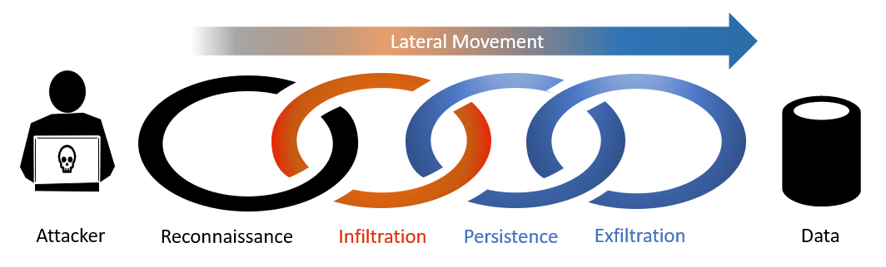
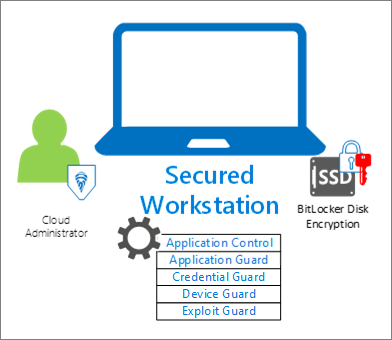
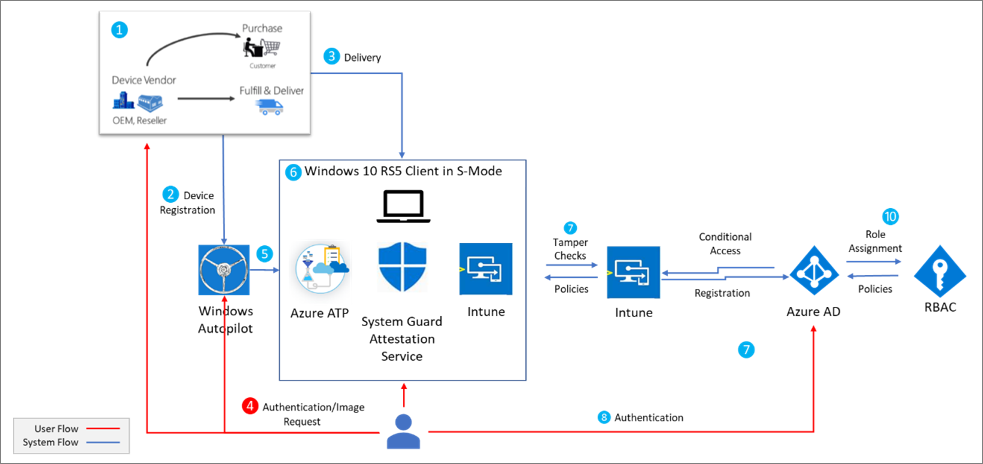

# Create secure Azure-managed workstations

The rapid adoption of cloud services and the ability to work from anywhere has created a new method for exploitation. Attackers are exploiting weak security controls on devices where administrators work and are able to gain access to privileged resources.

As documented in the [Verizon Threat report](https://enterprise.verizon.com/resources/reports/dbir/), privileged misuse is among the top five mechanisms used to breach organizations, and the second most commonly detected tactic in incidents reported in 2018.

Most attackers follow the path below:

* Start with simple reconnaissance, often specific to an industry, to find a way in
* Analyze collected information to identify the best means to gain access, exfiltrate data, or cause other intended harm
* Access, gather, and cause intended harm
* Exfiltrate and cover tracks

Attackers frequently infiltrate devices that seem low risk or undervalued for reconnaissance. These vulnerable devices are then used to locate an opportunity for lateral movement, find high valued data, and successfully exfiltrate information once they gain privileged user roles.



This document provides a solution to help protect your most sensitive computing devices by isolating management and services to help protect against lateral movement or attacks from less valuable productivity devices. The design helps reduce the ability to successfully execute a breach by breaking the chain prior and prevent infiltration of the device used to manage or access sensitive cloud resources. The solution described will utilize native Azure services that are part of the Microsoft 365 Enterprise stack including:

* Intune for device management, including application and URL whitelisting
* Autopilot for device setup and deployment and refresh
* Azure AD for user management, conditional access, and multi-factor authentication
* Windows 10 (current version) for device health attestation and user experience
* Microsoft Defender Advanced Threat Protection (ATP) for endpoint protection, detection, and response with cloud management
* Azure AD PIM for managing authorization, including Just In Time (JIT) privileged access to resources

## Who benefit from using a secure workstation?

An attacker who compromises a PC or device can do several things including impersonate all cached accounts, and use credentials, and tokens used on that device while they are logged on. This risk makes securing the devices used for administration so important as devices where a privileged account is used are targets for lateral movement and privilege escalation attacks. These accounts may be used for a variety of assets such as:

* Administrators of on-premises and cloud-based systems
* Developer workstations for critical systems
* Social media accounts administrator with high exposure
* Highly sensitive workstations like SWIFT payment terminals
* Workstations handling trade secrets

Microsoft recommends implementing elevated security controls for privileged workstations where these accounts are used to reduce risk. Additional guidance can be found in the [Azure Active Directory feature deployment guide](https://docs.microsoft.com/azure/active-directory/fundamentals/active-directory-deployment-checklist-p2), [Office 365 Roadmap](https://aka.ms/o365secroadmap), and [Securing Privileged Access roadmap](https://aka.ms/sparoadmap)).

## Why dedicated workstations

While it is possible to add security to an existing device, it is better to start with a secure foundation. Starting with a known good device and a set of known security controls puts your organization in the best position to maintain that increased level of security. With the ever growing number of attack vectors allowed by casual email and web browsing, it is increasingly hard to ensure a device can be trusted. This guide works under the assumption a dedicated workstation separated from standard productivity, browsing, and email tasks are completed. Removal of productivity, web browsing, and email from a device can have a negative impact on productivity, but this safeguard is typically acceptable for scenarios where the job tasks don’t explicitly require it and risk of a security incident is high.

> [!NOTE]
> Web browsing here refers to general access to arbitrary websites, which is a high risk distinctly different from using a web browser to access a small number of well-known administrative websites for services like Azure, Office 365, other cloud providers, and SaaS applications.

Containment strategies provide increased security assurances by increasing the number and type of controls an adversary has to overcome in order to access sensitive assets. The model developed here provides containment of administrative privileges to specific devices using a tiered privilege model.

Throughout the guidance, multiple scenarios will be addressed to achieve a more secure solution. These scenarios reflect common users in organizations that can benefit from a secure workstation, while balancing usability and risk. The guidance will provide configuration of settings based on industry standards. This guidance is used to illustrate a method in hardening Windows 10 and reducing the risks associated with device or user compromise using policy and technology to help manage security features and risks. We will outline the steps required to achieve a level of hardening called secured workstation.

|    | Standard | Enhanced | VIP | DevOps | Secured |
| --- | :---: | :---: | :---: | :---: | :---: |
| User in Azure AD | Yes | Yes | Yes | Yes | Yes |
| Intune managed | Yes | Yes | Yes | Yes | Yes |
| Device Azure AD registered | Yes |  |  |  |  |
| Device Azure AD joined |   | Yes | Yes | Yes | Yes |
| Intune security baseline applied |   | Yes | Yes <br> (Enhanced) | Yes <br> (NCSC) | Yes <br> (Custom) |
| Hardware meets secure Windows 10 Standards |   | Yes | Yes | Yes | Yes |
| Removal of admin rights |   |   | Yes | Yes | Yes |
| Microsoft Defender ATP enabled |   |   |   | Yes | Yes |
| Deployment using Autodeploy |   |   |   | Yes | Yes |
| Apps installed only by Intune |   |   |   | Yes | Yes |
| URLs restricted to approved list only |   |   |   | Yes | Yes |


* Standard – A managed standard workstation provides a good starting point for most home, and simple business use.
   * Azure AD registered
   * Intune managed
   * User in Azure AD
* Enhanced – Is an entry level solution for basics of securing a Windows 10 workstation. All controls from the standard workstation are built on and the [Intune security baselines](https://docs.microsoft.com/Intune/security-baselines) provided as an OOB experience that reduces the risk of the device being compromised.  The Enhanced workstation provides a secure means to ensure that users that require to work with customer data, and must actively do email and web browsing are performed is effectively on the front line and faces high exposure to many common cyberattacks. This workstation profile requires both uninterrupted productivity as well as strong security for common phishing and web-based attack vectors, as detailed with the [highly secure Windows 10 device](http://aka.ms/HighSecWin10).
   * Azure AD joined
   * Intune managed
   * Intune security baseline applied
   * Hardware meets highly secure Windows 10 device standards
* VIP – Organizational VIPs reflect the next high-risk user in an organization. VIPs can reflect executives, as well as high profile users that may occasionally have contact with sensitive data such as payroll, or approval of services, and processes. The user profile demands a higher controlled environment while still being able to perform their productivity activity, such as mail, and web browsing while maintaining a simple to use experience. The users expect features such as cookies, favorites, and other shortcuts available to operate. However these users do not require the ability to modify their device, and will not install drivers, develop code, or write scripts. All controls from the enhanced workstation are built on top of.
   * Enhanced Intune security baseline applied
   * Removal of local administrator rights
   * Microsoft Defender ATP enabled
      * Application control
      * Application Guard
      * Credential guard
      * Device guard
      * Exploit guard
   * Applications installed using Intune only
* DevOps – Developers and testers are an attractive target to attackers as these roles can alter systems of interest to the attackers. This is especially important for applications with internet access, business critical systems with sensitive data, systems process financial transactions, critical business functions where downtime can be expensive and other high value assets (sometimes referred to as “toxic” because of the damage to the business if released). This could include SWIFT payment terminals or operations technology SCADA/ICS that blends chemicals for food, drugs, construction materials, or medical supplies. All controls from the VIP workstation are built on top of.
   * National Cyber Security Center (NCSC) Intune security baseline applied
   * Browsing restrictions using URL approved lists
   * Deployment controlled with Windows Autopilot
* Secured – An attacker who can compromise an administrative account can typically cause significant business damage by data theft, data alteration, or service disruption. In this hardened state, the workstation will enable all the security controls and policies described in the content. All controls from the DevOps workstation are built on top of.
   * NCSC baselines with added controls taken from the SECCON security level 3 are applied to harden the host and its local policies



## Deploying a secure workstation



### License Requirements

The concepts covered in this guide will assume Microsoft 365 Enterprise E5 or an equivalent SKU. Some of the recommendations in this guide can be implemented with lower SKUs. Additional information can be found on [Microsoft 365 Enterprise licensing](https://www.microsoft.com/licensing/product-licensing/microsoft-365-enterprise).

You may want to configure [group-based licensing](https://docs.microsoft.com/azure/active-directory/users-groups-roles/licensing-groups-assign) for your users to automate provisioning of licenses.

### Azure Active Directory

Configuring your Azure Active Directory (Azure AD) directory, which will manage your users, groups, and devices for your administrator workstations requires that you enable identity services and features with an [administrator account](https://docs.microsoft.com/azure/active-directory/users-groups-roles/directory-assign-admin-roles).

When you create the secured workstation administrator account, you are exposing the account to your current workstation. It is recommended you do this initial configuration and all global configuration from a known safe device. You can consider the guidance to [prevent malware infections](https://docs.microsoft.com/windows/security/threat-protection/intelligence/prevent-malware-infection) to reduce the risk of exposing first the first-time experience from attack.

Organizations should require multi-factor authentication, at least for their administrators. See [Deploy cloud-based MFA](https://docs.microsoft.com/azure/active-directory/authentication/howto-mfa-getstarted) for implementation guidance.

#### Azure AD user and group configuration

From the Azure portal, browse to **Azure Active Directory** > **Users** > **New user**. [Create your Secure Workstation user](https://docs.microsoft.com/Intune/quickstart-create-user), who will be your device administrator.

* **Name** - Secure Workstation Administrator
* **User name** - secure-ws-admin@identityitpro.com
* **Directory role** - **Limited administrator** and select the following administrative role
   * **Intune Administrator**
* **Create**

We will create two groups one for users of the workstations and one for the workstations themselves. From the Azure portal, browse to **Azure Active Directory** > **Groups** > **New group**

First group for workstation users. You may want to configure [group-based licensing](https://docs.microsoft.com/azure/active-directory/users-groups-roles/licensing-groups-assign) for the users in this group to automate provisioning of licenses to users.

* **Group type** - Security
* **Group name** - Secure Workstation Users
* **Membership type** - Assigned
* Add your secure workstation administrator user to the group
   * secure-ws-admin@identityitpro.com
* You can add any other users that will be managing secure workstations to the group
* **Create**

Second group for workstation devices.

* **Group type** - Security
* **Group name** - Secure Workstations
* **Membership type** - Assigned
* **Create**

#### Azure AD device configuration settings

##### Specify who can join devices to Azure AD

Configure your Devices setting in Active Directory to allow your administrative security group to join devices to your domain. To configure this setting from the Azure portal, browse to **Azure Active Directory** > **Devices** > **Device settings**. Choose **Selected** under **Users may join devices to Azure AD** and select the "Secure Workstation Users" group.

##### Removal of local admin rights

As part of the rollout workstations users of the VIP, DevOps, and Secure level workstations will have no administrator rights on their machines. To configure this setting from the Azure portal, browse to **Azure Active Directory** > **Devices** > **Device settings**. Select **None** under **Additional local administrators on Azure AD joined devices**.

##### Require Multi-Factor Auth to join devices

To further strengthen the process of joining devices to Azure AD, browse to **Azure Active Directory** > **Devices** > **Device settings** choose **Yes** under **Require Multi-Factor Auth to join devices** then choose **Save**.

#### Configure MDM

From the Azure portal, browse to **Azure Active Directory** > **Mobility (MDM and MAM)** > **Microsoft Intune**. Change the setting **MDM user scope** to **All** and choose **Save** as we will allow any device to be managed by Intune in this scenario. More information can be found in the article [Intune Quickstart: Set up automatic enrollment for Windows 10 devices](https://docs.microsoft.com/Intune/quickstart-setup-auto-enrollment). We will create Intune configuration and compliance policies in a future step.

#### Azure AD conditional access

Azure AD conditional access can help keep these privileged administrative tasks on compliant devices. Users we have defined as members of the **Secure Workstation Users** group will be required to perform multi-factor authentication when signing in to cloud applications. We will follow the best practice guidance and exclude our emergency access accounts from the policy. Additional information can be found in the article [Manage emergency access accounts in Azure AD](https://docs.microsoft.com/azure/active-directory/users-groups-roles/directory-emergency-access)

To configure conditional access from the Azure portal, browse to **Azure Active Directory** > **Conditional Access** > **New policy**.

* **Name** - Secure device required policy
* Assignments
   * **Users and groups**
      * Include - **Users and groups** - Select the **Secure Workstation Users** group created earlier
      * Exclude - **Users and groups** - Select your organization's emergency access accounts
   * **Cloud apps**
      * Include - **All cloud apps**
* Access controls
   * **Grant** - Select **Grant access** radio button
      * **Require multi-factor authentication**
      * **Require device to be marked as compliant**
      * For multiple controls - **Require all the selected controls**
* Enable policy - **On**

Organizations can optionally create policies to block countries where users would not access company resources. More information about IP location-based conditional access policies can be found in the article [What is the location condition in Azure Active Directory conditional access?](https://docs.microsoft.com/azure/active-directory/conditional-access/location-condition)

### Intune configuration


Configure your autopilot [enroll device](https://docs.microsoft.com/Intune/tutorial-use-autopilot-enroll-devices) for your secure workstations. The following elements should be addressed.

Configure the Windows Enrollment settings to block devices to be used until the profiles and apps are installed.


### Create an Autopilot deployment profile

After creating a device group, you must create a deployment profile so that you can configure the Autopilot devices.


1. In Intune in the Azure portal, choose Device enrollment > Windows enrollment > Deployment Profiles > Create Profile.
1. For Name, enter Secureworkstations. For Description, enter deployment of secure workstations.
1. Set Convert all targeted devices to Autopilot to Yes. This setting makes sure that all devices in the list get registered with the Autopilot deployment service.  Allow 48 hours for the registration to be processed.
1. For Deployment mode, choose Self-Deployed. Devices with this profile are associated with the user enrolling the device. User credentials are required to enroll the device.
1. In the Join to Azure AD as box, choose Azure AD joined.
1. Choose Out-of-box experience (OOBE), configure the following options and leave others set to the default, and then choose Save:
   * End-user license agreement (EULA): Hide
   * Privacy settings: Show
   * User account type: Standard
1. Choose Create to create the profile. The Autopilot deployment profile is now available to assign to devices.
1. Choose Device enrollment > Windows enrollment > Deployment Profiles > Assignments
   * Selected Group > Secure Workstation Users

Additional reading for configuring Windows autopilot

* https://docs.microsoft.com/en-us/Windows/deployment/Windows-autopilot/Windows-autopilot
* https://docs.microsoft.com/en-us/Windows/deployment/Windows-autopilot/administer 

### Enable a secure device baseline

For the use of this guidance Windows version 1809 of Windows 10 will be required for the use of ATP, Intune client, and Windows Threat protection. To find your Windows version, follow the guidance outlined in the article [Enroll your first Windows 10 device](https://docs.microsoft.com/Intune/quickstart-enroll-windows-device).

Additionally the [Intune secure baseline](https://docs.microsoft.com/Intune/security-baseline-settings-Windows) will be enabled to lock down the device and provide a secured workstation.

This includes managing the following categories:

|   |   |   |
| :---: | :---: | :---: |
| Above Lock | Device Installation | Remote Desktop Services |
| App Runtime | Device Lock | Remote Management |
| Application Management | Event Log Service | Remote Procedure Call |
| Auto Play | Experience | Search |
| BitLocker | Exploit Guard | Smart Screen |
| Browser | File Explorer | System |
| Connectivity | Internet Explorer | Wi-Fi |
| Credentials Delegation | Local Policies Security Options | Windows Connection Manager |
| Credentials UI | MS Security Guide | Windows Defender |
| Data Protection | MSS Legacy | Windows Ink Workspace |
| Device Guard | Power | Windows PowerShell |

#### Create a baseline profile (using Security baselines)

Provide the baseline starting point giving it a name, here we use Secured-Workstation-Baseline1, which we will use as a starting point for device enforcement.

For the initial setup we will implement the baseline, and apply additional constraints in policies.

Assign the Secure Workstation Users security group, and commit the changes with save+deploy

### Enabling Windows Defender Advanced Threat Protection (ATP), and jailbreak prevention

#### Auditing and Logging of devices

In the deployed solution we will rely on the configured ATP audit policies, and notifications that we enable with ATP enforcement. This design will not explore additional auditing, and monitoring outside of [ATP monitoring, and auditing capabilities](https://docs.microsoft.com/azure-advanced-threat-protection/atp-advanced-audit-policy).

This feature is called "compliance policies". Compliance policies define the rules and settings that users and devices must meet to be compliant. We will require the following configurations:

* Use a password to access organizational data on mobile devices
* The device isn't jail-broken or rooted
* A minimum operating system version on the device
* The device to be at, or under a threat level

We will be requiring devices to be compliant, with no ability to be used if core compliant services are altered.

In Microsoft Intune Device compliance - Compliance policy settings, we will enable the ability to validate compliant devices, and enable the Enhanced jailbreak detection with a validation no longer than 10 days.

#### ATP protection

Windows Defender Advanced Threat Protection (ATP) and Microsoft Intune work together to help prevent security breaches, and help limit the impact of breaches. The capabilities will provide real-time detection. ATP will also provide our deployment extensive audit and logging of the end-point devices.

1. Select All services, filter on Intune, and select Microsoft Intune.
1. Select Device compliance > Windows Defender ATP > Open the Windows Defender Security Center.

Configuring Windows Defender ATP

1. Set up a connection to Intune via the Windows Defender Security Center:
   * [Connect Windows Defender ATP to Microsoft Intune in the Windows Defender Security Center](https://securitycenter.windows.com/preferences2/integration)
1. After a connection is established, click "Refresh" at the top of this section to hide this guide and continue to enable the settings below.
1. In the Windows Defender Security Center:
   * Select Settings > Advanced features.
   * For Microsoft Intune connection, choose On:
   * Select Save preferences.
1. Go back to Intune, Device compliance > Windows Defender ATP. Set Connect Windows devices version 10.0.15063 and above to Windows Defender ATP to On.
1. Select Save.

Windows Defender Advanced Threat Protection (ATP) - https://docs.microsoft.com/Windows/security/threat-protection/
Enable Windows Defender ATP - https://docs.microsoft.com/Windows/security/threat-protection/Windows-defender-atp/Windows-defender-advanced-threat-protection

### Completing hardening of the workstation profile

To successfully harden the secured workstation we will configure the installation by implementing the PowerShell SDK, and device configuration from JSON scripts to import configurations based on the SECCON 3 controls.

Additionally, the following configuration will be required to be enabled for the SECCON controls. Will be done using Intune PowerShell sdk https://github.com/Microsoft/Intune-PowerShell-SDK and Intune scripts import scripts created by Dave Falkus. These will require that you configure your Intune consent, and [compliance manager](https://docs.microsoft.com/office365/securitycompliance/permissions-in-the-security-and-compliance-center) to allow for users to export and import configurations using PowerShell.

The modules can be loaded using following command.

``` PowerShell
Install-Module -Name Microsoft.Graph.Intune
```

We will also require the scripts consent to operate `Connect-MSGraph -AdminConsent`

In our solution, we will implement categories to appropriate Intune profiles.

The configuration can be done by exporting the current baseline, and applying changes to the export file as outlined in the SECCON documentation based on the profiles hardening that is required. Each hardening level will restrict and harden the workstation.

Running the Intune data export script `DeviceConfiguration_Export.ps1` from the [DeviceConfiguration GiuHub repository](https://github.com/microsoftgraph/powershell-intune-samples/tree/master/DeviceConfiguration) will provide the current export of all the of Intune existing profiles.

The exported JSON files can be updated for the SECCON 3 and the following categories be addressed in including:

* Security template policies
* Windows Defender Policies
* Computer Policies
* Windows Antivirus Policies
* User Policies
* IE Computer policies
* LAPS
* Computer Policies
* Services (restriction)

After the policy files are configured to the appropriate SECCON level, the configuration file can be imported to Intune using `DeviceConfiguration_Import_FromJSON.ps1` from the [DeviceConfiguration GiuHub repository](https://github.com/microsoftgraph/powershell-intune-samples/tree/master/DeviceConfiguration).

We have selected not to implement the Advanced Audit policies, as advanced threat protection (ATP) will provide the required auditing and reporting.

### Restrictive inbound, and outbound rules in Firewall configuration service provider (CSP)

Additional management of both inbound, and outbound rules can be updated to reflect your permitted and blocked endpoints. As we continue to harden the secure workstation, we move the restriction to a deny all inbound and outbound as default, and add permitted sites for the outbound to reflect common and trusted web sites. The configuration of the CSP can be found at https://docs.microsoft.com/Windows/client-management/mdm/firewall-csp.

Default restricted recommendations are:

* Deny All inbound
* Deny All outbound

Permitted site list added to outbound.

* https://www.spamhaus.org/whitelist/ (WAS A BETA AND HAS BEEN TAKEN DOWN)

### Limiting and removing local applications

Removing all application, including the removal of productivity applications will require the process to move the secure workstation to a truly hardened state. In our example we will add Chrome as the default browser, restrict ability to modify the browser including plug-ins. We will also use an example of using PowerShell to provide extensibility in managing the lockdown of the host. The script will set up a default background on the host. This capability is also available in profiles, and is only used to illustrate the capability.

### Setting up custom security settings using PowerShell

In the solution there will be a need to set up custom controls, and setting on a Secure workstation. In our example, we will change the background of the workstation to be able to easily identify the device as a secure and ready for use. The following configuration will set up a background that will allow anyone logging in to the host to identify it as a secured workstation. – This action is also available in Device configuration – Profiles Device Restrictions – Properties - Device restrictions – Personalization – Configure background.
To deploy the background, we will use a PowerShell script and Intune configurations.
For the sample, we will use a [free generic background image](https://i.imgur.com/OAJ28zO.png).
Microsoft scripting center provides the script [SetDesktopBackground.ps1](https://gallery.technet.microsoft.com/scriptcenter/Set-Desktop-Image-using-5430c9fb/) that will be used to allow Windows to load the background on start.

1. Download the script to a local device
1. Update the customerXXXX, and the download location of the background you are looking to use in the script to reflect the background file, and folder that you would like the deployment to use. In our example, we replace customerXXXX to backgrounds.  
1. In the Azure portal under  - Microsoft Intune - Device configuration - PowerShell scripts
1. Upload the updated PowerShell script by clicking “Add”.
1. Provide a name for the script and click “browse” select the script.
1. Select configure, and set Run this script using the logged on credentials, to yes
1. Select create
1. Select assignment
1. Add the security group Secure Workstation Users
1. D
1. 
1. 
1. 
1. Wait for the changes to be applied to the user's desktop.
1. You can also monitor the progress under the device configuration in Microsoft Intune.

### Deploy Chrome and whitelist/blacklist access

In several situations Chrome browser is required in the secured workstations. The following instructions provide details to enable Chrome in the securedwe security group.

Deploying Chrome https://www.ntweekly.com/2018/12/21/deploy-google-chrome-with-microsoft-Intune-to-Windows-10-machines/

Configuring and lock Chrome down https://support.google.com/chrome/a/answer/9102677?hl=en

## Enroll your first device

Add devices (Laptop) to Intune – You will have to have a Windows version 1809 built laptop, and require to sign in locally to create the initial CSV hash of the device - serial-number, Windows-product-id, hardware-hash, optional-order-id required.  file for the devices that will participate in the program. These devices once enrolled will provide the starting point for your secured access program.

* Serial-number will be found on the device chassis
* Windows product hardware ID can be found Windows – Setting - About in the device specifications.
* Running [Get-WindowsAutoPilotInfo](https://aka.ms/Autopilotshell) will provide the CSV hash file for device enrollment, and serial number. Running the `Get-Windowsautopilotinfo – outputfile device1.csv`

NOTE – the script will require elevated rights and run as unsigned. You can use the following to allow the script to run correctly. `Set-ExecutionPolicy -ExecutionPolicy Remotesigned`

Go to Azure portal - All services - Intune - Device Enrollment – Windows Enrollment -Windows autopilot devices select Import the .csv file you have created.

* Add the enrolled device (Laptop) to your security group Secure Workstation Users.

From the Windows device (laptop) In devices settings – Reset this PC select Get started and follow the prompts.

## Validate your secured device

At this point, we can review the enrolled device and check its configuration, which will be the selected default security baseline.

The device should have enabled basic user protections that will enable a secured platform. The enhancement of the device includes

## Additional Configuration to consider for system hardening

## Autodeployment of new devices

When purchasing new devices, it is recommended that devices be factory set to [Windows 10 Pro in S mode](https://docs.microsoft.com/Windows/deployment/Windows-10-pro-in-s-mode), which limits the exposure and vulnerabilities during supply chain management. Once a device is received from your supplier the device will be moved from S mode to Full using Intune autopilot capabilities. The following guidance provides details on applying the transformation process.

## Additional tasks once the Secure workstation is configured

Assigning device and users will require the mapping of the [selected profiles](https://docs.microsoft.com/intune/device-profile-assign) to your security group ‘securedsg’ and all new users that will be given permission to the service will be required to be added to the security group as well.

Monitoring the profiles to can be done using the monitoring [Microsoft Intune profiles](https://docs.microsoft.com/intune/device-profile-monitor).

Configuring the company portal for custom apps

In a secured mode installing applications will be restricted to the Intune company portal. However, installing the portal requires access to Microsoft Store. In the case of our secured solution, we will make the portal available to all devices using an offline mode of the company portal.

Installing an Intune managed copy of the [Company Portal](https://docs.microsoft.com/en-us/Intune/store-apps-company-portal-app) will permit the ability to push down additional tools on demand to users of the secured workstations.

Finally, some organizations may be required to install win32 apps or apps that require other preparations to deploy. For these the [Microsoft win32 content prep tool](https://github.com/Microsoft/Microsoft-Win32-Content-Prep-Tool) will provide a ready to use `.intunewin` format file for installation.


### Windows Hello for Business

Configuring Windows Hello for Business provides your secure devices multi-factor authentication and a great user experience. 

Windows Hello for Business is enabled from the **Azure portal** > **Microsoft Intune** > **Device enrollment** > **Windows enrollment** > **Windows Hello for Business** > **Properties**. 

Under **Settings** configure the following settings

* **Configure Windows Hello for Business** - **Enabled**
* **Use a Trusted Platform Module** - **Required**
* **Minimum PIN length** - **6**
* **PIN expiration (days)** - **90**


Configuration requires that  Hello for business is ‘enabled’ and default settings should require pin length of 6, with a pin expiration to be every three months. ‘remember pin history’ should be set to yes. And enhanced anti-spoofing should be set to yes. ‘Allow phone sign-in’ (set to yes) will provide your users a self-service management of device pin’s. 
