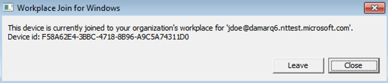
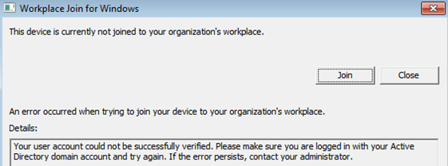
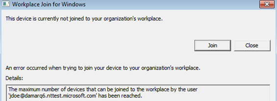

# Troubleshooting hybrid Azure Active Directory joined down-level devices 

This article is applicable only to the following devices: 

- Windows 7 
- Windows 8.1 
- Windows Server 2008 R2 
- Windows Server 2012 
- Windows Server 2012 R2 

For Windows 10 or Windows Server 2016, see [Troubleshooting hybrid Azure Active Directory joined Windows 10 and Windows Server 2016 devices](troubleshoot-hybrid-join-windows-current.md).

This article assumes that you have [configured hybrid Azure Active Directory joined devices](hybrid-azuread-join-plan.md) to support the following scenarios:

- Device-based Conditional Access

This article provides you with troubleshooting guidance on how to resolve potential issues.  

**What you should know:** 

- Hybrid Azure AD join for downlevel Windows devices works slightly differently than it does in Windows 10. Many customers do not realize that they need AD FS (for federated domains) or Seamless SSO configured (for managed domains).
- For customers with federated domains, if the Service Connection Point (SCP) was configured such that it points to the managed domain name (for example, contoso.onmicrosoft.com, instead of contoso.com), then Hybrid Azure AD Join for downlevel Windows devices will not work.
- The maximum number of devices per user currently also applies to downlevel hybrid Azure AD joined devices. 
- The same physical device appears multiple times in Azure AD when multiple domain users sign-in the downlevel hybrid Azure AD joined devices.  For example, if *jdoe* and *jharnett* sign-in to a device, a separate registration (DeviceID) is created for each of them in the **USER** info tab. 
- You can also get multiple entries for a device on the user info tab because of a reinstallation of the operating system or a manual re-registration.
- The initial registration / join of devices is configured to perform an attempt at either sign-in or lock / unlock. There could be 5-minute delay triggered by a task scheduler task. 
- Make sure [KB4284842](https://support.microsoft.com/help/4284842) is installed, in case of Windows 7 SP1 or Windows Server 2008 R2 SP1. This update prevents future authentication failures due to customer's access loss to protected keys after changing password.

## Step 1: Retrieve the registration status 

**To verify the registration status:**  

1. Sign on with the user account that has performed a hybrid Azure AD join.
1. Open the command prompt 
1. Type `"%programFiles%\Microsoft Workplace Join\autoworkplace.exe" /i`

This command displays a dialog box that provides you with details about the join status.

## Step 2: Evaluate the hybrid Azure AD join status 

If the device was not hybrid Azure AD joined, you can attempt to do hybrid Azure AD join by clicking on the "Join" button. If the attempt to do hybrid Azure AD join fails, the details about the failure will be shown.

**The most common issues are:**

- A misconfigured AD FS or Azure AD or Network issues

    
    
   - Autoworkplace.exe is unable to silently authenticate with Azure AD or AD FS. This could be caused by missing or misconfigured AD FS (for federated domains) or missing or misconfigured Azure AD Seamless Single Sign-On (for managed domains) or network issues. 
   - It could be that multi-factor authentication (MFA) is enabled/configured for the user and WIAORMULTIAUTHN is not configured at the AD FS server. 
   - Another possibility is that home realm discovery (HRD) page is waiting for user interaction, which prevents **autoworkplace.exe** from silently requesting a token.
   - It could be that AD FS and Azure AD URLs are missing in IE's intranet zone on the client.
   - Network connectivity issues may be preventing **autoworkplace.exe** from reaching AD FS or the Azure AD URLs. 
   - **Autoworkplace.exe** requires the client to have direct line of sight from the client to the organization's on-premises AD domain controller, which means that hybrid Azure AD join succeeds only when the client is connected to organization's intranet.
   - Your organization uses Azure AD Seamless Single Sign-On, `https://autologon.microsoftazuread-sso.com` or `https://aadg.windows.net.nsatc.net` are not present on the device's IE intranet settings, and **Allow updates to status bar via script** is not enabled for the Intranet zone.
- You are not signed on as a domain user

   

   There are a few different reasons why this can occur:

   - The signed in user is not a domain user (for example, a local user). Hybrid Azure AD join on down-level devices is supported only for domain users.
   - The client is not able to connect to a domain controller.    
- A quota has been reached

    

- The service is not responding 

    

You can also find the status information in the event log under: **Applications and Services Log\Microsoft-Workplace Join**
  
**The most common causes for a failed hybrid Azure AD join are:** 

- Your computer is not connected to your organization’s internal network or to a VPN with a connection to your on-premises AD domain controller.
- You are logged on to your computer with a local computer account. 
- Service configuration issues: 
   - The AD FS server has not been configured to support **WIAORMULTIAUTHN**. 
   - Your computer's forest has no Service Connection Point object that points to your verified domain name in Azure AD 
   - Or if your domain is managed, then Seamless SSO was not configured or working.
   - A user has reached the limit of devices. 

## Next steps

For questions, see the [device management FAQ](faq.md)  
