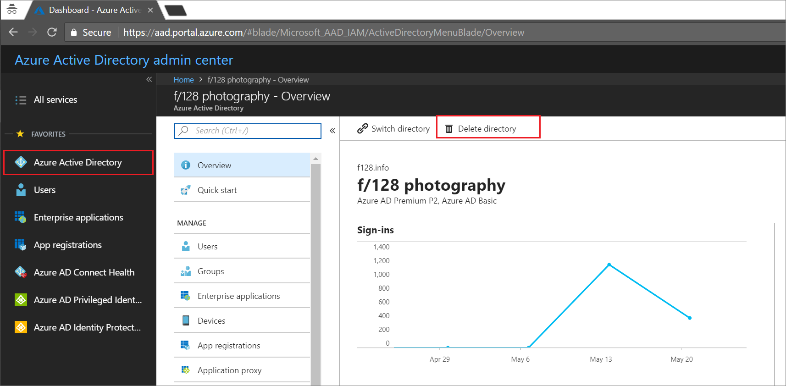

# How to delete an Azure Active Directory tenant
Only an Azure Active Directory (Azure AD) global administrator can delete an Azure AD tenant from the portal. When a tenant is deleted, all resources that are contained in the tenant are also deleted. Your task is to minimize the resources in the tenant before you delete.

* If you are signed in with a work or school account, you can't delete your home tenant. For example, if you are signed in as joe@contoso.onmicrosoft.com, you can't delete the tenant that has contoso.onmicrosoft.com as its default domain. 
* If you are signed in with a Microsoft account, you are authenticated outside of the tenant and can delete it.

## Prepare the tenant for deletion

You can't delete a tenant in Azure AD until it passes several checks. These checks reduce risk that deleting a tenant negatively impacts user access, such as the ability to sign in to Office 365 or access resources in Azure. For example, if the tenant associated with a subscription is unintentionally deleted, then users can't access the Azure resources for that subscription. The following explains the conditions that are checked:

* There can be no users in the tenant except one global administrator who is to delete the tenant. Any other users must be deleted before the tenant can be deleted. If users are synchronized from on-premises, then sync must be turned off, and the users must be deleted in the cloud tenant using the Azure portal or Azure PowerShell cmdlets. There is no requirement to delete groups or contacts.
* There can be no applications in the tenant. Any applications must be deleted before the tenant can be deleted.
* There can be no multi-factor authentication providers linked to the tenant.
* There can be no subscriptions for any Microsoft Online Services such as Microsoft Azure, Office 365, or Azure AD Premium associated with the tenant. For example, if a default tenant was created for you in Azure, you cannot delete this tenant if your Azure subscription still relies on this tenant for authentication. Similarly, you can't delete a tenant if another user has associated a subscription with it. 

Question: what about service principals or Azure AD Domain Services?

## Delete an Azure AD tenant

1. Sign in to the [Azure AD admin center](https://aad.portal.azure.com) with an account that is the Global admininstrator for the tenant.

2. Select **Azure Active Directory**.

3. Switch to the tenant you want to delete.
  
  

4. Select **Delete directory**.
  
  

5. After you pass all checks, select **Delete** to complete the process.

## Next steps
[Azure Active Directory documentation](https://docs.microsoft.com/azure/active-directory/)
