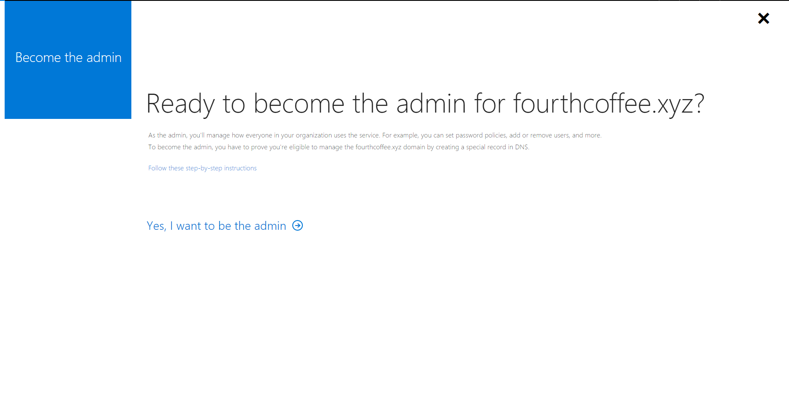
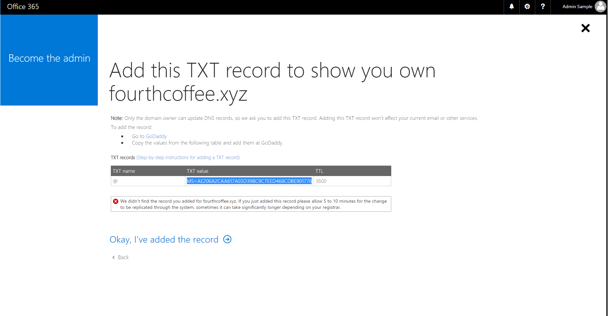
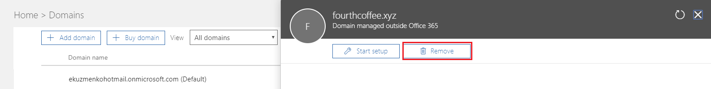

# Take over an unmanaged directory as administrator in Azure Active Directory
This article describes two ways to take over a DNS domain name in an unmanaged directory in Azure Active Directory (Azure AD). When a self-service user signs up for a cloud service that uses Azure AD, they are added to an unmanaged Azure AD directory based on their email domain. For more about self-service or "viral" signup for a service, see [What is self-service signup for Azure Active Directory?]()

## Decide how you want to take over an unmanaged directory
During the process of admin takeover, you can prove ownership as described in [Add a custom domain name to Azure AD](add-custom-domain.md). The next sections explain the admin experience in more detail, but here's a summary:

* When you perform an ["internal" admin takeover](#internal-admin-takeover) of an unmanaged Azure directory, you are added as the global administrator of the unmanaged directory. No users, domains, or service plans are migrated to any other directory you administer.

* When you perform an ["external" admin takeover](#external-admin-takeover) of an unmanaged Azure directory, you add the DNS domain name of the unmanaged directory to your managed Azure directory. When you add the domain name, a mapping of users to resources is created in your managed Azure directory so that users can continue to access services without interruption. 

## Internal admin takeover

Some products that include SharePoint and OneDrive, such as Office 365, do not support external takeover. If that is your scenario, or if you are an admin and want to take over an unmanaged or "shadow" tenant create by users who used self-service sign-up, you can do this with an internal admin takeover.

1. Create a user context in the unmanaged tenant through signing up with such as Power BI. For convenience of example, these steps assume that path.

2. Open the [Power BI site](https://powerbi.com) and select **Start Free**. Enter a user account that uses the domain name for the organization; for example, `admin@fourthcoffee.xyz`. After you enter in the verification code, check your email for the confirmation code.

3. In the confirmation email from Power BI, select **Yes, that's me**.

4. Sign in to the [Office 365 Admin center](https://portal.office.com/adminportal/Home) with the Power BI user account. You receive a message that instructs you to **Become the Admin** of the domain name that was already verified in the unmanaged tenant. select **Yes, I want to be the admin**.
  
  
  
5. Add the TXT record to prove that you own the domain name **fourthcoffee.xyz** at your domain name registrar. In this example, it is GoDaddy.com.
  
  

When the DNS TXT records are verified at your domain name registrar, you can manage the Azure AD tenant.

When you complete the preceding steps, you are now the global administrator of the Fourth Coffee tenant in Office 365. To integrate the domain name with your other Azure services, you can remove it from Office 365 and add it to a different managed tenant in Azure.

### Adding the domain name to a managed tenant in Azure AD 

1. Open the [Office 365 Admin center](https://portal.office.com/adminportal/Home).
2. Select **Users** tab, and create a new user account with a name like *user@fourthcoffeexyz.onmicrosoft.com* that does not use the custom domain name. 
3. Ensure that the new user account has global admin privileges for the Azure AD tenant.
4. Open **Domains** tab in the Office 365 Admin center, select the domain name and select **Remove**. 
  
  
  
5. If you have any users or groups in Office 365 that reference the removed domain name, they must be renamed to the .onmicrosoft.com domain. If you force delete the domain name, all users are automatically renamed, in this example to *user@fourthcoffeexyz.onmicrosoft.com*.
  
6. Sign in to the [Azure AD admin center](https://portal.azure.com/#blade/Microsoft_AAD_IAM/ActiveDirectoryMenuBlade/Overview) with an account that is the global admin for the Azure AD tenant.
  
7. Select **Custom domain names**, then add the domain name. You'll have to enter the DNS TXT records to verify ownership of the domain name. 
  
  
  
> [!NOTE]
> Any users of Power BI or Azure Rights Management service who have licenses assigned in the Office 365 tenant must save their dashboards if the domain name is removed. They must sign in with a user name like *user@fourthcoffeexyz.onmicrosoft.com* rather than *user@fourthcoffee.xyz*.

## External admin takeover

If you already manage a tenant with Azure services or Office 365, you are can't add a custom domain name if it is already verified in another Azure AD tenant. However, from your managed tenant in Azure AD you can take over an unmanaged tenant as an external admin takeover. The general procedure follows the article [Add a custom domain to Azure AD](add-custom-domain.md).

When you verify ownership of the domain name, Azure AD removes the domain name from the unmanaged tenant and moves it to your existing tenant. External admin takeover of an unmanaged directory requires the same DNS TXT validation process as internal admin takeover. The difference is that the following are also moved over with the domain name:

- Users
- Subscriptions
- License assignments
 
The [**ForceTakeover** option](#azure-ad-powershell-cmdlets-for-the-forcetakeover-option) for domain name external admin takeover is supported for only two services, Power BI and Azure RMS.

### Support for external admin takeover
External admin takeover is supported by the following online services:

- Power BI
- Azure Rights Management Service (RMS)
- Exchange Online

The supported service plans include:

- Power BI Free
- Power BI Pro
- PowerApps Free
- PowerFlow Free
- Azure Rights Management Service Basic (RMS)
- Azure Rights Management Service Enterprise (RMS)
- Microsoft Stream
- Dynamics 365 free trial

Exernal admin takeover is not supported for any service that has service plans that include SharePoint, OneDrive, or Skype For Business; for example, through an Office free subscription or the Office Basic SKU.

### Azure AD PowerShell cmdlets for the ForceTakeover option
You can see these cmdlets used in [PowerShell example](#powershell-example).


cmdlet | Usage 
------- | -------
`connect-msolservice` | When prompted, sign in to your managed tenant.
`get-msoldomain` | Shows your domain names associated with the current tenant.
`new-msoldomain –name <domainname>` | Adds the domain name to tenant as Unverified (no DNS verification has been performed yet).
`get-msoldomain` | The domain name is now included in the list of domain names associated with your managed tenant, but is listed as **Unverified**.
`get-msoldomainverificationdns –Domainname <domainname> –Mode DnsTxtRecord` | Provides the information to put into new DNS TXT record for the domain (MS=xxxxx). Verification might not happen immediately because it takes some time for the TXT record to propagate, so wait a few minutes before considering the **-ForceTakeover** option. 
`confirm-msoldomain –Domainname <domainname> –ForceTakeover Force` | <li>If your domain name is still not verified, you can proceed with the **-ForceTakeover** option. It verifies that the TXT record was created and kicks off the takeover process.<li>The **-ForceTakeover** option should be added to the cmdlet only when forcing an external admin takeover, such as when the unmanaged tenant has Office 365 services blocking the takeover.
`get-msoldomain` | The domain list now shows the the domain name as **Verified**.

### PowerShell example

1. Connect to Azure AD using the credentials that were used to respond to the self-service offering:
  ````
    import-module MSOnline
    $msolcred = get-credential
    
    connect-msolservice -credential $msolcred
  ````
2. Get a list of domains:
  
  ````
    Get-MsolDomain
  ````
3. Run the Get-MsolDomainVerificationDns cmdlet to create a challenge:
  ````
    Get-MsolDomainVerificationDns –DomainName *your_domain_name* –Mode DnsTxtRecord
  
    For example:
  
    Get-MsolDomainVerificationDns –DomainName contoso.com –Mode DnsTxtRecord
  ````

4. Copy the value (the challenge) that is returned from this command. For example:
  ````
    MS=32DD01B82C05D27151EA9AE93C5890787F0E65D9
  ````
5. In your public DNS namespace, create a DNS txt record that contains the value that you copied in the previous step. The name for this record is the name of the parent domain, so if you create this resource record by using the DNS role from Windows Server, leave the Record name blank and just paste the value into the Text box.
6. Run the Confirm-MsolDomain cmdlet to verify the challenge:
  
  ````
    Confirm-MsolEmailVerifiedDomain -DomainName *your_domain_name*
  ````
  
  For example:
  
  ````
    Confirm-MsolEmailVerifiedDomain -DomainName contoso.com
  ````

A successful challenge returns you to the prompt without an error.

## Next steps
* [Add a custom domain name to Azure AD](add-custom-domain.md)
* [How to install and configure Azure PowerShell](/powershell/azure/overview)
* [Azure PowerShell](/powershell/azure/overview)
* [Azure Cmdlet Reference](/powershell/azure/get-started-azureps)
* [Set-MsolCompanySettings](/powershell/module/msonline/set-msolcompanysettings?view=azureadps-1.0)

<!--Image references-->
[1]: ./media/active-directory-self-service-signup/SelfServiceSignUpControls.png
