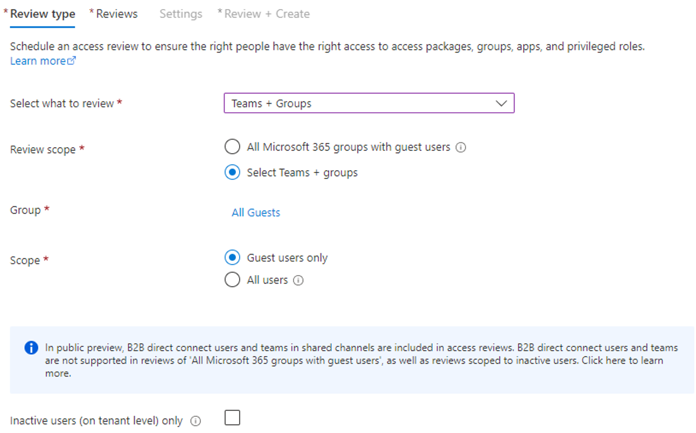
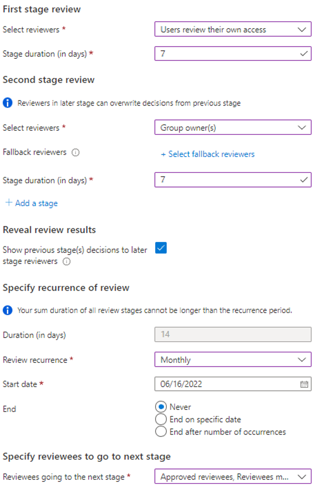
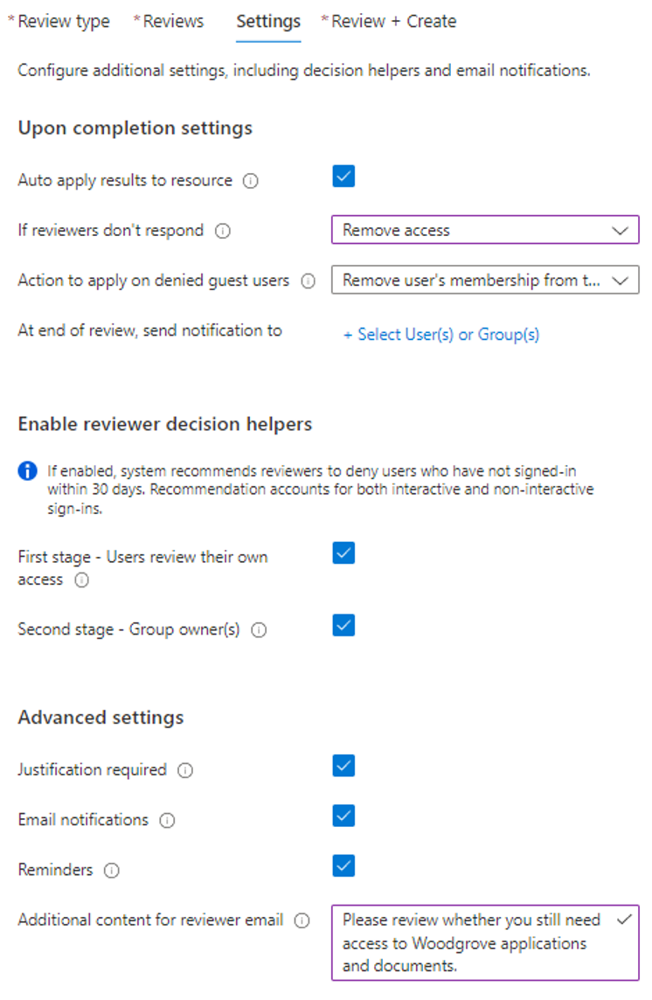
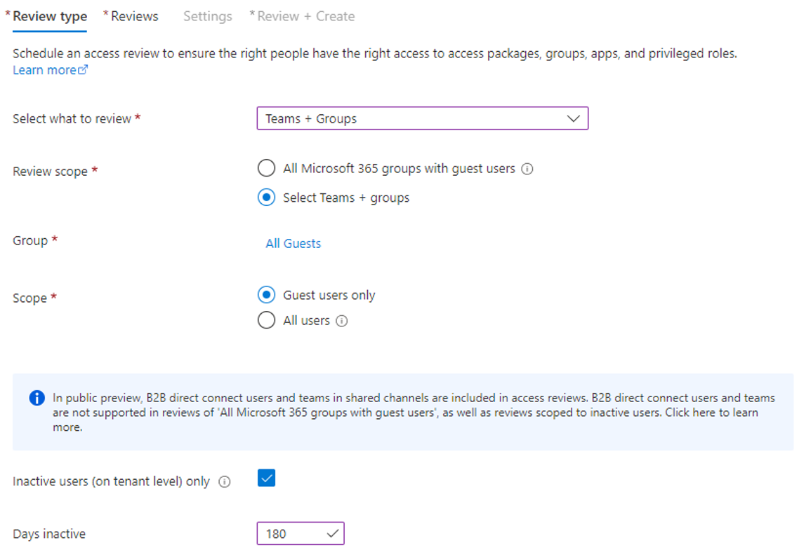
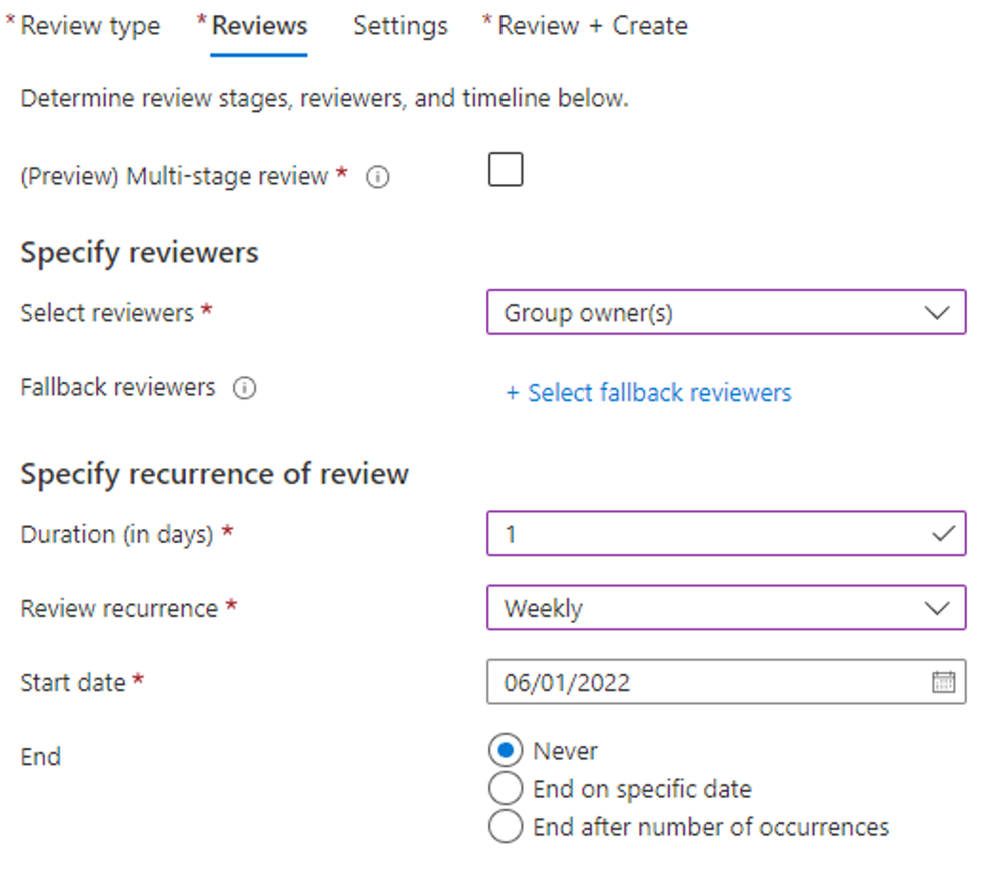
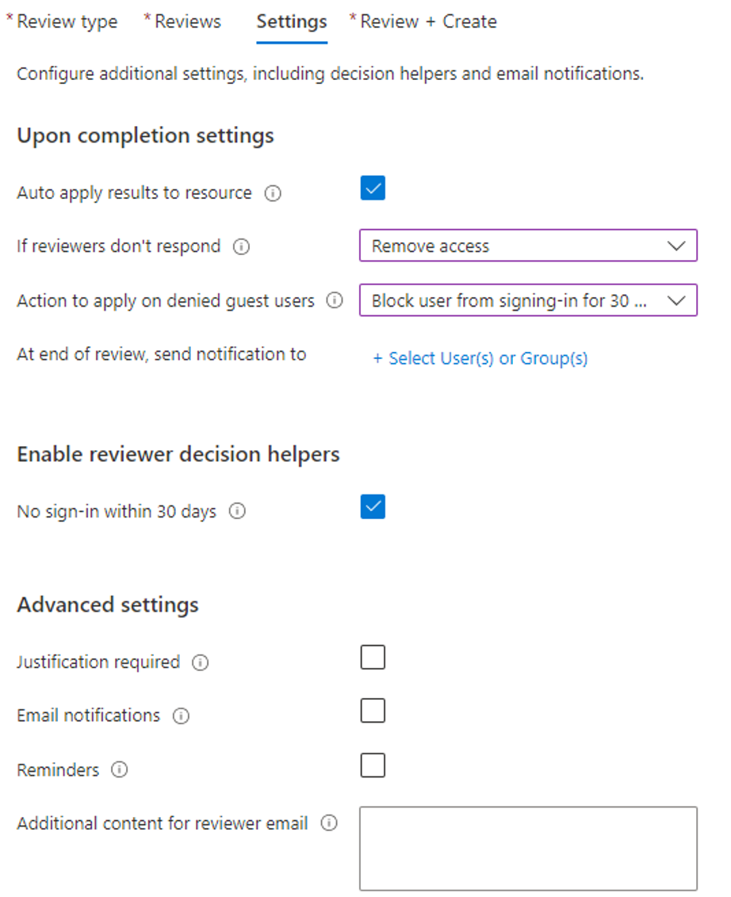

# Monitor and clean up stale guest accounts using access reviews 

As users collaborate with external partners, it’s possible that many guest accounts get created in Microsoft Entra tenants over time. When collaboration ends and the users no longer access your tenant, the guest accounts may become stale. Administrators can monitor guest accounts at scale using inactive guest insights. Administrators can also use Access Reviews to automatically review inactive guest users, block them from signing in, and, delete them from the directory.

Learn more about [how to manage inactive user accounts in Microsoft Entra ID](../reports-monitoring/howto-manage-inactive-user-accounts.md).

There are a few recommended patterns that are effective at monitoring and cleaning up stale guest accounts:

1. Monitor guest accounts at scale with intelligent insights into inactive guests in your organization using inactive guest report. Customize the inactivity threshold depending on your organization’s needs, narrow down the scope of guest users you want to monitor and identify the guest users that may be inactive.

2. Create a multi-stage review whereby guests self-attest whether they still need access. A second-stage reviewer assesses results and makes a final decision. Guests with denied access are disabled and later deleted.

3. Create a review to remove inactive external guests. Admins define inactive as period of days. They disable and later delete guests that don’t sign in to the tenant within that time frame. By default, this doesn't affect recently created users. [Learn more about how to identify inactive accounts](../reports-monitoring/howto-manage-inactive-user-accounts.md#how-to-detect-inactive-user-accounts).

Use the following instructions to learn how to enhance monitoring of inactive guest accounts at scale and create Access Reviews that follow these patterns. Consider the configuration recommendations and then make the needed changes that suit your environment.

### License requirements
[!INCLUDE [active-directory-entra-governance-license.md](../../../includes/active-directory-entra-governance-license.md)]

## Monitor guest accounts at scale with inactive guest insights (Preview)

[!INCLUDE [portal updates](~/articles/active-directory/includes/portal-update.md)]

1. Sign in to the [Microsoft Entra admin center](https://entra.microsoft.com).
1. Browse to **Identity governance** > **Dashboard**
1. Access the inactive guest account report by navigating to the **Guest access governance** card then select **View inactive guests**.
1. You will see the inactive guest report which will provide insights about inactive guest users based on 90 days of inactivity. The threshold is set to 90 days by default but can be configured using "Edit inactivity threshold" based on your organization's needs.
1. The following insights are provided as part of this report:

   - Guest account overview (total guests and inactive guests with further categorization of guests who have never signed in or signed in at least once)
   - Guest inactivity distribution (Percentage distribution of guest users based on days since last sign in)
   - Guest inactivity overview (Guest inactivity guidance to configure inactivity threshold)
   - Guest accounts summary (A tabular view with details of all guest accounts with insights into their activity state. The Activity state could be active or inactive based on the configured inactivity threshold)

1. The inactive days are calculated based on last sign in date if the user has signed in atleast once. For users who have never signed in, the inactive days are calculated based on creation date.

## Create a multi-stage review for guests to self-attest continued access

1. Create a [dynamic group](./groups-create-rule.md) for the guest users you want to review. For example,

   `(user.userType -eq "Guest") and (user.mail -contains "@contoso.com") and (user.accountEnabled -eq true)`

2. To [create an Access Review](../governance/create-access-review.md)
    for the dynamic group, navigate to **Microsoft Entra ID > Identity Governance > Access Reviews**.

3. Select **New access review**.

4. Configure Review type.

   | Property | Value |
   |:-----|:-------|
   | Select what to review | **Teams + Groups**|
   |Review scope | **Select Teams + groups** |
   |Group| Select the dynamic group |
   |Scope| **Guest users only**|
   |(Optional) Review inactive guests | Check the box for **Inactive users (on tenant level) only**.  Enter the number of days that constitute inactivity.|

   

5. Select **Next: Reviews**.

6. Configure Reviews:

   |Property | Value |
   |:------------|:-------------|
   | **First stage review** |     |
   | (Preview) Multi-stage review| Check the box|
   |Select reviewers | **Users review their own access**|
   | Stage duration (in days) | Enter the number of days |
   |**Second stage review** |            |
   | Select reviewers | **Group owner(s)** or **Selected user(s) or group(s)**|
   |Stage duration (in days) |  Enter the number of days. (Optional) Specify a fallback reviewer.|
   | **Specify recurrence of review** |    |
   | Review recurrence | Select your preference from the drop-down|
   |Start date| Select a date|
   |End| Select your preference |
   | **Specify reviewees to go to the next stage** | | 
   | Reviewees going to the next stage | Select reviewees. For example, select users who self-approved or responded **Don't know**.

    

7. Select **Next: Settings**.

8. Configure Settings:

   | Property | Value |
   |:--------|:-------|
   | **Upon completion settings**| |
   |Auto apply results to resource| Check the box|
   |If reviewers don't respond | **Remove access** |
   | Action to apply on denied guest users | **Block user from signing in for 30 days, then remove user from the tenant**|
   | (Optional) At end of review, send notification to | Specify other users or groups to notify.|
   | **Enable reviewer decision helpers** |  |
   | Additional content for reviewer email | Add a custom message for reviewers |
   | All other fields| Leave the default values for the remaining options. |

   

9. Select **Next: Review + Create**

10. Enter an Access Review name. (Optional) provide description.

11. Select **Create**.

## Create a review to remove inactive external guests

1. Create a [dynamic group](./groups-create-rule.md) for the guest users you want to review. For example,

   `(user.userType -eq "Guest") and (user.mail -contains "@contoso.com") and (user.accountEnabled -eq true)`

2. To [create an access review](../governance/create-access-review.md) for the dynamic group, navigate to **Microsoft Entra ID > Identity Governance > Access Reviews**.

3. Select **New access review**.

4. Configure Review type:

   |Property | Value |
   |:---------|:------------|
   | Select what to review | **Teams + Groups** |
   | Review scope | **Select Teams + groups** |
   | Group | Select the dynamic group |
   | Scope | **Guest users only**
   | Inactive users (on tenant level) only | Check the box |
   | Days inactive | Enter the number of days that constitutes inactivity |

   >[!NOTE]
   >The inactivity time you configure will not affect recently created users. The Access Review will check if the user has been created in the timeframe you configure and ignore users who haven’t existed for at least that amount of time. For example, if you set the inactivity time as 90 days and a guest user was created/invited less than 90 days ago, the guest user will not be in scope of the Access Review. This ensures that guests can sign in once before being removed.
   
   

5. Select **Next: Reviews**.

6. Configure Reviews:

   | Property | Value |
   |:----|:---|
   | **Specify reviewers** |  |
   | Select reviewers | Select **Group owner(s)** or a user or group. (Optional) To enable the process to remain automated, select a reviewer who will take no action.|  
   | **Specify recurrence of review**| | 
   | Duration (in days) | Enter or select a value based on your preference|
   | Review recurrence | Select your preference from the drop-down |
   | Start date | Select a date |
   | End | Choose an option |

7. Select **Next: Settings**.

   

8. Configure Settings:

   | Property | Value |
   | :----| :-----|
   | **Upon completion settings** | |
   | Auto apply results to resource | Check the box |
   | If reviews don't respond | **Remove access** |
   | Action to apply on denied guest users | **Block user from signing in for 30 days, then remove user from the tenant**  |
   | **Enable reviewer decision helpers** | |
   | No sign-in within 30 days | Check the box |
   | All other fields | Check/uncheck the boxes based on your preference. |

   

9. Select **Next: Review + Create**.

10. Enter an Access Review name. (Optional) provide description.

11. Select **Create**.

Guest users who don't sign into the tenant for the number of days you
configured are disabled for 30 days, then deleted. After deletion, you
can restore guests for up to 30 days, after which a new invitation is
needed.
