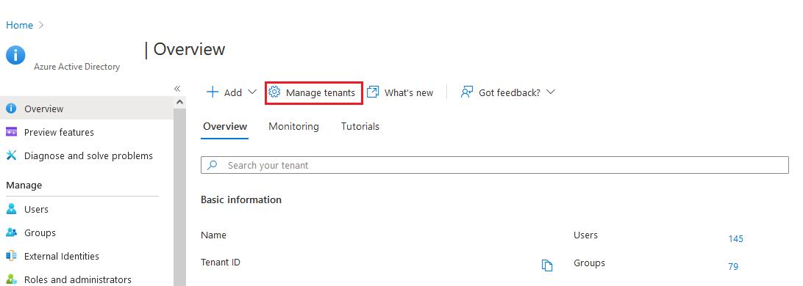
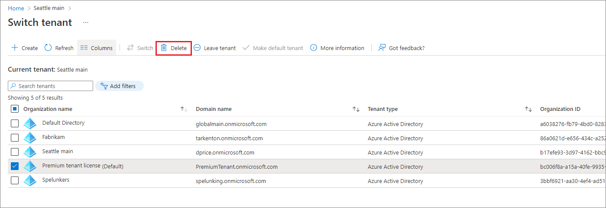
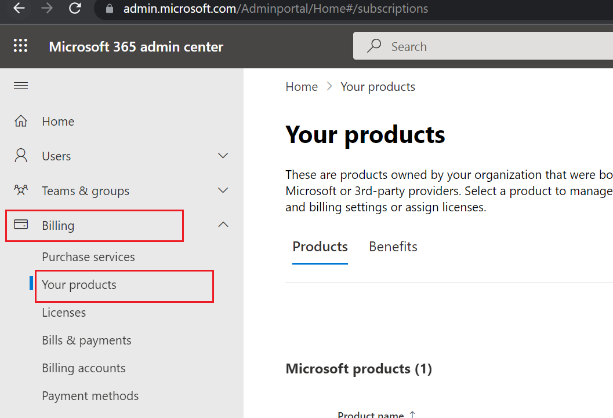
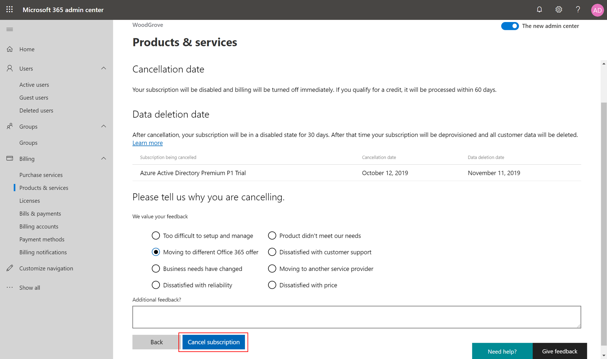
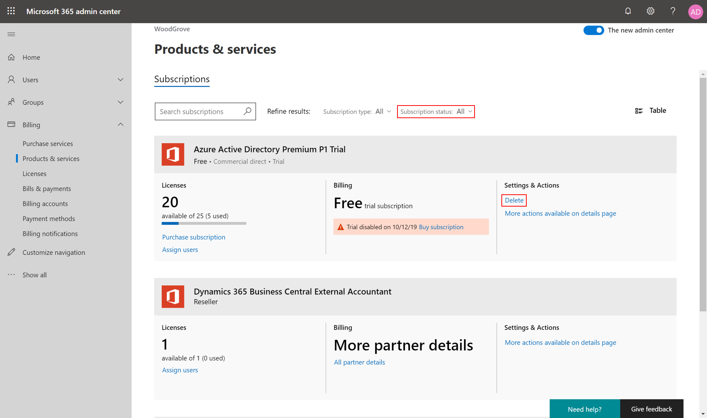
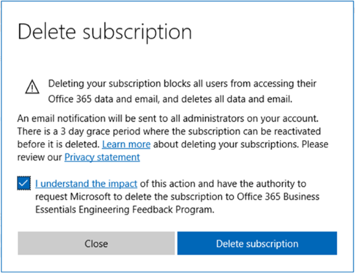
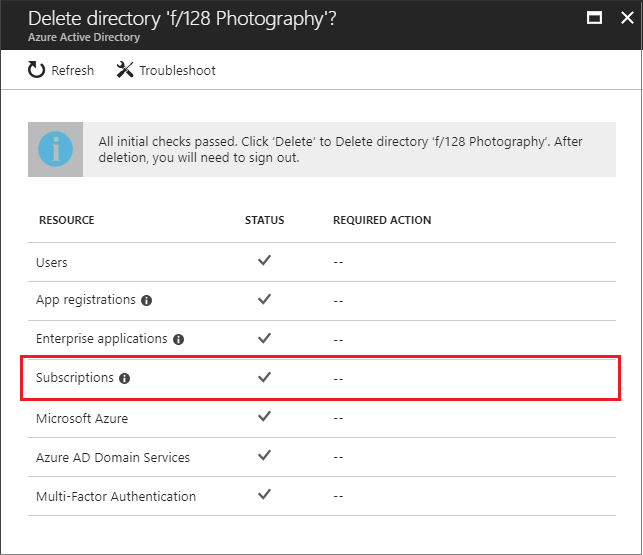
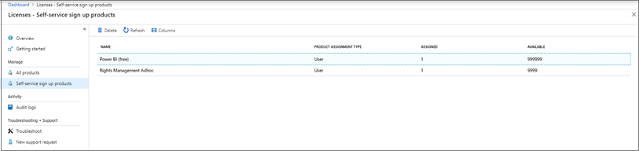
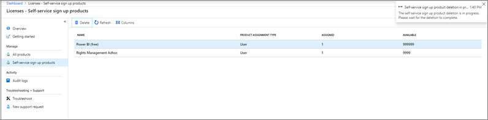

# Delete a tenant in Azure Active Directory

When an organization (tenant) is deleted in Azure Active Directory (Azure AD), part of Microsoft Entra, all resources in the organization are also deleted. Prepare your organization by minimizing its associated resources before you delete. Only a global administrator in Azure AD can delete an Azure AD organization from the Azure portal.

## Prepare the organization

You can't delete an organization in Azure AD until it passes several checks. These checks reduce the risk that deleting an Azure AD organization negatively affects user access, such as the ability to sign in to Microsoft 365 or access resources in Azure. For example, if the organization associated with a subscription is unintentionally deleted, users can't access the Azure resources for that subscription. 

Check the following conditions:

* You've paid all outstanding invoices and amounts due or overdue.
* No users are in the Azure AD tenant, except one global administrator who will delete the organization. You must delete any other users before you can delete the organization. 

  If users are synchronized from on-premises, turn off the sync first. You must delete the users in the cloud organization by using the Azure portal or Azure PowerShell cmdlets.
* No applications are in the organization. You must remove any applications before you can delete the organization.
* No multifactor authentication providers are linked to the organization.
* No subscriptions for any Microsoft Online Services offerings (such as Azure, Microsoft 365, or Azure AD Premium) are associated with the organization. 

  For example, if a default Azure AD tenant was created for you in Azure, you can't delete this organization if your Azure subscription still relies on it for authentication. You also can't delete a tenant if another user has associated an Azure subscription with it.

> [!NOTE]
> Microsoft is aware that customers with certain tenant configurations might be unable to successfully delete their Azure AD organization. We're working to address this problem. If you need more information, contact Microsoft support.

## Delete the organization

[!INCLUDE [portal updates](~/articles/active-directory/includes/portal-update.md)]

1. Sign in to the [Azure portal](https://portal.azure.com) with an account that is the Global Administrator for your organization.
1. Select **Azure Active Directory**.
1. On a tenant's **Overview** page, select **Manage tenants**.
  
   

1. Select the checkbox for the tenant that you want to delete, and then select **Delete**.
  
   
1. If your organization doesn't pass one or more checks, you'll get a link to more information on how to pass. After you pass all checks, select **Delete** to complete the process.

## Deprovision subscriptions to allow organization deletion

When you configured your Azure AD organization, you might have also activated license-based subscriptions for your organization, like Azure AD Premium P2, Microsoft 365 Business Standard, or Enterprise Mobility + Security E5. To avoid accidental data loss, you can't delete an organization until the subscriptions are fully deleted. The subscriptions must be in a **Deprovisioned** state to allow organization deletion. An **Expired** or **Canceled** subscription moves to the **Disabled** state, and the final stage is the **Deprovisioned** state.

For what to expect when a trial Microsoft 365 subscription expires (not including paid Partner/CSP, Enterprise Agreement, or Volume Licensing), see the following table. For more information on Microsoft 365 data retention and subscription lifecycle, see [What happens to my data and access when my Microsoft 365 for business subscription ends?](https://support.office.com/article/what-happens-to-my-data-and-access-when-my-office-365-for-business-subscription-ends-4436582f-211a-45ec-b72e-33647f97d8a3). 

Subscription state | Data | Access to data
----- | ----- | -----
**Active** (30 days for trial) | Data is accessible to all.	| Users have normal access to Microsoft 365 files or apps. Admins have normal access to the Microsoft 365 admin center and resources. 
**Expired** (30 days) | Data is accessible to all.| Users have normal access to Microsoft 365 files or apps. Admins have normal access to the Microsoft 365 admin center and resources.
**Disabled** (30 days) | Data is accessible to admins only. | Users can't access Microsoft 365 files or apps. Admins can access the Microsoft 365 admin center but can't assign licenses to or update users.
**Deprovisioned**  (30 days after **Disabled**) | Data is deleted (automatically deleted if no other services are in use). | Users can't access Microsoft 365 files or apps. Admins can access the Microsoft 365 admin center to purchase and manage other subscriptions.

## Delete an Office 365 or Microsoft 365 subscription

You can use the Microsoft admin center to put a subscription into the **Deprovisioned** state for deletion in three days:

1. Sign in to the [Microsoft 365 admin center](https://admin.microsoft.com) with an account that is a global administrator in your organization. If you're trying to delete the Contoso organization that has the initial default domain `contoso.onmicrosoft.com`, sign in with a User Principal Name (UPN) such as `admin@contoso.onmicrosoft.com`.

1. Preview the new Microsoft 365 admin center by turning on the **Try the new admin center** toggle.

   

1. You need to cancel a subscription before you can delete it. Select **Billing** > **Your products**, and then select **Cancel subscription** for the subscription that you want to cancel. 

   

1. Complete the feedback form, and then select **Cancel subscription**.

   

1. Select **Delete** for the subscription that you want to delete. If you can't find the subscription on the **Your products** page, make sure that you have **Subscription status** set to **All**.

   

1. Select the checkbox to accept terms and conditions, and then select **Delete subscription**. All data for the subscription is permanently deleted in three days. You can [reactivate the subscription](/office365/admin/subscriptions-and-billing/reactivate-your-subscription) during the three-day period if you change your mind.
  
   

   Now the subscription state has changed to **Disabled**, and the subscription is marked for deletion. The subscription enters the **Deprovisioned** state 72 hours later.

1. After you've deleted a subscription in your organization and 72 hours have elapsed, sign in to the Azure portal again. Confirm that no required actions or subscriptions are blocking your organization deletion. You should be able to successfully delete your Azure AD organization.
  
   
   
## Delete an Azure subscription

If you have an active or canceled Azure subscription associated with your Azure AD tenant, you can't delete the Azure AD tenant. After you cancel, billing is stopped immediately. However, Microsoft waits 30 to 90 days before permanently deleting your data in case you need to access it or you change your mind. We don't charge you for keeping the data. 

If you have a free trial or pay-as-you-go subscription, you don't have to wait 90 days for the subscription to be automatically deleted. You can delete your subscription three days after you cancel it, when the **Delete subscription** option becomes available. For details, read through [Delete free trial or pay-as-you-go subscriptions](../../cost-management-billing/manage/cancel-azure-subscription.md#delete-subscriptions).

All other subscription types are deleted only through the [subscription cancellation](../../cost-management-billing/manage/cancel-azure-subscription.md#cancel-a-subscription-in-the-azure-portal) process. In other words, you can't delete a subscription directly unless it's a free trial or pay-as-you-go subscription. However, after you cancel a subscription, you can create an [Azure support request](https://go.microsoft.com/fwlink/?linkid=2083458) and ask to have the subscription deleted immediately.

Alternatively, you can move the Azure subscription to another Azure AD tenant account. When you transfer billing ownership of your subscription to an account in another Azure AD tenant, you can move the subscription to the new account's tenant. Performing a **Switch Directory** action on the subscription wouldn't help, because the billing would still be aligned with the Azure AD tenant that was used to sign up for the subscription. For more information, review [Transfer a subscription to another Azure AD tenant account](../../cost-management-billing/manage/billing-subscription-transfer.md#transfer-a-subscription-to-another-azure-ad-tenant-account).

After you have all the Azure, Office 365, and Microsoft 365 subscriptions canceled and deleted, you can clean up the rest of the things within an Azure AD tenant before you delete it.

## Remove enterprise apps that you can't delete

A few enterprise applications can't be deleted in the Azure portal and might block you from deleting the tenant. Use the following PowerShell procedure to remove those applications:

1. Install the MSOnline module for PowerShell by running the following command:

   `Install-Module -Name MSOnline`

2. Install the Az PowerShell module by running the following command:

   `Install-Module -Name Az`

3. Create or use a managed admin account from the tenant that you want to delete. For example: `newAdmin@tenanttodelete.onmicrosoft.com`. 

4. Open PowerShell and connect to Azure AD by using admin credentials with the following command:

    `connect-msolservice`

    >[!WARNING]
    > You must run PowerShell by using admin credentials for the tenant that you're trying to delete. Only homed-in admins have access to manage the directory via Powershell. You can't use guest user admins, Microsoft accounts, or multiple directories. 
    >
    > Before you proceed, verify that you're connected to the tenant that you want to delete with the MSOnline module. We recommend that you run the `Get-MsolDomain` command to confirm that you're connected to the correct tenant ID and `onmicrosoft.com` domain.

5. Run the following commands to set the tenant context.  DO NOT skip these steps or you run the risk of deleting enterprise apps from the wrong teant.

   `Clear-AzContext -Scope CurrentUser`

   `Connect-AzAccount -Tenant \<object id of the tenant you are attempting to delete\>`
   
   `Get-AzContext`

    >[!WARNING]
    > Before you proceed, verify that you're connected to the tenant that you want to delete with the Az PowerShell module. We recommend that you run the `Get-AzContext` command to check the connected tenant ID and `onmicrosoft.com` domain.  Do NOT skip the above steps or you run the risk of deleting enterprise apps from the wrong tenant.

6. Run the following command to remove any enterprise apps that you can't delete:

    `Get-AzADServicePrincipal | ForEach-Object { Remove-AzADServicePrincipal -ObjectId $_.Id }`

7. Run the following command to remove applications and service principals:

   `Get-MsolServicePrincipal | Remove-MsolServicePrincipal`

8. Run the following command to disable any blocking service principals:

    `Get-MsolServicePrincipal | Set-MsolServicePrincipal -AccountEnabled $false`

9. Sign in to the [Azure portal](https://portal.azure.com) again, and remove any new admin account that you created in step 3.

10. Retry tenant deletion from the Azure portal.

## Handle a trial subscription that blocks deletion

There are [self-service sign-up products](/office365/admin/misc/self-service-sign-up) like Microsoft Power BI, Azure Rights Management (Azure RMS), Microsoft Power Apps, and Dynamics 365. Individual users can sign up via Microsoft 365, which also creates a guest user for authentication in your Azure AD organization. 

These self-service products block directory deletions until the products are fully deleted from the organization, to avoid data loss. Only the Azure AD admin can delete them, whether the user signed up individually or was assigned the product.

There are two types of self-service sign-up products, in terms of how they're assigned: 

* Organizational-level assignment: An Azure AD admin assigns the product to the entire organization. A user can actively use the service with the organizational-level assignment, even if the user isn't licensed individually.
* User-level assignment: An individual user during self-service sign-up essentially self-assigns the product without an admin. After an admin starts managing the organization (see [Administrator takeover of an unmanaged organization](domains-admin-takeover.md)), the admin can directly assign the product to users without self-service sign-up.  

When you begin the deletion of a self-service sign-up product, the action permanently deletes the data and removes all user access to the service. Any user who was assigned the offer individually or on the organization level is then blocked from signing in or accessing any existing data. If you want to prevent data loss with a self-service sign-up product like [Microsoft Power BI dashboards](/power-bi/service-export-to-pbix) or [Azure RMS policy configuration](/azure/information-protection/configure-policy#how-to-configure-the-azure-information-protection-policy), ensure that the data is backed up and saved elsewhere.

For more information about currently available self-service sign-up products and services, see [Available self-service programs](/office365/admin/misc/self-service-sign-up#available-self-service-programs).

For what to expect when a trial Microsoft 365 subscription expires (not including paid Partner/CSP, Enterprise Agreement, or Volume Licensing), see the following table. For more information on Microsoft 365 data retention and subscription lifecycle, see [What happens to my data and access when my Microsoft 365 for Business subscription ends?](/office365/admin/subscriptions-and-billing/what-if-my-subscription-expires).

Product state | Data | Access to data
------------- | ---- | --------------
**Active** (30 days for trial) | Data is accessible to all. | Users have normal access to self-service sign-up products, files, or apps. Admins have normal access to the Microsoft 365 admin center and resources.
**Deleted** | Data is deleted. | Users can't access self-service sign-up products, files, or apps. Admins can access the Microsoft 365 admin center to purchase and manage other subscriptions.

## Delete a self-service sign-up product

You can put a self-service sign-up product like Microsoft Power BI or Azure RMS into a **Delete** state to be immediately deleted in the Azure portal:

1. Sign in to the [Azure portal](https://portal.azure.com) with an account that is a global administrator in the organization. If you're trying to delete the Contoso organization that has the initial default domain `contoso.onmicrosoft.com`, sign in with a UPN such as `admin@contoso.onmicrosoft.com`.
1. Browse to **Azure Active Directory**.

1. Select **Licenses**, and then select **Self-service sign-up products**. You can see all the self-service sign-up products separately from the seat-based subscriptions. Choose the product that you want to permanently delete. Here's an example in Microsoft Power BI:

    

1. Select **Delete** to delete the product. This action will remove all users and remove organization access to the product. A dialog warns you that deleting the product will immediately and irrevocably delete data. Select **Yes** to confirm.  

    

    A notification tells you that the deletion is in progress.  

    

1. The self-service sign-up product state has changed to **Deleted**. Refresh the page, and verify that the product is removed from the **Self-service sign-up products** page.  

    

1. After you've deleted all the products, sign in to the Azure portal again. Confirm that no required actions or products are blocking your organization deletion. You should be able to successfully delete your Azure AD organization.

    

## Next steps

[Azure Active Directory documentation](../index.yml)
