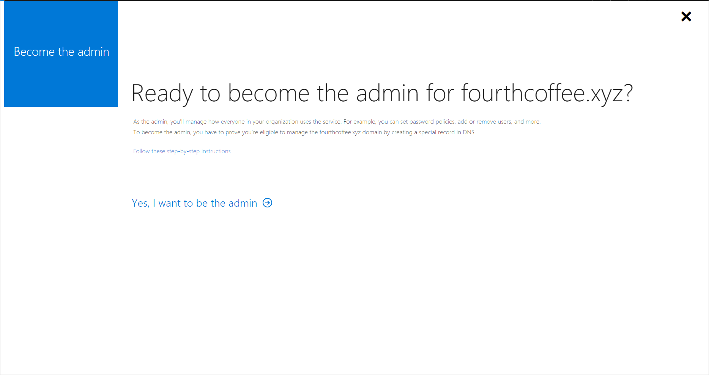
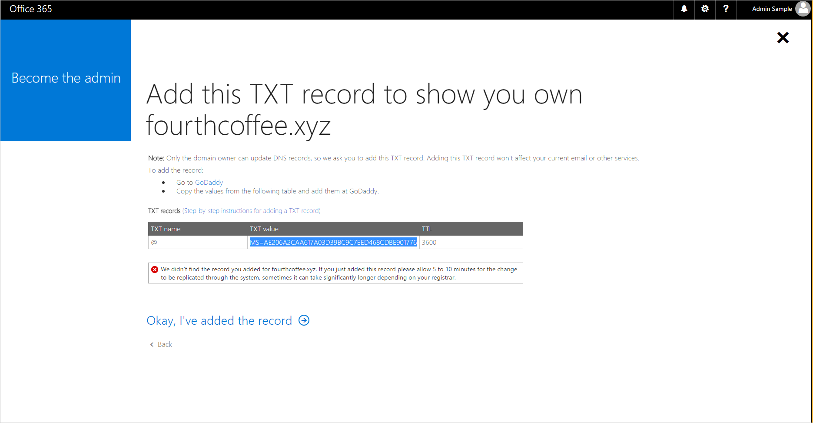
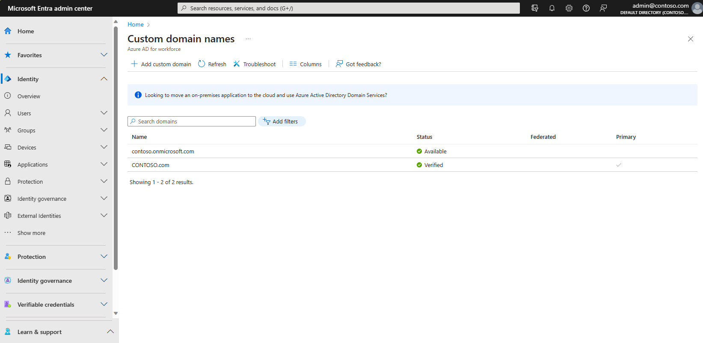

# Take over an unmanaged directory as administrator in Microsoft Entra ID

This article describes two ways to take over a DNS domain name in an unmanaged directory in Microsoft Entra ID formerly known as Azure AD. When a self-service user signs up for a cloud service that uses Microsoft Entra ID, they're added to an unmanaged Microsoft Entra directory based on their email domain. For more about self-service or "viral" sign-up for a service, see [What is self-service sign-up for Microsoft Entra ID?](directory-self-service-signup.md)


> [!VIDEO https://www.youtube.com/embed/GOSpjHtrRsg]

## Decide how you want to take over an unmanaged directory

During the process of admin takeover, you can prove ownership as described in [Add a custom domain name to Microsoft Entra ID](../fundamentals/add-custom-domain.md). The next sections explain the admin experience in more detail, but here's a summary:

* When you perform an ["internal" admin takeover](#internal-admin-takeover) of an unmanaged Azure directory, you're added as the global administrator of the unmanaged directory. No users, domains, or service plans are migrated to any other directory you administer.

* When you perform an ["external" admin takeover](#external-admin-takeover) of an unmanaged Azure directory, you add the DNS domain name of the unmanaged directory to your managed Azure directory. When you add the domain name, a mapping of users to resources is created in your managed Azure directory so that users can continue to access services without interruption. 

## Internal admin takeover

Some products that include SharePoint and OneDrive, such as Microsoft 365, don't support external takeover. If that is your scenario, or if you're an admin and want to take over an unmanaged or "shadow" Microsoft Entra organization created by users who used self-service sign-up, you can do this with an internal admin takeover.

1. Create a user context in the unmanaged organization through signing up for Power BI. For convenience of example, these steps assume that path.

2. Open the [Power BI site](https://powerbi.microsoft.com) and select **Start Free**. Enter a user account that uses the domain name for the organization; for example, `admin@fourthcoffee.xyz`. After you enter in the verification code, check your email for the confirmation code.

3. In the confirmation email from Power BI, select **Yes, that's me**.

4. Sign in to the [Microsoft 365 admin center](https://portal.office.com/admintakeover) with the Power BI user account. You receive a message that instructs you to **Become the Admin** of the domain name that was already verified in the unmanaged organization. select **Yes, I want to be the admin**.
  
   
  
5. Add the TXT record to prove that you own the domain name **fourthcoffee.xyz** at your domain name registrar. In this example, it's GoDaddy.com.
  
   

When the DNS TXT records are verified at your domain name registrar, you can manage the Microsoft Entra organization.

When you complete the preceding steps, you're now the global administrator of the Fourth Coffee organization in Microsoft 365. To integrate the domain name with your other Azure services, you can remove it from Microsoft 365 and add it to a different managed organization in Azure.

<a name='adding-the-domain-name-to-a-managed-organization-in-entra-id'></a>

### Adding the domain name to a managed organization in Microsoft Entra ID

[!INCLUDE [portal updates](~/articles/active-directory/includes/portal-update.md)]

1. Open the [Microsoft 365 admin center](https://admin.microsoft.com).
2. Select **Users** tab, and create a new user account with a name like *user\@fourthcoffeexyz.onmicrosoft.com* that doesn't use the custom domain name. 
3. Ensure that the new user account has Global Administrator privileges for the Microsoft Entra organization.
4. Open **Domains** tab in the Microsoft 365 admin center, select the domain name and select **Remove**. 
  
   
  
5. If you have any users or groups in Microsoft 365 that reference the removed domain name, they must be renamed to the .onmicrosoft.com domain. If you force delete the domain name, all users are automatically renamed, in this example to *user\@fourthcoffeexyz.onmicrosoft.com*.
  
6. Sign in to the [Microsoft Entra admin center](https://entra.microsoft.com) as at least a [Global Administrator](../roles/permissions-reference.md#global-administrator).
7. In the search box at the top of the page, search for **Domain Names**.

8. Select **+ Add custom domain names**, then add the domain name. You'll have to enter the DNS TXT records to verify ownership of the domain name. 
  
   
  
> [!NOTE]
> Any users of Power BI or Azure Rights Management service who have licenses assigned in the Microsoft 365 organization must save their dashboards if the domain name is removed. They must sign in with a user name like *user\@fourthcoffeexyz.onmicrosoft.com* rather than *user\@fourthcoffee.xyz*.

## External admin takeover

If you already manage an organization with Azure services or Microsoft 365, you can't add a custom domain name if it's already verified in another Microsoft Entra organization. However, from your managed organization in Microsoft Entra ID you can take over an unmanaged organization as an external admin takeover. The general procedure follows the article [Add a custom domain to Microsoft Entra ID](../fundamentals/add-custom-domain.md).

When you verify ownership of the domain name, Microsoft Entra ID removes the domain name from the unmanaged organization and moves it to your existing organization. External admin takeover of an unmanaged directory requires the same DNS TXT validation process as internal admin takeover. The difference is that the following are also moved over with the domain name:

- Users
- Subscriptions
- License assignments

### Support for external admin takeover

External admin takeover is supported by the following online services:

- Azure Rights Management
- Exchange Online

The supported service plans include:

- Power Apps Free
- Power Automate Free
- RMS for individuals
- Microsoft Stream
- Dynamics 365 free trial

External admin takeover isn't supported for any service that has service plans that include SharePoint, OneDrive, or Skype For Business; for example, through an Office free subscription. 

> [!NOTE]
> External admin takeover is not supported cross cloud boundaries (ex. Azure Commercial to Azure Government).  In these scenarios it is recommended to perform External admin takeover into another Azure Commercial tenant, and then delete the domain from this tenant so you may verify successfully into the destination Azure Government tenant.


#### More information about RMS for individuals

For [RMS for individuals](/azure/information-protection/rms-for-individuals), when the unmanaged organization is in the same region as the organization that you own, the automatically created [Azure Information Protection organization key](/azure/information-protection/plan-implement-tenant-key) and [default protection templates](/azure/information-protection/configure-usage-rights#rights-included-in-the-default-templates) are additionally moved over with the domain name.

The key and templates aren't moved over when the unmanaged organization is in a different region. For example, if the unmanaged organization is in Europe and the organization that you own is in North America.

Although RMS for individuals is designed to support Microsoft Entra authentication to open protected content, it doesn't prevent users from also protecting content. If users did protect content with the RMS for individuals subscription, and the key and templates weren't moved over, that content isn't accessible after the domain takeover.

### Azure AD PowerShell cmdlets for the ForceTakeover option

You can see these cmdlets used in [PowerShell example](#powershell-example).

cmdlet | Usage
------- | -------
`connect-mggraph` | When prompted, sign in to your managed organization.
`get-mgdomain` | Shows your domain names associated with the current organization.
`new-mgdomain -BodyParameter @{Id="<your domain name>"; IsDefault="False"}` | Adds the domain name to organization as Unverified (no DNS verification has been performed yet).
`get-mgdomain` | The domain name is now included in the list of domain names associated with your managed organization, but is listed as **Unverified**.
`Get-MgDomainVerificationDnsRecord` | Provides the information to put into new DNS TXT record for the domain (MS=xxxxx). Verification might not happen immediately because it takes some time for the TXT record to propagate, so wait a few minutes before considering the **-ForceTakeover** option. 
`confirm-mgdomain –Domainname <domainname>` | - If your domain name is still not verified, you can proceed with the **-ForceTakeover** option. It verifies that the TXT record was created and kicks off the takeover process.<br>- The **-ForceTakeover** option should be added to the cmdlet only when forcing an external admin takeover, such as when the unmanaged organization has Microsoft 365 services blocking the takeover.
`get-mgdomain` | The domain list now shows the domain name as **Verified**.

> [!NOTE]
> The unmanaged Microsoft Entra organization is deleted 10 days after you exercise the external takeover force option.

### PowerShell example

1. Connect to Microsoft Graph using the credentials that were used to respond to the self-service offering:
   ```powershell
   Install-Module -Name Microsoft.Graph
      
   Connect-MgGraph -Scopes "User.ReadWrite.All","Domain.ReadWrite.All"
   ```
2. Get a list of domains:
  
   ```powershell
   Get-MgDomain
   ```
3. Run the New-MgDomain cmdlet to add a new domain:
   ```powershell
   New-MgDomain -BodyParameter @{Id="<your domain name>"; IsDefault="False"}
   ```
4. Run the Get-MgDomainVerificationDnsRecord cmdlet to view the DNS challenge:
   ```powershell
   (Get-MgDomainVerificationDnsRecord -DomainId "<your domain name>" | ?{$_.recordtype -eq "Txt"}).AdditionalProperties.text
   ```
    For example:
   ```powershell
   (Get-MgDomainVerificationDnsRecord -DomainId "contoso.com" | ?{$_.recordtype -eq "Txt"}).AdditionalProperties.text
   ```

4. Copy the value (the challenge) that is returned from this command. For example:
   ```powershell
   MS=ms18939161
   ```
5. In your public DNS namespace, create a DNS txt record that contains the value that you copied in the previous step. The name for this record is the name of the parent domain, so if you create this resource record by using the DNS role from Windows Server, leave the Record name blank and just paste the value into the Text box.
6. Run the Confirm-MgDomain cmdlet to verify the challenge:
  
   ```powershell
   Confirm-MgDomain -DomainId "<your domain name>"
   ```
  
   For example:
  
   ```powershell
   Confirm-MgDomain -DomainId "contoso.com"
   ```

A successful challenge returns you to the prompt without an error.

## Next steps

* [Add a custom domain name to Microsoft Entra ID](../fundamentals/add-custom-domain.md)
* [How to install and configure Azure PowerShell](/powershell/azure/)
* [Azure PowerShell](/powershell/azure/)
* [Azure Cmdlet Reference](/powershell/azure/get-started-azureps)
* [Set-MsolCompanySettings](/powershell/module/msonline/set-msolcompanysettings?view=azureadps-1.0&preserve-view=true)

<!--Image references-->
[1]: ./media/active-directory-self-service-signup/SelfServiceSignUpControls.png
