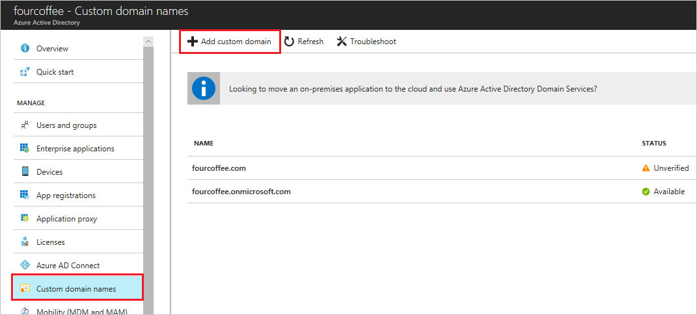

# Managing custom domain names in your Microsoft Entra ID

A domain name is an important part of the identifier for resources in many Microsoft Entra deployments. It's part of a user name or email address for a user, part of the address for a group, and is sometimes part of the app ID URI for an application. A resource in Microsoft Entra ID can include a domain name that's owned by the Microsoft Entra organization (sometimes called a tenant) that contains the resource. [Global Administrators](../roles/permissions-reference.md#global-administrator) and [Domain name administrators](../roles/permissions-reference.md#domain-name-administrator) can manage domains in Microsoft Entra ID. 

## Set the primary domain name for your Microsoft Entra organization

[!INCLUDE [portal updates](~/articles/active-directory/includes/portal-update.md)]

When your organization is created, the initial domain name, such as ‘contoso.onmicrosoft.com,’ is also the primary domain name. The primary domain is the default domain name for a new user when you create a new user. Setting a primary domain name streamlines the process for an administrator to create new users in the portal. To change the primary domain name:

1. Sign in to the [Microsoft Entra admin center](https://entra.microsoft.com) as at least a [Global Administrator](../roles/permissions-reference.md#global-administrator).
1. Select Microsoft Entra ID.
3. Select **Custom domain names**.
  
   
4. Select the name of the domain that you want to be the primary domain.
5. Select the **Make primary** command. Confirm your choice when prompted.
  
   

You can change the primary domain name for your organization to be any verified custom domain that isn't federated. Changing the primary domain for your organization won't change the user name for any existing users.

## Add custom domain names to your Microsoft Entra organization

You can add up to 5000 managed domain names. If you're configuring all your domains for federation with on-premises Active Directory, you can add up to 2500 domain names in each organization.

## Add subdomains of a custom domain

If you want to add a subdomain name such as ‘europe.contoso.com’ to your organization, you should first add and verify the root domain, such as contoso.com. The subdomain is automatically verified by Microsoft Entra ID. To see that the subdomain you added is verified, refresh the domain list in the browser.

If you have already added a contoso.com domain to one Microsoft Entra organization, you can also verify the subdomain europe.contoso.com in a different Microsoft Entra organization. When adding the subdomain, you are prompted to add a TXT record in the DNS hosting provider.

## What to do if you change the DNS registrar for your custom domain name

If you change the DNS registrars, there are no other configuration tasks in Microsoft Entra ID. You can continue using the domain name with Microsoft Entra ID without interruption. If you use your custom domain name with Microsoft 365, Intune, or other services that rely on custom domain names in Microsoft Entra ID, see the documentation for those services.

## Delete a custom domain name

You can delete a custom domain name from your Microsoft Entra ID if your organization no longer uses that domain name, or if you need to use that domain name with another Microsoft Entra organization.

To delete a custom domain name, you must first ensure that no resources in your organization rely on the domain name. You can't delete a domain name from your organization if:

* Any user has a user name, email address, or proxy address that includes the domain name.
* Any group has an email address or proxy address that includes the domain name.
* Any application in your Microsoft Entra ID has an app ID URI that includes the domain name.

You must change or delete any such resource in your Microsoft Entra organization before you can delete the custom domain name. 

> [!NOTE]
> To delete the custom domain, use a Global Administrator account that is based on either the default domain (onmicrosoft.com) or a different custom domain (mydomainname.com).

## ForceDelete option

You can **ForceDelete** a domain name in the [Azure portal](https://portal.azure.com) or using [Microsoft Graph API](/graph/api/domain-forcedelete). These options use an asynchronous operation and update all references from the custom domain name like “user@contoso.com” to the initial default domain name such as “user@contoso.onmicrosoft.com.”

To call **ForceDelete** in the Azure portal, you must ensure that there are fewer than 1000 references to the domain name, and any references where Exchange is the provisioning service must be updated or removed in the [Exchange Admin Center](https://outlook.office365.com/ecp/). This includes Exchange Mail-Enabled Security Groups and distributed lists. For more information, see [Removing mail-enabled security groups](/Exchange/recipients/mail-enabled-security-groups#Remove%20mail-enabled%20security%20groups&preserve-view=true). Also, the **ForceDelete** operation won't succeed if either of the following is true:

* You purchased a domain via Microsoft 365 domain subscription services
* You are a partner administering on behalf of another customer organization

The following actions are performed as part of the **ForceDelete** operation:

* Renames the UPN, EmailAddress, and ProxyAddress of users with references to the custom domain name to the initial default domain name.
* Renames the EmailAddress of groups with references to the custom domain name to the initial default domain name.
* Renames the identifierUris of applications with references to the custom domain name to the initial default domain name.

An error is returned when:

* The number of objects to be renamed is greater than 1000
* One of the applications to be renamed is a multi-tenant app

## Best Practices for Domain Hygiene

Use a reputable registrar that provides ample notifications for domain name changes, registration expiry, a grace period for expired domains, and maintains high security standards for controlling who has access to your domain name configuration and TXT records.
Keep your domain names current with your Registrar, and verify TXT records for accuracy.

* If you purposefully are expiring your domain name or turning over ownership to someone else (separately from your Microsoft Entra tenant), you should delete it from your Microsoft Entra tenant prior to expiring or transferring.
* If you do allow your domain name to expire, if you are able to reactivate it/regain control of it, carefully review all TXT records with the registrar to ensure no tampering of your domain name took place.
* If you can't reactivate or regain control of your domain name immediately, you should delete it from your Microsoft Entra tenant. Don't read/re-verify until you are able to resolve ownership of the domain name and verify the full TXT record for correctness.

>[!NOTE]
> Microsoft will not allow a domain name to be verified with more than Microsoft Entra tenant. Once you delete a domain name from your tenant, you will not be able to re-add/re-verify it with your Microsoft Entra tenant if it is subsequently added and verified with another Microsoft Entra tenant.

## Frequently asked questions

**Q: Why is the domain deletion failing with an error that states that I have Exchange mastered groups on this domain name?**  
**A:** Today, certain groups like Mail-Enabled Security groups and distributed lists are provisioned by Exchange and need to be manually cleaned up in [Exchange Admin Center (EAC)](https://outlook.office365.com/ecp/). There may be lingering ProxyAddresses, which rely on the custom domain name and will need to be updated manually to another domain name. 

**Q: I am logged in as admin\@contoso.com but I cannot delete the domain name “contoso.com”?** 
**A:** You can't reference the custom domain name you are trying to delete in your user account name. Ensure that the Global Administrator account is using the initial default domain name (.onmicrosoft.com) such as admin@contoso.onmicrosoft.com. Sign in with a different Global Administrator account that such as admin@contoso.onmicrosoft.com or another custom domain name like “fabrikam.com” where the account is admin@fabrikam.com.

**Q: I clicked the Delete domain button and see `In Progress` status for the Delete operation. How long does it take? What happens if it fails?** 
**A:**  The delete domain operation is an asynchronous background task that renames all references to the domain name. It may take up to 24 hours to complete. If domain deletion fails, ensure that you don’t have:

* Apps configured on the domain name with the appIdentifierURI
* Any mail-enabled group referencing the custom domain name
* More than 1000 references to the domain name
* The domain to be removed the set as the Primary domain of your organization

Also note that the ForceDelete option won't work if the domain uses Federated authentication type. In that case the users/groups on the domain must be renamed or removed using the on-premises Active Directory before reattempting the domain removal.
If you find that any of the conditions haven’t been met, manually clean up the references, and try to delete the domain again.

## Use PowerShell or the Microsoft Graph API to manage domain names

Most management tasks for domain names in Microsoft Entra ID can also be completed using Microsoft PowerShell, or programmatically using the Microsoft Graph API.

* [Using PowerShell to manage domain names in Microsoft Entra ID](/powershell/module/azuread/#domains&preserve-view=true)
* [Domain resource type](/graph/api/resources/domain)

## Next steps

* [Add custom domain names](../fundamentals/add-custom-domain.md?context=azure%2factive-directory%2fusers-groups-roles%2fcontext%2fugr-context)
* [Remove Exchange mail-enabled security groups in Exchange Admin Center on a custom domain name in Microsoft Entra ID](/Exchange/recipients/mail-enabled-security-groups#Remove%20mail-enabled%20security%20groups&preserve-view=true)
* [ForceDelete a custom domain name with Microsoft Graph API](/graph/api/domain-forcedelete)
