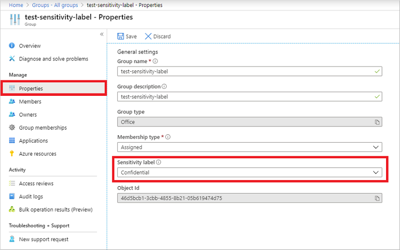

# Assign sensitivity labels to Microsoft 365 groups in Microsoft Entra ID

Microsoft Entra ID, part of Microsoft Entra, supports applying sensitivity labels published by the [Microsoft Purview compliance portal](https://compliance.microsoft.com) to Microsoft 365 groups. Sensitivity labels apply to group across services like Outlook, Microsoft Teams, and SharePoint. For more information about Microsoft 365 apps support, see [Microsoft 365 support for sensitivity labels](/purview/sensitivity-labels-teams-groups-sites#support-for-the-sensitivity-labels).

> [!IMPORTANT]
> To configure this feature, there must be at least one active Microsoft Entra ID P1 license in your Microsoft Entra organization.

## Enable sensitivity label support in PowerShell

To apply published labels to groups, you must first enable the feature. These steps enable the feature in Microsoft Entra ID.

1. Open a PowerShell prompt on your computer. You can open it without elevated privileges.
1. Run the following commands to prepare to run the cmdlets.

    ```powershell
    Install-Module AzureADPreview
    Import-Module AzureADPreview
    AzureADPreview\Connect-AzureAD
    ```

    In the **Sign in to your account** page, enter your admin account and password to connect you to your service, and select **Sign in**.
1. Fetch the current group settings for the Microsoft Entra organization and display the current group settings.

    ```powershell
    $grpUnifiedSetting = (Get-AzureADDirectorySetting | where -Property DisplayName -Value "Group.Unified" -EQ)
    $Setting = $grpUnifiedSetting
    $grpUnifiedSetting.Values
    ```

    > [!NOTE]
    > If no group settings have been created for this Microsoft Entra organization, you will get an empty screen. In this case, you must first create the settings. Follow the steps in [Microsoft Entra cmdlets for configuring group settings](../enterprise-users/groups-settings-cmdlets.md) to create group settings for this Microsoft Entra organization.  
    
    > [!NOTE]
    > If the sensitivity label has been enabled previously, you will see **EnableMIPLabels** =  **True**. In this case, you do not need to do anything.

1. Enable the feature:

    ```powershell
    $Setting["EnableMIPLabels"] = "True"
    ```
 
1. Check the new applied value:

    ```powershell
    $Setting.Values
    ```
    
1. Save the changes and apply the settings:

    ```powershell
    Set-AzureADDirectorySetting -Id $grpUnifiedSetting.Id -DirectorySetting $Setting
    ```

If you’re receiving a Request_BadRequest error, it's because the settings already exist in the tenant, so when you try to create a new property:value pair, the result is an error. In this case, take the following steps:

1. Repeat steps 1-4 from [Enable sensitivity label support in PowerShell](#enable-sensitivity-label-support-in-powershell).
1. Issue a `Get-AzureADDirectorySetting | FL` cmdlet and check the ID. If several ID values are present, use the one where you see the EnableMIPLabels property on the Values settings. You will need the ID in step 4.
1. Set the EnableMIPLabels property variable: `$Setting["EnableMIPLabels"] = "True"`
1. Issue the `Set-AzureADDirectorySetting -DirectorySetting $Setting -ID` cmdlet, using the ID that you retrieved in step 2.
1. Ensure that the value is now correctly updated by issuing `$Setting.Values` again.

You will also need to synchronize your sensitivity labels to Microsoft Entra ID. For instructions, see [How to enable sensitivity labels for containers and synchronize labels](/purview/sensitivity-labels-teams-groups-sites#how-to-enable-sensitivity-labels-for-containers-and-synchronize-labels).

## Assign a label to a new group in Azure portal

1. Sign in to the [Microsoft Entra admin center](https://entra.microsoft.com) as at least a [Global Administrator](../roles/permissions-reference.md#global-administrator).
1. Select Microsoft Entra ID.
1. Choose **Groups** > **All groups** > **New group**.
1. On the **New Group** page, select **Office 365**, and then fill out the required information for the new group and select a sensitivity label from the list.

   

1. Save your changes and select **Create**.

Your group is created and the site and group settings associated with the selected label are then automatically enforced.

## Assign a label to an existing group in Azure portal

1. Sign in to the [Microsoft Entra admin center](https://entra.microsoft.com) as at least a [Global Administrator](../roles/permissions-reference.md#global-administrator).
1. Select Microsoft Entra ID.
1. Select **Groups**.
1. From the **All groups** page, select the group that you want to label.
1. On the selected group's page, select **Properties** and select a sensitivity label from the list.

   

1. Select **Save** to save your changes.

## Remove a label from an existing group in Azure portal

1. Sign in to the [Microsoft Entra admin center](https://entra.microsoft.com) as at least a [Global Administrator](../roles/permissions-reference.md#global-administrator).
1. Select Microsoft Entra ID.
1. Select **Groups** > **All groups**.
1. From the **All groups** page, select the group that you want to remove the label from.
1. On the **Group** page, select **Properties**.
1. Select **Remove**.
1. Select **Save** to apply your changes.

<a name='using-classic-azure-ad-classifications'></a>

## Using classic Microsoft Entra classifications

After you enable this feature, the “classic” classifications for groups will appear only existing groups and sites, and you should use them for new groups only if creating groups in apps that don’t support sensitivity labels. Your admin can convert them to sensitivity labels later if needed. Classic classifications are the old classifications you set up by defining values for the `ClassificationList` setting in Azure AD PowerShell. When this feature is enabled, those classifications will not be applied to groups.

## Troubleshooting issues

### Sensitivity labels are not available for assignment on a group

The sensitivity label option is only displayed for groups when all of the following conditions are met:

1. The organization has an active Microsoft Entra ID P1 license.
1. The feature is enabled, EnableMIPLabels is set to True in from the Azure AD PowerShell module.
1. In addition, the sensitivity labels are published in the Microsoft Purview compliance portal for this Microsoft Entra organization.
1. Labels are synchronized to Microsoft Entra ID with the Execute-AzureAdLabelSync cmdlet in the Security & Compliance PowerShell module. It can take up to 24 hours after synchronization for the label to be available to Microsoft Entra ID.
1. The [sensitivity label scope](/purview/sensitivity-labels?preserve-view=true&view=o365-worldwide#label-scopes) must be configured for Groups & Sites.
3. The group is a Microsoft 365 group.
4. The current signed-in user:
    1. has sufficient privileges to assign sensitivity labels. The user must be a Global Administrator, Group Administrator, or the group owner 
    1. and must be within the scope of the [sensitivity label publishing policy](/purview/sensitivity-labels?preserve-view=true&view=o365-worldwide#what-label-policies-can-do)

Please make sure all the conditions above are met in order to assign labels to a group.

### The label I want to assign is not in the list

If the label you are looking for is not in the list, this could be the case for one of the following reasons:

- The label might not be published in the Microsoft Purview compliance portal. This could also apply to labels that are no longer published. Please check with your administrator for more information.
- The label may be published, however, it is not available to the user that is signed-in. Please check with your administrator for more information on how to get access to the label.

### How to change the label on a group

Labels can be swapped at any time using the same steps as assigning a label to an existing group, as follows:

1. 1. Sign in to the [Microsoft Entra admin center](https://entra.microsoft.com) as at least a [Global Administrator](../roles/permissions-reference.md#global-administrator).
1. Select Microsoft Entra ID.
1. Select **Groups**.
1. Choose **All groups**, select the group that you want to label.
1. On the selected group's page, select **Properties** and select a new sensitivity label from the list.
1. Select **Save**.

### Group setting changes to published labels aren't updated on the groups

When you make changes to group settings for a published label in the [Microsoft Purview compliance portal](https://compliance.microsoft.com), those policy changes aren't automatically applied on the labeled groups. Once the sensitivity label is published and applied to groups, Microsoft recommend that you not change the group settings for the label in the Microsoft Purview compliance portal.

If you must make a change, use an [Azure AD PowerShell script](https://github.com/microsoftgraph/powershell-aad-samples/blob/master/ReassignSensitivityLabelToO365Groups.ps1) to manually apply updates to the impacted groups. This method makes sure that all existing groups enforce the new setting.

## Next steps

- [Use sensitivity labels with Microsoft Teams, Microsoft 365 groups, and SharePoint sites](/purview/sensitivity-labels-teams-groups-sites)
- [Update groups after label policy change manually with Azure AD PowerShell script](https://github.com/microsoftgraph/powershell-aad-samples/blob/master/ReassignSensitivityLabelToO365Groups.ps1)
- [Edit your group settings](../fundamentals/how-to-manage-groups.md)
- [Manage groups using PowerShell commands](../enterprise-users/groups-settings-v2-cmdlets.md)
