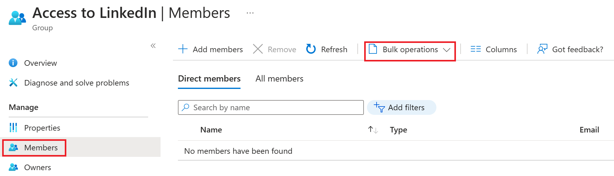

# Bulk download members of a group in Microsoft Entra ID

You can bulk download the members of a group in your organization to a comma-separated values (CSV) file from the Microsoft Entra Admin center. All admins and non-admin users can download group membership lists.

## To bulk download group membership

1. Sign in to the [Microsoft Entra admin center](https://entra.microsoft.com) as at least a [Global Administrator](../roles/permissions-reference.md#global-administrator).
1. Select Microsoft Entra ID.
1. Select **Groups** > **All groups**.
1. Open the group whose membership you want to download, and then select **Members**.
1. On the **Members** page, select **Bulk operations** and choose, **Download members** to download a CSV file listing the group members.

   

[!INCLUDE [Bulk update warning](~/articles/active-directory/includes/bulk-export.md)]

## Check download status

You can see the status of all of your pending bulk requests in the **Bulk operation results** page.

## Bulk download service limits

Each bulk activity to download a list of group members can run for up to one hour. This enables you to download a list of at least 500,000 members.

## Next steps

- [Bulk import group members](groups-bulk-import-members.md)
- [Bulk remove group members](groups-bulk-download-members.md)
