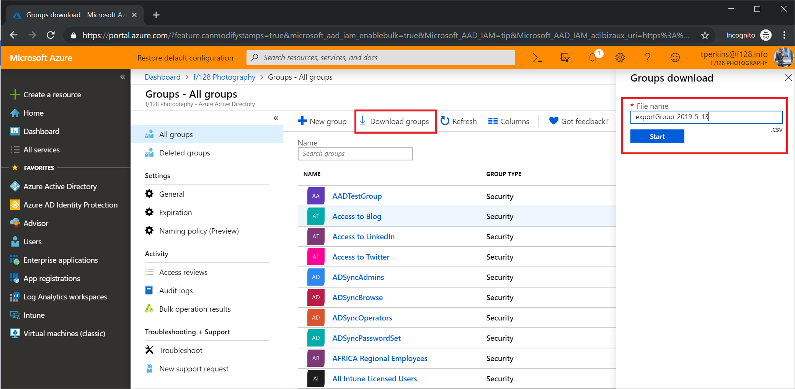

---

title: Download a list of groups in the Azure portal
description: Download group properties in bulk in the Azure admin center in Microsoft Entra ID. 
services: active-directory 
author: barclayn
ms.author: barclayn
manager: amycolannino
ms.date: 03/24/2022
ms.topic: how-to
ms.service: active-directory
ms.subservice: enterprise-users
ms.workload: identity
ms.custom: it-pro
ms.reviewer: jeffsta
ms.collection: M365-identity-device-management
---

# Bulk download a list of groups in Microsoft Entra ID

You can download a list of all the groups in your organization to a comma-separated values (CSV) file in the portal for Microsoft Entra ID, part of Microsoft Entra. All admins and non-admin users can download group lists.

## To download a list of groups

[!INCLUDE [portal updates](~/articles/active-directory/includes/portal-update.md)]

>[!NOTE]
> The columns downloaded are pre-defined

1. Sign in to the [Microsoft Entra admin center](https://entra.microsoft.com) as at least a [Global Administrator](../roles/permissions-reference.md#global-administrator).
1. Select Microsoft Entra ID.
1. Select **Groups** > **Download groups**.
1. On the **Groups download** page, select **Start** to receive a CSV file listing your groups.

   

## Check download status

You can see the status of all of your pending bulk requests in the **Bulk operation results** page.

## Bulk download service limits

Each bulk activity to download a group list can run for up to one hour. This enables you to download a list of at least 300,000 groups.

## Next steps

- [Bulk remove group members](groups-bulk-remove-members.md)
- [Download members of a group](groups-bulk-download-members.md)
