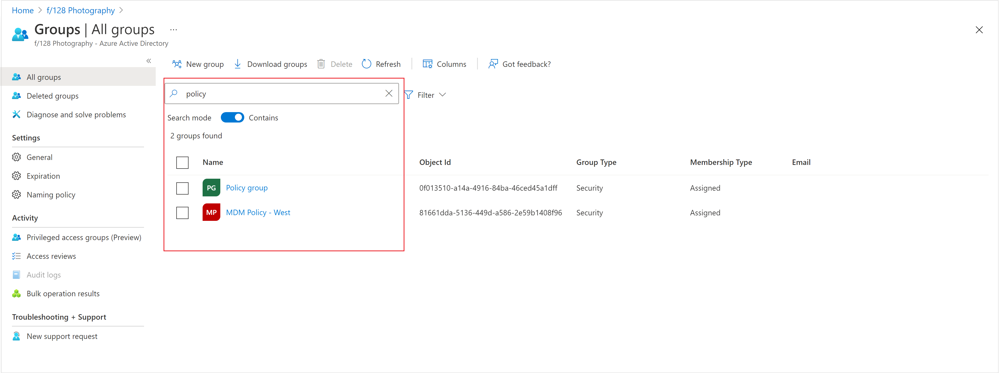
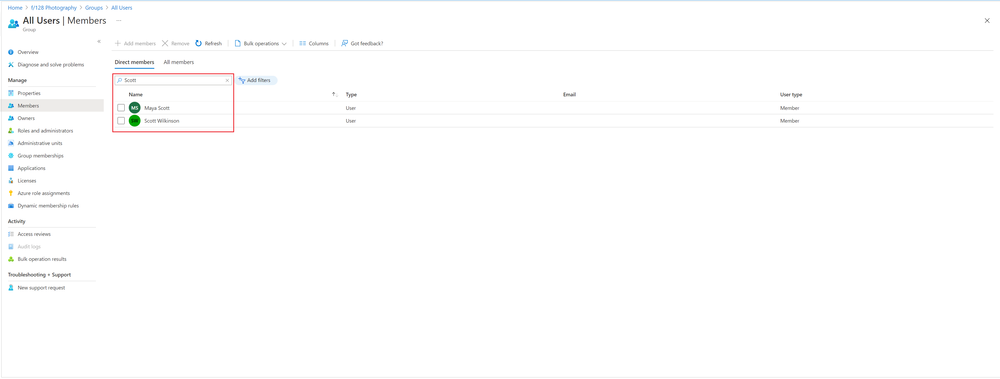
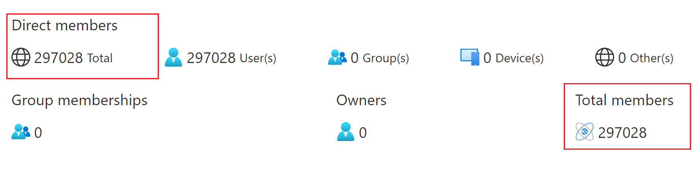

# Search groups and members in Microsoft Entra ID

This article tells you how to search for members and owners of a group and how to use search filters in the portal for Microsoft Entra ID, part of Microsoft Entra. Search functions for groups include:

- Groups search capabilities, such as substring search in group names
- Filtering and sorting options on member and owner lists
- Search capabilities for member and owner lists

## Group search and sort

On the **All groups** page, when you enter a search string, you can now toggle between "contains" and "starts with" searches on the **All groups** page only. The substring search is done only on whole words, and any special characters are searched for also as an ANDed search. For example, searching for -Name starts a search for the substring "Name" and a search for "-". Substring search is case-sensitive. Object ID or mailNickname properties are also searched.

For example, a search for “policy” returns both "MDM policy – West" and "Policy group." A group named "New_policy" wouldn't be returned. You can sort the **All groups** list by name in ascending or descending order.

## Group member search and filter

### Search group member and owner lists

You can search the members or owners of a specific group by name, and when you enter a search string, a `contains` search is automatically done. For example, a search for “Scott” returns both Scott Wilkinson and Maya Scott.

### Filter member and owner lists

You can also filter the group members and owners lists by user type. This information is found in the **User Type** column in the members or owners list. You can filter the list to see only members or guests.

The **Members** page includes all the unique members of group including anyone who inherits their group membership from another group.

You can also search and filter the lists individually. Filtering the all members list doesn't affect filters that are applied to the direct members list.

## Group memberships

You can also view group memberships for a group on the **Group memberships** page. The **Group memberships** page supports search, sort, and filter operations that are similar to the other Groups pages.

## Group member counts

The group **Overview** page provides member counts for groups. You can see the total number of direct members for a group and the total membership count (all the unique members of group including inherited memberships) on the **Overview** page.

## Next steps

These articles provide additional information on working with groups in Microsoft Entra ID.

- [View your groups and members](../fundamentals/groups-view-azure-portal.md)
- [Manage group membership](../fundamentals/how-to-manage-groups.md)
- [Manage dynamic rules for users in a group](groups-create-rule.md)
- [Edit your group settings](../fundamentals/how-to-manage-groups.md)
- [Manage access to resources using groups](../fundamentals/concept-learn-about-groups.md)
- [Manage access to SaaS apps using groups](groups-saasapps.md)
- [Manage groups using PowerShell commands](../enterprise-users/groups-settings-v2-cmdlets.md)
- [Add an Azure subscription to Microsoft Entra ID](../fundamentals/how-subscriptions-associated-directory.md)
