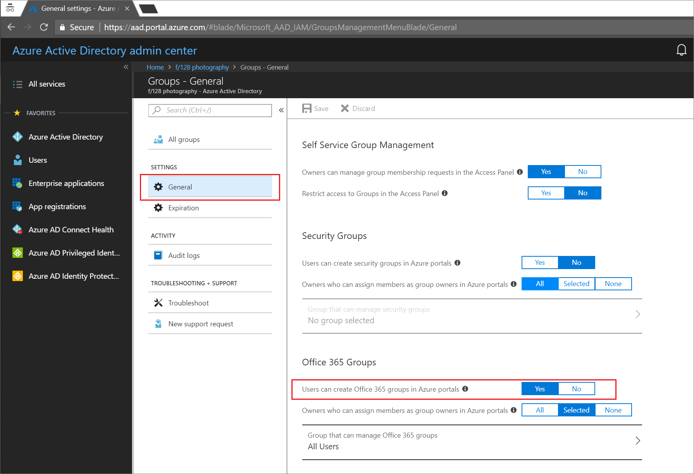
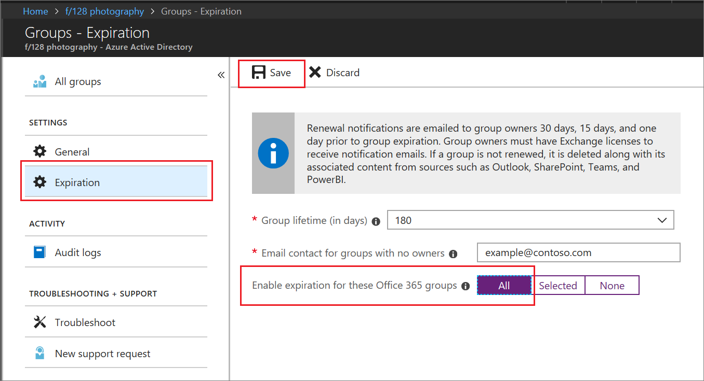

# Quickstart: Set Microsoft 365 groups to expire in Microsoft Entra ID

In this quickstart, you set the expiration policy for your Microsoft 365 groups. When users can set up their own groups, unused groups can multiply. One way to manage unused groups is to set those groups to expire, to reduce the maintenance of manually deleting groups.

Expiration policy is simple:

- Groups with user activities are automatically renewed as the expiration nears
- Group owners are notified to renew an expiring group
- A group that is not renewed is deleted
- A deleted Microsoft 365 group can be restored within 30 days by a group owner or by a Microsoft Entra administrator

> [!NOTE]
> Microsoft Entra ID, part of Microsoft Entra, uses intelligence to automatically renew groups based on whether they have been in recent use. This renewal decision is based on user activity in groups across Microsoft 365 services like Outlook, SharePoint, Teams, Yammer, and others.

If you don't have an Azure subscription, [create a free account](https://azure.microsoft.com/free/) before you begin.

## Prerequisite

 The least-privileged role required to set up group expiration is User administrator in the organization.

## Turn on user creation for groups

[!INCLUDE [portal updates](~/articles/active-directory/includes/portal-update.md)]

1. Sign in to the [Microsoft Entra admin center](https://entra.microsoft.com) as at least a [Global Administrator](../roles/permissions-reference.md#global-administrator).
1. Browse to **Identity** > **Groups** > **All groups** and then select **General**.
  
   

3. Set  **Users can create Microsoft 365 groups** to **Yes**.

4. Select **Save** to save the groups settings when you're done.

## Set group expiration

1. Sign in to the [Microsoft Entra admin center](https://entra.microsoft.com) as at least a [Groups Administrator](../roles/permissions-reference.md#groups-administrator).
1. Browse to **Identity** > **Groups** > **All groups** > **Expiration** to open the expiration settings.
  
   

2. Set the expiration interval. Select a preset value or enter a custom value over 31 days. 

3. Provide an email address where expiration notifications should be sent when a group has no owner.

4. For this quickstart, set **Enable expiration for these Microsoft 365 groups** to **All**.

5. Select **Save** to save the expiration settings when you're done.

That's it! In this quickstart, you successfully set the expiration policy for the selected Microsoft 365 groups.

## Clean up resources

### To remove the expiration policy

1. Sign in to the [Microsoft Entra admin center](https://entra.microsoft.com) as at least a [Groups Administrator](../roles/permissions-reference.md#groups-administrator).
1. Browse to **Identity** > **Groups** > **All groups** > **Expiration**.
1. Set **Enable expiration for these Microsoft 365 groups** to **None**.

### To turn off user creation for groups

1. Browse to **Identity** > **Groups** > **Group settings** >  **General**. 
1. Set **Users can create Microsoft 365 groups in Azure portals** to **No**.

## Next steps

For more information about expiration including PowerShell instructions and technical constraints, see the following article:

> [!div class="nextstepaction"]
> [Expiration policy PowerShell](groups-lifecycle.md)
