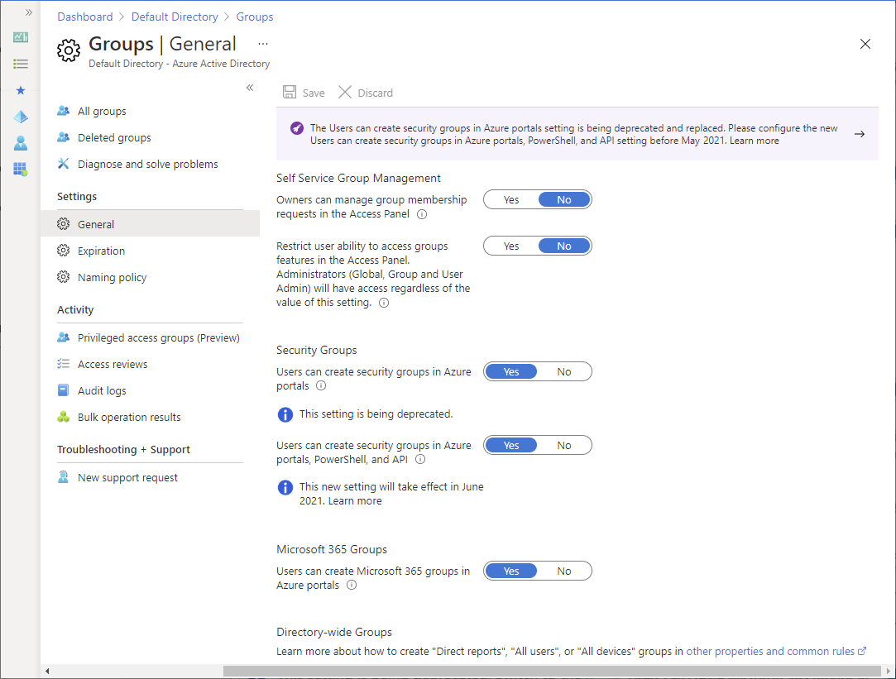
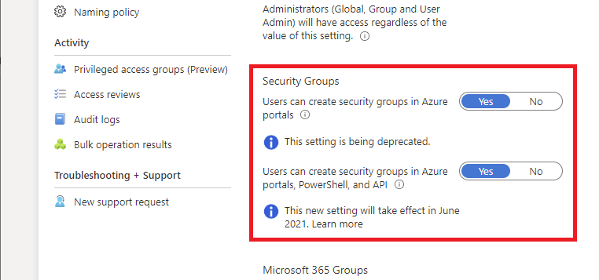

# Set up self-service group management in Microsoft Entra ID 

You can enable users to create and manage their own security groups or Microsoft 365 groups in Microsoft Entra ID, part of Microsoft Entra. The owner of the group can approve or deny membership requests, and can delegate control of group membership. Self-service group management features are not available for [mail-enabled security groups or distribution lists](../fundamentals/concept-learn-about-groups.md).

## Self-service group membership

You can allow users to create security groups, which are used to manage access to shared resources. Security groups can be created by users in Azure portals, using Azure AD PowerShell, or from the [MyApps Groups Access panel](https://account.activedirectory.windowsazure.com/r#/groups). Only the group's owners can update membership, but you can provide group owners the ability to approve or deny membership requests from the MyApps Groups Access panel. Security groups created by self-service through the MyApps Groups Access panel are available to join for all users, whether owner-approved or auto-approved. In the MyApps Groups Access panel, you can change membership options when you create the group.

Microsoft 365 groups, which provide collaboration opportunities for your users, can be created in any of the Microsoft 365 applications, such as SharePoint, Microsoft Teams, and Planner. Microsoft 365 groups can also be created in Azure portals, using Azure AD PowerShell, or from the MyApps Groups Access panel. For more information on the difference between security groups and Microsoft 365 groups, see [Learn about groups](../fundamentals/concept-learn-about-groups.md#what-to-know-before-creating-a-group)

Groups created in | Security group default behavior | Microsoft 365 group default behavior
------------------ | ------------------------------- | ---------------------------------
[Azure AD PowerShell](../enterprise-users/groups-settings-cmdlets.md) | Only owners can add members Visible but not available to join in MyApp Groups Access panel | Open to join for all users
[Azure portal](https://portal.azure.com) | Only owners can add members Visible but not available to join in MyApps Groups Access panel Owner is not assigned automatically at group creation | Open to join for all users
[MyApps Groups Access panel](https://account.activedirectory.windowsazure.com/r#/joinGroups) | Open to join for all users Membership options can be changed when the group is created | Open to join for all users Membership options can be changed when the group is created

## Self-service group management scenarios

* **Delegated group management**
    An example is an administrator who is managing access to a Software as a Service (SaaS) application that the company is using. Managing these access rights is becoming cumbersome, so this administrator asks the business owner to create a new group. The administrator assigns access for the application to the new group, and adds to the group all people already accessing the application. The business owner then can add more users, and those users are automatically provisioned to the application. The business owner doesn't need to wait for the administrator to manage access for users. If the administrator grants the same permission to a manager in a different business group, that person can also manage access for their own group members. Neither the business owner nor the manager can view or manage each other's group memberships. The administrator can still see all users who have access to the application and block access rights if needed.
* **Self-service group management**
    An example of this scenario is two users who both have SharePoint Online sites that they set up independently. They want to give each other's teams access to their sites. To accomplish this, they can create one group in Microsoft Entra ID, and in SharePoint Online each of them selects that group to provide access to their sites. When someone wants access, they request it from the MyApps Groups Access Panel, and after approval they get access to both SharePoint Online sites automatically. Later, one of them decides that all people accessing the site should also get access to a particular SaaS application. The administrator of the SaaS application can add access rights for the application to the SharePoint Online site. From then on, any requests that get approved give access to the two SharePoint Online sites and also to this SaaS application.

## Make a group available for user self-service

1. Sign in to the [Microsoft Entra admin center](https://entra.microsoft.com) as at least a [Groups Administrator](../roles/permissions-reference.md#groups-administrator).
1. Select Microsoft Entra ID.

2. Select **All groups** > **Groups**, and then select **General** settings.

 > [!NOTE]
 > This setting only restricts access of group information in **My Groups**. It does not restrict access to group information via other methods like Microsoft Graph API calls or the Microsoft Entra admin center.

 
   > [!NOTE]
   > In June 2024, the setting **Restrict users access to My Groups** will change to **Restrict users ability to see and edit security groups in My Groups.** If the setting is currently set to ‘Yes,’ end users will be able to access My Groups in June 2024, but will not be able to see security groups.

3. Set **Owners can manage group membership requests in the Access Panel** to **Yes**.

4. Set **Restrict user ability to access groups features in the Access Panel** to **No**.

5. Set **Users can create security groups in Azure portals, API or PowerShell** to **Yes** or **No**.

    For more information about this setting, see the next section [Group settings](#group-settings).

6. Set **Users can create Microsoft 365 groups in Azure portals, API or PowerShell** to **Yes** or **No**.

    For more information about this setting, see the next section [Group settings](#group-settings).

You can also use **Owners who can assign members as group owners in the Azure portal** to achieve more granular access control over self-service group management for your users.

When users can create groups, all users in your organization are allowed to create new groups and then can, as the default owner, add members to these groups. You can't specify individuals who can create their own groups. You can specify individuals only for making another group member a group owner.

> [!NOTE]
> A Microsoft Entra ID P1 or P2 license is required for users to request to join a security group or Microsoft 365 group and for owners to approve or deny membership requests. Without a Microsoft Entra ID P1 or P2 license, users can still manage their groups in the MyApp Groups Access panel, but they can't create a group that requires owner approval and they can't request to join a group.

## Group settings

The group settings enable you to control who can create security and Microsoft 365 groups.

 The following table helps you decide which values to choose.

| Setting | Value | Effect on your tenant |
| --- | :---: | --- |
| Users can create security groups in Azure portals, API or PowerShell | Yes | All users in your Microsoft Entra organization are allowed to create new security groups and add members to these groups in Azure portals, API, or PowerShell. These new groups would also show up in the Access Panel for all other users. If the policy setting on the group allows it, other users can create requests to join these groups. |
|  | No | Users can't create security groups and can't change existing groups for which they are an owner. However, they can still manage the memberships of those groups and approve requests from other users to join their groups. |
| Users can create Microsoft 365 groups in Azure portals, API or PowerShell | Yes | All users in your Microsoft Entra organization are allowed to create new Microsoft 365 groups and add members to these groups in Azure portals, API, or PowerShell. These new groups would also show up in the Access Panel for all other users. If the policy setting on the group allows it, other users can create requests to join these groups. |
|  | No | Users can't create Microsoft 365 groups and can't change existing groups for which they are an owner. However, they can still manage the memberships of those groups and approve requests from other users to join their groups. |

Here are some additional details about these group settings.

- These setting can take up to 15 minutes to take effect.
- If you want to enable some, but not all, of your users to create groups, you can assign those users a role that can create groups, such as [Groups Administrator](../roles/permissions-reference.md#groups-administrator).
- These settings are for users and don't impact service principals. For example, if you have a service principal with permissions to create groups, even if you set these settings to **No**, the service principal will still be able to create groups. 

## Configure group settings using Microsoft Graph

To configure the _Users can create security groups in Azure portals, API or PowerShell_ setting using Microsoft Graph, configure the **EnableGroupCreation** object in the groupSettings object. For more information, see [Overview of group settings](/graph/group-directory-settings).

To configure the _Users can create security groups in Azure portals, API or PowerShell_ setting using Microsoft Graph, update the **allowedToCreateSecurityGroups** property of **defaultUserRolePermissions** in the [authorizationPolicy](/graph/api/resources/authorizationpolicy) object.

## Next steps

These articles provide additional information on Microsoft Entra ID.

* [Manage access to resources with Microsoft Entra groups](../fundamentals/concept-learn-about-groups.md)
* [Microsoft Entra cmdlets for configuring group settings](../enterprise-users/groups-settings-cmdlets.md)
* [Application Management in Microsoft Entra ID](../manage-apps/what-is-application-management.md)
* [What is Microsoft Entra ID?](../fundamentals/whatis.md)
* [Integrate your on-premises identities with Microsoft Entra ID](../hybrid/whatis-hybrid-identity.md)
