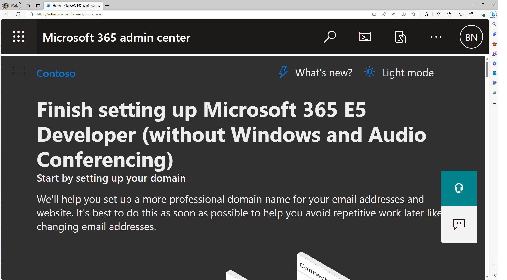
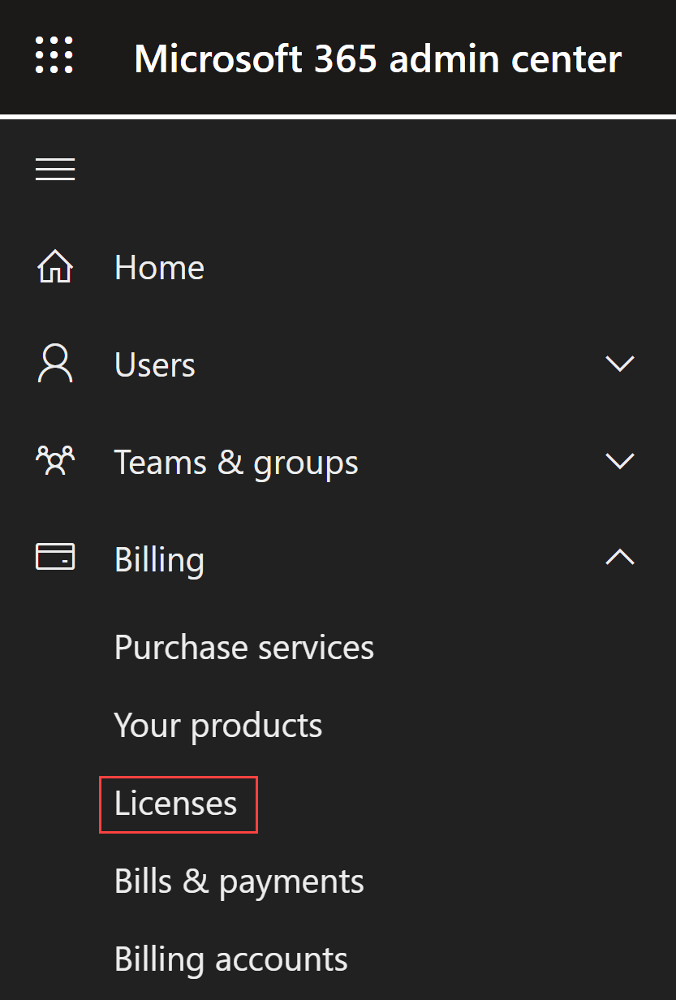
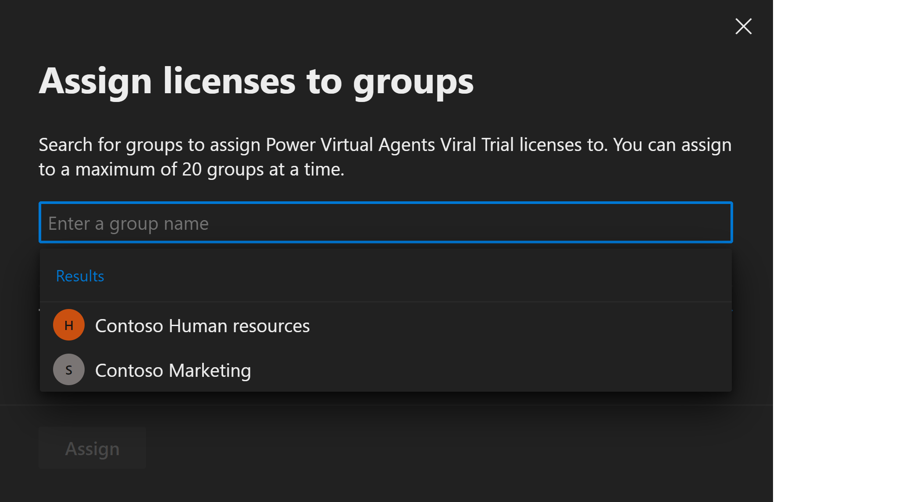
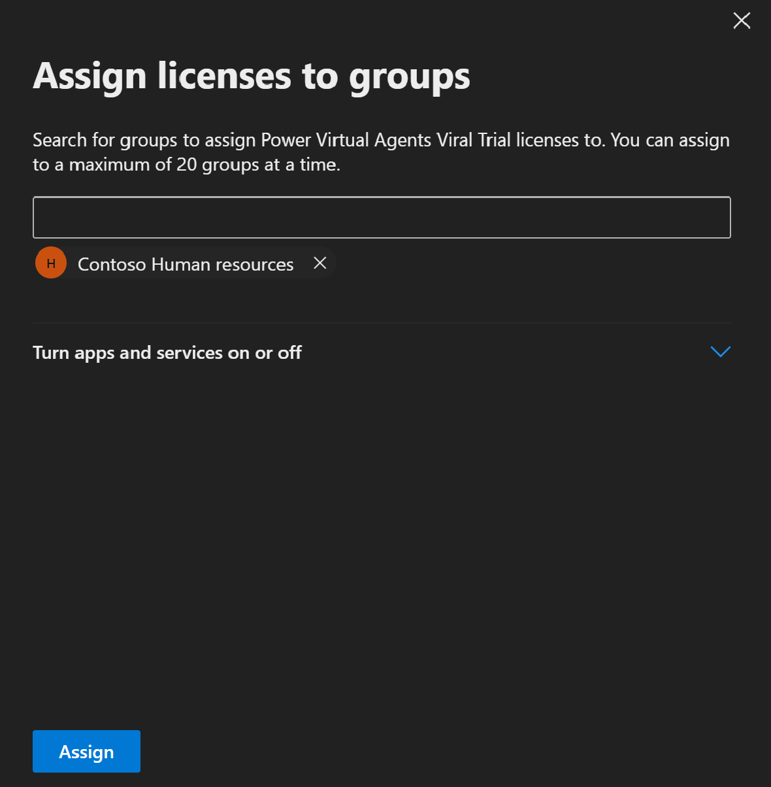
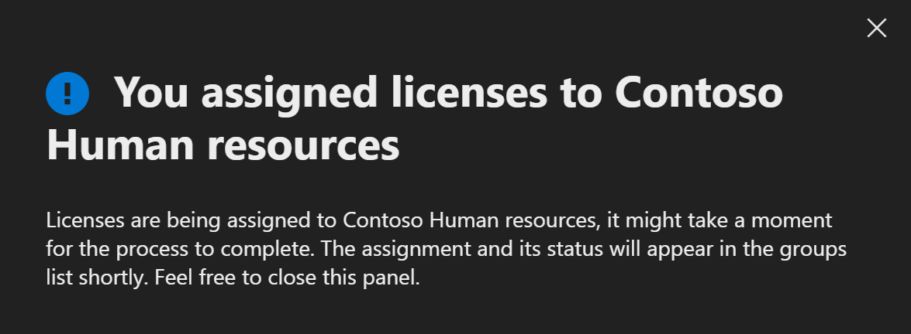
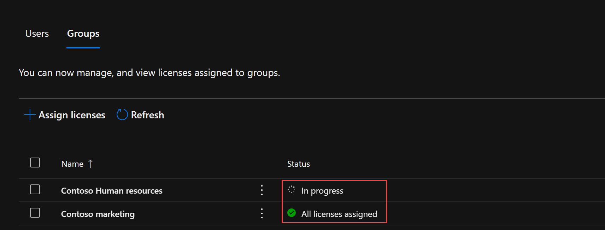

# Assign licenses to users by group membership using the Microsoft 365 admin center

This article shows you how to use the Microsoft 365 license center to assign licenses to a group.

> [!NOTE]
> Some Microsoft services are not available in all locations. Before a license can be assigned to a user, the administrator has to specify the Usage location property on the user.
>
> For group license assignment, any users without a usage location specified inherit the location of the directory. If you have users in multiple locations, we recommend that you always set usage location as part of your user creation flow in Microsoft Entra ID. For example, configure Microsoft Entra Connect configuration to set usage location. This recommendation makes sure the result of license assignment is always correct and users do not receive services in locations that are not allowed.

## Assign a license

1. Sign in to the [Microsoft 365 admin center](https://admin.microsoft.com/) with a license administrator account. To manage licenses, the account must be a License Administrator, User Administrator, or Global Administrator.
   
      

1. Browse to **Billing** > **Licenses** to open a page where you can see all licenses available in your organization.

      

1. Under **Licenses**, select the license that you would like to assign. 
1. In the License details section, choose **Groups** at the top of the page.
1. Choose **+ Assign licenses**
1. From the **+ Assign licenses** page search for the group that you would like to use for license assignment.

   
  
   >[!NOTE]
   >When assigning licenses to a group with service plans that have dependencies on other service plans, they must both be assigned together in the same group, otherwise the service plan with the dependency will be disabled.
  
1. To complete the assignment, on the **Assign license** page, click **Assign** at the bottom of the page.

   

When assign licenses to a group, Microsoft Entra ID processes all existing members of that group. This process might take some time depending on the size of the group.

   

## Verify that the initial assignment has finished

1. From the Admin Center, go to **Billing** > **Licenses**. Select the license that you assigned.

1. On the **License details** page, you can view the status of the license assignment operation. For example, in the image show below, you can see that **Contoso marketing** shows a status of **All licenses assigned** while **Contoso human resources** shows a status of **In progress**.

   

   [Read this section](licensing-group-advanced.md#use-audit-logs-to-monitor-group-based-licensing-activity) to learn more about how audit logs can be used to analyze changes made by group-based licensing.

## Next steps

To learn more about the feature set for license assignment using groups, see the following articles:

- [What is group-based licensing in Microsoft Entra ID?](../fundamentals/licensing-whatis-azure-portal.md?context=azure/active-directory/users-groups-roles/context/ugr-context)
- [Identifying and resolving license problems for a group in Microsoft Entra ID](licensing-groups-resolve-problems.md)
