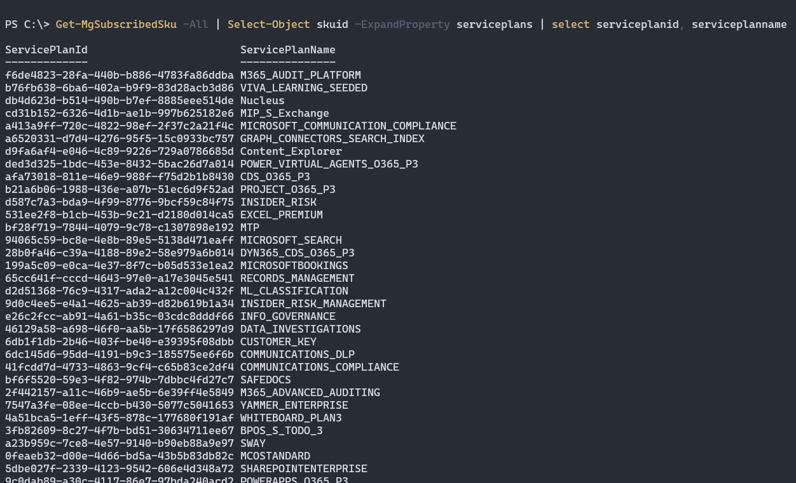
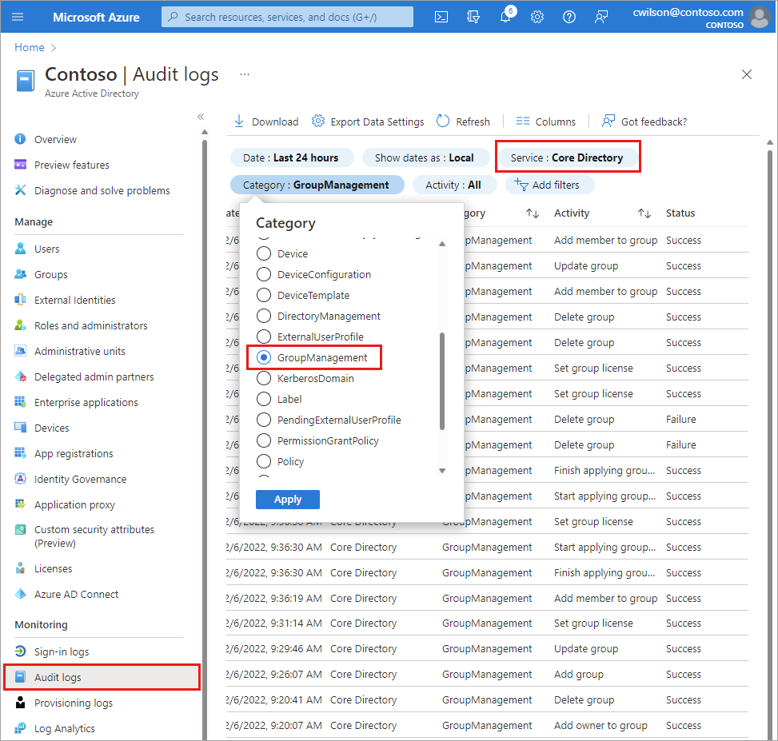
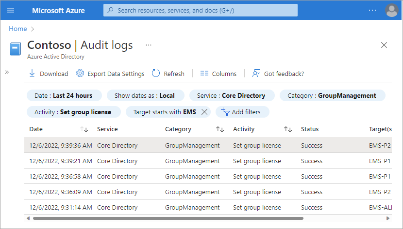
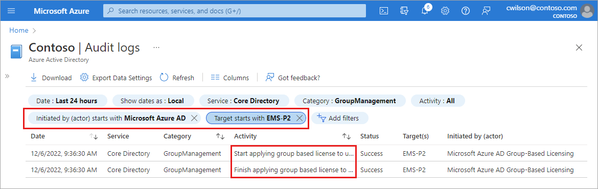

# Scenarios, limitations, and known issues using groups to manage licensing in Microsoft Entra ID

Use the following information and examples to gain a more advanced understanding of group-based licensing in Microsoft Entra ID, part of Microsoft Entra.

## Usage location

[!INCLUDE [portal updates](~/articles/active-directory/includes/portal-update.md)]

Some Microsoft services aren't available in all locations. For group license assignment, any users without a usage location specified inherit the location of the directory. If you have users in multiple locations, make sure to reflect that correctly in your user resources before adding users to groups with licenses. Before a license can be assigned to a user, the administrator should specify the **Usage location** property on the user.

1. Sign in to the [Microsoft Entra admin center](https://entra.microsoft.com) as at least a [Groups Administrator](../roles/permissions-reference.md#user-administrator).
1. Select Microsoft Entra ID.
1. Go to **Users** > **All users** and select a user.
1. Select **Edit properties**. 
1. Select the **Settings** tab and enter a location for the user.
1. Select the **Save** button.

> [!NOTE]
> Group license assignment will never modify an existing usage location value on a user. We recommend that you always set usage location as part of your user creation flow in Microsoft Entra ID (for example, via [Microsoft Entra Connect](../hybrid/connect/whatis-azure-ad-connect.md) configuration). Following such a process ensures the result of license assignment is always correct, and users do not receive services in locations that are not allowed.

## Use group-based licensing with dynamic groups

You can use group-based licensing with any security group, including dynamic groups. Dynamic groups run rules against user resource attributes to automatically add and remove members. Attributes can be department, job title, work location, or other custom attribute. Each group is assigned the licenses that you want members to receive. If an attribute changes, the member leaves the group, and the licenses are removed.

You can assign the attribute on-premises and sync it with Microsoft Entra ID, or you can manage the attribute directly in the cloud. 

> [!WARNING]
> Use caution when modifying an existing group’s membership rule. When a rule is changed, the membership of the group will be re-evaluated and users who no longer match the new rule will be removed (users who still match the new rule will not be affected during this process). Those users will have their licenses removed during the process which may result in loss of service, or in some cases, loss of data.
>
> If you have a large dynamic group you depend on for license assignment, consider validating any major changes on a smaller test group before applying them to the main group.

## Multiple groups and multiple licenses

A user can be a member of multiple groups with licenses. Here are some things to consider:

- Multiple licenses for the same product can overlap, and they result in all enabled services being applied to the user. An example could be that *M365-P1* contains the foundational services to deploy to all users, and *M365-P2* contains the P2 services to deploy only to some users. You can add a user to one or both groups and only use one license for the product.

- Select a license to view more details, including information about which services are enabled for the user by the group license assignment.

## Direct licenses coexist with group licenses

When a user inherits a license from a group, you can't directly remove or modify that license in the user's properties. You can change the license assignment only in the group and the changes are then propagated to all group members. If you need to assign other features to a user that has their license from a group license assignment, you must create another group to assign the other features to the user. 

When you use group-based licensing, consider the following scenarios:

- Group members inherit licenses assigned to the group.
- License options for group-based licenses must be changed at the group level.
- If different license options need to be assigned to a user, create a new group, assign a license to the group, then add the user to that group.
- Users still use only one license of a product if different license options for that product are used in the different group-based licenses.

When you use direct assignment, the following operations are allowed:

- Licenses not already assigned through group-based licensing can be changed for an individual user.
- Other services can be enabled, as part of a directly assigned license.
- Directly assigned licenses can be removed and don’t affect a user's inherited licenses.

## Managing new services added to products

When Microsoft adds a new service to a product license plan, it's enabled by default in all groups to which you've assigned the product license. Users in your organization who are subscribed to notifications about product changes will receive emails ahead of time notifying them about the upcoming service additions.

As an administrator, you can review all groups affected by the change and take action, such as disabling the new service in each group. For example, if you created groups targeting only specific services for deployment, you can revisit those groups and make sure that any newly added services are disabled.

Here's an example of what this process may look like:

1. Originally, you assigned the *Microsoft 365 E5* product to several groups. One of those groups, called *Microsoft 365 E5 - Exchange only* was designed to enable only the *Exchange Online (Plan 2)* service for its members.

1. You received a notification from Microsoft that the E5 product will be extended with a new service - *Microsoft Stream*. When the service becomes available in your organization, you can complete the following steps:

1. 1. Sign in to the [Microsoft Entra admin center](https://entra.microsoft.com) 
1. Select Microsoft Entra ID.
1. Select **Billing** > **Licenses** > **All products** and select *Microsoft 365 Enterprise E5*, then select **Licensed Groups** to view a list of all groups with that product.

1. Select the group you want to review (in this case, *Microsoft 365 E5 - Exchange only*). The **Licenses** tab opens. Select the E5 license to view all enabled services.
   > [!NOTE]
   > The *Microsoft Stream* service has been automatically added and enabled in this group, in addition to the *Exchange Online* service:

   

1. If you want to disable the new service in this group, select the On/Off toggle next to the service, and select the **Save** button to confirm the change. Microsoft Entra ID will now process all users in the group to apply the change; any new users added to the group won't have the *Microsoft Stream* service enabled.

   > [!NOTE]
   > Users may still have the service enabled through some other license assignment (another group they are members of or a direct license assignment).

1. If needed, perform the same steps for other groups with this product assigned.

## Use PowerShell to see who has inherited and direct licenses
You can use a PowerShell script to check if users have a license assigned directly or inherited from a group.

1. Run the `Connect-MgGraph -Scopes "Organization.Read.All"` cmdlet to authenticate and connect to your organization using Microsoft Graph.

2. `Get-MgSubscribedSku -All | Select-Object skuid -ExpandProperty serviceplans | select serviceplanid, serviceplanname` can be used to discover all provisioned product licenses in the Microsoft Entra organization.

   

3. Use the *ServicePlanId* value for the license you're interested in with [this PowerShell script](licensing-ps-examples.md#check-if-user-license-is-assigned-directly-or-inherited-from-a-group). A list populates the users who have this license and information about how the license is assigned.

## Use Audit logs to monitor group-based licensing activity

You can use [Microsoft Entra audit logs](../reports-monitoring/concept-audit-logs.md) to see all activity related to group-based licensing, including:
- who changed licenses on groups
- when the system started processing a group license change, and when it finished
- what license changes were made to a user as a result of a group license assignment.

Audit logs related to group-based licensing can be accessed from the Audit logs in the Groups or Licensing areas of Microsoft Entra ID or use the following filter combinations from the main Audit logs:

- **Service**: Core Directory
- **Category**: GroupManagement or UserManagement



### Find out who modified a license

1. To see the logs for group license changes, use the following Audit log filter options:
    - **Service**: Core Directory
    - **Category**: GroupManagement
    - **Activity**: Set group license
1. Select a row in the resulting table to view the details.
1. Select the **Modified Properties** tab see the old and new values for the license agreement.

The following example shows the filter settings listed above, plus the *Target* filter set to all groups that start with "EMS." 



To see license changes for a specific user, use the following filters:
- **Service**: Core Directory
- **Category**: UserManagement
- **Activity**: Change user license

### Find out when group changes started and finished processing

When a license changes on a group, Microsoft Entra ID will start applying the changes to all users, but the changes could take time to process.

1. To see when groups started processing, use the following filters:
    - **Service**: Core Directory
    - **Category**: GroupManagement
    - **Activity**: Start applying group based license to users
1. Select a row in the resulting table to view the details.
1. Select the **Modified Properties** tab see the license changes that were picked up for processing.
    - Use these details if you're making multiple changes to a group and aren't sure which license processed.
    - The actor for the operation is *Microsoft Entra group-Based Licensing*, which is a system account that is used to execute all group license changes.

To see when groups finished processing, change the **Activity** filter to *Finish applying group based license to users*. In this case, the **Modified Properties** field contains a summary of the results, which is useful to quickly check if processing resulted in any errors. Sample output:
> ```
> Modified Properties
> ...
> Name : Result
> Old Value : []
> New Value : [Users successfully assigned licenses: 6, Users for whom license assignment failed: 0.];
> ```

To see the complete log for how a group was processed, including all user changes, add the following filters:
- **Target**: Group name
- **Initiated By (Actor)**: Microsoft Entra group-Based Licensing (case-sensitive)
- **Date Range** (optional): Custom range for when you know a specific group started and finished processing

This sample output shows the start and finish of processing the license change.



## Deleting a group with an assigned license

It isn't possible to delete a group with an active license assigned. An administrator could delete a group not realizing that it will cause licenses to be removed from users. For this reason we require any licenses to be removed from the group first, before it can be deleted.

When trying to delete a group in the Azure portal, you may see an error notification like this:


Go to the **Licenses** tab on the group and see if there are any licenses assigned. If yes, remove those licenses and try to delete the group again.

You may see similar errors when trying to delete the group through PowerShell or Graph API. If you're using a group synced from on-premises, Microsoft Entra Connect may also report errors if it's failing to delete the group in Microsoft Entra ID. In all such cases, make sure to check if there are any licenses assigned to the group, and remove them first.

## Limitations and known issues

If you use group-based licensing, it's a good idea to familiarize yourself with the following list of limitations and known issues.

- Group-based licensing currently doesn't support groups that contain other groups (nested groups). If you apply a license to a nested group, only the immediate first-level user members of the group have the licenses applied.

- The feature can only be used with security groups, and Microsoft 365 groups that have securityEnabled=TRUE.

- The [Microsoft 365 admin center](https://admin.microsoft.com) doesn't currently support group-based licensing. If a user inherits a license from a group, this license appears in the Office admin portal as a regular user license. If you try to modify that license or try to remove the license, the portal returns an error message. Inherited group licenses can't be modified directly on a user.

- When licenses are assigned or modified for a large group (for example, 100,000 users), it could affect performance. Specifically, the volume of changes generated by Microsoft Entra automation might negatively affect the performance of your directory synchronization between Microsoft Entra ID and on-premises systems.

- If you're using dynamic groups to manage your user’s membership, verify that the user is part of the group, which is necessary for license assignment. If not, [check processing status for the membership rule](groups-create-rule.md) of the dynamic group.

- In certain high load situations, it may take a long time to process license changes for groups or membership changes to groups with existing licenses. If you see your changes take more than 24 hours to process group size of 60 K users or less, please [open a support ticket](https://portal.azure.com/#blade/Microsoft_AAD_IAM/ActiveDirectoryMenuBlade/supportRequest) to allow us to investigate. 

- License management automation doesn't automatically react to all types of changes in the environment. For example, you might have run out of licenses, causing some users to be in an error state. To free up the available seat count, you can remove some directly assigned licenses from other users. However, the system doesn't automatically react to this change and fix users in that error state.

  As a workaround to these types of limitations, you can go to **Microsoft Entra ID** > **Groups** > select a group > select **Licenses** > select **Reprocess**. This command processes all users in that group and resolves the error states, if possible.

## Next steps

To learn more about other scenarios for license management through group-based licensing, see:

* [What is group-based licensing in Microsoft Entra ID?](../fundamentals/concept-group-based-licensing.md)
* [Assigning licenses to a group in Microsoft Entra ID](licensing-groups-assign.md)
* [Identifying and resolving license problems for a group in Microsoft Entra ID](licensing-groups-resolve-problems.md)
* [How to migrate individual licensed users to group-based licensing in Microsoft Entra ID](licensing-groups-migrate-users.md)
* [How to migrate users between product licenses using group-based licensing in Microsoft Entra ID](licensing-groups-change-licenses.md)
