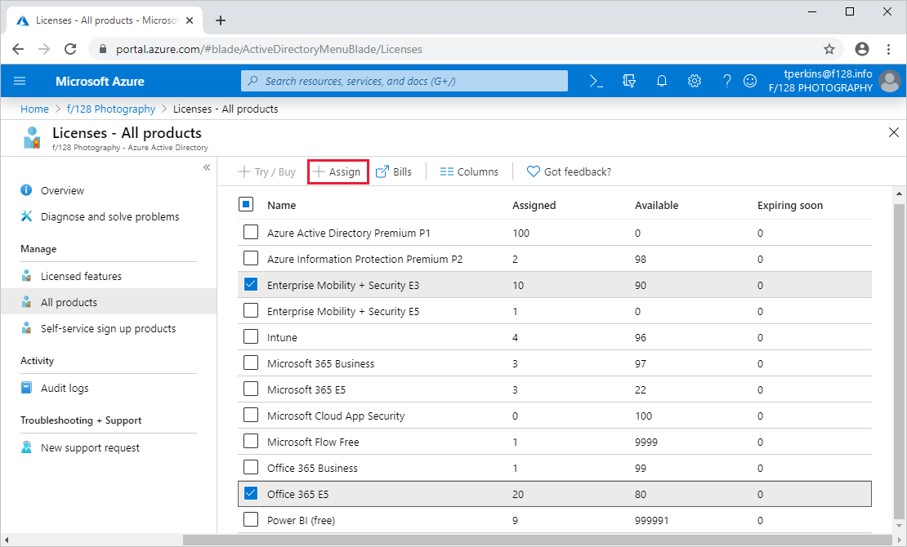
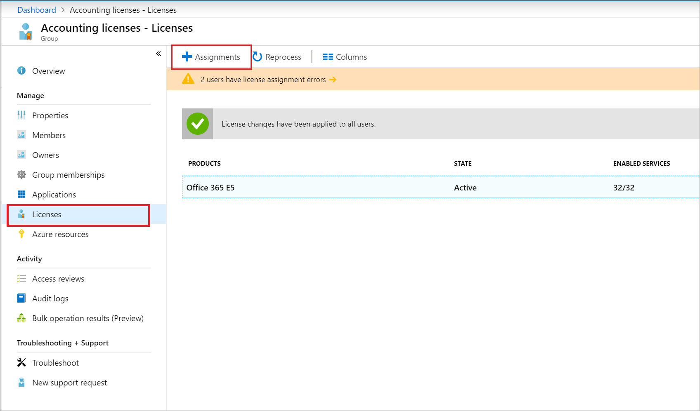
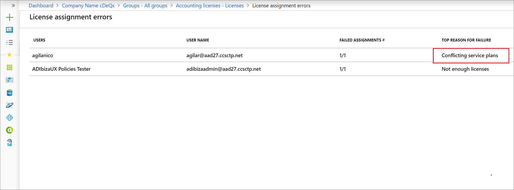
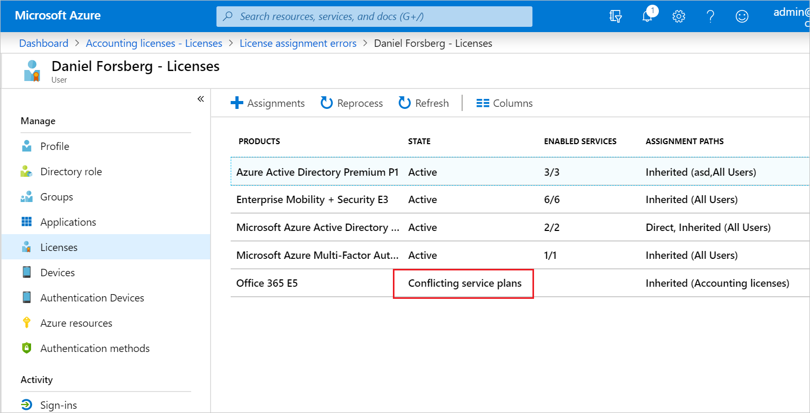

# Assign licenses to users by group membership in Microsoft Entra ID

This article walks you through assigning product licenses to a group of users and verifying that they're licensed correctly in Microsoft Entra ID, part of Microsoft Entra.

In this example, the Microsoft Entra organization contains a security group called **HR Department**. This group includes all members of the human resources department (around 1,000 users). You want to assign Office 365 Enterprise E3 licenses to the entire department. The Yammer Enterprise service that's included in the product must be temporarily disabled until the department is ready to start using it. You also want to deploy Enterprise Mobility + Security licenses to the same group of users.

> [!NOTE]
> Some Microsoft services are not available in all locations. Before a license can be assigned to a user, the administrator has to specify the Usage location property on the user.
>
> For group license assignment, any users without a usage location specified inherit the location of the directory. If you have users in multiple locations, we recommend that you always set usage location as part of your user creation flow in Microsoft Entra ID. For example, configure Microsoft Entra Connect configuration to set usage location. This recommendation makes sure the result of license assignment is always correct and users do not receive services in locations that are not allowed.

## Step 1: Assign the required licenses

[!INCLUDE [portal updates](~/articles/active-directory/includes/portal-update.md)]

1. Sign in to the [Microsoft Entra admin center](https://entra.microsoft.com) as at least a [License Administrator](../roles/permissions-reference.md#license-administrator).
1. Select Microsoft Entra ID.

1. Browse to **Billing** > **Licenses** to open a page where you can see and manage all licensable products in the organization.

1. Under **All products**, select both Office 365 Enterprise E5 and Enterprise Mobility + Security E3 by selecting the product names. To start the assignment, select **Assign** at the top of the page.

   
  
1. On the **Assign license** page, select **Users and groups** to open a list of users and groups.

1. Select a user or group, and then use the **Select** button at the bottom of the page to confirm your selection.

   >[!NOTE]
   >When assigning licenses to a group with service plans that have dependencies on other service plans, they must both be assigned together in the same group, otherwise the service plan with the dependency will be disabled.

1. On the **Assign license** page, click **Assignment options**, which displays all service plans included in the two products that we selected previously. Find **Yammer Enterprise** and turn it **Off** to disable that service from the product license. Confirm by clicking **OK** at the bottom of **License options**.

   
  
1. To complete the assignment, on the **Assign license** page, click **Assign** at the bottom of the page.

1. A notification is displayed in the upper-right corner that shows the status and outcome of the process. If the assignment to the group couldn't be completed (for example, because of pre-existing licenses in the group), click the notification to view details of the failure.

When assign licenses to a group, Microsoft Entra ID processes all existing members of that group. This process might take some time, varying with the size of the group. The next step describes how to verify that the process has finished and determine if further attention is required to resolve problems.

## Step 2: Verify that the initial assignment has finished

1. Go to **Microsoft Entra ID** > **Groups** > **All groups**. Select the group that licenses were assigned to.

1. On the group page, select **Licenses**. This lets you quickly confirm if licenses have been fully assigned to users and if there are any errors that you need to look into. The following information is available:

   - Service licenses that are currently assigned to the group. Select an entry to show the specific services that have been enabled and to make changes.

   - Status updates of the latest license changes, which are available if the changes are being processed or if processing has finished for all user members.

   - Information about user license assignments that are in an error state.

   

1. See more detailed information about license processing under **Microsoft Entra ID** >  **Groups** > **All groups** > *group name* > **Audit logs**. Check the following activities:

   - Activity: `Start applying group based license to users`. This is logged when the system picks up the license assignment change on the group and starts applying it to all user members. It contains information about the change that was made.

   - Activity: `Finish applying group based license to users`. This is logged when the system finishes processing all users in the group. It contains a summary of how many users were successfully processed and how many users couldn't be assigned group licenses.

   [Read this section](licensing-group-advanced.md#use-audit-logs-to-monitor-group-based-licensing-activity) to learn more about how audit logs can be used to analyze changes made by group-based licensing.

## Step 3: Check for license problems and resolve them

1. Go to **Microsoft Entra ID** > **All groups** > **Groups**, and find the group that licenses were assigned to.
1. On the group page, select **Licenses**. The notification on top of the page shows that there are 10 users that licenses couldn't be assigned to. Open it to see a list of all users in a licensing error state for this group.
1. The **Failed assignments** column tells us that both product licenses couldn't be assigned to the users. The **Top reason for failure** column contains the cause of the failure. In this case, it's **Conflicting service plans**.

   

1. Select a user to open the user's **Licenses** page. This page shows all licenses that are currently assigned to the user. In this example, the user has the Office 365 Enterprise E1 license that was inherited from the **Kiosk users** group. This conflicts with the E3 license that the system tried to apply from the **HR Department** group. As a result, none of the licenses from that group has been assigned to the user.

   

1. To solve this conflict, remove the user from the **Kiosk users** group. After Microsoft Entra ID processes the change, the **HR Department** licenses are correctly assigned.

## Next steps

To learn more about the feature set for license assignment using groups, see the following articles:

- [What is group-based licensing in Microsoft Entra ID?](../fundamentals/licensing-whatis-azure-portal.md?context=azure/active-directory/users-groups-roles/context/ugr-context)
- [Identifying and resolving license problems for a group in Microsoft Entra ID](licensing-groups-resolve-problems.md)
- [How to migrate individual licensed users to group-based licensing in Microsoft Entra ID](licensing-groups-migrate-users.md)
- [How to migrate users between product licenses using group-based licensing in Microsoft Entra ID](licensing-groups-change-licenses.md)
- [Microsoft Entra group-based licensing additional scenarios](licensing-group-advanced.md)
- [PowerShell examples for group-based licensing in Microsoft Entra ID](licensing-ps-examples.md)
