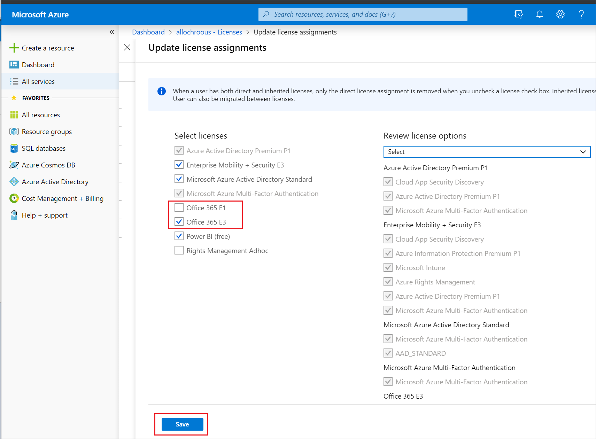
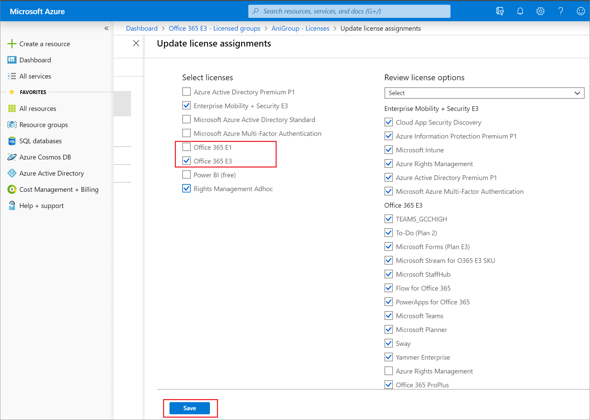

# Change license assignments for a user or group in Microsoft Entra ID

This article describes how to move users and groups between service license plans in Microsoft Entra ID, part of Microsoft Entra. The goal Microsoft Entra ID's approach is to ensure that there's no loss of service or data during the license change. Users should switch between services seamlessly. The license plan assignment steps in this article describe changing a user or group on Office 365 E1 to Office 365 E3, but the steps apply to all license plans. When you update license assignments for a user or group, the license assignment removals and new assignments are made simultaneously so that users do not lose access to their services during license changes or see license conflicts between plans.

## Before you begin

Before you update the license assignments, it's important to verify certain assumptions are true for all of the users or groups to be updated. If the assumptions aren't true for all of the users in a group, the migration might fail for some. As a result, some of the users might lose access to services or data. Ensure that:

- Users have the current license plan (in this case, Office 365 E1) that's assigned to a group and inherited by the user and not assigned directly.

- You have enough available licenses for the license plan you're assigning. If you don't have enough licenses, some users might not be assigned the new license plan. You can check the number of available licenses.

- Users don't have other assigned service licenses that can conflict with the desired license or prevent removal of the current license. For example, a license from a service such as Workplace Analytics or Project Online that has a dependency on other services.

- If you manage groups on-premises and sync them into Microsoft Entra ID via Microsoft Entra Connect, then you add or remove users by using your on-premises system. It can take some time for the changes to sync with Microsoft Entra ID to be picked up by group licensing.

- If you're using Microsoft Entra dynamic group memberships, you add or remove users by changing their attributes, but the update process for license assignments remains the same.

## Change user license assignments

[!INCLUDE [portal updates](~/articles/active-directory/includes/portal-update.md)]

On the **Update license assignments** page, if you see that some checkboxes are unavailable, it indicates services that can't be changed because they're inherited from a group license.

1. Sign in to the [Microsoft Entra admin center](https://entra.microsoft.com) as at least a [License Administrator](../roles/permissions-reference.md#license-administrator).
1. Select Microsoft Entra ID.
1. Select **All users** > **Users**, and then open the **Profile** page for a user.
1. Select **Licenses**.
1. Select **Assignments** to edit license assignment for the user or group. The **Assignments** page is where you can resolve license assignment conflicts.
1. Select the check box for Office 365 E3 and ensure that at minimum the all of the E1 services that are assigned to the user are selected.
1. Clear the check box for Office 365 E1.

    

1. Select **Save**.

Microsoft Entra ID applies the new licenses and removes the old licenses simultaneously to provide service continuity.

## Change group license assignments

1. Sign in to the [Microsoft Entra admin center](https://entra.microsoft.com) as at least a [License Administrator](../roles/permissions-reference.md#license-administrator).
1. Select Microsoft Entra ID.
1. Select **All groups** > **Groups**, and then open the **Overview** page for a group.
1. Select **Licenses**.
1. Select the **Assignments** command to edit license assignment for the user or group.
1. Select the check box for Office 365 E3. To maintain continuity of service, ensure that you select all of the E1 services that are already assigned to the user.
1. Clear the check box for Office 365 E1.

    

1. Select **Save**.

To provide service continuity, Microsoft Entra ID applies the new licenses and removes the old licenses simultaneously for all users in the group.

## Next steps

Learn about other scenarios for license management through groups in the following articles:

- [Assigning licenses to a group in Microsoft Entra ID](licensing-groups-assign.md)
- [Identifying and resolving license problems for a group in Microsoft Entra ID](licensing-groups-resolve-problems.md)
- [How to migrate individual licensed users to group licensing in Microsoft Entra ID](licensing-groups-migrate-users.md)
- [Microsoft Entra group licensing additional scenarios](licensing-group-advanced.md)
- [PowerShell examples for group licensing in Microsoft Entra ID](licensing-ps-examples.md)
