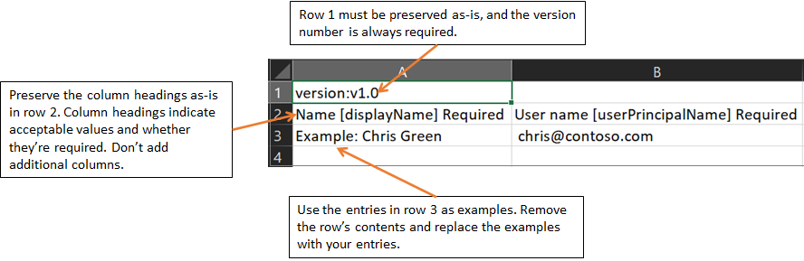
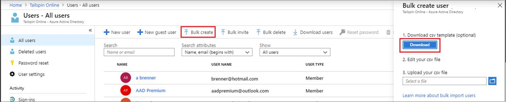
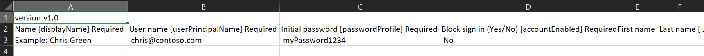

# Bulk create users in Azure Active Directory

Azure Active Directory (Azure AD), part of Microsoft Entra, supports bulk user create and delete operations and supports downloading lists of users. Just fill out comma-separated values (CSV) template you can download from the Azure portal.

## Required permissions

In order to bulk create users in the administration portal, you must be signed in as a Global administrator or User administrator.

## Understand the CSV template

Download and fill in the bulk upload CSV template to help you successfully create Azure AD users in bulk. The CSV template you download might look like this example:



> [!WARNING]
> If you are adding only one entry using the CSV template, you must preserve row 3 and add your new entry to row 4.
>
> Ensure that you add the ".csv" file extension and remove any leading spaces before userPrincipalName, passwordProfile, and accountEnabled.

### CSV template structure

The rows in a downloaded CSV template are as follows:

- **Version number**: The first row containing the version number must be included in the upload CSV.
- **Column headings**: The format of the column headings is &lt;*Item name*&gt; [PropertyName] &lt;*Required or blank*&gt;. For example, `Name [displayName] Required`. Some older versions of the template might have slight variations.
- **Examples row**: We have included in the template a row of examples of acceptable values for each column. You must remove the examples row and replace it with your own entries.

### Additional guidance

- The first two rows of the upload template must not be removed or modified, or the upload can't be processed.
- The required columns are listed first.
- We don't recommend adding new columns to the template. Any additional columns you add are ignored and not processed.
- We recommend that you download the latest version of the CSV template as often as possible.
- Make sure to check there is no unintended whitespace before/after any field. For **User principal name**, having such whitespace would cause import failure.
- Ensure that values in **Initial password** comply with the currently active [password policy](../authentication/concept-sspr-policy.md#username-policies).

## To create users in bulk

[!INCLUDE [portal updates](~/articles/active-directory/includes/portal-update.md)]

1. Sign in to the [Azure portal](https://portal.azure.com) with an account that is a User Administrator in the organization.
1. Browse to **Azure Active Directory** >  **Users** > **Bulk create**.
1. On the **Bulk create user** page, select **Download** to receive a valid comma-separated values (CSV) file of user properties, and then add users you want to create.

   

1. Open the CSV file and add a line for each user you want to create. The only required values are **Name**, **User principal name**, **Initial password** and **Block sign in (Yes/No)**. Then save the file.

   [](./media/users-bulk-add/add-csv-file.png#lightbox)

1. On the **Bulk create user** page, under Upload your CSV file, browse to the file. When you select the file and click **Submit**, validation of the CSV file starts.
1. After the file contents are validated, you’ll see **File uploaded successfully**. If there are errors, you must fix them before you can submit the job.
1. When your file passes validation, select **Submit** to start the Azure bulk operation that imports the new users.
1. When the import operation completes, you'll see a notification of the bulk operation job status.

If there are errors, you can download and view the results file on the **Bulk operation results** page. The file contains the reason for each error. The file submission must match the provided template and include the exact column names.

## Check status

You can see the status of all of your pending bulk requests in the **Bulk operation results** page.

   [](./media/users-bulk-add/bulk-center.png#lightbox)

Next, you can check to see that the users you created exist in the Azure AD organization either in the Azure portal or by using PowerShell.

## Verify users in the Azure portal

1. Sign in to the [Azure portal](https://portal.azure.com) with an account that is a User Administrator in the organization.
1. Browse to **Azure Active Directory** > **Users**.
1. Under **Show**, select **All users** and verify that the users you created are listed.

### Verify users with PowerShell

Run the following command:

``` PowerShell
Get-MgUser -Filter "UserType eq 'Member'"
```

You should see that the users that you created are listed.

## Bulk import service limits

Each bulk activity to create users can run for up to one hour. This enables bulk creation of at least 50,000 users.

## Next steps

- [Bulk delete users](users-bulk-delete.md)
- [Download list of users](users-bulk-download.md)
- [Bulk restore users](users-bulk-restore.md)
