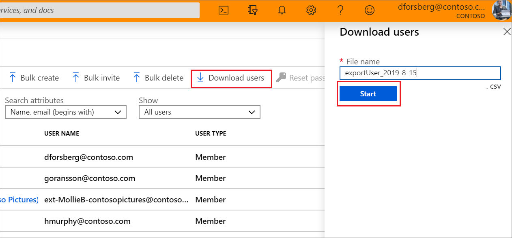

---

title: Download a list of users in the Azure portal
description: Download user records in bulk in the Azure admin center in Microsoft Entra ID. 
services: active-directory 
author: barclayn
ms.author: barclayn
manager: amycolannino
ms.date: 09/08/2023
ms.topic: how-to
ms.service: active-directory
ms.subservice: enterprise-users
ms.workload: identity
ms.custom: it-pro
ms.reviewer: krbain
ms.collection: M365-identity-device-management
---

# Download a list of users in Azure portal

Microsoft Entra ID, part of Microsoft Entra, supports bulk user list download operations.

## Required permissions

Both admin and non-admin users can download user lists.

## To download a list of users

[!INCLUDE [portal updates](~/articles/active-directory/includes/portal-update.md)]

1. Sign in to the [Microsoft Entra admin center](https://entra.microsoft.com) as at least a [Global Administrator](../roles/permissions-reference.md#global-administrator).
1. Select Microsoft Entra ID.
1. Select **Users** > **All users** > **Download users**. By default, all user profiles are exported.
1. On the **Download users** page, select **Start** to receive a CSV file listing user profile properties. If there are errors, you can download and view the results file on the **Bulk operation results** page. The file contains the reason for each error.

   

> [!NOTE]
> The download file will contain the filtered list of users based on the scope of the filters applied.

The following user attributes are included:

- `userPrincipalName`
- `displayName`
- `surname`
- `mail`
- `givenName`
- `objectId`
- `userType`
- `jobTitle`
- `department`
- `accountEnabled`
- `usageLocation`
- `streetAddress`
- `state`
- `country`
- `physicalDeliveryOfficeName`
- `city`
- `postalCode`
- `telephoneNumber`
- `mobile`
- `authenticationAlternativePhoneNumber`
- `authenticationEmail`
- `alternateEmailAddress`
- `ageGroup`
- `consentProvidedForMinor`
- `legalAgeGroupClassification`

## Check status

You can see the status of your pending bulk requests in the **Bulk operation results** page.

## Bulk download service limits

Each bulk activity to export a list of users can run for up to one hour. This pace enables export and download of a list of up to 500,000 users.

[!INCLUDE [Bulk update warning](~/articles/active-directory/includes/bulk-export.md)]

## Next steps

- [Bulk add users](users-bulk-add.md)
- [Bulk delete users](users-bulk-delete.md)
- [Bulk restore users](users-bulk-restore.md)
