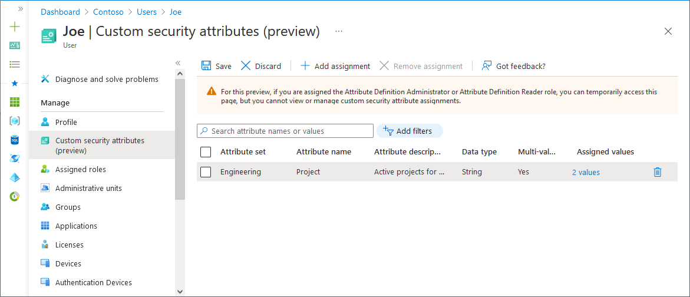
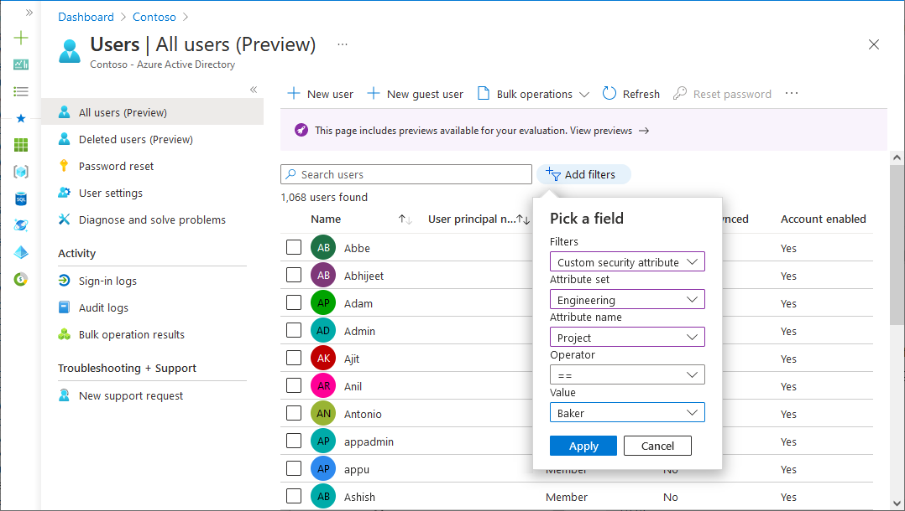

# Assign, update, list, or remove custom security attributes for a user (Preview)

> [!IMPORTANT]
> Custom security attributes are currently in PREVIEW.
> See the [Supplemental Terms of Use for Microsoft Azure Previews](https://azure.microsoft.com/support/legal/preview-supplemental-terms/) for legal terms that apply to Azure features that are in beta, preview, or otherwise not yet released into general availability.

[Custom security attributes](../fundamentals/custom-security-attributes-overview.md) in Azure Active Directory (Azure AD), part of Microsoft Entra, are business-specific attributes (key-value pairs) that you can define and assign to Azure AD objects. For example, you can assign custom security attribute to filter your employees or to help determine who gets access to resources. This article describes how to assign, update, list, or remove custom security attributes for Azure AD.

## Prerequisites

To assign or remove custom security attributes for a user in your Azure AD tenant, you need:

- Azure AD Premium P1 or P2 license
- [Attribute Assignment Administrator](../roles/permissions-reference.md#attribute-assignment-administrator)
- [AzureADPreview](https://www.powershellgallery.com/packages/AzureADPreview) version 2.0.2.138 or later when using PowerShell

> [!IMPORTANT]
> By default, [Global Administrator](../roles/permissions-reference.md#global-administrator) and other administrator roles do not have permissions to read, define, or assign custom security attributes.
    
## Assign custom security attributes to a user

1. Sign in to the [Azure portal](https://portal.azure.com).

1. Make sure that you have defined custom security attributes. For more information, see [Add or deactivate custom security attributes in Azure AD](../fundamentals/custom-security-attributes-add.md).

1. Select **Azure Active Directory** > **Users**.

1. Find and select the user you want to assign custom security attributes to.

1. In the Manage section, select **Custom security attributes (preview)**.

1. Select **Add assignment**.

1. In **Attribute set**, select an attribute set from the list.

1. In **Attribute name**, select a custom security attribute from the list.
  
1. Depending on the properties of the selected custom security attribute, you can enter a single value, select a value from a predefined list, or add multiple values.

    - For freeform, single-valued custom security attributes, enter a value in the **Assigned values** box.
    - For predefined custom security attribute values, select a value from the **Assigned values** list.
    - For multi-valued custom security attributes, select **Add values** to open the **Attribute values** pane and add your values. When finished adding values, select **Done**.

    

1. When finished, select **Save** to assign the custom security attributes to the user.

## Update custom security attribute assignment values for a user

1. Sign in to the [Azure portal](https://portal.azure.com).

1. Select **Azure Active Directory** > **Users**.

1. Find and select the user that has a custom security attribute assignment value you want to update.

1. In the Manage section, select **Custom security attributes (preview)**.
  
1. Find the custom security attribute assignment value you want to update.

    Once you have assigned a custom security attribute to a user, you can only change the value of the custom security attribute. You can't change other properties of the custom security attribute, such as attribute set or attribute name.

1. Depending on the properties of the selected custom security attribute, you can update a single value, select a value from a predefined list, or update multiple values.

1. When finished, select **Save**.

## Filter users based on custom security attributes

You can filter the list of custom security attributes assigned to users on the All users page.

1. Sign in to the [Azure portal](https://portal.azure.com).

1. Select **Azure Active Directory** > **Users**.

1. Select **Add filter** to open the Add filter pane.

1. Select **Custom security attributes**.

1. Select your attribute set and attribute name.

1. For **Operator**, you can select equals (**==**), not equals (**!=**), or **starts with**.

1. For **Value**, enter or select a value.

    

1. To apply the filter, select **Apply**.

## Remove custom security attribute assignments from a user

1. Sign in to the [Azure portal](https://portal.azure.com).

1. Select **Azure Active Directory** > **Users**.

1. Find and select the user that has the custom security attribute assignments you want to remove.

1. In the Manage section, select **Custom security attributes (preview)**.

1. Add check marks next to all the custom security attribute assignments you want to remove.

1. Select **Remove assignment**.

## PowerShell

To manage custom security attribute assignments for users in your Azure AD organization, you can use PowerShell. The following commands can be used to manage assignments.

#### Assign a custom security attribute with a multi-string value to a user

Use the [Set-AzureADMSUser](/powershell/module/azuread/set-azureadmsuser) command to assign a custom security attribute with a multi-string value to a user.

- Attribute set: `Engineering`
- Attribute: `Project`
- Attribute data type: Collection of Strings
- Attribute value: `("Baker","Cascade")`

```powershell
$attributes = @{
    Engineering = @{
        "@odata.type" = "#Microsoft.DirectoryServices.CustomSecurityAttributeValue"
        "Project@odata.type" = "#Collection(String)"
        Project = @("Baker","Cascade")
    }
}
Set-AzureADMSUser -Id dbb22700-a7de-4372-ae78-0098ee60e55e -CustomSecurityAttributes $attributes
```

#### Update a custom security attribute with a multi-string value for a user

Use the [Set-AzureADMSUser](/powershell/module/azuread/set-azureadmsuser) command to update a custom security attribute with a multi-string value for a user.

- Attribute set: `Engineering`
- Attribute: `Project`
- Attribute data type: Collection of Strings
- Attribute value: `("Alpine","Baker")`

```powershell
$attributesUpdate = @{
    Engineering = @{
        "@odata.type" = "#Microsoft.DirectoryServices.CustomSecurityAttributeValue"
        "Project@odata.type" = "#Collection(String)"
        Project = @("Alpine","Baker")
    }
}
Set-AzureADMSUser -Id dbb22700-a7de-4372-ae78-0098ee60e55e -CustomSecurityAttributes $attributesUpdate 
```

#### Get the custom security attribute assignments for a user

Use the [Get-AzureADMSUser](/powershell/module/azuread/get-azureadmsuser) command to get the custom security attribute assignments for a user.

```powershell
$user1 = Get-AzureADMSUser -Id dbb22700-a7de-4372-ae78-0098ee60e55e -Select CustomSecurityAttributes
$user1.CustomSecurityAttributes
```

## Microsoft Graph API

To manage custom security attribute assignments for users in your Azure AD organization, you can use the Microsoft Graph API. The following API calls can be made to manage assignments. For more information, see [Examples: Assign, update, list, or remove custom security attribute assignments using the Microsoft Graph API](/graph/custom-security-attributes-examples).

#### Assign a custom security attribute with a string value to a user

Use the [Update user](/graph/api/user-update?view=graph-rest-beta&preserve-view=true) API to assign a custom security attribute with a string value to a user.

- Attribute set: `Engineering`
- Attribute: `ProjectDate`
- Attribute data type: String
- Attribute value: `"2022-10-01"`

```http
PATCH https://graph.microsoft.com/beta/users/{id}
{
    "customSecurityAttributes":
    {
        "Engineering":
        {
            "@odata.type":"#Microsoft.DirectoryServices.CustomSecurityAttributeValue",
            "ProjectDate":"2022-10-01"
        }
    }
}
```

#### Assign a custom security attribute with a multi-string value to a user

Use the [Update user](/graph/api/user-update?view=graph-rest-beta&preserve-view=true) API to assign a custom security attribute with a multi-string value to a user.

- Attribute set: `Engineering`
- Attribute: `Project`
- Attribute data type: Collection of Strings
- Attribute value: `["Baker","Cascade"]`

```http
PATCH https://graph.microsoft.com/beta/users/{id}
{
    "customSecurityAttributes":
    {
        "Engineering":
        {
            "@odata.type":"#Microsoft.DirectoryServices.CustomSecurityAttributeValue",
            "Project@odata.type":"#Collection(String)",
            "Project":["Baker","Cascade"]
        }
    }
}
```

#### Assign a custom security attribute with an integer value to a user

Use the [Update user](/graph/api/user-update?view=graph-rest-beta&preserve-view=true) API to assign a custom security attribute with an integer value to a user.

- Attribute set: `Engineering`
- Attribute: `NumVendors`
- Attribute data type: Integer
- Attribute value: `4`

```http
PATCH https://graph.microsoft.com/beta/users/{id}
{
    "customSecurityAttributes":
    {
        "Engineering":
        {
            "@odata.type":"#Microsoft.DirectoryServices.CustomSecurityAttributeValue",
            "NumVendors@odata.type":"#Int32",
            "NumVendors":4
        }
    }
}
```

#### Assign a custom security attribute with a multi-integer value to a user

Use the [Update user](/graph/api/user-update?view=graph-rest-beta&preserve-view=true) API to assign a custom security attribute with a multi-integer value to a user.

- Attribute set: `Engineering`
- Attribute: `CostCenter`
- Attribute data type: Collection of Integers
- Attribute value: `[1001,1003]`

```http
PATCH https://graph.microsoft.com/beta/users/{id}
{
    "customSecurityAttributes":
    {
        "Engineering":
        {
            "@odata.type":"#Microsoft.DirectoryServices.CustomSecurityAttributeValue",
            "CostCenter@odata.type":"#Collection(Int32)",
            "CostCenter":[1001,1003]
        }
    }
}
```

#### Assign a custom security attribute with a Boolean value to a user

Use the [Update user](/graph/api/user-update?view=graph-rest-beta&preserve-view=true) API to assign a custom security attribute with a Boolean value to a user.

- Attribute set: `Engineering`
- Attribute: `Certification`
- Attribute data type: Boolean
- Attribute value: `true`

```http
PATCH https://graph.microsoft.com/beta/users/{id}
{
    "customSecurityAttributes":
    {
        "Engineering":
        {
            "@odata.type":"#Microsoft.DirectoryServices.CustomSecurityAttributeValue",
            "Certification":true
        }
    }
}
```

#### Update a custom security attribute with an integer value for a user

Use the [Update user](/graph/api/user-update?view=graph-rest-beta&preserve-view=true) API to update a custom security attribute with an integer value for a user.

- Attribute set: `Engineering`
- Attribute: `NumVendors`
- Attribute data type: Integer
- Attribute value: `8`

```http
PATCH https://graph.microsoft.com/beta/users/{id}
{
    "customSecurityAttributes":
    {
        "Engineering":
        {
            "@odata.type":"#Microsoft.DirectoryServices.CustomSecurityAttributeValue",
            "NumVendors@odata.type":"#Int32",
            "NumVendors":8
        }
    }
}
```

#### Update a custom security attribute with a Boolean value for a user

Use the [Update user](/graph/api/user-update?view=graph-rest-beta&preserve-view=true) API to update a custom security attribute with a Boolean value for a user.

- Attribute set: `Engineering`
- Attribute: `Certification`
- Attribute data type: Boolean
- Attribute value: `false`

```http
PATCH https://graph.microsoft.com/beta/users/{id}
{
    "customSecurityAttributes":
    {
        "Engineering":
        {
            "@odata.type":"#Microsoft.DirectoryServices.CustomSecurityAttributeValue",
            "Certification":false
        }
    }
}
```

#### Get the custom security attribute assignments for a user

Use the [Get user](/graph/api/user-get?view=graph-rest-beta&preserve-view=true) API to get the custom security attribute assignments for a user.

```http
GET https://graph.microsoft.com/beta/users/{id}?$select=customSecurityAttributes
```

If there are no custom security attributes assigned to the user or if the calling principal does not have access, the response will look like:

```http
{
    "customSecurityAttributes": null
}
```

#### List all users with a custom security attribute assignment that equals a value

Use the [List users](/graph/api/user-list?view=graph-rest-beta&preserve-view=true) API to list all users with a custom security attribute assignment that equals a value. The following example retrieves users with a custom security attribute named `AppCountry` with a value that equals `Canada`. The filter value is case sensitive. You must add `ConsistencyLevel=eventual` in the request or the header. You must also include `$count=true` to ensure the request is routed correctly.

- Attribute set: `Marketing`
- Attribute: `AppCountry`
- Filter: AppCountry eq 'Canada'

```http
GET https://graph.microsoft.com/beta/users?$count=true&$select=id,displayName,customSecurityAttributes&$filter=customSecurityAttributes/Marketing/AppCountry eq 'Canada'
ConsistencyLevel: eventual
```

#### List all users with a custom security attribute assignment that starts with a value

Use the [List users](/graph/api/user-list?view=graph-rest-beta&preserve-view=true) API to list all users with a custom security attribute assignment that starts with a value. The following example retrieves users with a custom security attribute named `EmployeeId` with a value that starts with `GS`. The filter value is case sensitive. You must add `ConsistencyLevel=eventual` in the request or the header. You must also include `$count=true` to ensure the request is routed correctly.

- Attribute set: `Marketing`
- Attribute: `EmployeeId`
- Filter: EmployeeId startsWith 'GS'

```http
GET https://graph.microsoft.com/beta/users?$count=true&$select=id,displayName,customSecurityAttributes&$filter=startsWith(customSecurityAttributes/Marketing/EmployeeId,'GS')
ConsistencyLevel: eventual
```

#### List all users with a custom security attribute assignment that does not equal a value

Use the [List users](/graph/api/user-list?view=graph-rest-beta&preserve-view=true) API to list all users with a custom security attribute assignment that does not equal a value. The following example retrieves users with a custom security attribute named `AppCountry` with a value that does not equal `Canada`. The filter value is case sensitive. You must add `ConsistencyLevel=eventual` in the request or the header. You must also include `$count=true` to ensure the request is routed correctly.

- Attribute set: `Marketing`
- Attribute: `AppCountry`
- Filter: AppCountry ne 'Canada'

```http
GET https://graph.microsoft.com/beta/users?$count=true&$select=id,displayName,customSecurityAttributes&$filter=customSecurityAttributes/Marketing/AppCountry ne 'Canada'
ConsistencyLevel: eventual
```

#### Remove a single-valued custom security attribute assignment from a user

Use the [Update user](/graph/api/user-update?view=graph-rest-beta&preserve-view=true) API to remove a single-valued custom security attribute assignment from a user by setting the value to null.

- Attribute set: `Engineering`
- Attribute: `ProjectDate`
- Attribute value: `null`

```http
PATCH https://graph.microsoft.com/beta/users/{id}
{
    "customSecurityAttributes":
    {
        "Engineering":
        {
            "@odata.type":"#Microsoft.DirectoryServices.CustomSecurityAttributeValue",
            "ProjectDate":null
        }
    }
}
```

#### Remove a multi-valued custom security attribute assignment from a user

Use the [Update user](/graph/api/user-update?view=graph-rest-beta&preserve-view=true) API to remove a multi-valued custom security attribute assignment from a user by setting the value to an empty collection.

- Attribute set: `Engineering`
- Attribute: `Project`
- Attribute value: `[]`

```http
PATCH https://graph.microsoft.com/beta/users/{id}
{
    "customSecurityAttributes":
    {
        "Engineering":
        {
            "@odata.type":"#Microsoft.DirectoryServices.CustomSecurityAttributeValue",
            "Project":[]
        }
    }
}
```

## Frequently asked questions

**Where are custom security attributes for users supported?**

Custom security attributes for users are supported in Azure portal, PowerShell, and Microsoft Graph APIs. Custom security attributes are not supported in My Apps or Microsoft 365 admin center.

**Who can view the custom security attributes assigned to a user?**

Only users that have been assigned the Attribute Assignment Administrator or Attribute Assignment Reader roles at tenant scope can view custom security attributes assigned to any users in the tenant. Users cannot view the custom security attributes assigned to their own profile or other users. Guests cannot view the custom security attributes regardless of the guest permissions set on the tenant.

**Do I need to create an app to use custom security attributes?**

No, custom security attributes can be assigned to user objects without requiring an application.

**Why do I keep getting an error trying to save custom security attribute assignments?**

You don't have permissions to assign custom security attributes to users. Make sure that you are assigned the Attribute Assignment Administrator role.

**Can I assign custom security attributes to guests?**

Yes, custom security attributes can be assigned to members or guests in your tenant.

**Can I assign custom security attributes to directory synced users?**

Yes, directory synced users from an on-premises Active Directory can be assigned custom security attributes.

**Are custom security attributes available for dynamic membership rules?**

No, custom security attributes assigned to users are not supported for configuring dynamic membership rules.

**Are custom security attributes the same as the custom attributes in B2C tenants?**

No, custom security attributes are not supported in B2C tenants and are not related to B2C features.

## Next steps

- [Add or deactivate custom security attributes in Azure AD](../fundamentals/custom-security-attributes-add.md)
- [Assign, update, list, or remove custom security attributes for an application](../manage-apps/custom-security-attributes-apps.md)
- [Troubleshoot custom security attributes in Azure AD](../fundamentals/custom-security-attributes-troubleshoot.md)
