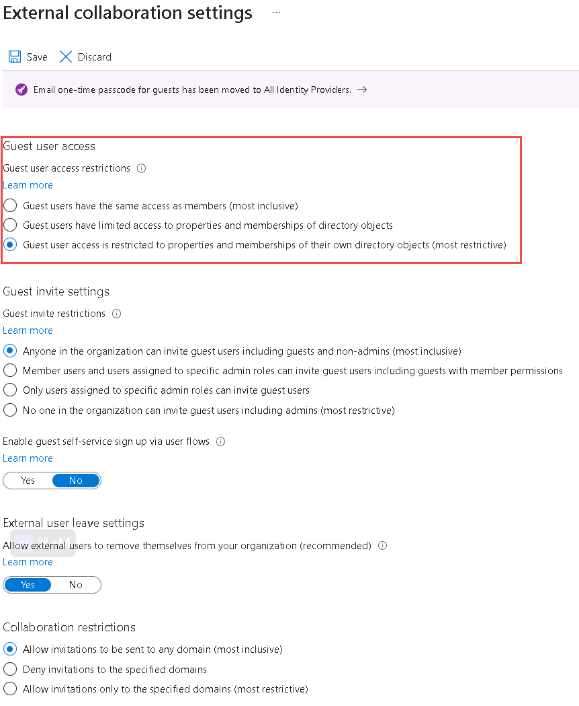

# Restrict guest access permissions in Azure Active Directory

Azure Active Directory (Azure AD), part of Microsoft Entra, allows you to restrict what external guest users can see in their organization in Azure AD. Guest users are set to a limited permission level by default in Azure AD, while the default for member users is the full set of user permissions. There's another guest user permission level in your Azure AD organization's external collaboration settings for even more restricted access, so that the guest access levels are:

Permission level             | Access level | Value
----------------             | ------------ | -----
Same as member users         | Guests have the same access to Azure AD resources as member users | a0b1b346-4d3e-4e8b-98f8-753987be4970
Limited access (default)     | Guests can see membership of all non-hidden groups | 10dae51f-b6af-4016-8d66-8c2a99b929b3
**Restricted access (new)**  | **Guests can't see membership of any groups** | **2af84b1e-32c8-42b7-82bc-daa82404023b**

When guest access is restricted, guests can view only their own user profile. Permission to view other users isn't allowed even if the guest is searching by User Principal Name or objectId. Restricted access also restricts guest users from seeing the membership of groups they're in. For more information about the overall default user permissions, including guest user permissions, see [What are the default user permissions in Azure Active Directory?](../fundamentals/users-default-permissions.md).

## Permissions and licenses

You must be in the Global Administrator role to configure guest user access. There are no additional licensing requirements to restrict guest access.

## Update in the Azure portal

[!INCLUDE [portal updates](~/articles/active-directory/includes/portal-update.md)]

We’ve made changes to the existing Azure portal controls for guest user permissions.

1. Sign in to the [Azure portal](https://portal.azure.com) with Global Administrator permissions.
1. Browse to **Azure Active Directory** > **User settings**.
1. Under **External users**, select **Manage external collaboration settings**.
1. On the **External collaboration settings** page, select **Guest user access is restricted to properties and memberships of their own directory objects** option.

    

1. Select **Save**. The changes can take up to 15 minutes to take effect for guest users.

## Update with the Microsoft Graph API

We’ve added a new Microsoft Graph API to configure guest permissions in your Azure AD organization. The following API calls can be made to assign any permission level. The value for guestUserRoleId used here is to illustrate the most restricted guest user setting. For more information about using the Microsoft Graph to set guest permissions, see [authorizationPolicy resource type](/graph/api/resources/authorizationpolicy).

### Configuring for the first time

````PowerShell
POST https://graph.microsoft.com/beta/policies/authorizationPolicy/authorizationPolicy

{
  "guestUserRoleId": "2af84b1e-32c8-42b7-82bc-daa82404023b"
}
````

Response should be Success 204.

### Updating the existing value

````PowerShell
PATCH https://graph.microsoft.com/beta/policies/authorizationPolicy/authorizationPolicy

{
  "guestUserRoleId": "2af84b1e-32c8-42b7-82bc-daa82404023b"
}
````

Response should be Success 204.

### View the current value

````PowerShell
GET https://graph.microsoft.com/beta/policies/authorizationPolicy/authorizationPolicy
````

Example response:

````PowerShell
{
    "@odata.context": "https://graph.microsoft.com/beta/$metadata#policies/authorizationPolicy/$entity",
    "id": "authorizationPolicy",
    "displayName": "Authorization Policy",
    "description": "Used to manage authorization related settings across the company.",
    "enabledPreviewFeatures": [],
    "guestUserRoleId": "10dae51f-b6af-4016-8d66-8c2a99b929b3",
    "permissionGrantPolicyIdsAssignedToDefaultUserRole": [
        "user-default-legacy"
    ]
}
````

## Update with PowerShell cmdlets

With this feature, we’ve added the ability to configure the restricted permissions via PowerShell v2 cmdlets. Get and Set PowerShell cmdlets have been published in version 2.0.2.85.

### Get command: Get-AzureADMSAuthorizationPolicy

Example:

````PowerShell
PS C:\WINDOWS\system32> Get-AzureADMSAuthorizationPolicy

Id                                                : authorizationPolicy
OdataType                                         :
Description                                       : Used to manage authorization related settings across the company.
DisplayName                                       : Authorization Policy
EnabledPreviewFeatures                            : {}
GuestUserRoleId                                   : 10dae51f-b6af-4016-8d66-8c2a99b929b3
PermissionGrantPolicyIdsAssignedToDefaultUserRole : {user-default-legacy}
````

### Set command: Set-AzureADMSAuthorizationPolicy

Example:

````PowerShell
PS C:\WINDOWS\system32> Set-AzureADMSAuthorizationPolicy -GuestUserRoleId '2af84b1e-32c8-42b7-82bc-daa82404023b'
````

> [!NOTE]
> You must enter authorizationPolicy as the ID when requested.

## Supported Microsoft 365 services

### Supported services

By supported we mean that the experience is as expected; specifically, that it's same as current guest experience.

- Teams
- Outlook (OWA)
- SharePoint
- Planner in Teams
- Planner mobile app
- Planner web app

### Services currently not supported

Service without current support might have compatibility issues with the new guest restriction setting.

- Forms
- Project
- Yammer
- Planner in SharePoint

## Frequently asked questions (FAQ)

Question | Answer
-------- | ------
Where do these permissions apply? | These directory level permissions are enforced across Azure AD services including the Microsoft Graph, PowerShell v2, the Azure portal, and My Apps portal. Microsoft 365 services leveraging Microsoft 365 groups for collaboration scenarios are also affected, specifically Outlook, Microsoft Teams, and SharePoint.
How do restricted permissions affect which groups guests can see? | Regardless of default or restricted guest permissions, guests can't enumerate the list of groups or users. Guests can see groups they're members of in both the Azure portal and the My Apps portal depending on permissions:<ul><li>**Default permissions**: To find the groups they're members of in the Azure portal, the guest must search for their object ID in the **All users** list, and then select **Groups**. Here they can see the list of groups that they're members of, including all the group details, including name, email, and so on. In the My Apps portal, they can see a list of groups they own and groups they're in.</li><li>**Restricted guest permissions**: In the Azure portal, they can find the list of groups they're in by searching for their object ID in the **All users** list, and then selecting **Groups**. They can see only limited details about the group, notably the object ID. By design, the Name and Email columns are blank and Group Type is Unrecognized. In the My Apps portal, they're not able to access the list of groups they own or groups they're a member of.</li></ul><br>For more detailed comparison of the directory permissions that come from the Graph API, see [Default user permissions](../fundamentals/users-default-permissions.md#member-and-guest-users).
Which parts of the My Apps portal will this feature affect? | The groups functionality in the My Apps portal will honor these new permissions. This functionality includes all paths to view the groups list and group memberships in My Apps. No changes were made to the group tile availability. The group tile availability is still controlled by the existing group setting in the Azure portal.
Do these permissions override SharePoint or Microsoft Teams guest settings? | No. Those existing settings still control the experience and access in those applications. For example, if you see issues in SharePoint, double check your external sharing settings. Guests added by team owners at the team level have access to channel meeting chat only for standard channels, excluding any private and shared channels.
What are the known compatibility issues in  Yammer? | With permissions set to ‘restricted’, guests signed into Yammer won't be able to leave the group.
Will my existing guest permissions be changed in my tenant? | No changes were made to your current settings. We maintain backward compatibility with your existing settings. You decide when you want to make changes.
Will these permissions be set by default? | No. The existing default permissions remain unchanged. You can optionally set the permissions to be more restrictive.
Are there any license requirements for this feature? | No, there are no new licensing requirements with this feature.

## Next steps

- To learn more about existing guest permissions in Azure AD, see [What are the default user permissions in Azure Active Directory?](../fundamentals/users-default-permissions.md)
- To see the Microsoft Graph API methods for restricting guest access, see [authorizationPolicy resource type](/graph/api/resources/authorizationpolicy)
- To revoke all access for a user, see [Revoke user access in Azure AD](users-revoke-access.md)
