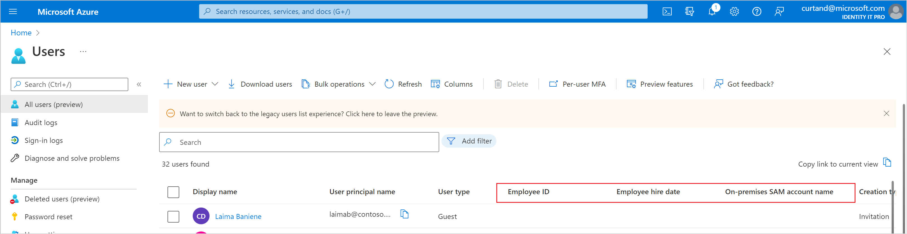
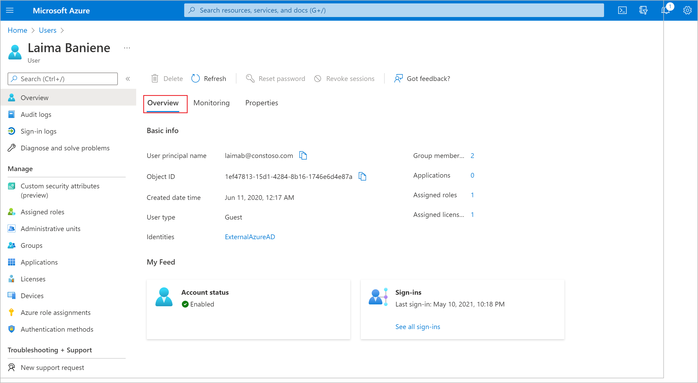
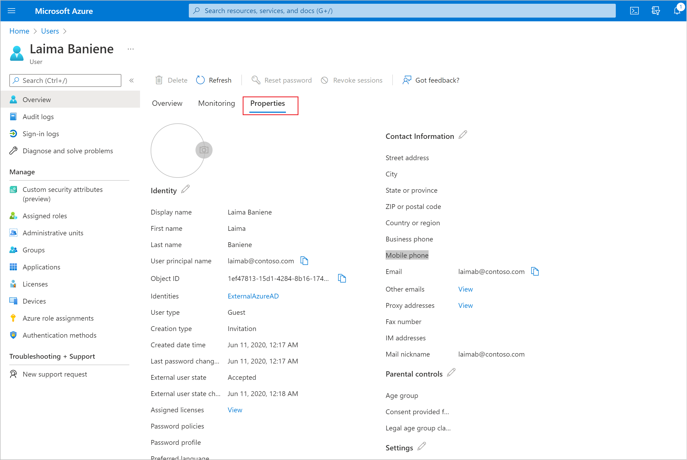
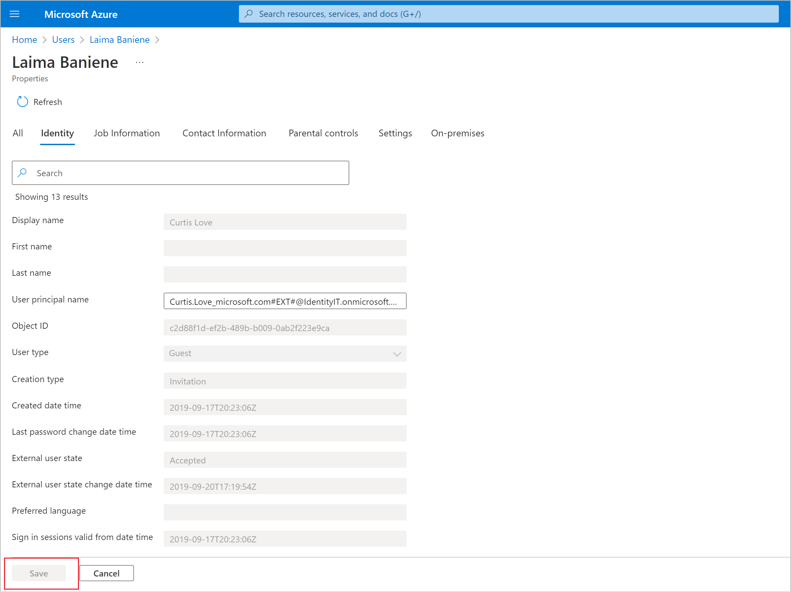

# User management enhancements in Microsoft Entra ID

This article describes how to use the user management enhancements in the admin center for Microsoft Entra ID, part of Microsoft Entra. The **All users** page and user profile pages have been updated to provide more information and make it easier to find users.

Enhancements include:

- Preloaded scrolling so that you no longer have to select ‘Load more’ to view more users 
- More user properties can be added as columns including city, country/region, employee ID, employee type, and external user state
- More user properties can be filtered on including custom security attributes, on-premises extension attributes, and manager 
- More ways to customize your view, like using drag-and-drop to reorder columns 
- Copy and share your customized All Users view with others 
- An enhanced User Profile experience that gives you quick insights about a user and lets you view and edit more properties 

> [!NOTE]
> These enhancements are not currently available for Azure AD B2C tenants.

## All users page

We’ve made some changes to the columns and filters available on the **All users** page. In addition to the existing columns for managing your list of users, we've added the option to add more user properties as columns and filters including employee ID, employee hire date, on-premises attributes, and more. 

### Reorder columns

You can customize your list view by reordering the columns on the page in one of two ways. One way is to directly drag and drop the columns on the page. Another way is to select **Columns** to open the column picker and then drag and drop the three- dot "handle" next to any given column. 

### Share views

If you want to share your customized list view with another person, you can select **Copy link to current view** in the upper right corner to share a link to the view. 

## User Profile enhancements

The user profile page is now organized into three tabs: **Overview**, **Monitoring**, and **Properties**.  

### Overview tab 

The overview tab contains key properties and insights about a user, such as: 

- Properties like user principal name, object ID, created date/time and user type 
- Selectable aggregate values such as the number of groups that the user is a member of, the number of apps to which they have access, and the number of licenses that are are assigned to them 
- Quick alerts and insights about a user such as their current account enabled status, the last time they signed in, whether they can use multifactor authentication, and B2B collaboration options

> [!NOTE] 
> Some insights about a user may not be visible to you unless you have sufficient role permissions.  

### Monitoring tab 

The monitoring tab is the new home for the chart showing user sign-ins over the past 30 days.  

### Properties tab 

The properties tab now contains more user properties. Properties are broken up into categories including Identity, Job information, Contact information, Parental controls, Settings, and On-premises.  

You can edit properties by selecting the pencil icon next to any category, which will then redirect you to a new editing experience. Here, you can search for specific properties or scroll through property categories. You can edit one or many properties, across categories, before selecting **Save**. 

 

> [!NOTE] 
> Some properties will not be visible or editable if they are read-only or if you don’t have sufficient role permissions to edit them. 

 
## Next steps

User operations

- [Add or change profile information](../fundamentals/how-to-manage-user-profile-info.md)
- [Add or delete users](../fundamentals/add-users.md)

Bulk operations

- [Download list of users](users-bulk-download.md)
- [Bulk add users](users-bulk-add.md)
- [Bulk delete users](users-bulk-delete.md)
- [Bulk restore users](users-bulk-restore.md)
