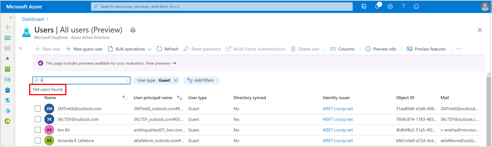

# User management enhancements in Azure Active Directory

This article describes how to use the user management enhancements in the Azure Active Directory (Azure AD) portal. The **All users** and **Deleted users** pages have been updated to provide more information and make it easier to find users.

Enhancements include:

- Infinite scroll so you no longer have to select ‘Load more’ to view more users 
- More user properties can be added as columns including city, country, employee ID, employee type, and external user state
- More user properties can be filtered on including custom security attributes, on-premises extension attributes, and manager 
- More ways to customize your view, like using drag-and-drop to reorder columns 
- Copy and share your customized All Users view with others 
- An enhanced User Profile experience that gives you quick insights about a user and lets you view and edit more properties 

> [!NOTE]
> These enhancements are not currently available for Azure AD B2C tenants.

## All users page

We’ve made some changes to the columns and filters available on the **All users** page. In addition to the existing columns for managing your list of users, we've added the option to add more user properties as columns and filters including employee ID, employee hire date, on premises attributes, and more. 

### Re-order columns

You can customize your list view by re-ordering the columns on the page in one of two ways. One way is to directly drag and drop the columns on the page. Another way is by opening the column picker and drag and dropping the three vertical dots next to any given column. ### Deleted users page

### Share views

If you want to share your customized list view with another person, you can select the Copy and share current view option in the upper right corner to get a shareable link. 

## User Profile enhancements

The user profile page has been updated to surface three tabs: Overview, Monitoring and Properties.  

### Overview tab 

The overview tab surfaces key properties and insights about a user, such as: 

- Properties like user principal name, object ID, created date/time and user type 
- Selectable aggregate values such as  how many groups the user is a member of, how many applications they have access to, and how many licenses are assigned to them 
- Quick alerts and insights about a user such as their current account enabled status, the last time they signed in, whether they can use multifactor authentication, and B2B collaboration options

[New screen shot of user profile overview tab] 

> [!NOTE] 
> Some insights about a user may not be visible to you unless you have sufficient role permissions.  

### Monitoring tab 

The monitoring tab is the new home for the chart showing user sign-ins over the past 30 days.  

### Properties tab 

The properties tab now surfaces more properties about a user. Properties are broken up into categories including Identity, Job information, Contact information, Parental controls, Settings, and On premises.  

[New screenshot of user profile properties tab] 

You can edit properties by selecting the pencil icon next to any category which will redirect you to a new editing experience. Here, you can search for specific properties or scroll through property categories. You can edit one or many properties, across categories, before selecting save. 

[New screenshot of user profile properties editor tab] 

> [!NOTE] 
> Some properties will not be visible or editable if they are read-only or if you don’t have the right role permissions to edit them. 

 
## More search and filtering

### Identity issuers

Select an entry in the **Identity issuer** column for any user to view additional details about the issuer including the sign-in type and the issuer assigned ID. The entries in the **Identity issuer** column can be multi-valued. If there are multiple issuers of the user's identity, you'll see the word Multiple in the **Identity issuer** column on **All users** and **Deleted users** pages, and the details pane list all issuers.

> [!NOTE]
> The **Source** column is replaced by multiple columns including **Creation type**, **Directory synced**, and **Identity issuer** for more granular filtering.

## User list search

When you enter a search string, the search now uses "starts with" and substring search to match names, emails, or object IDs in a single search. You can enter any of these attributes into the search box, and the search automatically looks across all these properties to return any matching results. The substring search is performed only on whole words. You can perform the same search on both the **All users** and **Deleted users** pages.

## User list filtering

Filtering capabilities have been enhanced to provide more filtering options for the **All users** and **Deleted users** pages. You can now filter by multiple properties simultaneously, and can filter by more properties.

### Filtering All users list

The following are the filterable properties on the **All users** page:

- User type: Member, guest, none
- Directory synced status: Yes, no
- Creation type: Invitation, Email verified, Local account
- Creation time: Last 7, 14, 30, 90, 360 or >360 days ago
- Job title: Enter a job title
- Department: Enter a department name
- Group: Search for a group
- Invitation state – Pending acceptance, Accepted
- Domain name: Enter a domain name
- Company name: Enter a company name
- Administrative unit: Select this option to restrict the scope of the users you view to a single administrative unit. For more information, see [Administrative units management preview](../roles/administrative-units.md).

### Filtering Deleted users list

The **Deleted users** page has additional filters not in the **All users** page. The following are the filterable properties on the **Deleted users** page:

- User type: Member, guest, none
- Directory synced status: Yes, no
- Creation type: Invitation, Email verified, Local account
- Creation time: Last 7, 14, 30, 90, 360 or > 360 days ago
- Job title: Enter a job title
- Department: Enter a department name
- Invitation state: Pending acceptance, Accepted
- Deletion date: Last 7, 14, or 30 days
- Domain name: Enter a domain name
- Company name: Enter a company name
- Permanent deletion date: Last 7, 14, or 30 days

## User list sorting

You can now sort by name and user principal name in the **All users** and **Deleted users** pages. You can also sort by deletion date in the **Deleted Users** list.

## User list counts

You can view the total number of users in the **All users** and **Deleted users** pages. As you search or filter the lists, the count is updated to reflect the total number of users found.

## Frequently Asked Questions (FAQ)

Question | Answer
-------- | ------
Why is the deleted user still displayed when the permanent deletion date has passed? | The permanent deletion date is displayed in the UTC time zone, so this may not match your current time zone. Also, this date is the earliest date after which the user will be permanently deleted from the organization, so it may still be processing. Permanently deleted users will automatically be removed from the list.
What happen to the bulk capabilities for users and guests? | The bulk operations are all still available for users and guests, including bulk create, bulk invite, bulk delete, and download users. We’ve just merged them into a menu called **Bulk operations**. You can find the **Bulk operations** options at the top of the **All users** page.
What happened to the Source column? | The **Source** column has been replaced with other columns that provide similar information, while allowing you to filter on those values independently. Examples include **Creation type**, **Directory synced** and **Identity issuer**.
What happened to the User Name column? | The **User Name** column is still there, but it’s been renamed to **User Principal Name**. This  better reflects the information contained in that column. You’ll also notice that the full User Principal Name is now displayed for B2B guests. This matches what you’d get in MS Graph.  

## Next steps

User operations

- [Add or change profile information](../fundamentals/active-directory-users-profile-azure-portal.md)
- [Add or delete users](../fundamentals/add-users-azure-active-directory.md)

Bulk operations

- [Download list of users](users-bulk-download.md)
- [Bulk add users](users-bulk-add.md)
- [Bulk delete users](users-bulk-delete.md)
- [Bulk restore users](users-bulk-restore.md)
