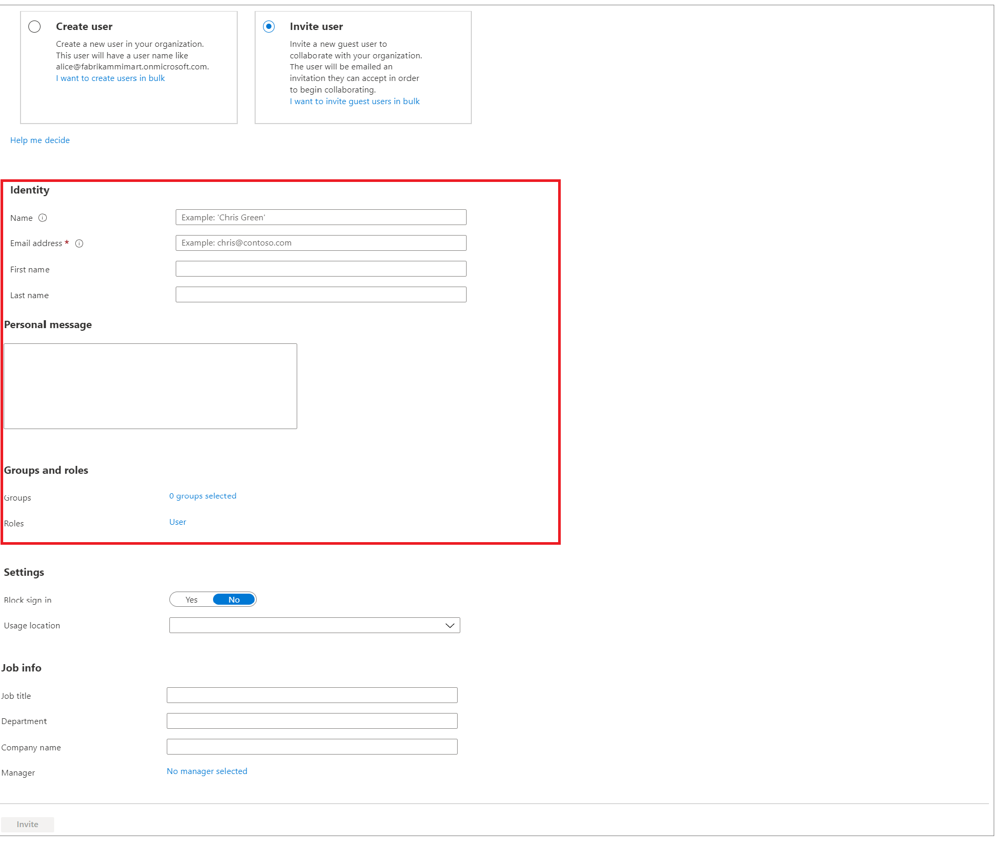
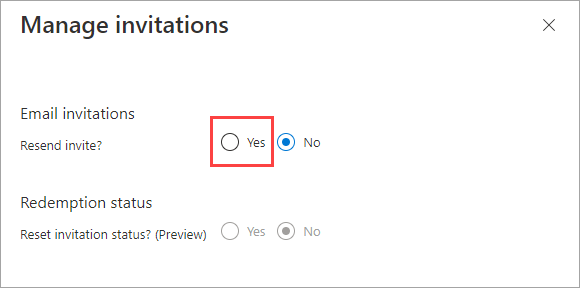

---

title: Add B2B collaboration users in the Azure portal - Azure AD
description: Shows how an admin can add guest users to their directory from a partner organization using Azure Active Directory (Azure AD) B2B collaboration.

services: active-directory
ms.service: active-directory
ms.subservice: B2B
ms.topic: how-to
ms.date: 10/12/2022

ms.author: mimart
author: msmimart
manager: celestedg
ms.collection: M365-identity-device-management
---

# Add Azure Active Directory B2B collaboration users in the Azure portal

As a user who is assigned any of the limited administrator directory roles, you can use the Azure portal to invite B2B collaboration users. You can invite guest users to the directory, to a group, or to an application. After you invite a user through any of these methods, the invited user's account is added to Azure Active Directory (Azure AD), with a user type of *Guest*. The guest user must then redeem their invitation to access resources. An invitation of a user does not expire.

After you add a guest user to the directory, you can either send the guest user a direct link to a shared app, or the guest user can select the redemption URL in the invitation email. For more information about the redemption process, see [B2B collaboration invitation redemption](redemption-experience.md).

> [!IMPORTANT]
> You should follow the steps in [How-to: Add your organization's privacy info in Azure Active Directory](../fundamentals/active-directory-properties-area.md) to add the URL of your organization's privacy statement. As part of the first time invitation redemption process, an invited user must consent to your privacy terms to continue. 

## Before you begin

Make sure your organization's external collaboration settings are configured such that you're allowed to invite guests. By default, all users and admins can invite guests. But your organization's external collaboration policies might be configured to prevent certain types of users or admins from inviting guests. To find out how to view and set these policies, see [Enable B2B external collaboration and manage who can invite guests](external-collaboration-settings-configure.md).

## Add guest users to the directory

To add B2B collaboration users to the directory, follow these steps:

1. Sign in to the [Azure portal](https://portal.azure.com) as a user who is assigned a limited administrator directory role or the Guest Inviter role.
2. Search for and select **Azure Active Directory** from any page.
3. Under **Manage**, select **Users**.
4. Select **New user** > **Invite external user**. (Or, if you're using the legacy experience, select **New guest user**).
5. On the **New user** page, select **Invite user** and then add the guest user's information.

   

      - **Name.** The first and last name of the guest user.
   - **Email address (required)**. The email address of the guest user.
   - **Personal message (optional)** Include a personal welcome message to the guest user.
   - **Groups**: You can add the guest user to one or more existing groups, or you can do it later.
   -  **Roles**: If you require Azure AD administrative permissions for the user, you can add them to an Azure AD role by selecting **User** next to **Roles**.  [Learn more](../../role-based-access-control/role-assignments-external-users.md) about Azure roles for external guest users.

   > [!NOTE]
   > Group email addresses aren’t supported; enter the email address for an individual. Also, some email providers allow users to add a plus symbol (+) and additional text to their email addresses to help with things like inbox filtering. However, Azure AD doesn’t currently support plus symbols in email addresses. To avoid delivery issues, omit the plus symbol and any characters following it up to the @ symbol.
6. Select **Invite** to automatically send the invitation to the guest user. 
 
After you send the invitation, the user account is automatically added to the directory as a guest. 

 

The user is added to your directory with a user principal name (UPN) in the format *emailaddress*#EXT#\@*domain*, for example, *john_contoso.com#EXT#\@fabrikam.onmicrosoft.com*, where fabrikam.onmicrosoft.com is the organization from which you sent the invitations. ([Learn more about B2B collaboration user properties](user-properties.md).)
## Add guest users to a group
If you need to manually add B2B collaboration users to a group, follow these steps:

1. Sign in to the [Azure portal](https://portal.azure.com) as an Azure AD administrator.
2. Search for and select **Azure Active Directory** from any page.
3. Under **Manage**, select **Groups**.
4. Select a group (or select **New group** to create a new one). It's a good idea to include in the group description that the group contains B2B guest users.
5. Under **Manage**, select **Members**.
6. Select **Add members**.
7. Do one of the following:

   - *If the guest user is already in the directory:*
      
       a. On the **Add members** page, start typing the name or email address of the guest user.
       
       b. In the search results, choose the user, and then choose **Select**.

   - *If the guest user isn't currently in the directory:*
      
       a. On the **Add members** page, type the user's full email address in the search box, type a **Personal message** (optional), and then choose **Invite** to send an invitation.
       
       b. Choose **Select**.
       
       c. Now add the user to the group: On the **Members** page, choose **Add members**. Type the user's name or email address in the search box, choose the user in the results, and then choose **Select**.

You can also use dynamic groups with Azure AD B2B collaboration. For more information, see [Dynamic groups and Azure Active Directory B2B collaboration](use-dynamic-groups.md).

## Add guest users to an application

To add B2B collaboration users to an application, follow these steps:

1. Sign in to the [Azure portal](https://portal.azure.com) as an Azure AD administrator.
2. Search for and select **Azure Active Directory** from any page.
3. Under **Manage**, select **Enterprise applications**.
4. On the **All applications** page, select the application to which you want to add guest users.
5. Under **Manage**, select **Users and groups**.
6. Select **Add user/group**.
7. On the **Add Assignment** page, select the link under **Users**.
8. Do one of the following:

   - *If the guest user is already in the directory:*
      
       a. On the **Users** page, start typing the name or email address of the guest user.
      
       b. In the search results, choose the user, and then choose **Select**.
       
       c. On the **Add Assignment** page, choose **Assign** to add the user to the app.

   - *If the guest user isn't currently in the directory:*
      
       a. On the **Users** page, type the user's full email address in the search box, type a **Personal message** (optional), and then choose **Invite**.
       
       b. Choose **Select**.
       
       c. Now add the invited user to the application: On the **Add Assignment** page, choose the link under **Users**. Type the invited user's name or email address in the search box, choose the user in the results, and then choose **Select**.
       
       d. On the **Add Assignment** page, choose **Assign**.

9. The guest user appears in the application's **Users and groups** list with the assigned role of **Default Access**. If the application provides different roles and you want to change the user's role, do the following:

    a. Select the check box next to the guest user, and then select the **Edit** button. 
    
    b. On the **Edit Assignment** page, choose the link under **Select a role**, and select the role you want to assign to the user.
    
    c. Choose **Select**.
    
    d. Select **Assign**.

## Resend invitations to guest users

If a guest user has not yet redeemed their invitation, you can resend the invitation email.

1. Sign in to the [Azure portal](https://portal.azure.com) as an Azure AD administrator.
2. Search for and select **Azure Active Directory** from any page.
3. Under **Manage**, select **Users**.
4. In the list, select the user's name to open their user profile.
5. Under **My Feed**, in the **B2B collaboration** tile, select the **Manage (resend invitation / reset status** link.
6. If the user has not yet accepted the invitation, Select the **Yes** option to resend.

    

7. In the confirmation message, select **Yes** to confirm that you want to send the user a new email invitation for redeeming their guest account. An invitation URL will be generated and sent to the user.

## Next steps

- To learn how non-Azure AD admins can add B2B guest users, see [How users in your organization can invite guest users to an app](add-users-information-worker.md)
- For information about the invitation email, see [The elements of the B2B collaboration invitation email](invitation-email-elements.md).
