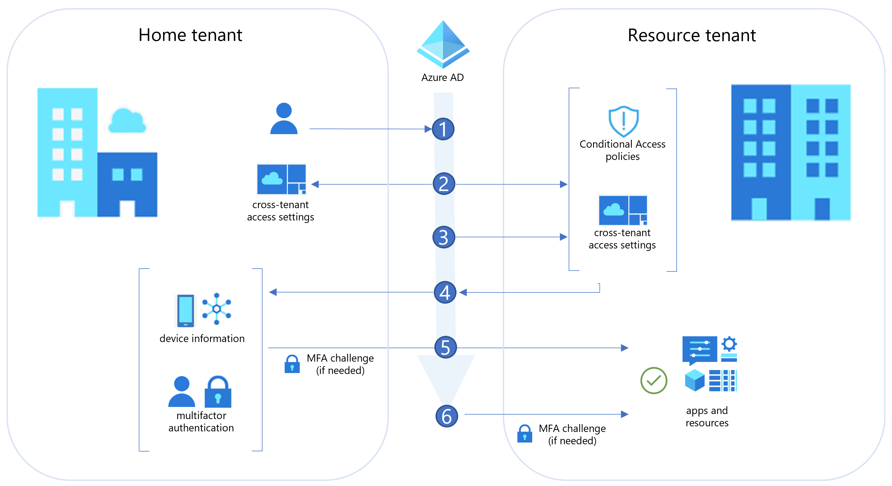
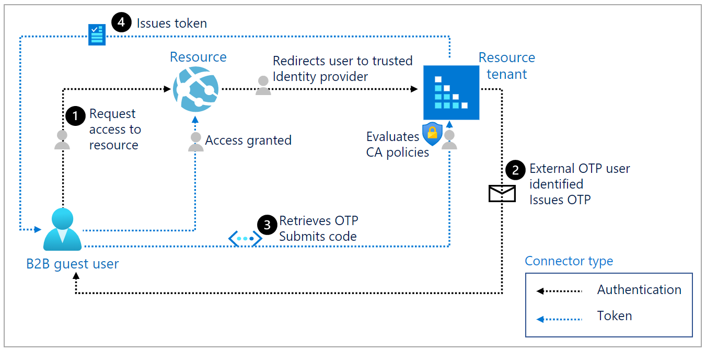

# Authentication and Conditional Access for External ID

> [!TIP]
> This article applies to B2B collaboration and B2B direct connect. If your tenant is configured for customer identity and access management, see [Security and governance in Microsoft Entra ID for customers](customers/concept-security-customers.md).

When an external user accesses resources in your organization, the authentication flow is determined by the collaboration method (B2B collaboration or B2B direct connect), user's identity provider (an external Microsoft Entra tenant, social identity provider, etc.), Conditional Access policies, and the [cross-tenant access settings](cross-tenant-access-overview.md) configured both in the user's home tenant and the tenant hosting resources.

This article describes the authentication flow for external users who are accessing resources in your organization. Organizations can enforce multiple Conditional Access policies for their external users, which can be enforced at the tenant, app, or individual user level in the same way that they're enabled for full-time employees and members of the organization.

<a name='authentication-flow-for-external-azure-ad-users'></a>

## Authentication flow for external Microsoft Entra users

The following diagram illustrates the authentication flow when a Microsoft Entra organization shares resources with users from other Microsoft Entra organizations. This diagram shows how cross-tenant access settings work with Conditional Access policies, such as multifactor authentication, to determine if the user can access resources. This flow applies to both B2B collaboration and B2B direct connect, except as noted in step 6.

[  ](media/authentication-conditional-access/cross-tenant-auth.png#lightbox)

|Step  |Description  |
|---------|---------|
|**1**     | A user from Fabrikam (the user’s *home tenant*) initiates sign-in to a resource in Contoso (the *resource tenant*).        |
|**2**     | During sign-in, the Microsoft Entra security token service (STS) evaluates Contoso's Conditional Access policies. It also checks whether the Fabrikam user is allowed access by evaluating cross-tenant access settings (Fabrikam’s outbound settings and Contoso’s inbound settings).        |
|**3**     | Microsoft Entra ID checks Contoso’s inbound trust settings to see if Contoso trusts MFA and device claims (device compliance, Microsoft Entra hybrid joined status) from Fabrikam. If not, skip to step 6.         |
|**4**     | If Contoso trusts MFA and device claims from Fabrikam, Microsoft Entra ID checks the user’s authentication session for an indication the user has completed MFA. If Contoso trusts device information from Fabrikam, Microsoft Entra ID looks for a claim in the authentication session indicating the device state (compliant or Microsoft Entra hybrid joined).         |
|**5**     | If MFA is required but not completed, or if a device claim isn't provided, Microsoft Entra ID issues MFA and device challenges in the user's home tenant as needed. When MFA and device requirements are satisfied in Fabrikam, the user is allowed access to the resource in Contoso. If the checks can’t be satisfied, access is blocked.        |
|**6**     | When no trust settings are configured and MFA is required, B2B collaboration users are prompted for MFA, which they need to satisfy in the resource tenant. Access is blocked for B2B direct connect users. If device compliance is required but can't be evaluated, access is blocked for both B2B collaboration and B2B direct connect users.             |

For more information, see the [Conditional Access for external users](#conditional-access-for-external-users) section.

## Authentication flow for non-Azure AD external users

When a Microsoft Entra organization shares resources with external users with an identity provider other than Microsoft Entra ID, the authentication flow depends on whether the user is authenticating with an identity provider or with email one-time passcode authentication. In either case, the resource tenant identifies which authentication method to use, and then either redirects the user to their identity provider or issues a one-time passcode.

### Example 1: Authentication flow and token for a non-Azure AD external user

The following diagram illustrates the authentication flow when an external user signs in with an account from a non-Azure AD identity provider, such as Google, Facebook, or a federated SAML/WS-Fed identity provider.

[  ](media/authentication-conditional-access/authentication-flow-b2b-guests.png#lightbox)

| Step | Description |
|--------------|-----------------------|
| **1** | The B2B guest user requests access to a resource. The resource redirects the user to its resource tenant,  a trusted IdP.|
| **2** | The resource tenant identifies the user as external and redirects the user to the B2B guest user’s IdP. The user performs primary authentication in the IdP.
| **3** | Authorization policies are evaluated in the B2B guest user's IdP. If the user satisfies these policies, the B2B guest user's IdP issues a token to the user. The user is redirected back to the resource tenant with the token. The resource tenant validates the token and then evaluates the user against its Conditional Access policies. For example, the resource tenant could require the user to perform Microsoft Entra multifactor authentication.
| **4** | Inbound cross-tenant access settings and Conditional Access policies are evaluated. If all policies are satisfied, the resource tenant issues its own token and redirects the user to its resource.

### Example 2: Authentication flow and token for one-time passcode user

The following diagram illustrates the flow when email one-time passcode authentication is enabled and the external user isn't authenticated through other means, such as Microsoft Entra ID, Microsoft account (MSA), or social identity provider.

[  ](media/authentication-conditional-access/authentication-flow-b2b-guests-otp.png#lightbox)

| Step | Description |
|--------------|-----------------------|
| **1** |The user requests access to a resource in another tenant. The resource redirects the user to its resource tenant, a trusted IdP.|
| **2** | The resource tenant identifies the user as an external email one-time passcode (OTP) user and sends an email with the OTP to the user.|
| **3** | The user retrieves the OTP and submits the code. The resource tenant evaluates the user against its Conditional Access policies.
| **4** | Once all Conditional Access policies are satisfied, the resource tenant issues a token and redirects the user to its resource. |

## Conditional Access for external users

Organizations can enforce Conditional Access policies for external B2B collaboration and B2B direct connect users in the same way that they’re enabled for full-time employees and members of the organization. With the introduction of cross-tenant access settings, you can also trust MFA and device claims from external Microsoft Entra organizations. This section describes important considerations for applying Conditional Access to users outside of your organization. 

> [!NOTE]
> Custom Controls with Conditional Access are not support for cross-tenant trusts. 

### Assigning Conditional Access policies to external user types

When configuring a Conditional Access policy, you have granular control over the types of external users you want to apply the policy to. External users are categorized based on how they authenticate (internally or externally) and their relationship to your organization (guest or member).

- **B2B collaboration guest users** - Most users who are commonly considered guests fall into this category. This B2B collaboration user has an account in an external Microsoft Entra organization or an external identity provider (such as a social identity), and they have guest-level permissions in your organization. The user object created in your Microsoft Entra directory has a UserType of Guest. This category includes B2B collaboration users who have been invited and who have used self-service sign-up.
- **B2B collaboration member users** - This B2B collaboration user has an account in an external Microsoft Entra organization or an external identity provider (such as a social identity) and member-level access to resources in your organization. This scenario is common in organizations consisting of multiple tenants, where users are considered part of the larger organization and need member-level access to resources in the organization’s other tenants. The user object created in the resource Microsoft Entra directory has a UserType of Member.
- **B2B direct connect users** - External users who are able to access your resources via B2B direct connect, which is a mutual, two-way connection with another Microsoft Entra organization that allows single sign-on access to certain Microsoft applications (currently, Microsoft Teams Connect shared channels). B2B direct connect users don’t have a presence in your Microsoft Entra organization, but are instead managed from within the application (for example, by the Teams shared channel owner).
- **Local guest users** - Local guest users have credentials that are managed in your directory. Before Microsoft Entra B2B collaboration was available, it was common to collaborate with distributors, suppliers, vendors, and others by setting up internal credentials for them and designating them as guests by setting the user object UserType to Guest.
- **Service provider users** - Organizations that serve as cloud service providers for your organization (the isServiceProvider property in the Microsoft Graph [partner-specific configuration](/graph/api/resources/crosstenantaccesspolicyconfigurationpartner) is true).
- **Other external users** - Applies to any users who don't fall into the categories above, but who aren't considered internal members of your organization, meaning they don't authenticate internally via Microsoft Entra ID, and the user object created in the resource Microsoft Entra directory doesn't have a UserType of Member.

>[!NOTE]
> The "All guest and external users" selection has now been replaced with "Guest and external users" and all its sub types. For customers who previously had a Condtional Access policy with "All guest and external users" selected will now see "Guest and external users" along with all sub types being selected. This change in UX does not have any functional impact on how policy is evaluated by Conditional Access backend. The new selection provides customers the needed granularity to choose specifc types of guest and external users to include/exclude from user scope when creating their Conditional Access policy.

Learn more about [Conditional Access user assignments](../conditional-access/concept-conditional-access-users-groups.md).

### Comparing External Identities Conditional Access policies

The following table gives a detailed comparison of the security policy and compliance options in Microsoft Entra External ID. Security policy and compliance are managed by the host/inviting organization under Conditional Access policies.

|**Policy** |**B2B collaboration users**  |**B2B direct connect users**|
| :------------ | :-------------- | :----- |
|**Grant controls—Block access**   |   Supported       |   Supported      |
|**Grant controls — Require multifactor authentication**     |  Supported        |   Supported, requires configuring your [inbound trust settings](cross-tenant-access-settings-b2b-direct-connect.md#to-change-inbound-trust-settings-for-mfa-and-device-state) to accept MFA claims from the external organization       |
|**Grant controls — Require compliant device**     | Supported, requires configuring your [inbound trust settings](cross-tenant-access-settings-b2b-collaboration.md#to-change-inbound-trust-settings-for-mfa-and-device-claims) to accept compliant device claims from the external organization.      | Supported, requires configuring your [inbound trust settings](cross-tenant-access-settings-b2b-direct-connect.md#to-change-inbound-trust-settings-for-mfa-and-device-state) to accept compliant device claims from the external organization.         |
|**Grant controls — Require Microsoft Entra hybrid joined device**   |  Supported, requires configuring your [inbound trust settings](cross-tenant-access-settings-b2b-collaboration.md#to-change-inbound-trust-settings-for-mfa-and-device-claims) to accept Microsoft Entra hybrid joined device claims from the external organization  |   Supported, requires configuring your [inbound trust settings](cross-tenant-access-settings-b2b-direct-connect.md#to-change-inbound-trust-settings-for-mfa-and-device-state) to accept Microsoft Entra hybrid joined device claims from the external organization       |
|**Grant controls — Require approved client app**    | Not supported         |   Not supported       |
|**Grant controls — Require app protection policy**     |  Not supported        |  Not supported        |
|**Grant controls — Require password change**     |  Not supported        |    Not supported      |
|**Grant controls — Terms of Use**     |  Supported       |  Not supported        |
|**Session controls — Use app enforced restrictions**    |   Supported      |  Not supported        |
|**Session controls — Use Conditional Access App control**     |  Supported       |   Not supported       |
|**Session controls — Sign-in frequency**     |  Supported       |   Not supported       |
|**Session controls — Persistent browser session**   |   Supported      |  Not supported        |

<a name='mfa-for-azure-ad-external-users'></a>

### MFA for Microsoft Entra external users

In a Microsoft Entra cross-tenant scenario, the resource organization can create Conditional Access policies that require MFA or device compliance for all guest and external users. Generally, a B2B collaboration user accessing a resource is then required to set up their Microsoft Entra multifactor authentication with the resource tenant. However, Microsoft Entra ID now offers the ability to trust MFA claims from other Microsoft Entra tenants. Enabling MFA trust with another tenant streamlines the sign-in process for B2B collaboration users and enables access for B2B direct connect users.

If you've configured your inbound trust settings to accept MFA claims from a B2B collaboration or B2B direct connect user's home tenant, Microsoft Entra ID checks the user's authentication session. If the session contains a claim indicating that MFA policies have already been met in the user's home tenant, the user is granted seamless sign-on to your shared resource.

If MFA trust isn't enabled, the user experience is different for B2B collaboration users and B2B direct connect users:

- **B2B collaboration users**: If the resource organization hasn't enabled MFA trust with the user's home tenant, the user is presented with an MFA challenge from the resource organization. (The flow is the same as the [MFA flow for non-Azure AD external users](#mfa-for-non-azure-ad-external-users).)

- **B2B direct connect users**: If the resource organization hasn't enabled MFA trust with the user's home tenant, the user is blocked from accessing resources. If you want to allow B2B direct connect with an external organization and your Conditional Access policies require MFA, you *must* configure your inbound trust settings to accept MFA claims from the organization.

Learn more about how to [configure inbound trust settings for MFA](cross-tenant-access-settings-b2b-collaboration.md#to-change-inbound-trust-settings-for-mfa-and-device-claims).

### MFA for non-Azure AD external users

For non-Azure AD external users, the resource tenant is always responsible for MFA. The following is an example of a typical MFA flow. This scenario works for any identity, including a Microsoft Account (MSA) or social ID. This flow also applies for Microsoft Entra external users when you haven't configured trust settings with their home Microsoft Entra organization.

1. An admin or information worker in a company named Fabrikam invites a user from another company named Contoso to use Fabrikam's app.

2. Fabrikam's app is configured to require Microsoft Entra multifactor authentication upon access.

3. When the B2B collaboration user from Contoso attempts to access Fabrikam's app, they're asked to complete the Microsoft Entra multifactor authentication challenge.

4. The guest user can then set up their Microsoft Entra multifactor authentication with Fabrikam and select the options.

Fabrikam must have sufficient premium Microsoft Entra ID licenses that support Microsoft Entra multifactor authentication. The user from Contoso then consumes this license from Fabrikam. See [billing model for Microsoft Entra External ID](./external-identities-pricing.md) for information on the B2B licensing.

>[!NOTE]
>MFA is completed at resource tenancy to ensure predictability. When the guest user signs in, they'll see the resource tenant sign-in page displayed in the background, and their own home tenant sign-in page and company logo in the foreground.

<a name='azure-ad-mfa-reset-proof-up-for-b2b-collaboration-users'></a>

#### Microsoft Entra multifactor authentication reset (proof up) for B2B collaboration users

The following PowerShell cmdlets are available to *proof up* or request MFA registration from B2B collaboration users.

1. Connect to Microsoft Entra ID:

   ```powershell
   $cred = Get-Credential
   Connect-MsolService -Credential $cred
   ```

2. Get all users with proof up methods:

   ```powershell
   Get-MsolUser | where { $_.StrongAuthenticationMethods} | select UserPrincipalName, @{n="Methods";e={($_.StrongAuthenticationMethods).MethodType}}
   ```

   For example:

   ```powershell
   Get-MsolUser | where { $_.StrongAuthenticationMethods} | select UserPrincipalName, @{n="Methods";e={($_.StrongAuthenticationMethods).MethodType}}
   ```

3. Reset the Microsoft Entra multifactor authentication method for a specific user to require the user to set proof up methods again, for example:

   ```powershell
   Reset-MsolStrongAuthenticationMethodByUpn -UserPrincipalName gsamoogle_gmail.com#EXT#@ WoodGroveAzureAD.onmicrosoft.com
   ```

### Authentication strength policies for external users

Authentication strength is a Conditional Access control that lets you define a specific combination of multifactor authentication methods that an external user must complete accessing your resources. This control is especially useful for restricting external access to sensitive apps in your organization because you can enforce specific authentication methods, such as a phishing-resistant method, for external users.

You also have the ability to apply authentication strength to the different types of [guest or external users](#assigning-conditional-access-policies-to-external-user-types) that you collaborate or connect with. This means you can enforce authentication strength requirements that are unique to your B2B collaboration, B2B direct connect, and other external access scenarios.

Microsoft Entra ID provides three [built-in authentication strengths](https://aka.ms/b2b-auth-strengths):

- Multifactor authentication strength
- Passwordless MFA strength
- Phishing-resistant MFA strength

You can use one of these built-in strengths or create a custom authentication strength policy based on the authentication methods you want to require.

> [!NOTE]
> Currently, you can only apply authentication strength policies to external users who authenticate with Microsoft Entra ID. For email one-time passcode, SAML/WS-Fed, and Google federation users, use the MFA grant control to require MFA.

When you apply an authentication strength policy to external Microsoft Entra users, the policy works together with [MFA trust settings](cross-tenant-access-settings-b2b-collaboration.md#to-change-inbound-trust-settings-for-mfa-and-device-claims) in your cross-tenant access settings to determine where and how the external user must perform MFA. A Microsoft Entra user first authenticates using their own account in their home Microsoft Entra tenant. Then when this user tries to access your resource, Microsoft Entra ID applies the authentication strength Conditional Access policy and checks to see if you've enabled MFA trust.

In external user scenarios, the authentication methods that are acceptable for fulfilling authentication strength vary, depending on whether the user is completing MFA in their home tenant or the resource tenant. The following table indicates the acceptable methods in each tenant. If a resource tenant has opted to trust claims from external Microsoft Entra organizations, only those claims listed in the “Home tenant” column below will be accepted by the resource tenant for MFA fulfillment. If the resource tenant has disabled MFA trust, the external user must complete MFA in the resource tenant using one of the methods listed in the “Resource tenant” column.

##### Table 1. Authentication strength MFA methods for external users

|Authentication method  |Home tenant  | Resource tenant  |
|---------|---------|---------|
|SMS as second factor                         | &#x2705;        | &#x2705; |
|Voice call                                   | &#x2705;        | &#x2705; |
|Microsoft Authenticator push notification    | &#x2705;        | &#x2705; |
|Microsoft Authenticator phone sign-in        | &#x2705;        | &#x2705; |
|OATH software token                          | &#x2705;        | &#x2705; |
|OATH hardware token                          | &#x2705;        |          |
|FIDO2 security key                           | &#x2705;        |          |
|Windows Hello for Business                   | &#x2705;        |          |


To configure a Conditional Access policy that applies authentication strength requirements to external users or guests, see [Conditional Access: Require an authentication strength for external users](../conditional-access/howto-conditional-access-policy-authentication-strength-external.md).

<a name='user-experience-for-external-azure-ad-users'></a>

#### User experience for external Microsoft Entra users

Authentication strength policies work together with [MFA trust settings](cross-tenant-access-settings-b2b-collaboration.md#to-change-inbound-trust-settings-for-mfa-and-device-claims) in your cross-tenant access settings to determine where and how the external user must perform MFA.  

First, a Microsoft Entra user authenticates with their own account in their home tenant. Then when this user tries to access your resource, Microsoft Entra ID applies the authentication strength Conditional Access policy and checks to see if you've enabled MFA trust.

- **If MFA trust is enabled**, Microsoft Entra ID checks the user's authentication session for a claim indicating that MFA has been fulfilled in the user's home tenant. (See [Table 1](#table-1-authentication-strength-mfa-methods-for-external-users) for authentication methods that are acceptable for MFA fulfillment when completed in an external user's home tenant.) If the session contains a claim indicating that MFA policies have already been met in the user's home tenant and the methods satisfy the authentication strength requirements, the user is allowed access. Otherwise, Microsoft Entra ID presents the user with a challenge to complete MFA in the home tenant using an acceptable authentication method. The MFA method must be enabled in the home tenant and user must be able to register for it.
- **If MFA trust is disabled**, Microsoft Entra ID presents the user with a challenge to complete MFA in the resource tenant using an acceptable authentication method. (See [Table 1](#table-1-authentication-strength-mfa-methods-for-external-users) for authentication methods that are acceptable for MFA fulfillment by an external user.)

If the user is unable to complete MFA, or if a Conditional Access policy (such as a compliant device policy) prevents them from registering, access is blocked.

<a name='device-compliance-and-hybrid-azure-ad-joined-device-policies'></a>

### Device compliance and Microsoft Entra hybrid joined device policies

Organizations can use Conditional Access policies to require users' devices to be managed by Microsoft Intune. Such policies can block external user access, because an external user can't register their unmanaged device with the resource organization. Devices can only be managed by a user's home tenant.

However, you can use device trust settings to unblock external users while still requiring managed devices. In your cross-tenant access settings, you can choose to trust claims from an external user's home tenant about whether the user's device meets their device compliance policies or is [Microsoft Entra hybrid joined](../conditional-access/howto-conditional-access-policy-compliant-device.md). You can set device trust settings for all Microsoft Entra organizations or individual organizations.

When device trust settings are enabled, Microsoft Entra ID checks a user's authentication session for a device claim. If the session contains a device claim indicating that the policies have already been met in the user's home tenant, the external user is granted seamless sign-on to your shared resource.

>[!Important]
>
>- Unless you're willing to trust claims regarding device compliance or Microsoft Entra hybrid joined status from an external user's home tenant, we don't recommend applying Conditional Access policies that require external users to use managed devices.

### Device filters

When creating Conditional Access policies for external users, you can evaluate a policy based on the device attributes of a registered device in Microsoft Entra ID. By using the *filter for devices* condition, you can target specific devices using the supported operators and properties and the other available assignment conditions in your Conditional Access policies.

Device filters can be used together with cross-tenant access settings to base policies on devices that are managed in other organizations. For example, suppose you want to block devices from an external Microsoft Entra tenant based on a specific device attribute. You can set up a device attribute-based policy by doing the following:

- Configure your cross-tenant access settings to trust device claims from that organization.
- Assign the device attribute you want to use for filtering to one of the [supported device extension attributes](../conditional-access/concept-condition-filters-for-devices.md#supported-operators-and-device-properties-for-filters).
- Create a Conditional Access policy with a device filter that blocks access to devices containing that attribute.

Learn more about [filtering for devices with Conditional Access](../conditional-access/concept-condition-filters-for-devices.md).
### Mobile application management policies

We don't recommend requiring an app protection policy for external users. Conditional Access grant controls such as **Require approved client apps** and **Require app protection policies** require the device to be registered in the resource tenant. These controls can only be applied to [iOS and Android devices](../conditional-access/concept-conditional-access-conditions.md#device-platforms). Because a user’s device can only be managed by their home tenant, these controls can't be applied to external guest users.

### Location-based Conditional Access

The [location-based policy](../conditional-access/concept-conditional-access-conditions.md#locations) based on IP ranges can be  enforced if the inviting organization can create a trusted IP address range that defines their partner organizations.

Policies can also be enforced based on **geographical locations**.

### Risk-based Conditional Access

The [Sign-in risk policy](../conditional-access/concept-conditional-access-conditions.md#sign-in-risk) is enforced if the external guest user satisfies the grant control. For example, an organization could require Microsoft Entra multifactor authentication for medium or high sign-in risk. However, if a user hasn't previously registered for Microsoft Entra multifactor authentication in the resource tenant, the user will be blocked. This is done to prevent malicious users from registering their own Microsoft Entra multifactor authentication credentials in the event they compromise a legitimate user’s password.

The [User-risk policy](../conditional-access/concept-conditional-access-conditions.md#user-risk), however, can't be resolved in the resource tenant. For example, if you require a password change for high-risk external guest users, they'll be blocked because of the inability to reset passwords in the resource directory.

### Conditional Access client apps condition

[Client apps conditions](../conditional-access/concept-conditional-access-conditions.md#client-apps) behave the same for B2B guest users as they do for any other type of user. For example, you could prevent guest users from using legacy authentication protocols.

### Conditional Access session controls

[Session controls](../conditional-access/concept-conditional-access-session.md) behave the same for B2B guest users as they do for any other type of user.

## Identity protection and user risk policies

Identity Protection detects compromised credentials for Microsoft Entra users and marks user accounts that may be compromised as "at risk". As a resource tenant, you can apply user risk policies to external users to block risky sign-ins. For an external user, the user risk is evaluated at their home directory. The real-time sign-in risk for these users is evaluated at the resource directory when they try to access the resource. However, because an external user's identity exists in their home directory, the following are limitations:

- If an external user triggers the Identity Protection user risk policy to force password reset, they're blocked because they can't reset their password in the resource organization.
- The resource organization's risky users report won't reflect external users because the risk evaluation occurs in the external user's home directory.
- Admins in the resource organization can't dismiss or remediate a risky external user because they don't have access to the B2B user's home directory.

You can prevent external users from being impacted by risk-based policies by creating a group in Microsoft Entra ID that contains all of your organization's external users. Then, add this group as an exclusion for your built-in Identity Protection user risk and sign-in risk policies, and any Conditional Access policies that use sign-in risk as a condition.

For more information, see [Identity Protection and B2B users](../identity-protection/concept-identity-protection-b2b.md).

## Next steps

For more information, see the following articles:

- [Zero Trust policies for allowing guest access and B2B external user access](/microsoft-365/security/office-365-security/identity-access-policies-guest-access?view=o365-worldwide&preserve-view=true)
- [Identity Protection and B2B users](../identity-protection/concept-identity-protection-b2b.md)
- [Frequently Asked Questions (FAQs)](./faq.yml)
