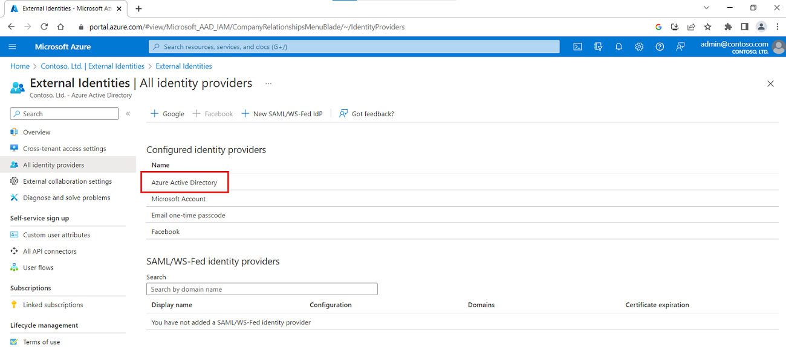
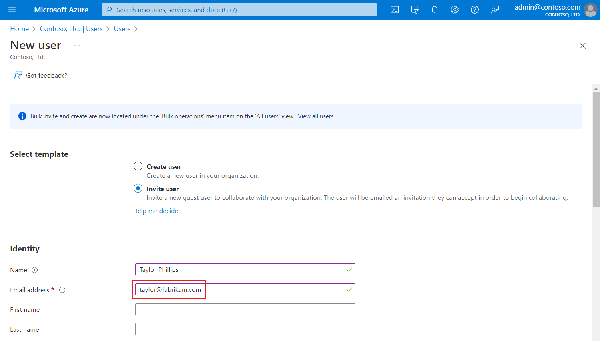
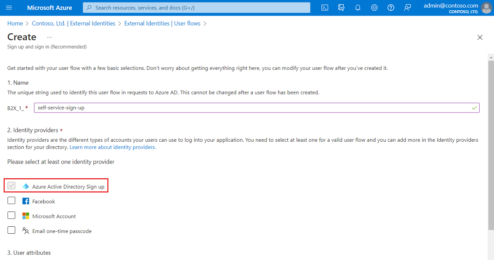

---

title: Azure AD Account identity provider
description: Use Azure Active Directory to enable an external user (guest) to sign in to your Azure AD apps with their Azure AD work account.

services: active-directory
ms.service: active-directory
ms.subservice: B2B
ms.topic: how-to
ms.date: 06/02/2021

ms.author: mimart
author: msmimart
manager: celestedg
ms.collection: M365-identity-device-management
---

# Azure Active Directory (Azure AD) identity provider for External Identities

Azure Active Directory is available as an identity provider option for B2B collaboration by default. If an external guest user has an Azure AD account through work or school, they can redeem your B2B collaboration invitations or complete your sign-up user flows using their Azure AD account.

## Guest sign-in using Azure Active Directory accounts

Azure Active Directory is available in the list of External Identities identity providers by default. No further configuration is needed to allow guest users to sign in with their Azure AD account using either the invitation flow or a self-service sign-up user flow.

### Azure AD account in the invitation flow

When you [invite a guest user](add-users-administrator.md) to B2B collaboration, you can specify their Azure AD account as the email address they'll use to sign in.

### Azure AD account in self-service sign-up user flows

Azure AD account is an identity provider option for your self-service sign-up user flows. Users can sign up for your applications using their own Azure AD accounts. First, you'll need to [enable self-service sign-up](self-service-sign-up-user-flow.md) for your tenant. Then you can set up a user flow for the application and select Azure Active Directory as one of the sign-in options.

## Next steps

- [Add Azure Active Directory B2B collaboration users](add-users-administrator.md)
- [Add self-service sign-up to an app](self-service-sign-up-user-flow.md)