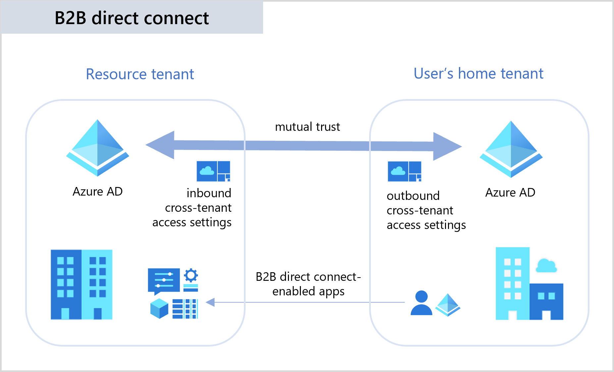
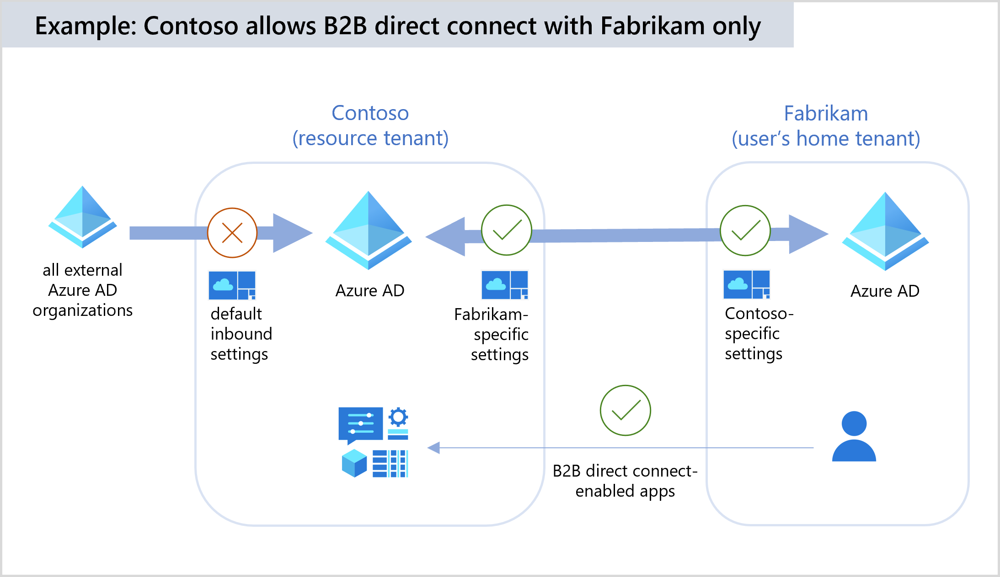
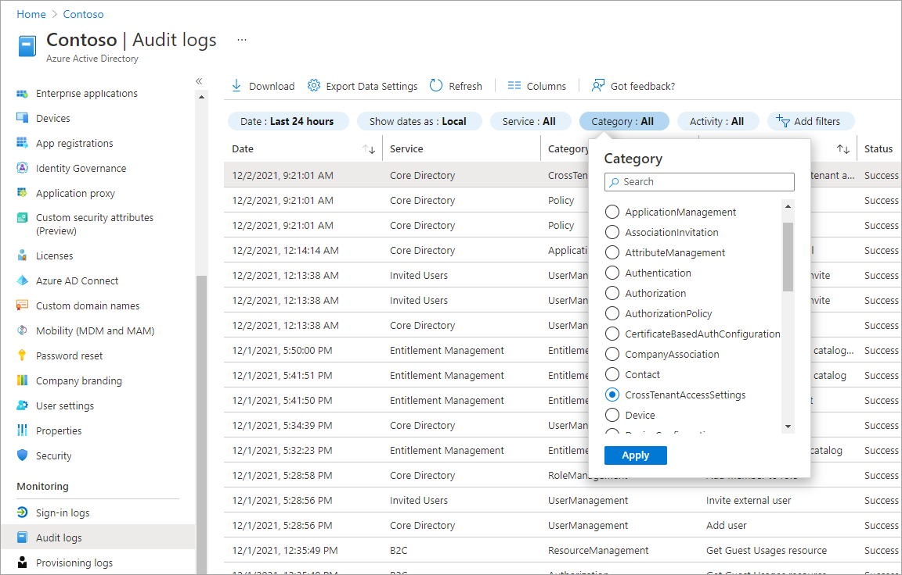
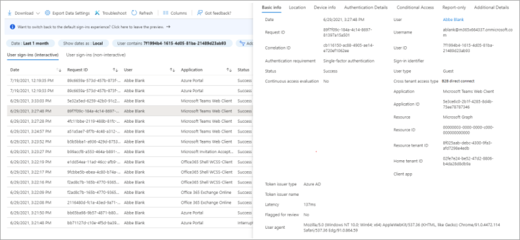

# B2B direct connect overview

B2B direct connect is a feature of Microsoft Entra External ID that lets you set up a mutual trust relationship with another Microsoft Entra organization for seamless collaboration. This feature currently works with Microsoft Teams shared channels. With B2B direct connect, users from both organizations can work together using their home credentials and a shared channel in Teams, without having to be added to each other’s organizations as guests. Use B2B direct connect to share resources with external Microsoft Entra organizations. Or use it to share resources across multiple Microsoft Entra tenants within your own organization.

B2B direct connect requires a mutual trust relationship between two Microsoft Entra organizations to allow access to each other's resources. Both the resource organization and the external organization need to mutually enable B2B direct connect in their cross-tenant access settings. When the trust is established, the B2B direct connect user has single sign-on access to resources outside their organization using credentials from their home Microsoft Entra organization.

Currently, B2B direct connect capabilities work with Teams shared channels. When B2B direct connect is established between two organizations, users in one organization can create a shared channel in Teams and invite an external B2B direct connect user to it. Then from within Teams, the B2B direct connect user can seamlessly access the shared channel in their home tenant Teams instance, without having to manually sign in to the organization hosting the shared channel.

For licensing and pricing information related to B2B direct connect users, refer to [Microsoft Entra External ID pricing](https://azure.microsoft.com/pricing/details/active-directory/external-identities/).

## Managing cross-tenant access for B2B direct connect

Microsoft Entra organizations can manage their trust relationships with other Microsoft Entra organizations by defining inbound and outbound [cross-tenant access settings](cross-tenant-access-settings-b2b-collaboration.md). Cross-tenant access settings give you granular control over how other organizations collaborate with you (inbound access) and how your users collaborate with other organizations (outbound access).

- **Inbound access settings** control whether users from external organizations can access resources in your organization. You can apply these settings to everyone, or you can specify individual users, groups, and applications.

- **Outbound access settings** control whether your users can access resources in an external organization. You can apply these settings to everyone, or you can specify individual users, groups, and applications.

- **Tenant restrictions** determine how your users can access an external organization when they’re using your devices and network, but they’re signed in using an account that was issued to them by the external organization.

- **Trust settings** determine whether your Conditional Access policies will trust the multi-factor authentication (MFA), compliant device, and Microsoft Entra hybrid joined device claims from an external organization when their users access your resources.  

> [!IMPORTANT]
> B2B direct connect is possible only when both organizations allow access to and from the other organization. For example, Contoso can allow inbound B2B direct connect from Fabrikam, but sharing isn't possible until Fabrikam also enables outbound B2B direct connect with Contoso. Therefore, you’ll need to coordinate with the external organization’s admin to make sure their cross-tenant access settings allow sharing with you. This mutual agreement is important because B2B direct connect enables limited sharing of data for the users you enable for B2B direct connect.
### Default settings

The default cross-tenant access settings apply to all external Microsoft Entra organizations, except organizations for which you've configured individual settings. Initially, Microsoft Entra ID blocks all inbound and outbound B2B direct connect capabilities by default for all external Microsoft Entra tenants. You can change these default settings, but typically you can leave them as-is and enable B2B direct connect access with individual organizations.

### Organization-specific settings

You can configure organization-specific settings by adding the organization and modifying the cross-tenant access settings. These settings then take precedence over the default settings for this organization.

### Example 1: Allow B2B direct connect with Fabrikam and block all others

In this example, Contoso wants to block B2B direct connect with all external organizations by default, but allow B2B direct connect for all users, groups, and apps in Fabrikam.

Contoso sets the following **Default settings** for cross-tenant access:

- Block inbound access to B2B direct connect for all external users and groups.
- Block outbound access to B2B direct connect for all Contoso users and groups.

Then Contoso adds the Fabrikam organization and configures the following **Organizational settings** for Fabrikam:

- Allow inbound access to B2B direct connect for all Fabrikam users and groups.
- Allow inbound access to all internal Contoso applications by Fabrikam B2B direct connect users.
- Allow all Contoso users, or select users and groups to have outbound access to Fabrikam using B2B direct connect.
- Allow Contoso B2B direct connect users to have outbound access to all Fabrikam applications.

For this scenario to work, Fabrikam also needs to allow B2B direct connect with Contoso by configuring these same cross-tenant access settings for Contoso and for their own users and applications. When configuration is complete, Contoso users who manage Teams shared channels will be able to add Fabrikam users by searching for their full Fabrikam email addresses.

### Example 2: Enable B2B direct connect with Fabrikam's Marketing group only

Starting from the example above, Contoso could also choose to allow only the Fabrikam Marketing group to collaborate with Contoso's users through B2B direct connect. In this case, Contoso needs to obtain the Marketing group's object ID from Fabrikam. Then, instead of allowing inbound access to all Fabrikam's users, they'll configure their Fabrikam-specific access settings as follows:

- Allow inbound access to B2B direct connect for Fabrikam's Marketing group only. Contoso specifies Fabrikam's Marketing group object ID in the allowed users and groups list.
- Allow inbound access to all internal Contoso applications by Fabrikam B2B direct connect users.
- Allow all Contoso users and groups to have outbound access to Fabrikam using B2B direct connect.
- Allow Contoso B2B direct connect users to have outbound access to all Fabrikam applications.

Fabrikam will also need to configure their outbound cross-tenant access settings so that their Marketing group is allowed to collaborate with Contoso through B2B direct connect. When configuration is complete, Contoso users who manage Teams shared channels will be able to add only Fabrikam Marketing group users by searching for their full Fabrikam email addresses.

## Authentication

In a B2B direct connect scenario, authentication involves a user from a Microsoft Entra organization (the user's home tenant) attempting to sign in to a file or app in another Microsoft Entra organization (the resource tenant). The user signs in with Microsoft Entra credentials from their home tenant. The sign-in attempt is evaluated against cross-tenant access settings in both the user's home tenant and the resource tenant. If all access requirements are met, a token is issued to the user that allows the user to access the resource. This token is valid for 1 hour.

For details about how authentication works in a cross-tenant scenario with Conditional Access policies, see [Authentication and Conditional Access in cross-tenant scenarios](authentication-conditional-access.md).

## Multi-factor authentication (MFA)

If you want to allow B2B direct connect with an external organization and your Conditional Access policies require MFA, you ***must*** configure your inbound [trust settings](cross-tenant-access-settings-b2b-direct-connect.md#to-change-inbound-trust-settings-for-mfa-and-device-state) so that your Conditional Access policies will accept MFA claims from the external organization. This configuration ensures that B2B direct connect users from the external organization are compliant with your Conditional Access policies, and it provides a more seamless user experience.

For example, say Contoso (the resource tenant) trusts MFA claims from Fabrikam. Contoso has a Conditional Access policy requiring MFA. This policy is scoped to all guests, external users, and SharePoint Online. As a prerequisite for B2B direct connect, Contoso must configure trust settings in their cross-tenant access settings to accept MFA claims from Fabrikam. When a Fabrikam user accesses a B2B direct connect-enabled app (for example, a Teams Connect shared channel), the user is subject to the MFA requirement enforced by Contoso:

- If the Fabrikam user has already performed MFA in their home tenant, they’ll be able to access the resource within the shared channel.
- If the Fabrikam user hasn’t completed MFA, they’ll be blocked from accessing the resource.

For information about Conditional Access and Teams, see [Overview of security and compliance](/microsoftteams/security-compliance-overview) in the Microsoft Teams documentation.

## Trust settings for device compliance

In your cross-tenant access settings, you can use **Trust settings** to trust claims from an external user's home tenant about whether the user's device meets their device compliance policies or is Microsoft Entra hybrid joined. When device trust settings are enabled, Microsoft Entra ID checks a user's authentication session for a device claim. If the session contains a device claim indicating that the policies have already been met in the user's home tenant, the external user is granted seamless sign-on to your shared resource. You can enable device trust settings for all Microsoft Entra organizations or individual organizations. ([Learn more](authentication-conditional-access.md#device-compliance-and-hybrid-azure-ad-joined-device-policies))

## B2B direct connect user experience

Currently, B2B direct connect enables the Teams Connect shared channels feature. B2B direct connect users can access an external organization's Teams shared channel without having to switch tenants or sign in with a different account. The B2B direct connect user’s access is determined by the shared channel’s policies.

In the resource organization, the Teams shared channel owner can search within Teams for users from an external organization and add them to the shared channel. After they're added, the B2B direct connect users can access the shared channel from within their home instance of Teams, where they collaborate using features such as chat, calls, file-sharing, and app-sharing.  For details, see [Overview of teams and channels in Microsoft Teams](/microsoftteams/teams-channels-overview). For details about the resources, files, and applications that are available to the B2B direct connect user via the Teams shared channel refer to [Chat, teams, channels, & apps in Microsoft Teams](/microsoftteams/deploy-chat-teams-channels-microsoft-teams-landing-page).

## B2B direct connect vs. B2B collaboration

B2B collaboration and B2B direct connect are two different approaches to sharing with users outside of your organization. You can find a [feature-to-feature comparison](external-identities-overview.md#comparing-external-identities-feature-sets) in the External Identities overview, where we discuss some key differences in how users are managed, and how they access resources.

### User access and management

B2B direct connect users collaborate via a mutual connection between two organizations, whereas B2B collaboration users are invited to an organization and managed via a user object.

- B2B direct connect offers way to collaborate with users from another Microsoft Entra organization through a mutual, two-way connection configured by admins from both organizations. Users have single sign-on access to B2B direct connect-enabled Microsoft applications. Currently, B2B direct connect support Teams Connect shared channels.

- B2B collaboration lets you invite external partners to access your Microsoft, SaaS, or custom-developed apps. B2B collaboration is especially useful when the external partner doesn't use Microsoft Entra ID or it's not practical or possible to set up B2B direct connect. B2B collaboration allows external users to sign in using their preferred identity, including their Microsoft Entra account, consumer Microsoft account, or a social identity you enable such as Google. With B2B collaboration, you can let external users sign in to your Microsoft applications, SaaS apps, custom-developed apps, and so on.  

### Using Teams with B2B direct connect vs. B2B collaboration

Within the context of Teams, there are differences in how resources can be shared depending on whether you’re collaborating with someone using B2B direct connect or B2B collaboration.

- With B2B direct connect, you add the external user to a shared channel within a team. This user can access the resources within the shared channel, but they don’t have access to the entire team or any other resources outside the shared channel. For example, they don’t have access to the Azure portal. They do, however, have access to My apps portal. B2B direct connect users don’t have a presence in your Microsoft Entra organization, so these users are managed in the Teams client by the shared channel owner. For details, see the [Assign team owners and members in Microsoft Teams](/microsoftteams/assign-roles-permissions).

- With B2B collaboration, you can invite the guest user to a team. The B2B collaboration guest user signs into the resource tenant using the email address that was used to invite them. Their access is determined by the permissions assigned to guest users in the resource tenant. Guest users can’t see or participate in any shared channels in the team.

For more information about differences between B2B collaboration and B2B direct connect in Teams, see [Guest access in Microsoft Teams](/microsoftteams/guest-access).

## Monitoring and auditing

Reporting for monitoring and auditing B2B direct connect activity is available in both the Azure portal and the Microsoft Teams admin center.

### Microsoft Entra ID monitoring and audit logs

Microsoft Entra ID includes information about cross-tenant access and B2B direct connect in the organization's Audit logs and Sign-in logs. These logs can be viewed in the Azure portal under **Monitoring**.

- **Microsoft Entra audit logs**: Microsoft Entra audit logs show when inbound and outbound policies are created, updated, or deleted.  

   

- **Microsoft Entra sign-in logs** Microsoft Entra sign-in logs are available in both the home organization and the resource organization. Once B2B direct connect is enabled, sign-in logs will begin including user object IDs for B2B direct connect users from other tenants. The information reported in each organization varies, for example:

  - In both organizations, B2B direct connect sign-ins are labeled with a cross-tenant access type of B2B direct connect. A sign-in event is recorded when a B2B direct connect user first accesses a resource organization, and again when a refresh token is issued for the user. Users can access their own sign-in logs. Admins can view sign-ins for their entire organization to see how B2B direct connect users are accessing resources in their tenant.  

  - In the home organization, the logs include client application information.

  - In the resource organization, the logs include conditionalAccessPolicies in the Conditional Access tab.  

   

- **Microsoft Entra access reviews**: With Microsoft Entra access reviews, a tenant admin can ensure that external guest users don’t have access to your apps and resources longer than is necessary by configuring a one-time or recurring access review of the external users. [Learn more about access reviews](../governance/access-reviews-overview.md).

### Microsoft Teams monitoring and audit logs

The Microsoft Teams admin center displays reporting for shared channels, including external B2B direct connect members for each team.

- **Teams audit logs**: Teams supports the following auditing events in the tenant that hosts the shared channel: Shared channel lifecycle (Create/Delete channel), In-tenant/Cross-tenant Member lifecycle (Add/remove/Promote/Demote member). These audit logs are available in the resource tenant so that admins can determine who has access to the Teams shared channel. There are no audit logs in the external user’s home tenant related to their activity in an external shared channel.

- **Teams access reviews**: Access reviews of Groups that are Teams can now detect B2B direct connect users who are using Teams shared channels. When creating an access review, you can scope the review to all internal users, guest users, and external B2B direct connect users who have been added directly to a shared channel. The reviewer is then presented with users who have direct access to the shared channel.  

- **Current limitations**: An access review can detect internal users and external B2B direct connect users, but not other teams that have been added to a shared channel. To view and remove teams that have been added to a shared channel, the shared channel owner can manage membership from within Teams.

For more information about Microsoft Teams audit logs, see the [Microsoft Teams auditing documentation](/microsoftteams/audit-log-events).

## Privacy and data handling

B2B direct connect lets your users and groups access apps and resources that are hosted by an external organization. To establish a connection, an admin from the external organization must also enable B2B direct connect.

By enabling B2B connect with an external organization, you're allowing the external organizations that you have enabled outbound settings with to access limited contact data about your users. Microsoft shares this data with those organizations to help them send a request to connect with your users. Data collected by external organizations, including limited contact data, is subject to the privacy policies and practices of those organizations.

### Outbound access

When B2B direct connect is enabled with an external organization, users in the external organization will be able to search for your users by full email address. Matching search results will return limited data about your users, including first name and last name. Your users will need to consent to the external organization’s privacy policies before more of their data is shared. We recommend you review the privacy information that will be provided by the organization and presented to your users.

### Inbound access

We strongly recommend you add both your global privacy contact and your organization's privacy statement so your internal employees and external guests can review your policies. Follow the steps to [add your organization's privacy info](../fundamentals/properties-area.md).  

### Restricting access to users and groups

You might want to consider using cross-tenant access settings to restrict B2B direct connect to specific users and groups within your organization and the external organization.

## Next steps

- [Configure cross-tenant access settings](cross-tenant-access-settings-b2b-collaboration.md)
- See the Microsoft Teams documentation for details about [data loss prevention](/microsoft-365/compliance), [retention policies](/microsoftteams/retention-policies), and [eDiscovery](/microsoftteams/ediscovery-investigation).
