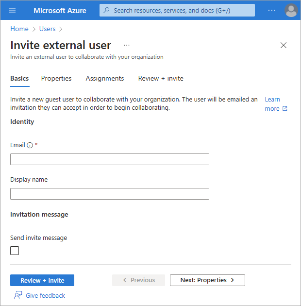

# Quickstart: Add a guest user and send an invitation

With Microsoft Entra [B2B collaboration](what-is-b2b.md), you can invite anyone to collaborate with your organization using their own work, school, or social account.

In this quickstart, you'll learn how to add a new guest user to your Microsoft Entra directory in the Microsoft Entra admin center. You'll also send an invitation and see what the guest user's invitation redemption process looks like. 

If you don’t have an Azure subscription, create a [free account](https://azure.microsoft.com/free/?WT.mc_id=A261C142F) before you begin.

The updated experience for creating new users covered in this article is available as a Microsoft Entra ID preview feature. This feature is enabled by default, but you can opt out by going to **Identity** > **Settings** > **Preview hub** and disabling the **Create user experience** feature. For more information about previews, see [Universal License Terms for Online Services](https://www.microsoft.com/licensing/terms/product/ForOnlineServices/all).

Instructions for the legacy create user process can be found in the [Add or delete users](../fundamentals/add-users.md) article.

## Prerequisites

To complete the scenario in this quickstart, you need:

- A role that allows you to create users in your tenant directory, such as at least a [Guest Inviter role](../roles/permissions-reference.md#guest-inviter) or a [User administrator](../roles/permissions-reference.md#user-administrator).

- Access to a valid email address outside of your Microsoft Entra tenant, such as a separate work, school, or social email address. You'll use this email to create the guest account in your tenant directory and access the invitation.

## Invite an external guest user

[!INCLUDE [portal updates](~/articles/active-directory/includes/portal-update.md)]

This quickstart guide provides the basic steps to invite an external user. To learn about all of the properties and settings that you can include when you invite an external user, see [How to create and delete a user](../fundamentals/how-to-create-delete-users.md).

1. Sign in to the [Microsoft Entra admin center](https://entra.microsoft.com) as at least a [User administrator](../roles/permissions-reference.md#user-administrator).

1. Browse to **Identity** > **Users** > **All users**.

1. Select **Invite external user** from the menu. 

    

### Basics for external users

In this section, you're inviting the guest to your tenant using *their email address*. For this quickstart, enter an email address that you can access.

- **Email**: Enter the email address for the guest user you're inviting.

- **Display name**: Provide the display name.

-  **Invitation message**: Select the **Send invite message** checkbox to send an invitation message. When enabling this checkbox, you can also set up the customized short message and additional CC recipient.

Select the **Review and invite** button to finalize the process.

### Review and invite

The final tab captures several key details from the user creation process. Review the details and select the **Invite** button if everything looks good.

An email invitation is sent automatically. 

1. After you send the invitation, the user account is automatically added to the directory as a guest.

    :::image type="content" source="media/quickstart-add-users-portal/new-guest-user-directory.png" alt-text="Screenshot showing the new guest user in the directory.":::

## Accept the invitation

Now sign in as the guest user to see the invitation.

1. Sign in to your test guest user's email account.

1. In your inbox, open the email from "Microsoft Invitations on behalf of Contoso."

    :::image type="content" source="media/quickstart-add-users-portal/quickstart-users-portal-email-small.png" alt-text="Screenshot showing the B2B invitation email.":::

1. In the email body, select **Accept invitation**. A **Review permissions** page opens in the browser.

    :::image type="content" source="media/quickstart-add-users-portal/consent-screen.png" alt-text="Screenshot showing the Review permissions page.":::

1. Select **Accept**.

1. The **My Apps** page opens. Because we haven't assigned any apps to this guest user, you'll see the message "There are no apps to show." In a real-life scenario, you would [add the guest user to an app](add-users-administrator.md#add-guest-users-to-an-application) so the app would appear here.

## Clean up resources

When no longer needed, delete the test guest user.

1. Sign in to the [Microsoft Entra admin center](https://entra.microsoft.com) as at least a [User administrator](../roles/permissions-reference.md#user-administrator).
1. Browse to **Identity** > **Users** > **User settings**.
1. Select the test user, and then select **Delete user**.

## Next steps

In this quickstart, you created a guest user in the Microsoft Entra admin center and sent an invitation to share apps. Then you viewed the redemption process from the guest user's perspective, and verified that the guest user was able to access their My Apps page. 
To learn more about adding guest users for collaboration, see [Add Microsoft Entra B2B collaboration users in the Microsoft Entra admin center](add-users-administrator.md).
To learn more about adding guest users with PowerShell, see [Add and invite guests with PowerShell](b2b-quickstart-invite-powershell.md).
You can also bulk invite guest users [via the admin center](tutorial-bulk-invite.md) or [via PowerShell](bulk-invite-powershell.md). 
