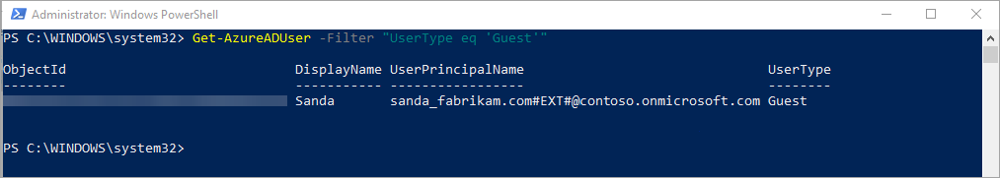

---

title: 'Quickstart: Add a guest user with PowerShell - Azure AD'
description: In this quickstart, you learn how to use PowerShell to send an invitation to an external Azure AD B2B collaboration user.

services: active-directory
ms.service: active-directory
ms.subservice: B2B
ms.topic: quickstart
ms.date: 08/28/2018

ms.author: mimart
author: msmimart
manager: celestedg
ms.reviewer: mal
ms.custom: "it-pro, seo-update-azuread-jan"
#customer intent: As a tenant admin, I want to walk through the B2B invitation workflow so that I can understand how to add a user through PowerShell.

ms.collection: M365-identity-device-management
---

# Quickstart: Add a guest user with PowerShell

There are many ways you can invite external partners to your apps and services with Azure Active Directory B2B collaboration. In the previous quickstart, you saw how to add guest users directly in the Azure Active Directory admin portal. You can also use PowerShell to add guest users, either one at a time or in bulk. In this quickstart, you’ll use the New-AzureADMSInvitation command to add one guest user to your Azure tenant.

If you don’t have an Azure subscription, create a [free account](https://azure.microsoft.com/free/?WT.mc_id=A261C142F) before you begin. 

## Prerequisites

### Install the latest AzureADPreview module
Make sure that you install the latest version of the Azure AD PowerShell for Graph module (AzureADPreview). 

First, check which modules you have installed. Open Windows PowerShell as an elevated user (Run as administrator), and run the following command:
 
```powershell  
Get-Module -ListAvailable AzureAD*
```

If the AzureADPreview module displays with no message indicating there’s a later version, you’re set. Otherwise, based on the output, do one of the following:

- If no results are returned, run the following command to install the AzureADPreview module:
  
   ```powershell  
   Install-Module AzureADPreview
   ```
- If only the AzureAD module shows up in the results, run the following commands to install the AzureADPreview module: 

   ```powershell 
   Uninstall-Module AzureAD 
   Install-Module AzureADPreview 
   ```
- If only the AzureADPreview module shows up in the results, but you receive a message that indicates there's a later version, run the following commands to update the module: 

   ```powershell 
   Uninstall-Module AzureADPreview 
   Install-Module AzureADPreview 
  ```

You might receive a prompt that you're installing the module from an untrusted repository. This occurs if you haven't previously set the PSGallery repository as a trusted repository. Press **Y** to install the module.

### Get a test email account

You need a test email account that you can send the invitation to. The account must be from outside your organization. You can use any type of account, including a social account such as a gmail.com or outlook.com address.

## Sign in to your tenant

Run the following command to connect to the tenant domain:

```powershell
Connect-AzureAD -TenantDomain "<Tenant_Domain_Name>"
```
For example, `Connect-AzureAD -TenantDomain "contoso.onmicrosoft.com"`.

When prompted, enter your credentials.

## Send an invitation

1. To send an invitation to your test email account, run the following PowerShell command (replace **"Sanda"** and **sanda\@fabrikam.com** with your test email account name and email address): 

   ```powershell
   New-AzureADMSInvitation -InvitedUserDisplayName "Sanda" -InvitedUserEmailAddress sanda@fabrikam.com -InviteRedirectURL https://myapps.microsoft.com -SendInvitationMessage $true
   ```
2. The command sends an invitation to the email address specified. Check the output, which should look similar to the following:

   

## Verify the user exists in the directory

1. To verify that the invited user was added to Azure AD, run the following command:
 
   ```powershell
   Get-AzureADUser -Filter "UserType eq 'Guest'"
   ```
3. Check the output to make sure the user you invited is listed, with a user principal name (UPN) in the format *emailaddress*#EXT#\@*domain*. For example, *sanda_fabrikam.com#EXT#\@contoso.onmicrosoft.com*, where contoso.onmicrosoft.com is the organization from which you sent the invitations.

   

## Clean up resources

When no longer needed, you can delete the test user account in the directory. Run the following command to delete a user account:

```powershell
 Remove-AzureADUser -ObjectId "<UPN>"
```
For example: `Remove-AzureADUser -ObjectId "sanda_fabrikam.com#EXT#@contoso.onmicrosoft.com"`


## Next steps
In this quickstart, you invited and added a single guest user to your directory using PowerShell. Next, learn how to invite guest users in bulk using PowerShell.

> [!div class="nextstepaction"]
> [Tutorial: Bulk invite Azure AD B2B collaboration users](tutorial-bulk-invite.md)
