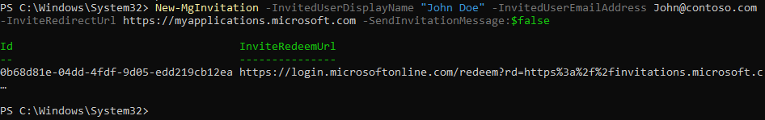
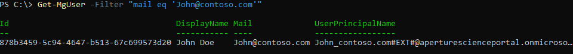

# Quickstart: Add a guest user with PowerShell

There are many ways you can invite external partners to your apps and services with Azure Active Directory B2B collaboration. In the previous quickstart, you saw how to add guest users directly in the Azure Active Directory admin portal. You can also use PowerShell to add guest users, either one at a time or in bulk. In this quickstart, you’ll use the New-MgInvitation command to add one guest user to your Azure tenant.

If you don’t have an Azure subscription, create a [free account](https://azure.microsoft.com/free/?WT.mc_id=A261C142F) before you begin.

## Prerequisites

### PowerShell Module
Install the [Microsoft Graph Identity Sign-ins module](/powershell/module/microsoft.graph.identity.signins/?view=graph-powershell-beta&preserve-view=true) (Microsoft.Graph.Identity.SignIns) and the [Microsoft Graph Users module](/powershell/module/microsoft.graph.users/?view=graph-powershell-beta&preserve-view=true) (Microsoft.Graph.Users).

### Get a test email account

You need a test email account that you can send the invitation to. The account must be from outside your organization. You can use any type of account, including a social account such as a gmail.com or outlook.com address.

## Sign in to your tenant

Run the following command to connect to the tenant domain:

```powershell
Connect-MgGraph -Scopes user.readwrite.all
```

When prompted, enter your credentials.

## Send an invitation

1. To send an invitation to your test email account, run the following PowerShell command (replace **"John Doe"** and **john\@contoso.com** with your test email account name and email address):

   ```powershell
   New-MgInvitation -InvitedUserDisplayName "John Doe" -InvitedUserEmailAddress John@contoso.com -InviteRedirectUrl "https://myapplications.microsoft.com" -SendInvitationMessage:$true
   ```
1. The command sends an invitation to the email address specified. Check the output, which should look similar to the following example:

   

## Verify the user exists in the directory

1. To verify that the invited user was added to Azure AD, run the following command (replace **john\@contoso.com** with your invited email):
 
   ```powershell
   Get-MgUser -Filter "Mail eq 'John@contoso.com'"
   ```
1. Check the output to make sure the user you invited is listed, with a user principal name (UPN) in the format *emailaddress*#EXT#\@*domain*. For example, *john_contoso.com#EXT#\@fabrikam.onmicrosoft.com*, where fabrikam.onmicrosoft.com is the organization from which you sent the invitations.

   

## Clean up resources

When no longer needed, you can delete the test user account in the directory. Run the following command to delete a user account:

```powershell
 Remove-AzureADUser -ObjectId "<UPN>"
```
For example: `Remove-AzureADUser -UserId john_contoso.com#EXT#@fabrikam.onmicrosoft.com`


## Next steps
In this quickstart, you invited and added a single guest user to your directory using PowerShell. Next, learn how to invite guest users in bulk using PowerShell.

> [!div class="nextstepaction"]
> [Tutorial: Bulk invite Azure AD B2B collaboration users](tutorial-bulk-invite.md)
