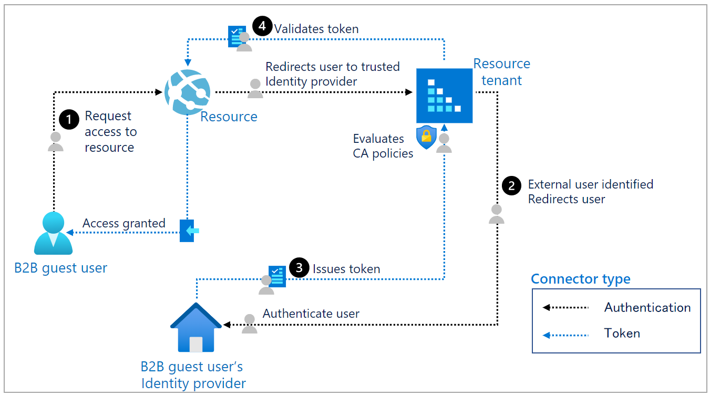

# Conditional Access for B2B collaboration users

This article describes how organizations can scope Conditional Access (CA) policies for B2B guest users to access their resources.
>[!NOTE]
>This authentication or authorization flow is a bit different for guest users than for the existing users of that Identity provider (IdP).

## Authentication flow for B2B guest users from an external directory

The following diagram illustrates the flow:


| Step | Description |
|--------------|-----------------------|
| 1. | The B2B guest user requests access to a resource. The resource redirects the user to its resource tenant,  a trusted IdP.|
| 2. | The resource tenant identifies the user as external and redirects the user to the B2B guest user’s IdP. The user performs primary authentication in the IdP.
| 3. | The B2B guest user’s IdP issues a token to the user. The user is redirected back to the resource tenant with the token. The resource tenant validates the token and then evaluates the user against its CA policies. For example, the resource tenant could require the user to perform Azure Active Directory (AD) Multi-Factor Authentication.
| 4. | Once all resource tenant CA policies are satisfied, the resource tenant issues its own token and redirects the user to its resource.

## Authentication flow for B2B guest users with one time passcode

The following diagram illustrates the flow:


| Step | Description |
|--------------|-----------------------|
| 1. |The user requests access to a resource in another tenant. The resource redirects the user to its resource tenant, a trusted IdP.|
| 2. | The resource tenant identifies the user as an [external email one-time passcode (OTP) user](./one-time-passcode.md) and sends an email with the OTP to the user.|
| 3. | The user retrieves the OTP and submits the code. The resource tenant evaluates the user against its CA policies.
| 4. | Once all CA policies are satisfied, the resource tenant issues a token and redirects the user to its resource. |

>[!NOTE]
>If the user is from an external resource tenant, it is not possible for the B2B guest user’s IdP CA policies to also be evaluated. As of today, only the resource tenant’s CA policies apply to its guests.

## Azure AD Multi-Factor Authentication for B2B users

Organizations can enforce multiple Azure AD Multi-Factor Authentication policies for their B2B guest users. These policies can be enforced at the tenant, app, or individual user level in the same way that they're enabled for full-time employees and members of the organization.
The resource tenant is always responsible for Azure AD Multi-Factor Authentication for users, even if the guest user’s organization has Multi-Factor Authentication capabilities. Here's an example-

1. An admin or information worker in a company named Fabrikam invites user from another company named Contoso to use their application Woodgrove.

2. The Woodgrove app in Fabrikam is configured to require Azure AD Multi-Factor Authentication on access.

3. When the B2B guest user from Contoso attempts to access Woodgrove in the Fabrikam tenant, they're asked to complete the Azure AD Multi-Factor Authentication challenge.

4. The guest user can then set up their Azure AD Multi-Factor Authentication with Fabrikam and select the options.

5. This scenario works for any identity – Azure AD or Personal Microsoft Account (MSA). For example, if user in Contoso authenticates using social ID.

6. Fabrikam must have sufficient premium Azure AD licenses that support Azure AD Multi-Factor Authentication. The user from Contoso then consumes this license from Fabrikam. See [billing model for Azure AD external identities](./external-identities-pricing.md) for information on the B2B licensing.

>[!NOTE]
>Azure AD Multi-Factor Authentication is done at resource tenancy to ensure predictability. When the guest user signs in, they'll see the resource tenant sign-in page displayed in the background, and their own home tenant sign-in page and company logo in the foreground.

### Set up Azure AD Multi-Factor Authentication for B2B users

To set up Azure AD Multi-Factor Authentication for B2B collaboration users, watch this video:

>[!VIDEO https://channel9.msdn.com/Blogs/Azure/b2b-conditional-access-setup/Player]

### B2B users Azure AD Multi-Factor Authentication for offer redemption

To learn more about the Azure AD Multi-Factor Authentication redemption experience, watch this video:

>[!VIDEO https://channel9.msdn.com/Blogs/Azure/MFA-redemption/Player]

### Azure AD Multi-Factor Authentication reset for B2B users

Now, the following PowerShell cmdlets are available to proof up B2B guest users:

1. Connect to Azure AD

   ```
   $cred = Get-Credential
   Connect-MsolService -Credential $cred
   ```
2. Get all users with proof up methods

   ```
   Get-MsolUser | where { $_.StrongAuthenticationMethods} | select UserPrincipalName, @{n="Methods";e={($_.StrongAuthenticationMethods).MethodType}}
   ```
   Here is an example:

   ```
   Get-MsolUser | where { $_.StrongAuthenticationMethods} | select UserPrincipalName, @{n="Methods";e={($_.StrongAuthenticationMethods).MethodType}}
   ```

3. Reset the Azure AD Multi-Factor Authentication method for a specific user to require the B2B collaboration user to set proof-up methods again. 
   Here is an example:

   ```
   Reset-MsolStrongAuthenticationMethodByUpn -UserPrincipalName gsamoogle_gmail.com#EXT#@ WoodGroveAzureAD.onmicrosoft.com
   ```

## Conditional Access for B2B users

There are various factors that influence CA policies for B2B guest users.

### Device-based Conditional Access

In CA, there's an option to require a user’s [device to be Compliant or Hybrid Azure AD joined](../conditional-access/concept-conditional-access-conditions.md#device-state-preview). B2B guest users can only satisfy compliance if the resource tenant can manage their device. Devices cannot be managed by more than one organization at a time. B2B guest users can't satisfy the Hybrid Azure AD join because they don't have an on-premises AD account. Only if the guest user’s device is unmanaged, they can register or enroll their device in the resource tenant and then make the device compliant. The user can then satisfy the grant control.

>[!Note]
>It is not recommended to require a managed device for external users.

### Mobile application management policies

The CA grant controls such as **Require approved client apps** and **Require app protection policies** need the device to be registered in the tenant. These controls can only be applied to [iOS and Android devices](../conditional-access/concept-conditional-access-conditions.md#device-platforms). However, neither of these controls can be applied to B2B guest users if the user’s device is already being managed by another organization. A mobile device cannot be registered in more than one tenant at a time. If the mobile device is managed by another organization, the user will be blocked. Only if the guest user’s device is unmanaged, they can register their device in the resource tenant. The user can then satisfy the grant control.  

>[!NOTE]
>It is not recommended to require an app protection policy for external users.

### Location-based Conditional Access

The [location-based policy](../conditional-access/concept-conditional-access-conditions.md#locations) based on IP ranges can be  enforced if the inviting organization can create a trusted IP address range that defines their partner organizations.

Policies can also be enforced based on **geographical locations**.

### Risk-based Conditional Access

The [Sign-in risk policy](../conditional-access/concept-conditional-access-conditions.md#sign-in-risk) is enforced if the B2B guest user satisfies the grant control. For example, an organization could require Azure AD Multi-Factor Authentication for medium or high sign-in risk. However, if a user hasn't previously registered for Azure AD Multi-Factor Authentication in the resource tenant, the user will be blocked. This is done to prevent malicious users from registering their own Azure AD Multi-Factor Authentication credentials in the event they compromise a legitimate user’s password.

The [User-risk policy](../conditional-access/concept-conditional-access-conditions.md#user-risk) however cannot be resolved in the resource tenant. For example, if you require a password change for high-risk guest users, they'll be blocked because of the inability to reset passwords in the resource directory.

### Conditional Access client apps condition

[Client apps conditions](../conditional-access/concept-conditional-access-conditions.md#client-apps) behave the same for B2B guest users as they do for any other type of user. For example, you could prevent guest users from using legacy authentication protocols.

### Conditional Access session controls

[Session controls](../conditional-access/concept-conditional-access-session.md) behave the same for B2B guest users as they do for any other type of user.

## Next steps

For more information, see the following articles on Azure AD B2B collaboration:

- [What is Azure AD B2B collaboration?](./what-is-b2b.md)
- [Identity Protection and B2B users](../identity-protection/concept-identity-protection-b2b.md)
- [External Identities pricing](https://azure.microsoft.com/pricing/details/active-directory/)
- [Frequently Asked Questions (FAQs)](./faq.md)
