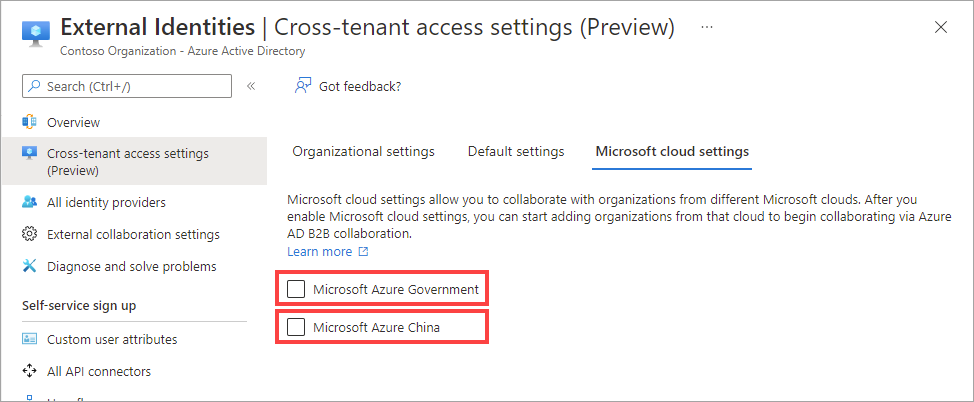
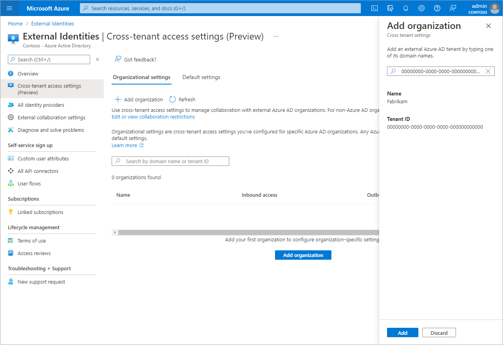
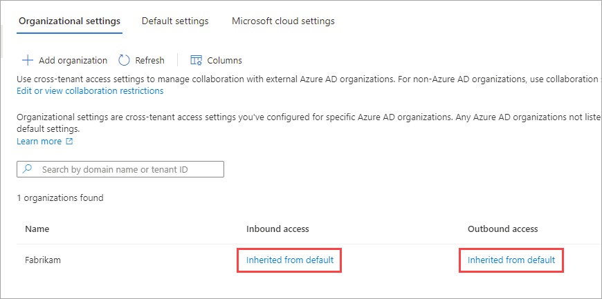

# Configure Microsoft cloud settings for B2B collaboration

When Microsoft Entra organizations in separate Microsoft Azure clouds need to collaborate, they can use Microsoft cloud settings to enable Microsoft Entra B2B collaboration. B2B collaboration is available between the following global and sovereign Microsoft Azure clouds:

- Microsoft Azure commercial cloud and Microsoft Azure Government
- Microsoft Azure commercial cloud and Microsoft Azure operated by 21Vianet

To set up B2B collaboration between partner organizations in different Microsoft Azure clouds, each partner mutually agrees to configure B2B collaboration with each other. In each organization, an admin completes the following steps:

1. Configures their Microsoft cloud settings to enable collaboration with the partner's cloud.

1. Uses the partner's tenant ID to find and add the partner to their organizational settings.

1. Configures their inbound and outbound settings for the partner organization. The admin can either apply the default settings or configure specific settings for the partner.

After each organization has completed these steps, Microsoft Entra B2B collaboration between the organizations is enabled.

> [!NOTE]
> B2B direct connect is not supported for collaboration with Microsoft Entra tenants in a different Microsoft cloud.

## Before you begin

- **Obtain the partner's tenant ID.** To enable B2B collaboration with a partner's Microsoft Entra organization in another Microsoft Azure cloud, you'll need the partner's tenant ID. Using an organization's domain name for lookup isn't available in cross-cloud scenarios.
- **Decide on inbound and outbound access settings for the partner.** Selecting a cloud in your Microsoft cloud settings doesn't automatically enable B2B collaboration. Once you enable another Microsoft Azure cloud, all B2B collaboration is blocked by default for organizations in that cloud. You'll need to add the tenant you want to collaborate with to your Organizational settings. At that point, your default settings go into effect for that tenant only. You can allow the default settings to remain in effect. Or, you can modify the inbound and outbound settings for the organization.
- **Obtain any required object IDs or app IDs.** If you want to apply access settings to specific users, groups, or applications in the partner organization, you'll need to contact the organization for information before configuring your settings. Obtain their user object IDs, group object IDs, or application IDs (*client app IDs* or *resource app IDs*) so you can target your settings correctly.

> [!NOTE]
> Users from another Microsoft cloud must be invited using their user principal name (UPN). [Email as sign-in](../authentication/howto-authentication-use-email-signin.md#b2b-guest-user-sign-in-with-an-email-address) is not currently supported when collaborating with users from another Microsoft cloud.

## Enable the cloud in your Microsoft cloud settings

[!INCLUDE [portal updates](~/articles/active-directory/includes/portal-update.md)]

In your Microsoft cloud settings, enable the Microsoft Azure cloud you want to collaborate with.

1. Sign in to the [Microsoft Entra admin center](https://entra.microsoft.com) as at least a [Security administrator](../roles/permissions-reference.md#security-administrator).
1. Browse to **Identity** > **External Identities** > **Cross-tenant access settings**, then select **Microsoft cloud settings**.
1. Select the checkboxes next to the external Microsoft Azure clouds you want to enable.

   

> [!NOTE]
> Selecting a cloud doesn't automatically enable B2B collaboration with organizations in that cloud. You'll need to add the organization you want to collaborate with, as described in the next section.

## Add the tenant to your organizational settings

Follow these steps to add the tenant you want to collaborate with to your Organizational settings.

1. Sign in to the [Microsoft Entra admin center](https://entra.microsoft.com) as at least a [Security administrator](../roles/permissions-reference.md#security-administrator).
1. Browse to **Identity** > **External Identities** > **Cross-tenant access settings**, then select **Organizational settings**.
1. Select **Add organization**.
1. On the **Add organization** pane, type the tenant ID for the organization (cross-cloud lookup by domain name isn't currently available).

   

1. Select the organization in the search results, and then select **Add**.
1. The organization appears in the **Organizational settings** list. At this point, all access settings for this organization are inherited from your default settings.

   

1. If you want to change the cross-tenant access settings for this organization, select the **Inherited from default** link under the **Inbound access** or **Outbound access** column. Then follow the detailed steps in these sections:

   - [Modify inbound access settings](cross-tenant-access-settings-b2b-collaboration.md#modify-inbound-access-settings)
   - [Modify outbound access settings](cross-tenant-access-settings-b2b-collaboration.md#modify-outbound-access-settings)

## Sign-in endpoints

After enabling collaboration with an organization from a different Microsoft cloud, cross-cloud Microsoft Entra guest users can now sign in to your multi-tenant or Microsoft first-party apps by using a [common endpoint](redemption-experience.md#redemption-process-and-sign-in-through-a-common-endpoint) (in other words, a general app URL that doesn't include your tenant context). During the sign-in process, the guest user chooses **Sign-in options**, and then selects **Sign in to an organization**. The user then types the name of your organization and continues signing in using their Microsoft Entra credentials.

Cross-cloud Microsoft Entra guest users can also use application endpoints that include your tenant information, for example:

  * `https://myapps.microsoft.com/?tenantid=<your tenant ID>`
  * `https://myapps.microsoft.com/<your verified domain>.onmicrosoft.com`
  * `https://contoso.sharepoint.com/sites/testsite`

You can also give cross-cloud Microsoft Entra guest users a direct link to an application or resource by including your tenant information, for example `https://myapps.microsoft.com/signin/Twitter/<application ID?tenantId=<your tenant ID>`.

## Supported scenarios with cross-cloud Microsoft Entra guest users

The following scenarios are supported when collaborating with an organization from a different Microsoft cloud:

- Use B2B collaboration to invite a user in the partner tenant to access resources in your organization, including web line-of-business apps, SaaS apps, and SharePoint Online sites, documents, and files.
- Use B2B collaboration to [share Power BI content to a user in the partner tenant](/power-bi/enterprise/service-admin-azure-ad-b2b#cross-cloud-b2b).
- Apply Conditional Access policies to the B2B collaboration user and opt to trust multi-factor authentication or device claims (compliant claims and Microsoft Entra hybrid joined claims) from the user’s home tenant.

> [!NOTE]
> Enabling the [SharePoint and OneDrive integration with Microsoft Entra B2B](/sharepoint/sharepoint-azureb2b-integration) will provide the best experience for inviting users from another Microsoft cloud within SharePoint and OneDrive.

## Next steps

See [Configure external collaboration settings](external-collaboration-settings-configure.md) for B2B collaboration with non Microsoft Entra identities, social identities, and non-IT managed external accounts.
