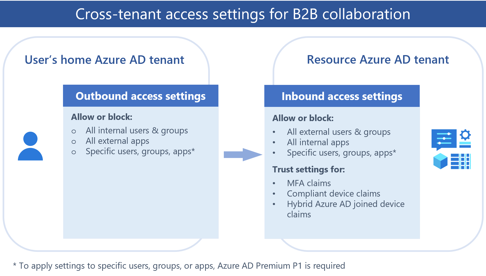

# Overview: Cross-tenant access with Microsoft Entra External ID

Microsoft Entra organizations can use External ID cross-tenant access settings to manage how they collaborate with other Microsoft Entra organizations and other Microsoft Azure clouds through B2B collaboration and [B2B direct connect](cross-tenant-access-settings-b2b-direct-connect.md). [Cross-tenant access settings](cross-tenant-access-settings-b2b-collaboration.md) give you granular control over how external Microsoft Entra organizations collaborate with you (inbound access) and how your users collaborate with external Microsoft Entra organizations (outbound access). These settings also let you trust multi-factor authentication (MFA) and device claims ([compliant claims and Microsoft Entra hybrid joined claims](../conditional-access/howto-conditional-access-policy-compliant-device.md)) from other Microsoft Entra organizations.

This article describes cross-tenant access settings, which are used to manage B2B collaboration and B2B direct connect with external Microsoft Entra organizations, including across Microsoft clouds. More settings are available for B2B collaboration with non-Azure AD identities (for example, social identities or non-IT managed external accounts). These [external collaboration settings](external-collaboration-settings-configure.md) include options for restricting guest user access, specifying who can invite guests, and allowing or blocking domains.

> [!IMPORTANT]
> Microsoft started to move customers using cross-tenant access settings to a new storage model on August 30, 2023. You may notice an entry in your audit logs informing you that your cross-tenant access settings were updated as our automated task migrates your settings. For a brief window while the migration processes, you'll be unable to make changes to your settings. If you're unable to make a change, wait a few moments and try the change again. Once the migration completes, [you'll no longer be capped with 25kb of storage space](./faq.yml#how-many-organizations-can-i-add-in-cross-tenant-access-settings-) and there will be no more limits on the number of partners you can add.
 
## Manage external access with inbound and outbound settings

The external identities cross-tenant access settings manage how you collaborate with other Microsoft Entra organizations. These settings determine both the level of inbound access users in external Microsoft Entra organizations have to your resources, and the level of outbound access your users have to external organizations. 

The following diagram shows the cross-tenant access inbound and outbound settings. The **Resource Microsoft Entra tenant** is the tenant containing the resources to be shared. In the case of B2B collaboration, the resource tenant is the inviting tenant (for example, your corporate tenant, where you want to invite the external users to). The **User's home Microsoft Entra tenant** is the tenant where the external users are managed.



By default, B2B collaboration with other Microsoft Entra organizations is enabled, and B2B direct connect is blocked. But the following comprehensive admin settings let you manage both of these features.

- **Outbound access settings** control whether your users can access resources in an external organization. You can apply these settings to everyone, or specify individual users, groups, and applications.

- **Inbound access settings** control whether users from external Microsoft Entra organizations can access resources in your organization. You can apply these settings to everyone, or specify individual users, groups, and applications.

- **Trust settings** (inbound) determine whether your Conditional Access policies will trust the multi-factor authentication (MFA), compliant device, and [Microsoft Entra hybrid joined device](../devices/concept-hybrid-join.md) claims from an external organization if their users have already satisfied these requirements in their home tenants. For example, when you configure your trust settings to trust MFA, your MFA policies are still applied to external users, but users who have already completed MFA in their home tenants won't have to complete MFA again in your tenant.

## Default settings

The default cross-tenant access settings apply to all Microsoft Entra organizations external to your tenant, except those for which you've configured organizational settings. You can change your default settings, but the initial default settings for B2B collaboration and B2B direct connect are as follows:

- **B2B collaboration**: All your internal users are enabled for B2B collaboration by default. This setting means your users can invite external guests to access your resources and they can be invited to external organizations as guests. MFA and device claims from other Microsoft Entra organizations aren't trusted.

- **B2B direct connect**: No B2B direct connect trust relationships are established by default. Microsoft Entra ID blocks all inbound and outbound B2B direct connect capabilities for all external Microsoft Entra tenants.

- **Organizational settings**: No organizations are added to your Organizational settings by default. This means all external Microsoft Entra organizations are enabled for B2B collaboration with your organization.

- **Cross-tenant sync**: No users from other tenants are synchronized into your tenant with cross-tenant synchronization.

The behaviors described above apply to B2B collaboration with other Microsoft Entra tenants in your same Microsoft Azure cloud. In cross-cloud scenarios, default settings work a little differently. See [Microsoft cloud settings](#microsoft-cloud-settings) later in this article.

## Organizational settings

You can configure organization-specific settings by adding an organization and modifying the inbound and outbound settings for that organization. Organizational settings take precedence over default settings.

- **B2B collaboration**: For B2B collaboration with other Microsoft Entra organizations, use cross-tenant access settings to manage inbound and outbound B2B collaboration and scope access to specific users, groups, and applications. You can set a default configuration that applies to all external organizations, and then create individual, organization-specific settings as needed. Using cross-tenant access settings, you can also trust multi-factor (MFA) and device claims (compliant claims and Microsoft Entra hybrid joined claims) from other Microsoft Entra organizations.

   > [!TIP]
   >We recommend excluding external users from the [Identity Protection MFA registration policy](../identity-protection/howto-identity-protection-configure-mfa-policy.md), if you are going to [trust MFA for external users](authentication-conditional-access.md#mfa-for-azure-ad-external-users). When both policies are present, external users won’t be able to satisfy the requirements for access.

- **B2B direct connect**: For B2B direct connect, use organizational settings to set up a mutual trust relationship with another Microsoft Entra organization. Both your organization and the external organization need to mutually enable B2B direct connect by configuring inbound and outbound cross-tenant access settings.

- You can use **External collaboration settings** to limit who can invite external users, allow or block B2B specific domains, and set restrictions on guest user access to your directory.

### Automatic redemption setting

[!INCLUDE [automatic-redemption-include](../includes/automatic-redemption-include.md)]

To configure this setting using Microsoft Graph, see the [Update crossTenantAccessPolicyConfigurationPartner](/graph/api/crosstenantaccesspolicyconfigurationpartner-update) API. For information about building your own onboarding experience, see [B2B collaboration invitation manager](external-identities-overview.md#azure-ad-microsoft-graph-api-for-b2b-collaboration).

For more information, see [Configure cross-tenant synchronization](../multi-tenant-organizations/cross-tenant-synchronization-configure.md), [Configure cross-tenant access settings for B2B collaboration](cross-tenant-access-settings-b2b-collaboration.md), and [Configure cross-tenant access settings for B2B direct connect](cross-tenant-access-settings-b2b-direct-connect.md).

### Cross-tenant synchronization setting

[!INCLUDE [cross-tenant-synchronization-include](../includes/cross-tenant-synchronization-include.md)]

To configure this setting using Microsoft Graph, see the [Update crossTenantIdentitySyncPolicyPartner](/graph/api/crosstenantidentitysyncpolicypartner-update) API. For more information, see [Configure cross-tenant synchronization](../multi-tenant-organizations/cross-tenant-synchronization-configure.md).

## Tenant restrictions

With **Tenant Restrictions** settings, you can control the types of external accounts your users can use on the devices you manage, including:

- Accounts your users have created in unknown tenants.
- Accounts that external organizations have given to your users so they can access that organization's resources.  

We recommend configuring your tenant restrictions to disallow these types of external accounts and use B2B collaboration instead. B2B collaboration gives you the ability to:

- Use Conditional Access and force multi-factor authentication for B2B collaboration users.
- Manage inbound and outbound access.
- Terminate sessions and credentials when a B2B collaboration user's employment status changes or their credentials are breached.
- Use sign-in logs to view details about the B2B collaboration user.

Tenant restrictions are independent of other cross-tenant access settings, so any inbound, outbound, or trust settings you've configured won't impact tenant restrictions. For details about configuring tenant restrictions, see [Set up tenant restrictions V2](tenant-restrictions-v2.md).

## Microsoft cloud settings

Microsoft cloud settings let you collaborate with organizations from different Microsoft Azure clouds. With Microsoft cloud settings, you can establish mutual B2B collaboration between the following clouds:

- Microsoft Azure commercial cloud and Microsoft Azure Government
- Microsoft Azure commercial cloud and Microsoft Microsoft Azure operated by 21Vianet (operated by 21Vianet)

> [!NOTE]
> Microsoft Azure Government includes the Office GCC-High and DoD clouds.

To set up B2B collaboration, both organizations configure their Microsoft cloud settings to enable the partner's cloud. Then each organization uses the partner's tenant ID to find and add the partner to their organizational settings. From there, each organization can allow their default cross-tenant access settings apply to the partner, or they can configure partner-specific inbound and outbound settings. After you establish B2B collaboration with a partner in another cloud, you'll be able to:

- Use B2B collaboration to invite a user in the partner tenant to access resources in your organization, including web line-of-business apps, SaaS apps, and SharePoint Online sites, documents, and files.
- Use B2B collaboration to [share Power BI content to a user in the partner tenant](/power-bi/enterprise/service-admin-azure-ad-b2b#cross-cloud-b2b).
- Apply Conditional Access policies to the B2B collaboration user and opt to trust multi-factor authentication or device claims (compliant claims and Microsoft Entra hybrid joined claims) from the user’s home tenant.

> [!NOTE]
> B2B direct connect is not supported for collaboration with Microsoft Entra tenants in a different Microsoft cloud.

For configuration steps, see [Configure Microsoft cloud settings for B2B collaboration](cross-cloud-settings.md).

### Default settings in cross-cloud scenarios

To collaborate with a partner tenant in a different Microsoft Azure cloud, both organizations need to mutually enable B2B collaboration with each other. The first step is to enable the partner's cloud in your cross-tenant settings. When you first enable another cloud, B2B collaboration is blocked for all tenants in that cloud. You need to add the tenant you want to collaborate with to your Organizational settings, and at that point your default settings go into effect for that tenant only. You can allow the default settings to remain in effect, or you can modify the organizational settings for the tenant.

## Important considerations

> [!IMPORTANT]
> Changing the default inbound or outbound settings to block access could block existing business-critical access to apps in your organization or partner organizations. Be sure to use the tools described in this article and consult with your business stakeholders to identify the required access.

- To configure cross-tenant access settings in the Azure portal, you'll need an account with a Global administrator, Security administrator, or a [custom role](#custom-roles-for-managing-cross-tenant-access-settings) you've defined.

- To configure trust settings or apply access settings to specific users, groups, or applications, you'll need a Microsoft Entra ID P1 license. The license is required on the tenant that you configure. For B2B direct connect, where mutual trust relationship with another Microsoft Entra organization is required, you'll need a Microsoft Entra ID P1 license in both tenants. 

- Cross-tenant access settings are used to manage B2B collaboration and B2B direct connect with other Microsoft Entra organizations. For B2B collaboration with non-Azure AD identities (for example, social identities or non-IT managed external accounts), use [external collaboration settings](external-collaboration-settings-configure.md). External collaboration settings include B2B collaboration options for restricting guest user access, specifying who can invite guests, and allowing or blocking domains.

- If you want to apply access settings to specific users, groups, or applications in an external organization, you'll need to contact the organization for information before configuring your settings. Obtain their user object IDs, group object IDs, or application IDs (*client app IDs* or *resource app IDs*) so you can target your settings correctly.

  > [!TIP]
  > You might be able to find the application IDs for apps in external organizations by checking your sign-in logs. See the [Identify inbound and outbound sign-ins](#identify-inbound-and-outbound-sign-ins) section.

- The access settings you configure for users and groups must match the access settings for applications. Conflicting settings aren't allowed, and you’ll see warning messages if you try to configure them.

  - **Example 1**: If you block inbound access for all external users and groups, access to all your applications must also be blocked.

  - **Example 2**: If you allow outbound access for all your users (or specific users or groups), you’ll be prevented from blocking all access to external applications; access to at least one application must be allowed.

- If you want to allow B2B direct connect with an external organization and your Conditional Access policies require MFA, you must configure your trust settings so that your Conditional Access policies will accept MFA claims from the external organization.

- If you block access to all apps by default, users will be unable to read emails encrypted with Microsoft Rights Management Service (also known as Office 365 Message Encryption or OME). To avoid this issue, we recommend configuring your outbound settings to allow your users to access this app ID: 00000012-0000-0000-c000-000000000000. If this is the only application you allow, access to all other apps will be blocked by default.

## Custom roles for managing cross-tenant access settings

Cross-tenant access settings can be managed with custom roles defined by your organization. This enables you to [define your own finely-scoped roles](../roles/custom-create.md) to manage cross-tenant access settings instead of using one of the built-in roles for management.
Your organization can define custom roles to manage cross-tenant access settings. This allows you to create [your own finely-scoped roles](../roles/custom-create.md) to manage cross-tenant access settings instead of using built-in roles for management.
### Recommended custom roles

#### Cross-tenant access administrator

This role can manage everything in cross-tenant access settings, including default and organizational based settings. This role should be assigned to users who need to manage all settings in cross-tenant access settings.

Please find the list of recommended actions for this role below.

| Actions |
| ------- |
| microsoft.directory.tenantRelationships/standard/read |
| microsoft.directory/crossTenantAccessPolicy/standard/read |
| microsoft.directory/crossTenantAccessPolicy/allowedCloudEndpoints/update |
| microsoft.directory/crossTenantAccessPolicy/basic/update |
| microsoft.directory/crossTenantAccessPolicy/default/b2bCollaboration/update |
| microsoft.directory/crossTenantAccessPolicy/default/b2bDirectConnect/update |
| microsoft.directory/crossTenantAccessPolicy/default/crossCloudMeetings/update |
| microsoft.directory/crossTenantAccessPolicy/default/standard/read |
| microsoft.directory/crossTenantAccessPolicy/default/tenantRestrictions/update |
| microsoft.directory/crossTenantAccessPolicy/partners/b2bCollaboration/update |
| microsoft.directory/crossTenantAccessPolicy/partners/b2bDirectConnect/update |
| microsoft.directory/crossTenantAccessPolicy/partners/create |
| microsoft.directory/crossTenantAccessPolicy/partners/crossCloudMeetings/update |
| microsoft.directory/crossTenantAccessPolicy/partners/delete |
| microsoft.directory/crossTenantAccessPolicy/partners/identitySynchronization/basic/update |
| microsoft.directory/crossTenantAccessPolicy/partners/identitySynchronization/create |
| microsoft.directory/crossTenantAccessPolicy/partners/identitySynchronization/standard/read |
| microsoft.directory/crossTenantAccessPolicy/partners/standard/read |
| microsoft.directory/crossTenantAccessPolicy/partners/tenantRestrictions/update |

#### Cross-tenant access reader
This role can read everything in cross-tenant access settings, including default and organizational based settings. This role should be assigned to users who only need to review settings in cross-tenant access settings, but not manage them.

Please find the list of recommended actions for this role below.

| Actions |
| ------- |
| microsoft.directory.tenantRelationships/standard/read |
| microsoft.directory/crossTenantAccessPolicy/standard/read |
| microsoft.directory/crossTenantAccessPolicy/default/standard/read |
| microsoft.directory/crossTenantAccessPolicy/partners/identitySynchronization/standard/read |
| microsoft.directory/crossTenantAccessPolicy/partners/standard/read |

#### Cross-tenant access partner administrator
This role can manage everything relating to partners and read the default settings. This role should be assigned to users who need to manage organizational based settings but not be able to change default settings.

Please find the list of recommended actions for this role below.

| Actions |
| ------- |
| microsoft.directory.tenantRelationships/standard/read |
| microsoft.directory/crossTenantAccessPolicy/standard/read |
| microsoft.directory/crossTenantAccessPolicy/basic/update |
| microsoft.directory/crossTenantAccessPolicy/default/standard/read |
| microsoft.directory/crossTenantAccessPolicy/partners/b2bCollaboration/update |
| microsoft.directory/crossTenantAccessPolicy/partners/b2bDirectConnect/update |
| microsoft.directory/crossTenantAccessPolicy/partners/create |
| microsoft.directory/crossTenantAccessPolicy/partners/crossCloudMeetings/update |
| microsoft.directory/crossTenantAccessPolicy/partners/delete |
| microsoft.directory/crossTenantAccessPolicy/partners/identitySynchronization/basic/update |
| microsoft.directory/crossTenantAccessPolicy/partners/identitySynchronization/create |
| microsoft.directory/crossTenantAccessPolicy/partners/identitySynchronization/standard/read |
| microsoft.directory/crossTenantAccessPolicy/partners/standard/read |
| microsoft.directory/crossTenantAccessPolicy/partners/tenantRestrictions/update |

## Protect cross-tenant access administrative actions
Any actions that modify cross-tenant access settings are considered protected actions and can be additionally protected with Conditional Access policies. For more information and configuration steps see [protected actions](../roles/protected-actions-overview.md).

## Identify inbound and outbound sign-ins

Several tools are available to help you identify the access your users and partners need before you set inbound and outbound access settings. To ensure you don’t remove access that your users and partners need, you should examine current sign-in behavior. Taking this preliminary step will help prevent loss of desired access for your end users and partner users. However, in some cases these logs are only retained for 30 days, so we strongly recommend you speak with your business stakeholders to ensure required access isn't lost.

### Cross-tenant sign-in activity PowerShell script

To review user sign-in activity associated with external tenants, use the [cross-tenant user sign-in activity](https://aka.ms/cross-tenant-signins-ps) PowerShell script. For example, to view all available sign-in events for inbound activity (external users accessing resources in the local tenant) and outbound activity (local users accessing resources in an external tenant), run the following command:

```powershell
Get-MSIDCrossTenantAccessActivity -SummaryStats -ResolveTenantId
```

The output is a summary of all available sign-in events for inbound and outbound activity, listed by external tenant ID and external tenant name.

### Sign-in logs PowerShell script

To determine your users' access to external Microsoft Entra organizations, use the [Get-MgAuditLogSignIn](/powershell/module/microsoft.graph.reports/get-mgauditlogsignin) cmdlet in the Microsoft Graph PowerShell SDK to view data from your sign-in logs for the last 30 days. For example, run the following command:

```powershell
#Initial connection
Connect-MgGraph -Scopes "AuditLog.Read.All"
Select-MgProfile -Name "beta"

#Get external access
$TenantId = "<replace-with-your-tenant-ID>"

Get-MgAuditLogSignIn -Filter "ResourceTenantId ne '$TenantID'" -All:$True |
Group-Object ResourceTenantId,AppDisplayName,UserPrincipalName |
Select-Object count,@{n='Ext TenantID/App User Pair';e={$_.name}}
```

The output is a list of outbound sign-ins initiated by your users to apps in external tenants.

### Azure Monitor

If your organization subscribes to the Azure Monitor service, use the [Cross-tenant access activity workbook](../reports-monitoring/workbook-cross-tenant-access-activity.md) (available in the Monitoring workbooks gallery in the Azure portal) to visually explore inbound and outbound sign-ins for longer time periods.

### Security Information and Event Management (SIEM) Systems

If your organization exports sign-in logs to a Security Information and Event Management (SIEM) system, you can retrieve the required information from your SIEM system.

## Identify changes to cross-tenant access settings

The Microsoft Entra audit logs capture all activity around cross-tenant access setting changes and activity. To audit changes to your cross-tenant access settings, use the **category** of ***CrossTenantAccessSettings*** to filter all activity to show changes to cross-tenant access settings.

:::image type="content" source="media/cross-tenant-access-overview/cross-tenant-access-settings-audit-logs.png" alt-text="Screenshot of the audit logs for cross-tenant access settings." lightbox="media/cross-tenant-access-overview/cross-tenant-access-settings-audit-logs.png":::

## Next steps

[Configure cross-tenant access settings for B2B collaboration](cross-tenant-access-settings-b2b-collaboration.md)
[Configure cross-tenant access settings for B2B direct connect](cross-tenant-access-settings-b2b-direct-connect.md)
