# Configure cross-tenant access settings for B2B collaboration

Use External Identities cross-tenant access settings to manage how you collaborate with other Azure AD organizations through B2B collaboration. These settings determine both the level of *inbound* access users in external Azure AD organizations have to your resources, and the level of *outbound* access your users have to external organizations. They also let you trust multi-factor authentication (MFA) and device claims ([compliant claims and hybrid Azure AD joined claims](../conditional-access/howto-conditional-access-policy-compliant-device.md)) from other Azure AD organizations. For details and planning considerations, see [Cross-tenant access in Azure AD External Identities](cross-tenant-access-overview.md).

## Before you begin

  > [!CAUTION]
  > Changing the default inbound or outbound settings to **Block access** could block existing business-critical access to apps in your organization or partner organizations. Be sure to use the tools described in [Cross-tenant access in Azure AD External Identities](cross-tenant-access-overview.md) and consult with your business stakeholders to identify the required access.

- Review the [Important considerations](cross-tenant-access-overview.md#important-considerations) section in the [cross-tenant access overview](cross-tenant-access-overview.md) before configuring your cross-tenant access settings.
- Use the tools and follow the recommendations in [Identify inbound and outbound sign-ins](cross-tenant-access-overview.md#identify-inbound-and-outbound-sign-ins) to understand which external Azure AD organizations and resources users are currently accessing.
- Decide on the default level of access you want to apply to all external Azure AD organizations.
- Identify any Azure AD organizations that will need customized settings so you can configure **Organizational settings** for them.
- If you want to apply access settings to specific users, groups, or applications in an external organization, you'll need to contact the organization for information before configuring your settings. Obtain their user object IDs, group object IDs, or application IDs (*client app IDs* or *resource app IDs*) so you can target your settings correctly.
- If you want to set up B2B collaboration with a partner organization in an external Microsoft Azure cloud, follow the steps in [Configure Microsoft cloud settings](cross-cloud-settings.md). An admin in the partner organization will need to do the same for your tenant.
- Both allow/block list and cross-tenant access settings are checked at the time of invitation. If a user's domain is on the allow list, they can be invited, unless the domain is explicitly blocked in the cross-tenant access settings. If a user's domain is on the deny list, they can't be invited regardless of the cross-tenant access settings. If a user is not on either list, we check the cross-tenant access settings to determine whether they can be invited. 

## Configure default settings

[!INCLUDE [portal updates](~/articles/active-directory/includes/portal-update.md)]

 Default cross-tenant access settings apply to all external tenants for which you haven't created organization-specific customized settings.  If you want to modify the Azure AD-provided default settings, follow these steps.

1. Sign in to the [Azure portal](https://portal.azure.com) using a Global administrator or Security administrator account. Then open the **Azure Active Directory** service.
1. Select **External Identities**, and then select **Cross-tenant access settings**.
1. Select the **Default settings** tab and review the summary page.

   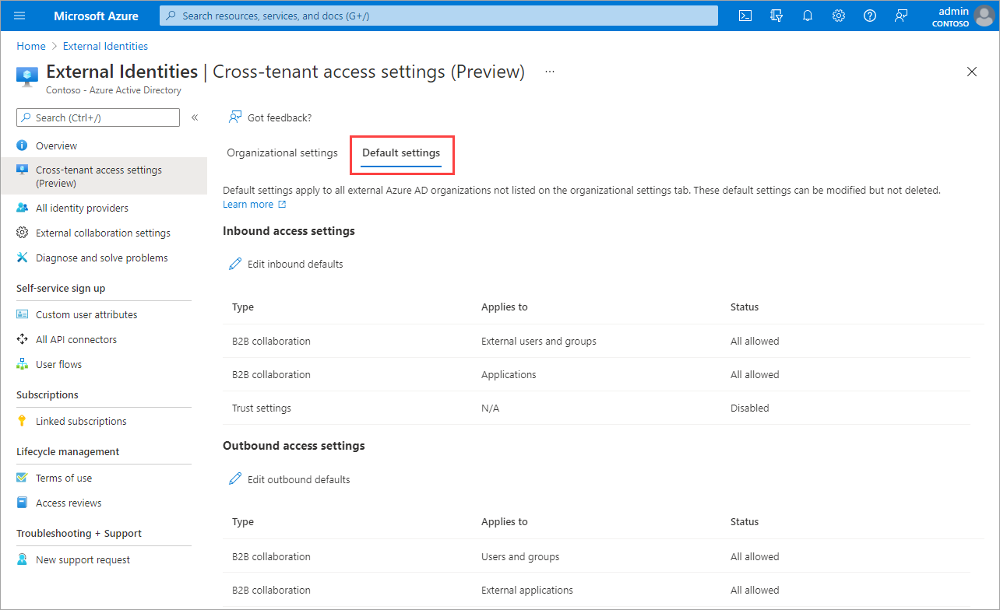

1. To change the settings, select the **Edit inbound defaults** link or the **Edit outbound defaults** link.

      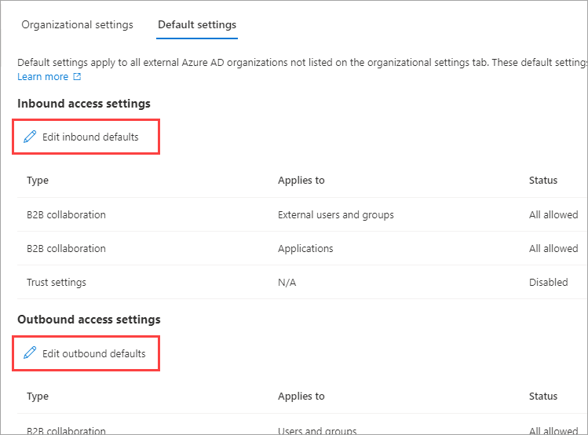

1. Modify the default settings by following the detailed steps in these sections:

   - [Modify inbound access settings](#modify-inbound-access-settings)
   - [Modify outbound access settings](#modify-outbound-access-settings)

## Add an organization

Follow these steps to configure customized settings for specific organizations.

1. Sign in to the [Azure portal](https://portal.azure.com) using a Global administrator or Security administrator account. Then open the **Azure Active Directory** service.
1. Select **External Identities**, and then select **Cross-tenant access settings**.
1. Select **Organizational settings**.
1. Select **Add organization**.
1. On the **Add organization** pane, type the full domain name (or tenant ID) for the organization.

   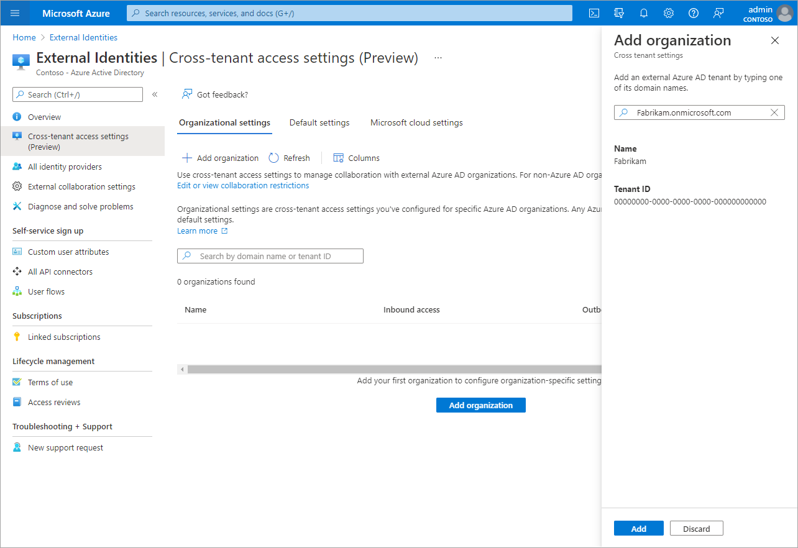

1. Select the organization in the search results, and then select **Add**.
1. The organization appears in the **Organizational settings** list. At this point, all access settings for this organization are inherited from your default settings. To change the settings for this organization, select the **Inherited from default** link under the **Inbound access** or **Outbound access** column.

   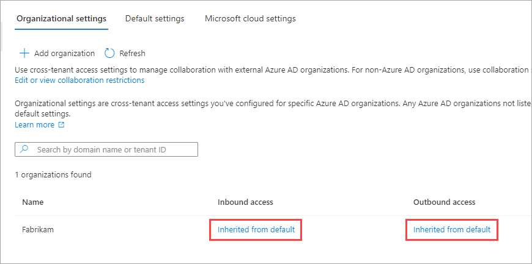

1. Modify the organization's settings by following the detailed steps in these sections:

   - [Modify inbound access settings](#modify-inbound-access-settings)
   - [Modify outbound access settings](#modify-outbound-access-settings)

## Modify inbound access settings

With inbound settings, you select which external users and groups will be able to access the internal applications you choose. Whether you're configuring default settings or organization-specific settings, the steps for changing inbound cross-tenant access settings are the same. As described in this section, you'll navigate to either the **Default** tab or an organization on the **Organizational settings** tab, and then make your changes.

1. Sign in to the [Azure portal](https://portal.azure.com) using a Global administrator or Security administrator account. Then open the **Azure Active Directory** service.

1. Select **External Identities** > **Cross-tenant access settings**.

1. Navigate to the settings you want to modify:
   - **Default settings**: To modify default inbound settings, select the **Default settings** tab, and then under **Inbound access settings**, select **Edit inbound defaults**.
   - **Organizational settings**: To modify settings for a specific organization, select the **Organizational settings** tab, find the organization in the list (or [add one](#add-an-organization)), and then select the link in the **Inbound access** column.

1. Follow the detailed steps for the inbound settings you want to change:

   - [To change inbound B2B collaboration settings](#to-change-inbound-b2b-collaboration-settings)
   - [To change inbound trust settings for accepting MFA and device claims](#to-change-inbound-trust-settings-for-mfa-and-device-claims)

### To change inbound B2B collaboration settings

1. Sign in to the [Azure portal](https://portal.azure.com) using a Global administrator or Security administrator account. Then open the **Azure Active Directory** service.

1. Select **External Identities** > **Cross-tenant access settings**.

1. Under **Organizational settings** select the link in the **Inbound access** column and the **B2B collaboration** tab.

1. If you're configuring inbound access settings for a specific organization, select one of the following:

   - **Default settings**: Select this option if you want the organization to use the default inbound settings (as configured on the **Default** settings tab). If customized settings were already configured for this organization, you'll need to select **Yes** to confirm that you want all settings to be replaced by the default settings. Then select **Save**, and skip the rest of the steps in this procedure.

   - **Customize settings**: Select this option if you want to customize the settings for this organization, which will be enforced for this organization instead of the default settings. Continue with the rest of the steps in this procedure.

1. Select **External users and groups**.

1. Under **Access status**, select one of the following:

   - **Allow access**: Allows the users and groups specified under **Applies to** to be invited for B2B collaboration.
   - **Block access**: Blocks the users and groups specified under **Applies to** from being invited to B2B collaboration.

   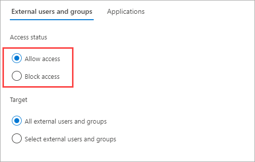

1. Under **Applies to**, select one of the following:

   - **All external users and groups**: Applies the action you chose under **Access status** to all users and groups from external Azure AD organizations.
   - **Select external users and groups** (requires an Azure AD premium subscription): Lets you apply the action you chose under **Access status** to specific users and groups within the external organization.

   > [!NOTE]
   > If you block access for all external users and groups, you also need to block access to all your internal applications (on the **Applications** tab).

   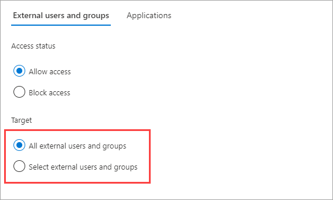

1. If you chose **Select external users and groups**, do the following for each user or group you want to add:

    - Select **Add external users and groups**.
    - In the **Add other users and groups** pane, in the search box, type the user object ID or group object ID you obtained from your partner organization.
    - In the menu next to the search box, choose either **user** or **group**.
    - Select **Add**.

   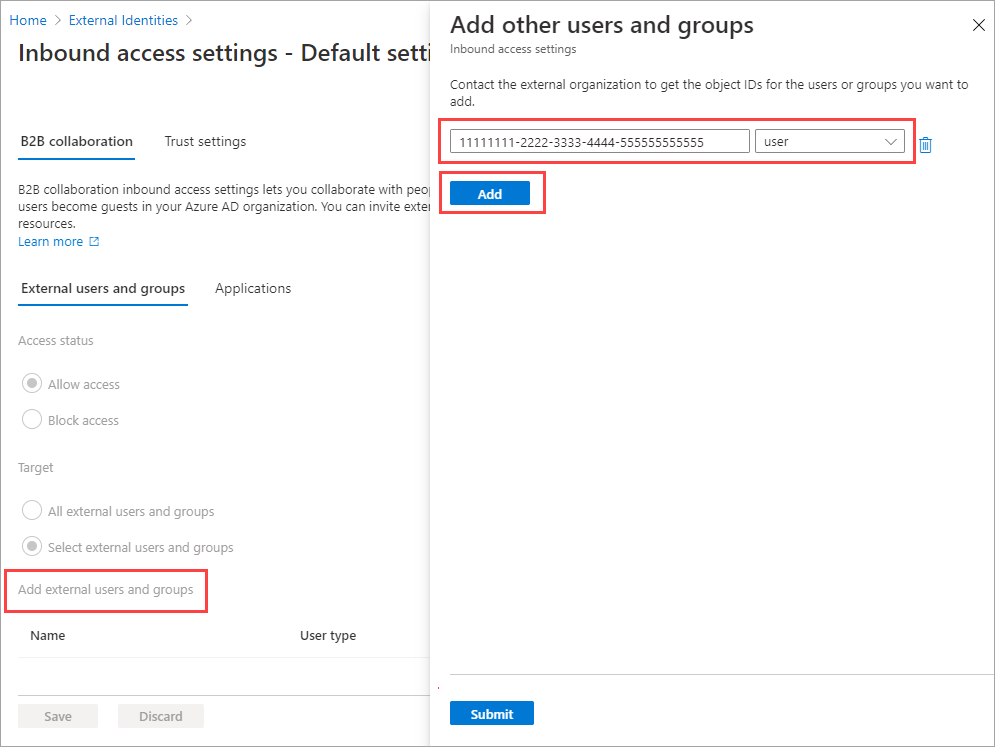

1. When you're done adding users and groups, select **Submit**.

   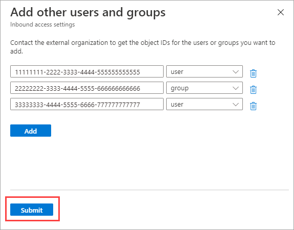

1. Select the **Applications** tab.

1. Under **Access status**, select one of the following:

   - **Allow access**: Allows the applications specified under **Applies to** to be accessed by B2B collaboration users.
   - **Block access**: Blocks the applications specified under **Applies to** from being accessed by B2B collaboration users.

    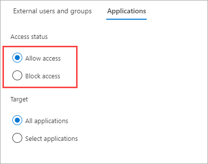

1. Under **Applies to**, select one of the following:

   - **All applications**: Applies the action you chose under **Access status** to all of your applications.
   - **Select applications** (requires an Azure AD premium subscription): Lets you apply the action you chose under **Access status** to specific applications in your organization.

   > [!NOTE]
   > If you block access to all applications, you also need to block access for all external users and groups (on the **External users and groups** tab).

    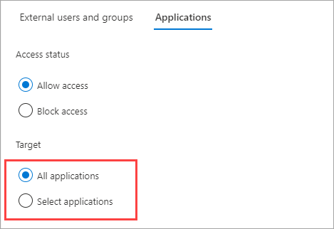

1. If you chose **Select applications**, do the following for each application you want to add:

   - Select **Add Microsoft applications** or **Add other applications**.
   - In the **Select** pane, type the application name or the application ID (either the *client app ID* or the *resource app ID*) in the search box. Then select the application in the search results.  Repeat for each application you want to add.
   - When you're done selecting applications, choose **Select**.

    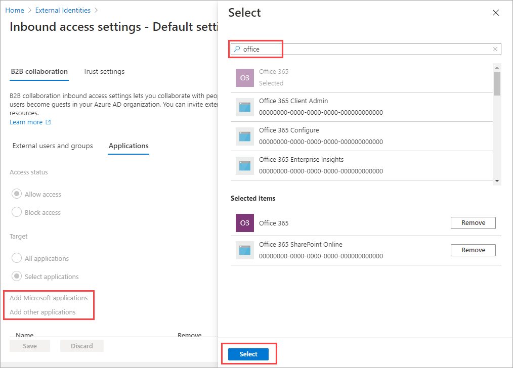

1. Select **Save**.

### To change inbound trust settings for MFA and device claims

1. Select the **Trust settings** tab.

1. (This step applies to **Organizational settings** only.) If you're configuring settings for an organization, select one of the following:

   - **Default settings**: The organization will use the settings configured on the **Default** settings tab. If customized settings were already configured for this organization, you'll need to select **Yes** to confirm that you want all settings to be replaced by the default settings. Then select **Save**, and skip the rest of the steps in this procedure.

   - **Customize settings**: You can customize the settings for this organization, which will be enforced for this organization instead of the default settings. Continue with the rest of the steps in this procedure.

1. Select one or more of the following options:

   - **Trust multi-factor authentication from Azure AD tenants**: Select this checkbox to allow your Conditional Access policies to trust MFA claims from external organizations. During authentication, Azure AD will check a user's credentials for a claim that the user has completed MFA. If not, an MFA challenge will be initiated in the user's home tenant.  

   - **Trust compliant devices**: Allows your Conditional Access policies to trust [compliant device claims](../conditional-access/howto-conditional-access-policy-compliant-device.md) from an external organization when their users access your resources.

   - **Trust hybrid Azure AD joined devices**: Allows your Conditional Access policies to trust hybrid Azure AD joined device claims from an external organization when their users access your resources.

    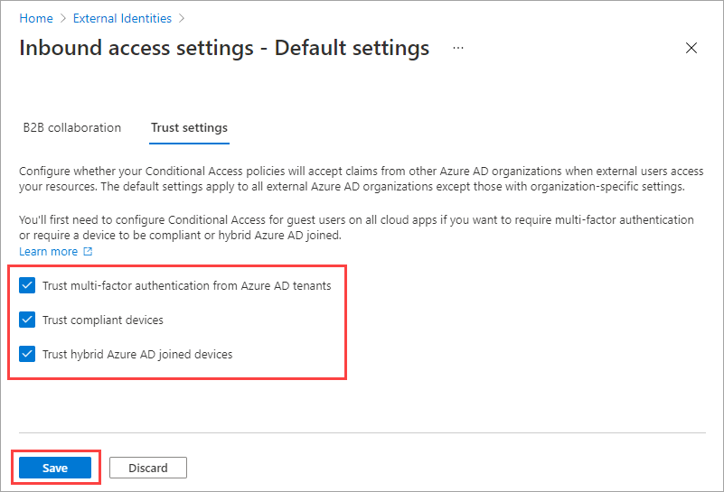

1. (This step applies to **Organizational settings** only.) Review the **Automatic redemption** option:

   - **Automatically redeem invitations with the tenant** &lt;tenant&gt;: Check this setting if you want to automatically redeem invitations. If so, users from the specified tenant won't have to accept the consent prompt the first time they access this tenant using cross-tenant synchronization, B2B collaboration, or B2B direct connect. This setting will only suppress the consent prompt if the specified tenant checks this setting for outbound access as well.

    

1. Select **Save**.

### Allow users to sync into this tenant

If you select **Inbound access** of the added organization, you'll see the **Cross-tenant sync** tab and the **Allow users sync into this tenant** check box. Cross-tenant synchronization is a one-way synchronization service in Azure AD that automates creating, updating, and deleting B2B collaboration users across tenants in an organization. For more information, see [Configure cross-tenant synchronization](../multi-tenant-organizations/cross-tenant-synchronization-configure.md) and the [Multi-tenant organizations documentation](../multi-tenant-organizations/index.yml).

:::image type="content" source="media/cross-tenant-access-settings-b2b-collaboration/cross-tenant-sync-tab.png" alt-text="Screenshot that shows the Cross-tenant sync tab with the Allow users sync into this tenant check box." lightbox="media/cross-tenant-access-settings-b2b-collaboration/cross-tenant-sync-tab.png":::

## Modify outbound access settings

With outbound settings, you select which of your users and groups will be able to access the external applications you choose. Whether you're configuring default settings or organization-specific settings, the steps for changing outbound cross-tenant access settings are the same. As described in this section, you'll navigate to either the **Default** tab or an organization on the **Organizational settings** tab, and then make your changes.

1. Sign in to the [Azure portal](https://portal.azure.com) using a Global administrator or Security administrator account. Then open the **Azure Active Directory** service.

1. Select **External Identities**, and then select **Cross-tenant access settings**.

1. Navigate to the settings you want to modify:

   - To modify default outbound settings, select the **Default settings** tab, and then under **Outbound access settings**, select **Edit outbound defaults**.

   - To modify settings for a specific organization, select the **Organizational settings** tab, find the organization in the list (or [add one](#add-an-organization)) and then select the link in the **Outbound access** column.

1. Select the **B2B collaboration** tab.

1. (This step applies to **Organizational settings** only.) If you're configuring settings for an organization, select one of the following:

   - **Default settings**: The organization will use the settings configured on the **Default** settings tab. If customized settings were already configured for this organization, you'll need to select **Yes** to confirm that you want all settings to be replaced by the default settings. Then select **Save**, and skip the rest of the steps in this procedure.

   - **Customize settings**: You can customize the settings for this organization, which will be enforced for this organization instead of the default settings. Continue with the rest of the steps in this procedure.

1. Select **Users and groups**.

1. Under **Access status**, select one of the following:

   - **Allow access**: Allows your users and groups specified under **Applies to** to be invited to external organizations for B2B collaboration.
   - **Block access**: Blocks your users and groups specified under **Applies to** from being invited to B2B collaboration. If you block access for all users and groups, this will also block all external applications from being accessed via B2B collaboration.

    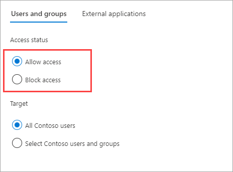

1. Under **Applies to**, select one of the following:

   - **All \<your organization\> users**: Applies the action you chose under **Access status** to all your users and groups.
   - **Select \<your organization\> users and groups** (requires an Azure AD premium subscription): Lets you apply the action you chose under **Access status** to specific users and groups.

   > [!NOTE]
   > If you block access for all of your users and groups, you also need to block access to all external applications (on the **External applications** tab).

   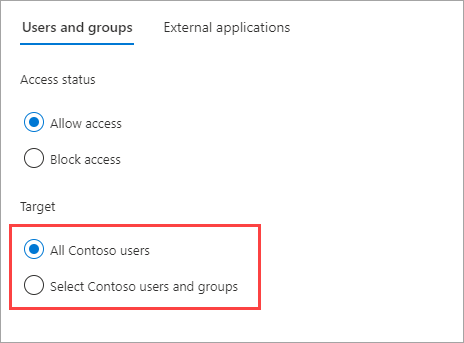

1. If you chose **Select \<your organization\> users and groups**, do the following for each user or group you want to add:

   - Select **Add \<your organization\> users and groups**.
   - In the **Select** pane, type the user name or group name in the search box.
   - Select the user or group in the search results.
   - When you're done selecting the users and groups you want to add, choose **Select**.

   > [!NOTE]
   > When targeting your users and groups, you won't be able to select users who have configured [SMS-based authentication](../authentication/howto-authentication-sms-signin.md). This is because users who have a "federated credential" on their user object are blocked to prevent external users from being added to outbound access settings. As a workaround, you can use the [Microsoft Graph API](/graph/api/resources/crosstenantaccesspolicy-overview) to add the user's object ID directly or target a group the user belongs to.

1. Select the **External applications** tab.

1. Under **Access status**, select one of the following:

   - **Allow access**: Allows the external applications specified under **Applies to** to be accessed by your users via B2B collaboration.
   - **Block access**: Blocks the external applications specified under **Applies to** from being accessed by your users via B2B collaboration.

    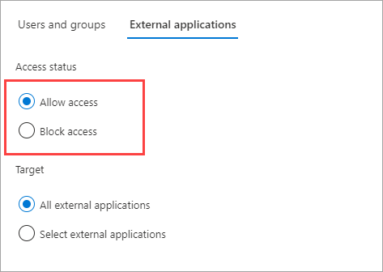

1. Under **Applies to**, select one of the following:

   - **All external applications**: Applies the action you chose under **Access status** to all external applications.
   - **Select external applications**: Applies the action you chose under **Access status** to all external applications.

   > [!NOTE]
   > If you block access to all external applications, you also need to block access for all of your users and groups (on the **Users and groups** tab).

    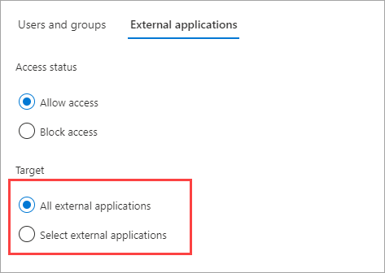

1. If you chose **Select external applications**, do the following for each application you want to add:

   - Select **Add Microsoft applications** or **Add other applications**.
   - In the search box, type the application name or the application ID (either the *client app ID* or the *resource app ID*). Then select the application in the search results. Repeat for each application you want to add.
   - When you're done selecting applications, choose **Select**.

    

1. Select **Save**.

### To change outbound trust settings

(This section applies to **Organizational settings** only.)

1. Select the **Trust settings** tab.

1. Review the **Automatic redemption** option:

   - **Automatically redeem invitations with the tenant** &lt;tenant&gt;: Check this setting if you want to automatically redeem invitations. If so, users from this tenant don't have to accept the consent prompt the first time they access the specified tenant using cross-tenant synchronization, B2B collaboration, or B2B direct connect. This setting will only suppress the consent prompt if the specified tenant checks this setting for inbound access as well.

    

1. Select **Save**.

## Remove an organization

When you remove an organization from your Organizational settings, the default cross-tenant access settings will go into effect for that organization.

> [!NOTE]
> If the organization is a cloud service provider for your organization (the isServiceProvider property in the Microsoft Graph [partner-specific configuration](/graph/api/resources/crosstenantaccesspolicyconfigurationpartner) is true), you won't be able to remove the organization.

1. Sign in to the [Azure portal](https://portal.azure.com) using a Global administrator or Security administrator account. Then open the **Azure Active Directory** service.

1. Select **External Identities**, and then select **Cross-tenant access settings**.

1. Select the **Organizational settings** tab.

1. Find the organization in the list, and then select the trash can icon on that row.

## Next steps

- See [Configure external collaboration settings](external-collaboration-settings-configure.md) for B2B collaboration with non-Azure AD identities, social identities, and non-IT managed external accounts.
- [Configure cross-tenant access settings for B2B direct connect](cross-tenant-access-settings-b2b-direct-connect.md)
