# Configure cross-tenant access settings for B2B direct connect

Use cross-tenant access settings to manage how you collaborate with other Microsoft Entra organizations through [B2B direct connect](b2b-direct-connect-overview.md). These settings let you determine the level of outbound access your users have to external organizations. They also let you control the level of inbound access that users in external Microsoft Entra organizations will have to your internal resources.

- **Default settings**: The default cross-tenant access settings apply to all external Microsoft Entra organizations, except organizations for which you've configured individual settings. You can change these default settings. For B2B direct connect, you'll typically leave the default settings as-is and enable B2B direct connect access with organization-specific settings. Initially, your default values are as follows:

  - **B2B direct connect initial default settings** - By default, outbound B2B direct connect is blocked for your entire tenant, and inbound B2B direct connect is blocked for all external Microsoft Entra organizations.
  - **Organizational settings** - No organizations are added by default.

- **Organization-specific settings**: You can configure organization-specific settings by adding an organization and modifying the inbound and outbound settings for that organization. Organizational settings take precedence over default settings.

Learn more about using cross-tenant access settings to [manage B2B direct connect](b2b-direct-connect-overview.md#managing-cross-tenant-access-for-b2b-direct-connect).

> [!IMPORTANT]
> Microsoft is beginning to move customers using cross-tenant access settings to a new storage model on August 30, 2023. You may notice an entry in your audit logs informing you that your cross-tenant access settings were updated as our automated task migrates your settings. For a brief window while the migration processes, you will be unable to make changes to your settings. If you are unable to make a change, you should wait a few moments and try the change again. Once the migration completes, [you will no longer be capped with 25kb of storage space](/azure/active-directory/external-identities/faq#how-many-organizations-can-i-add-in-cross-tenant-access-settings-) and there will be no more limits on the number of partners you can add.

## Before you begin

- Review the [Important considerations](cross-tenant-access-overview.md#important-considerations) section in the [cross-tenant access overview](cross-tenant-access-overview.md) before configuring your cross-tenant access settings.
- Decide on the default level of access you want to apply to all external Microsoft Entra organizations.
- Identify any Microsoft Entra organizations that will need customized settings.
- Contact organizations with which you want to set up B2B direct connect. Because B2B direct connect is established through mutual trust, both you and the other organization need to enable B2B direct connect with each other in your cross-tenant access settings.
- Obtain any required information from external organizations. If you want to apply access settings to specific users, groups, or applications within an external organization, you'll need to obtain these IDs from the organization before you can configure access settings.
- To configure cross-tenant access settings in the Microsoft Entra admin center, you'll need an account with a Global administrator or Security administrator role. Teams administrators can read cross-tenant access settings, but they can't update these settings.

## Configure default settings

[!INCLUDE [portal updates](~/articles/active-directory/includes/portal-update.md)]

 Default cross-tenant access settings apply to all external tenants for which you haven't created organization-specific customized settings. If you want to modify the Microsoft Entra ID-provided default settings, follow these steps.

1. Sign in to the [Microsoft Entra admin center](https://entra.microsoft.com) as at least a [Security administrator](../roles/permissions-reference.md#security-administrator).
1. Browse to **Identity** > **External Identities** > **Cross-tenant access settings**.
1. Select the **Default settings** tab and review the summary page.

   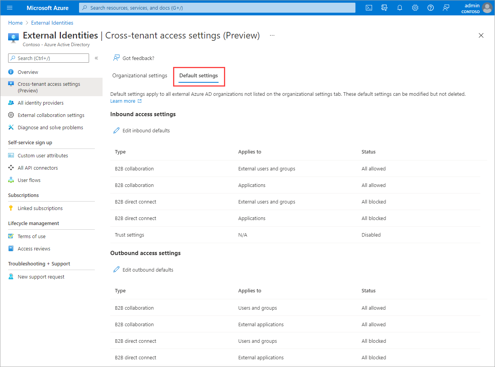

1. To change the settings, select the **Edit inbound defaults** link or the **Edit outbound defaults** link.

      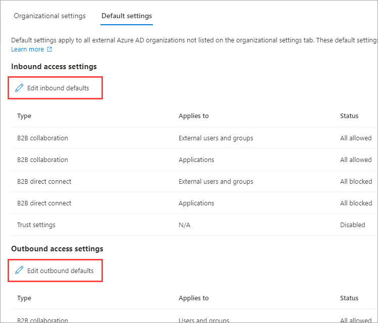

1. Modify the default settings by following the detailed steps in these sections:

   - [Modify inbound access settings](#modify-inbound-access-settings)
   - [Modify outbound access settings](#modify-outbound-access-settings)

## Add an organization

Follow these steps to configure customized settings for specific organizations.

1. Sign in to the [Microsoft Entra admin center](https://entra.microsoft.com) as at least a [Security administrator](../roles/permissions-reference.md#security-administrator).
1. Browse to **Identity** > **External Identities** > **Cross-tenant access settings**.
3. Select **Organizational settings**.
4. Select **Add organization**.
5. On the **Add organization** pane, type the full domain name (or tenant ID) for the organization.

   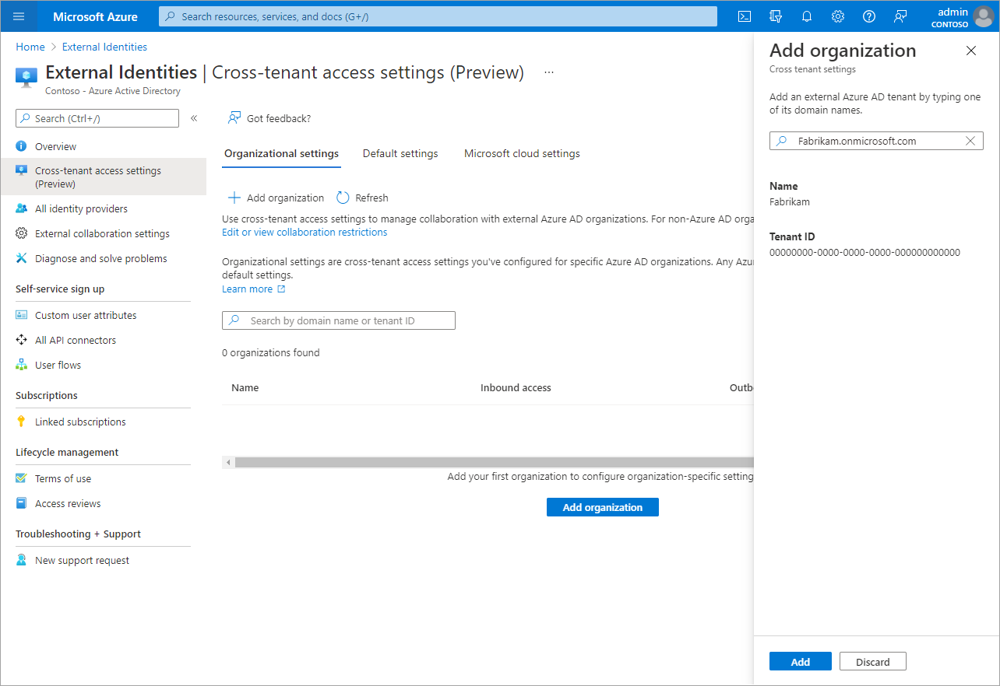

1. Select the organization in the search results, and then select **Add**.
2. The organization appears in the **Organizational settings** list. At this point, all access settings for this organization are inherited from your default settings. To change the settings for this organization, select the **Inherited from default** link under the **Inbound access** or **Outbound access** column.

   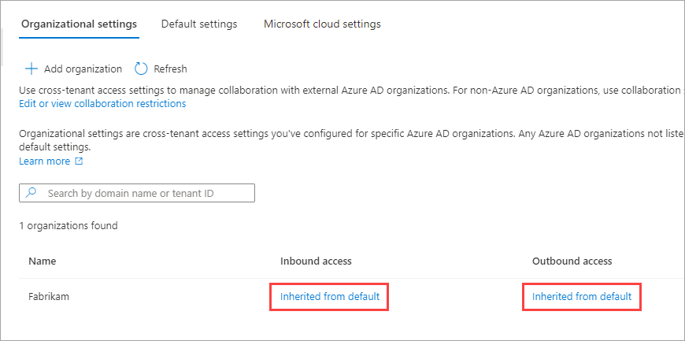

1. Modify the organization's settings by following the detailed steps in these sections:

   - [Modify inbound access settings](#modify-inbound-access-settings)
   - [Modify outbound access settings](#modify-outbound-access-settings)

## Modify inbound access settings

With inbound settings, you select which external users and groups will be able to access the internal applications you choose. Whether you're configuring default settings or organization-specific settings, the steps for changing inbound cross-tenant access settings are the same. As described in this section, you'll navigate to either the **Default** tab or an organization on the **Organizational settings** tab, and then make your changes.

1. Sign in to the [Microsoft Entra admin center](https://entra.microsoft.com) as at least a [Security administrator](../roles/permissions-reference.md#security-administrator).

1. Browse to **Identity** > **External Identities** > **Cross-tenant access settings**.

1. Navigate to the settings you want to modify:
   - To modify default inbound settings, select the **Default settings** tab, and then under **Inbound access settings**, select **Edit inbound defaults**.
   - To modify settings for a specific organization, select the **Organizational settings** tab, find the organization in the list (or [add one](#add-an-organization)), and then select the link in the **Inbound access** column.

1. Follow the detailed steps for the settings you want to change:

   - [To change inbound B2B direct connect settings](#to-change-inbound-b2b-direct-connect-settings)
   - [To change inbound trust settings for MFA and device state](#to-change-inbound-trust-settings-for-mfa-and-device-state)

### To change inbound B2B direct connect settings

1. Select the **B2B direct connect** tab

1. *If you're configuring settings for an organization,* select one of these options:

   - **Default settings**: The organization will use the settings configured on the **Default** settings tab. If customized settings were already configured for this organization, you'll need to select **Yes** to confirm that you want all settings to be replaced by the default settings. Then select **Save**, and skip the rest of the steps in this procedure.

   - **Customize settings**: You can customize the settings for this organization, which will be enforced for this organization instead of the default settings. Continue with the rest of the steps in this procedure.

1. Select **External users and groups**.

1. Under **Access status**, select one of these options:

   - **Allow access**: Allows the users and groups specified under **Applies to** to access B2B direct connect.
   - **Block access**: Blocks the users and groups specified under **Applies to** from accessing B2B direct connect. Blocking access for all external users and groups also blocks all your internal applications from being shared via B2B direct connect.

   

1. Under **Applies to**, select one of the following:

   - **All external users and groups**: Applies the action you chose under **Access status** to all users and groups from external Microsoft Entra organizations.
   - **Select external users and groups**: Lets you apply the action you chose under **Access status** to specific users and groups within the external organization. A Microsoft Entra ID P1 license is required on the tenant that you configure.

   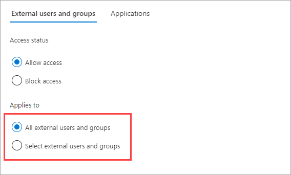

1. If you chose **Select external users and groups**, do the following for each user or group you want to add:

   - Select **Add external users and groups**.
   - In the **Add other users and groups** pane, type the user object ID or the group object ID in the search box.
   - In the menu next to the search box, choose either **user** or **group**.
   - Select **Add**.

   > [!NOTE]
   > You cannot target users or groups in inbound default settings.

   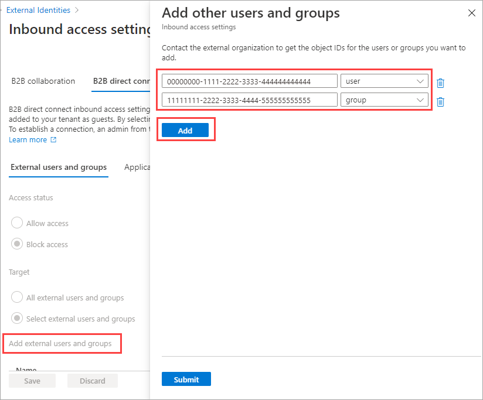

1. When you're done adding users and groups, select **Submit**.

1. Select the **Applications** tab.

1. Under **Access status**, select one of the following:

   - **Allow access**: Allows the applications specified under **Applies to** to be accessed by B2B direct connect users.
   - **Block access**: Blocks the applications specified under **Applies to** from being accessed by B2B direct connect users.

    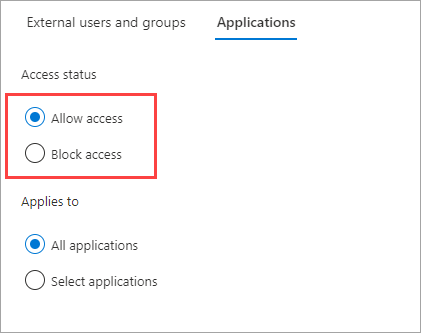

1. Under **Applies to**, select one of the following:

   - **All applications**: Applies the action you chose under **Access status** to all of your applications.
   - **Select applications** (requires a Microsoft Entra ID P1 or P2 subscription): Lets you apply the action you chose under **Access status** to specific applications in your organization.

    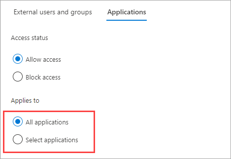

1. If you chose **Select applications**, do the following for each application you want to add:

   - Select **Add Microsoft applications**.
   - In the applications pane, type the application name in the search box and select the application in the search results.
   - When you're done selecting applications, choose **Select**.

    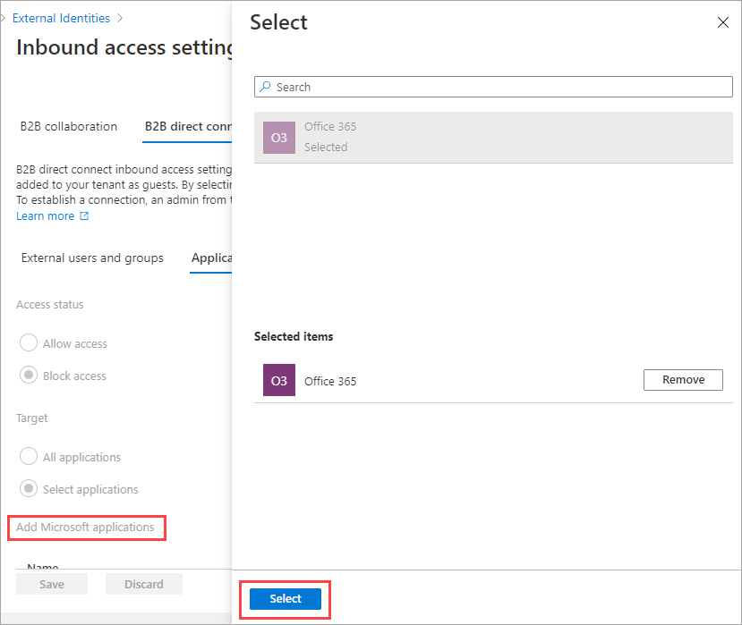

1. Select **Save**.

### To change inbound trust settings for MFA and device state

1. Select the **Trust settings** tab.

1. *If you're configuring settings for an organization*, select one of these options:

   - **Default settings**: The organization will use the settings configured on the **Default** settings tab. If customized settings were already configured for this organization, you'll need to select **Yes** to confirm that you want all settings to be replaced by the default settings. Then select **Save**, and skip the rest of the steps in this procedure.

   - **Customize settings**: You can customize the settings for this organization, which will be enforced for this organization instead of the default settings. Continue with the rest of the steps in this procedure.

1. Select one or more of the following options:

   - **Trust multi-factor authentication from Microsoft Entra tenants**: Select this checkbox if your Conditional Access policies require multi-factor authentication (MFA). This setting allows your Conditional Access policies to trust MFA claims from external organizations. During authentication, Microsoft Entra ID will check a user's credentials for a claim that the user has completed MFA. If not, an MFA challenge will be initiated in the user's home tenant.  

   - **Trust compliant devices**: Allows your Conditional Access policies to trust compliant device claims from an external organization when their users access your resources.

   - **Trust Microsoft Entra hybrid joined devices**: Allows your Conditional Access policies to trust Microsoft Entra hybrid joined device claims from an external organization when their users access your resources.

    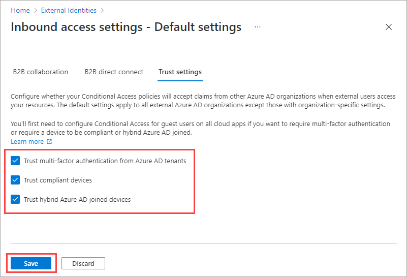

1. (This step applies to **Organizational settings** only.) Review the **Automatic redemption** option:

   - **Automatically redeem invitations with the tenant** &lt;tenant&gt;: Check this setting if you want to automatically redeem invitations. If so, users from the specified tenant won't have to accept the consent prompt the first time they access this tenant using cross-tenant synchronization, B2B collaboration, or B2B direct connect. This setting will only suppress the consent prompt if the specified tenant checks this setting for outbound access as well.

    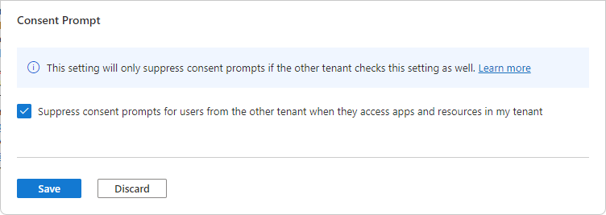

1. Select **Save**.

> [!NOTE]
> When configuring settings for an organization, you'll notice a **Cross-tenant sync** tab. This tab doesn't apply to your B2B direct connect configuration. Instead, this feature is used by multi-tenant organizations to enable B2B collaboration across their tenants. For more information, see the [multi-tenant organization documentation](../multi-tenant-organizations/index.yml).

## Modify outbound access settings

With outbound settings, you select which of your users and groups will be able to access the external applications you choose. The detailed steps for modifying outbound cross-tenant access settings are the same whether you're configuring default or organization-specific settings. As described in this section, navigate to the **Default** tab or an organization on the **Organizational settings** tab, and then make your changes.

1. Sign in to the [Microsoft Entra admin center](https://entra.microsoft.com) as at least a [Security administrator](../roles/permissions-reference.md#security-administrator).

1. Browse to **Identity** > **External Identities** > **Cross-tenant access settings**.

1. Navigate to the settings you want to modify:

   - To modify default outbound settings, select the **Default settings** tab, and then under **Outbound access settings**, select **Edit outbound defaults**.

   - To modify settings for a specific organization, select the **Organizational settings** tab, find the organization in the list (or [add one](#add-an-organization)) and then select the link in the **Outbound access** column.

### To change the outbound access settings

1. Select the **B2B direct connect** tab.

1. *If you're configuring settings for an organization,* select one of these options:

   - **Default settings**: The organization will use the settings configured on the **Default** settings tab. If customized settings were already configured for this organization, you'll need to select **Yes** to confirm that you want all settings to be replaced by the default settings. Then select **Save**, and skip the rest of the steps in this procedure.

   - **Customize settings**: You can customize the settings for this organization, which will be enforced for this organization instead of the default settings. Continue with the rest of the steps in this procedure.

1. Select **Users and groups**.

1. Under **Access status**, select one of the following:

   - **Allow access**: Allows your users and groups specified under **Applies to** to access B2B direct connect.
   - **Block access**: Blocks your users and groups specified under **Applies to** from accessing B2B direct connect. Blocking access for all your users and groups  also blocks all external applications from being shared via B2B direct connect.

    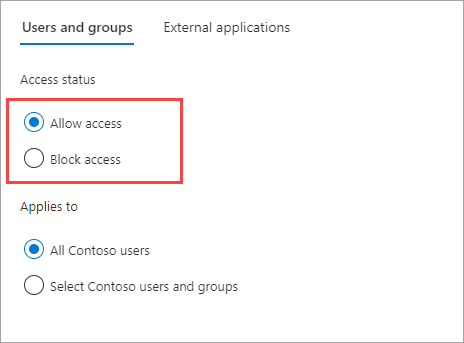

1. Under **Applies to**, select one of the following:

   - **All \<your organization\> users**: Applies the action you chose under **Access status** to all your users and groups.
   - **Select \<your organization\> users and groups** (requires a Microsoft Entra ID P1 or P2 subscription): Lets you apply the action you chose under **Access status** to specific users and groups.

   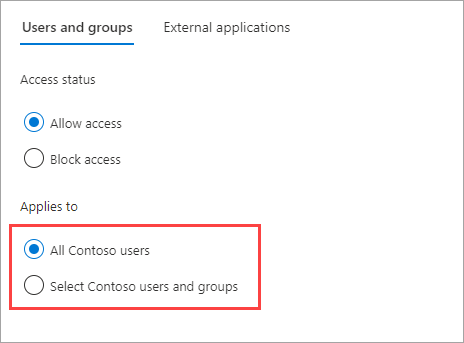

1. If you chose **Select \<your organization\> users and groups**, do the following for each user or group you want to add:

   - Select **Add \<your organization\> users and groups**.
   - In the **Select** pane, type the user name or the group name in the search box.
   - When you're done selecting users and groups, choose **Select**.

   > [!NOTE]
   > When targeting your users and groups, you won't be able to select users who have configured [SMS-based authentication](../authentication/howto-authentication-sms-signin.md). This is because users who have a "federated credential" on their user object are blocked to prevent external users from being added to outbound access settings. As a workaround, you can use the [Microsoft Graph API](/graph/api/resources/crosstenantaccesspolicy-overview) to add the user's object ID directly or target a group the user belongs to.

1. Select **Save**.
1. Select the **External applications** tab.
1. Under **Access status**, select one of the following:

   - **Allow access**: Allows the applications specified under **Applies to** to be accessed by B2B direct connect users.
   - **Block access**: Blocks the applications specified under **Applies to** from being accessed by B2B direct connect users.

    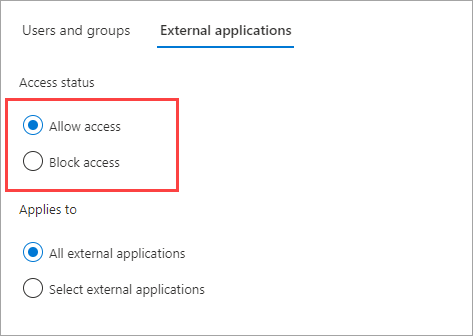

1. Under **Applies to**, select one of the following:

   - **All external applications**: Applies the action you chose under **Access status** to all external applications.
   - **Select applications** (requires a Microsoft Entra ID P1 or P2 subscription): Lets you apply the action you chose under **Access status** to specific external applications.

    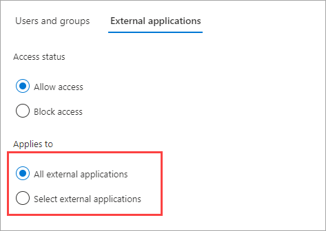

1. If you chose **Select external applications**, do the following for each application you want to add:

   - Select **Add Microsoft applications** or **Add other applications**.
   - In the applications pane, type the application name in the search box and select the application in the search results.
   - When you're done selecting applications, choose **Select**.

    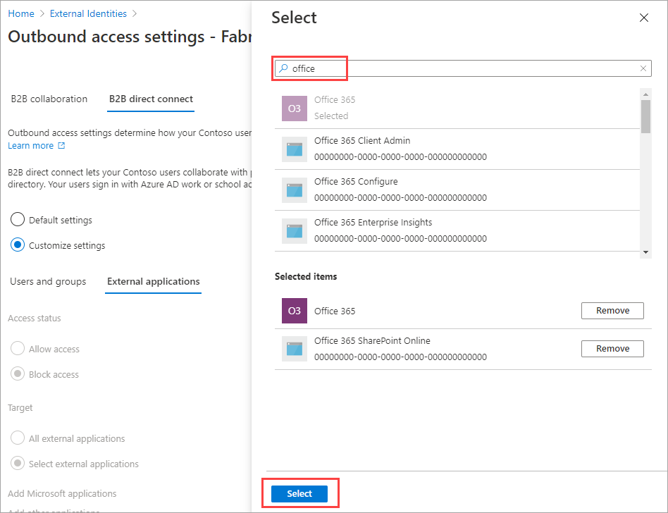

1. Select **Save**.

### To change outbound trust settings

(This section applies to **Organizational settings** only.)

1. Select the **Trust settings** tab.

1. Review the **Automatic redemption** option:

   - **Automatically redeem invitations with the tenant** &lt;tenant&gt;: Check this setting if you want to automatically redeem invitations. If so, users from this tenant don't have to accept the consent prompt the first time they access the specified tenant using cross-tenant synchronization, B2B collaboration, or B2B direct connect. This setting will only suppress the consent prompt if the specified tenant checks this setting for inbound access as well.

    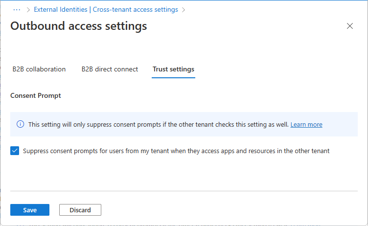

1. Select **Save**.

## Remove an organization

When you remove an organization from your Organizational settings, the default cross-tenant access settings will go into effect for that organization.

> [!NOTE]
> If the organization is a cloud service provider for your organization (the isServiceProvider property in the Microsoft Graph [partner-specific configuration](/graph/api/resources/crosstenantaccesspolicyconfigurationpartner) is true), you won't be able to remove the organization.

1. Sign in to the [Microsoft Entra admin center](https://entra.microsoft.com) as at least a [Security administrator](../roles/permissions-reference.md#security-administrator).

1. Browse to **Identity** > **External Identities** > **Cross-tenant access settings**.

1. Select the **Organizational settings** tab.

1. Find the organization in the list, and then select the trash can icon on that row.

## Next steps

[Configure cross-tenant access settings for B2B collaboration](cross-tenant-access-settings-b2b-collaboration.md)
