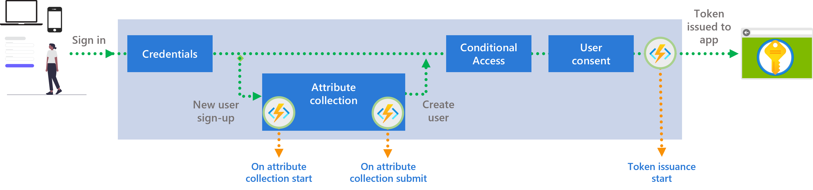

<!--   The content is mostly copied from https://learn.microsoft.com/en-us/azure/active-directory/external-identities/identity-providers. For now the text is used as a placeholder in the release branch, until further notice. -->

# Custom extensions and token enrichment

This article provides an overview of custom authentication extensions for Azure Active Directory (Azure AD) for customers.

For your customer-facing applications, key data might be stored in systems external to Microsoft Entra, such as a secondary email, billing tier, or sensitive information. An application's user experience might rely on the information, or a legacy app that can't be modified might require these claims in tokens.

For these scenarios, you can use a custom authentication extension, which allows you to enrich or customize application tokens with information from external systems that can't be stored as part of the Azure AD directory. A custom authentication extension made for this event is also known as a custom extension.



## Enriching tokens with data from external systems

When users authenticate to your application with Azure Active Directory, a security token is return to your application. The security token contains claims that are statements about the user, such as name, unique identifier, or application roles.  

Beyond the default set of claims that are contained in the security token you can define your own custom claims from external systems using a REST API you develop. Ideally the information in the external system could be stored in the Azure AD directory. However, that isn't always feasible, while applications in your organization may rely on that data. With Azure Active Directory custom claims provider you can add this data into tokens returned to your application. 

### Custom extensions

Custom extensions in Azure Active Directory allow you to interact with external systems during a user authentication. The custom extension contains information about your REST API endpoint, the credentials to call the REST API, the attributes that it returns, and when the REST API should be called. 

### Token issuance start event

Azure AD supports the token issuance start event. The token issuance start event is triggered once a user completes all of their authentication challenges, and a security token is about to be issued. 

### Custom claims provider

To customize the token return to your applications, enterprise applications in your Azure AD tenant can configure custom claims provider to fetch data from external systems. The custom claims provider points to a custom extension and specifies the attributes to be added to the security token. Multiple claims provider can share the same custom extension. So, each application can choose its own set of attributes to be added to the security token.  

### General flow of sign-up with a custom extension

The flow starts when a user attempts to sign into an app. The user is asked to sign-in with their credentials.  

The application is configured with a custom claims provider. So, once a user completes all of their authentication challenges, and a token is about to be issued by Azure AD, the custom extension “token issuance start” event is triggered.  

The Azure AD custom extension sends an HTTP request to a REST API endpoint you own. The request contains information about the event, the user, and other context information.  

Using the data sent by Azure AD, for example the user unique identifier, the REST API retrieves attributes from an external data source and returns it back to Azure AD.  

Based on the custom claims provider setting, selected attributes are added into the token that will be returned to the application.  

The application can now read the claims from the security token and react accordingly.  

## Supported scenarios

Use custom extensions for the following scenarios:

- **Migration of legacy systems** - You may have legacy identity systems such as Active Directory Federation Services (AD FS) or data stores (such as LDAP directory) that hold information about users. You'd like to migrate applications, but can't fully migrate the user information onto Azure AD. Your apps may depend on certain information on the token and can't be re-architected.

- **Integration with other data stores that can't be synced to the directory** - You may have third-party systems or your own systems that store user information. Ideally this information could be consolidated, either through synchronization or direct migration, in the Azure AD directory. However, that isn't always feasible.

   With custom extension you can pull information from other sources, like a legacy identity or an HR system, and include them in your tokens. The custom extension is useful when many applications rely on a piece of information in an external service and can't be updated to fetch the attributes from that service directly.

- **Sensitive information** - You may have sensitive information about users that you can't store in Azure AD. The restriction may be because of sensitive customer content, data residency, or other requirements.

## How custom extensions work

Custom extensions allow you to create custom extension and claims mapping policies to customize the Azure AD authentication experience, by integrating with external systems.  Attributes are retrieved from an external system and returned to Azure AD, which issues these attributes as claims into the token.

1. A user attempts to sign into an app and is redirected to the Azure AD sign-in or sign-up page.
1. Once a user completes a certain step, for example, the user has successfully authenticated and a token is about to be issued by Azure AD, the **token issuance start event** is triggered. This flow is dependent on the custom extension event type that is configured.
1. The Azure AD **event listener** service (custom extension) sends an HTTP request to a **REST API endpoint**. The request contains information about the event, the user profile, session data, and other context information.
1. The **REST API** retrieves attributes from an external data source.
1. The **REST API** sends an HTTP response containing the requested external attributes to Azure AD.
1. Azure AD **custom extension** collects the key-value pairs from the response based on the **claims mapping** policy configured for the app.
1. The **token** is returned to the **app**, including the newly collected claims.

### Event types

Custom extensions are triggered at particular parts of the authentication flow. The currently supported trigger points during the authentication flow are as follows:

- **Token Issuance Start Event** - A custom extension, which is triggered right before the token is issued to the application.

### NEW! Custom Extensions Configuration (Optional) (User flow custom extensions, events )

Self-Service Sign-Up User Flows can now take advantage of custom extensions in order to provide validation and augmentation capabilities. Currently, while this feature is in preview, you will need to use this URL in order to access this feature in the Azure Portal: https://portal.azure.com/?enableCustomExtension=true&enableCustomExtensionForTesting=true 

Custom Extensions allows you to perform validation on attributes collected from the user during sign-up, along with showing the user a blocked or validation error page if needed. There are two events enabled for Custom Extensions: OnAttributeCollectionStart and OnAttributeCollectionSubmit.  

OnAttributeCollectionStart 

OnAttributeCollectionStart is fired at the beginning of the attribute collection process and can be used to prevent the user from signing up (such as based on the domain they are authenticating from) or modify the initial attributes to be collected (such as including additional attributes to collect based on the user’s IdP). 

OnAttributeCollectionSubmit 

OnAttributeCollectionSubmit is fired after the user provides attribute information during signing up and can be used to validate the information provided by the user (such as an invitation code or partner number), modify the collected attributes (such as address validation), and either allow the user to continue in the journey or show a validation or block page.

### REST API endpoint

When an event fires, Azure AD sends an HTTP request, to your REST API endpoint. The REST API can be an Azure Function, Azure Logic App, or some other publicly available API endpoint.

Your REST API endpoint is responsible for interfacing with downstream databases, existing APIs, LDAP directories, or any other stores that contain the attributes you'd like to add to the token configuration.

The REST API returns an HTTP response, or action, back to Azure AD containing the attributes. Attributes that return by your REST API aren't automatically added to a token. Instead, an application's claims mapping policy must be configured for any attribute to be included in the token.

### Claims mapping policy

In Azure AD, a claims mapping policy modifies the claims emitted in tokens issued for specific applications.

```json
{
    "ClaimsMappingPolicy": {
        "Version": 1,
        "IncludeBasicClaimSet": "true",
        "ClaimsSchema": [{
            "Source": "CustomClaimsProvider",
            "ID": "dateOfBirth",
            "JwtClaimType": "birthdate"
        },
        {
            "Source": "CustomClaimsProvider",
            "ID": "customRoles",
            "JwtClaimType": "my_roles"
        },
        {
            "Source": "CustomClaimsProvider",
            "ID": "correlationId",
            "JwtClaimType": "correlation_Id"
        },
        {
            "Source": "CustomClaimsProvider",
            "ID": "apiVersion",
            "JwtClaimType": "apiVersion"
        },
        {
            "Value": "tokenaug_V2",
            "JwtClaimType": "policy_version"
        }]
    }
}
```

The `ClaimsSchema` element contains the list of claims to be mapped with the following attributes:

- **Source** describes the source of the attribute, the `CustomClaimsProvider`. Note, the last element contains a fixed value with the policy version, for testing purposes. Thus, the `source` attribute is omitted.

- **ID** is the name of the claims at it returns from the Azure Function you created.

    > [!IMPORTANT]
    > The ID attribute's value is case sensitive. Make sure you type the claim name exactly as it returned by the Azure Function.
- **JwtClaimType** is an optional name of claim in the emitted token for OIDC app. It allows you to provide a different name that will be return in the JWT token. For example, if the API response has an `ID` value of `dateOfBirth`, it can be emitted as `birthdate` in the token.

Once you create your claims mapping policy, the next step is to upload it to your Azure AD tenant. Use the following [claimsMappingPolicy](/graph/api/claimsmappingpolicy-post-claimsmappingpolicies) Graph API in your tenant.

> [!IMPORTANT]
> The **definition** element should be an array with a single string value. The string should be the stringified and escaped version of your claims mapping policy. You can use tools like [https://jsontostring.com/](https://jsontostring.com/) to stringify your claims mapping policy.
## Developing a custom extension REST API

You can use any programming language, framework, and hosting environment to create and host your custom extensions REST API. For a quick way to get started, we recommend you use a C# Azure Function. Azure Functions lets you run your code in a serverless environment without having to first create a virtual machine (VM) or publish a web application. Check out the get started with custom extension article.

Your custom extension REST API must handle:

- Backend processing for authentication events
- Token validation for securing the API call
- Incoming and outgoing validation of HTTP request and response schemas
- Versioning
- Auditing
- Logging

### Custom extensions schema

When creating your own custom API, the following API data contract can be followed to design the request and response handler.

Your custom extension in Azure AD will make an HTTP call to your REST API with a JSON payload. The JSON payload contains user profile data, authentication context attributes, and information about the application the user wants to sign-in. The JSON attributes can be used to perform extra logic by your API. The request to your API is in the following format:

```json
{
    "type": "microsoft.graph.authenticationEvent.tokenIssuanceStart",
    "source": "/tenants/<Your tenant GUID>/applications/<Your Test Application App Id>",
    "data": {
        "@odata.type": "microsoft.graph.onTokenIssuanceStartCalloutData",
        "tenantId": "<Your tenant GUID>",
        "authenticationEventListenerId": "<GUID>",
        "customAuthenticationExtensionId": "<Your custom extension ID>",
        "authenticationContext": {
            "correlationId": "fcef74ef-29ea-42ca-b150-8f45c8f31ee6",
            "client": {
                "ip": "30.51.176.110",
                "locale": "en-us",
                "market": "en-us"
            },
            "protocol": "OAUTH2.0",
            "clientServicePrincipal": {
                "id": "<Your Test Applications servicePrincipal objectId>",
                "appId": "<Your Test Application App Id>",
                "appDisplayName": "My Test application",
                "displayName": "My Test application"
            },
            "resourceServicePrincipal": {
                "id": "<Your Test Applications servicePrincipal objectId>",
                "appId": "<Your Test Application App Id>",
                "appDisplayName": "My Test application",
                "displayName": "My Test application"
            },
            "user": {
                "createdDateTime": "2016-03-01T15:23:40Z",
                "displayName": "John",
                "givenName": "John",
                "id": "90847c2a-e29d-4d2f-9f54-c5b4d3f26471",
                "mail": "john@contoso.com",
                "preferredLanguage": "en-us",
                "surname": "Smith",
                "userPrincipalName": "john@contoso.com",
                "userType": "Member"
            }
        }
    }
}
```

The API response format which Azure expects will be in the following format, where the claims `DateOfBirth` and `CustomRoles` are returned to Azure:

```json
{
    "data": {
        "@odata.type": "microsoft.graph.onTokenIssuanceStartResponseData",
        "actions": [
            {
                "@odata.type": "microsoft.graph.provideClaimsForToken",
                "claims": {
                    "DateOfBirth": "01/01/2000",
                    "CustomRoles": [
                        "Writer",
                        "Editor"
                    ]
                }
            }
        ]
    }
}
```

### Security

To ensure your custom extension integration is secured appropriately, multiple security controls are applied.

1. Azure AD sends an Authorization header when calling your custom extension API, with a bearer token issued by your Azure AD.
1. The bearer token contains an `appid` or `azp` claim, which once verified by your API, ensures that Azure AD is making the API request. For **V1** Applications, validate the `appid` claim. For **V2** Applications, validate the `azp` claim. At your API, ensure the respective claim contains the value `99045fe1-7639-4a75-9d4a-577b6ca3810f`.
1. When Azure AD invokes your API the bearer token `aud` audience claim contains the ID of the associated application registration. You REST API endpoint needs to validate that the bearer token is issued for that specific audience.
1. After the user's token expires, often a refresh token is used to obtain a new set of tokens. During the refresh token flow, the custom claim provider is called again, and any claims returned are renewed into the token.

## Component overview

To setup and integrate a custom extension with your application requires multiple components to be connected. 

- You should have a **REST API endpoint** publicly available. In this diagram it represented by Azure Function. The REST API generates and returns custom claims to the custom extension. It's associated with an Azure AD application registration.
- You require to configure a **custom extension** in Azure AD, which is configured to connect to your API.
- You require an **application** that receives the customized tokens. For example <https://jwt.ms> a Microsoft-owned web application that displays the decoded contents of a token.
- The application, such as the <https://jwt.ms> must be registered into Azure AD using **app registration**.
- You must create an association between your application and your custom extension using event listener.
- You must specify the claims to include int the token, using mapping policy.
- You can optionally secure the Azure Function with an authentication provider, in this article we'll use your Azure AD.

## Next steps

- Learn how to create and register a custom extension and API endpoint.
- If you already have a custom extension registered, you can configure a SAML application to receive tokens with claims sourced from an external store.