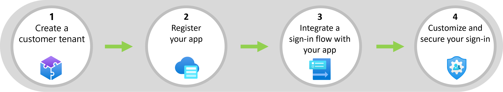

<!--   The content is mostly copied from https://learn.microsoft.com/en-us/azure/active-directory/fundamentals/azure-active-directory-b2c-deployment-plans. For now the text  is used as a placeholder in the release branch, until further notice. -->

# Planning for customer identity and access management

Microsoft Entra offers a customizable and extensible solution for integrating your customer-facing applications with Azure AD. Because Azure AD for customers is built on the Microsoft Entra platform, you benefit from consistency in app integration, tenant management, and operations across your workforce and customer scenarios. When designing your configuration, it's important to understand how Azure AD for customers works, how it differs from an Azure AD workforce scenario, and which underlying Azure AD features will benefit your scenario.

This article describes the general steps for getting started with Azure AD for customers. It outlines the important considerations as you design and configure your solution.
## Steps for integrating your app with Azure AD for customers

Adding secure sign-in to your app and setting up a customer identity and access management involves four general steps, as illustrated in the following diagram. This article 

|  |  |  |
|---------|---------|---------|
|1     |      Create a customer tenant   | Create a new customer tenant in the Microsoft Entra admin center or via Azure Resource Manager   |
|2     |      Register your application   | In the Microsoft Entra admin center, register your application with Azure Active Directory    |
|3     |    Integrate your app with a sign-in flow     | - Create a user flow - Associate the app with the user flow - Update the app code with your customer tenant info See [Samples and guidance by app type and language](samples-ciam-all.md)   |
|4     |    Customize and secure your sign-in     |  - Customize branding - Add identity providers - Add multifactor authentication - Use custom authentication extensions to enhance the authentication flow   |
|     |         |

## Customer tenant and user model

Azure AD for customers uses the standard tenant model and overlays it with customized onboarding journeys for workforce or customer scenarios. B2B collaboration is part of workforce configurations.

## User flows for self-service sign-up

A self-service sign-up user flow creates a sign-up experience for your customers through the application you want to share. The user flow can be associated with one or more of your applications. First you'll enable self-service sign-up for your tenant and federate with the identity providers you want to allow external users to use for sign-in. Then you'll create and customize the sign-up user flow and assign your applications to it.
You can configure user flow settings to control how the customer signs up for the application:

- Account types used for sign-in, such as social accounts like Facebook, or email address
- Attributes to be collected from the user signing up, such as first name, postal code, or country/region of residency

The customer can sign in to your application, via the web, mobile, desktop, or single-page application (SPA). The application initiates an authorization request to the user flow provided endpoint. The user flow defines and controls the customer's experience. When the customer completes the sign-up user flow, Azure AD generates a token and redirects the customer back to your application. Upon completion of sign-up, a guest account is provisioned for the customer in the directory. Multiple applications can use the same user flow.

## Extensibility 

### Communications

Communicate proactively and regularly with your users about pending and current changes. Inform them about how the experience changes, when it changes, and provide a contact for support.

### Timelines

Help set realistic expectations and make contingency plans to meet key milestones:

- Pilot date
- Launch date
- Dates that affect delivery
- Dependencies

### Checklist for personas, permissions, delegation, and calls

* Identify the personas that access to your application 
* Define how you manage system permissions and entitlements today, and in the future

### User identity deployment checklist

* Confirm the number of users accessing applications
* Determine the IdP types needed:
  * For example, Facebook, Google.
* Determine the information to collect during sign-in and sign-up 

## Next steps
- [Overview - Customer identity access management (CIAM)](overview-customers-ciam.md)