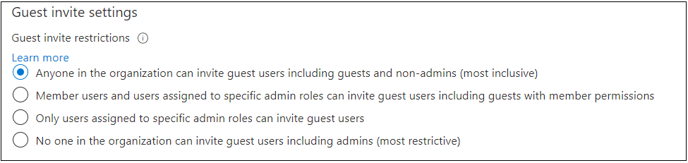

# Enable B2B external collaboration and manage who can invite guests

This article describes how to enable Azure Active Directory (Azure AD) B2B collaboration, designate who can invite guests, and determine the permissions that guest users have in your Azure AD. 

By default, all users and guests in your directory can invite guests even if they're not assigned to an admin role. External collaboration settings let you turn guest invitations on or off for different types of users in your organization. You can also delegate invitations to individual users by assigning roles that allow them to invite guests.

Azure AD allows you to restrict what external guest users can see in your Azure AD directory. By default, guest users are set to a limited permission level that blocks them from enumerating users, groups, or other directory resources, but lets them see membership of non-hidden groups. A new preview setting lets you restrict guest access even further, so that guests can only view their own profile information. For details, see [Restrict guest access permissions (preview)](../enterprise-users/users-restrict-guest-permissions.md).

## Configure B2B external collaboration settings

With Azure AD B2B collaboration, a tenant admin can set the following invitation policies:

- Turn off invitations
- Only admins and users in the Guest Inviter role can invite
- Admins, the Guest Inviter role, and members can invite
- All users, including guests, can invite

By default, all users, including guests, can invite guest users.

### To configure external collaboration settings:

1. Sign in to the [Azure portal](https://portal.azure.com) as a tenant administrator.
2. Select **Azure Active Directory**.
3. Select **External Identities** > **External collaboration settings**.

4. Under **Guest user access restrictions (Preview)**, choose the level of access you want guest users to have:
  
   - **Guest users have the same access as members (most inclusive)**: This option gives guests the same access to Azure AD resources and directory data as member users.

   - **Guest users have limited access to properties and memberships of directory objects**: (Default) This setting blocks guests from certain directory tasks, like enumerating users, groups, or other directory resources. Guests can see membership of all non-hidden groups.

   - **Guest user access is restricted to properties and memberships of their own directory objects (most restrictive)**: With this setting, guests can access only their own profiles. Guests are not allowed to see other users' profiles, groups, or group memberships.


5. Under **Guest invite settings**, choose the appropriate settings:

    

   - **Admins and users in the guest inviter role can invite**: To allow admins and users in the "Guest Inviter" role to invite guests, set this policy to **Yes**.

   - **Members can invite**: To allow non-admin members of your directory to invite guests, set this policy to **Yes**.

   - **Guests can invite**: To allow guests to invite other guests, set this policy to **Yes**.

   > [!NOTE]
   > If **Members can invite** is set to **No** and **Admins and users in the guest inviter role can invite** is set to **Yes**, users in the **Guest Inviter** role will still be able to invite guests.

6. Under **Email one-time passcode for guests**, choose the appropriate settings (for more information, see [Email one-time passcode authentication](one-time-passcode.md)):

   - **Automatically enable email one-time passcode for guests in October 2021**. (Default) If the email one-time passcode feature is not already enabled for your tenant, it will be automatically turned on in October 2021. No further action is necessary if you want the feature enabled at that time. If you've already enabled or disabled the feature, this option will be unavailable.

   - **Enable email one-time passcode for guests effective now**. Turns on the email one-time passcode feature for your tenant.

   - **Disable email one-time passcode for guests**. Turns off the email one-time passcode feature for your tenant, and prevents the feature from turning on in October 2021.

   > [!NOTE]
   > Instead of the options above, you'll see the following toggle if you've enabled or disabled this feature or if you've previously opted in to the preview:
   >
   >

7. Under **Enable guest self-service sign up via user flows**, select **Yes** if you want to be able to create user flows that let users sign up for apps. For more information about this setting, see [Add a self-service sign-up user flow to an app](self-service-sign-up-user-flow.md).

    

7. Under **Collaboration restrictions**, you can choose whether to allow or deny invitations to the domains you specify and enter specific domain names in the text boxes. For multiple domains, enter each domain on a new line. For more information, see [Allow or block invitations to B2B users from specific organizations](allow-deny-list.md).

    
## Assign the Guest Inviter role to a user

With the Guest Inviter role, you can give individual users the ability to invite guests without assigning them a global administrator or other admin role. Assign the Guest inviter role to individuals. Then make sure you set **Admins and users in the guest inviter role can invite** to **Yes**.

Here's an example that shows how to use PowerShell to add a user to the Guest Inviter role:

```
Add-MsolRoleMember -RoleObjectId 95e79109-95c0-4d8e-aee3-d01accf2d47b -RoleMemberEmailAddress <RoleMemberEmailAddress>
```

## Next steps

See the following articles on Azure AD B2B collaboration:

- [What is Azure AD B2B collaboration?](what-is-b2b.md)
- [Add B2B collaboration guest users without an invitation](add-user-without-invite.md)
- [Adding a B2B collaboration user to a role](add-guest-to-role.md)

