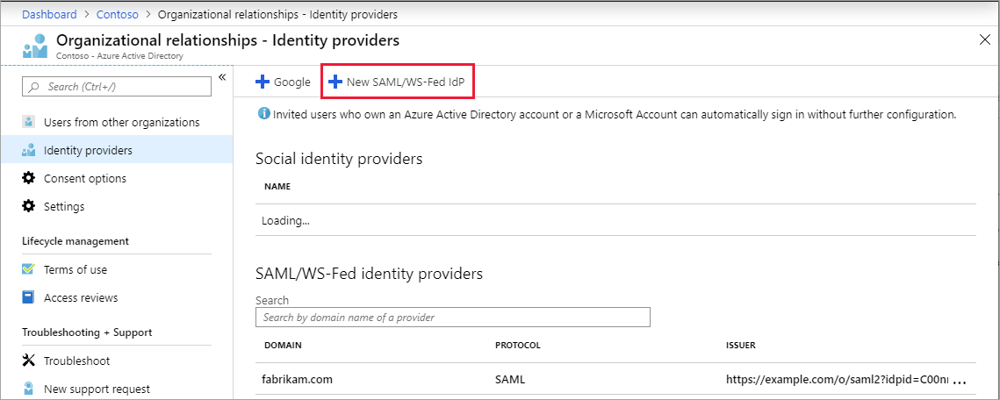
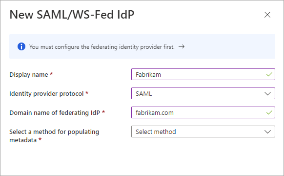
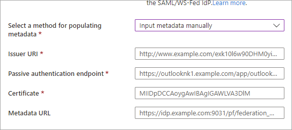
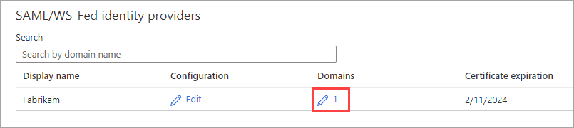
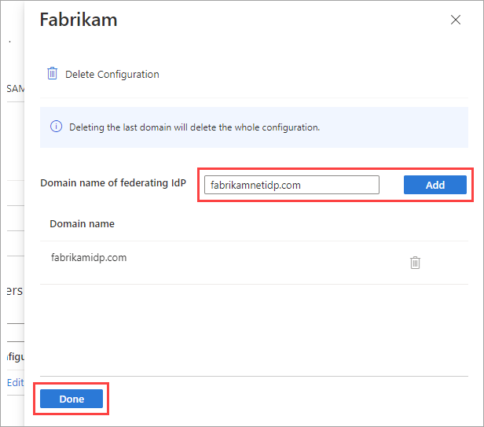
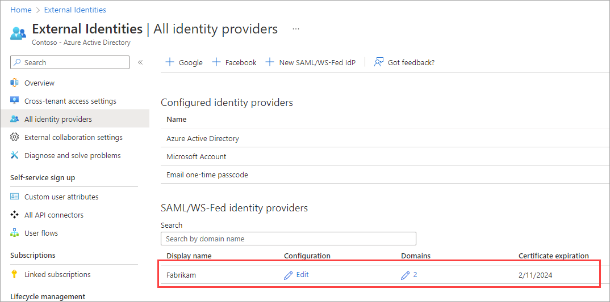
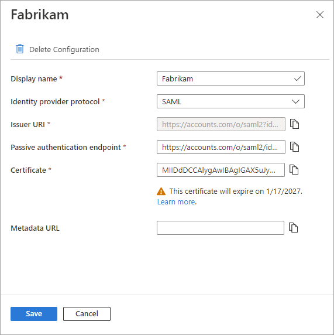
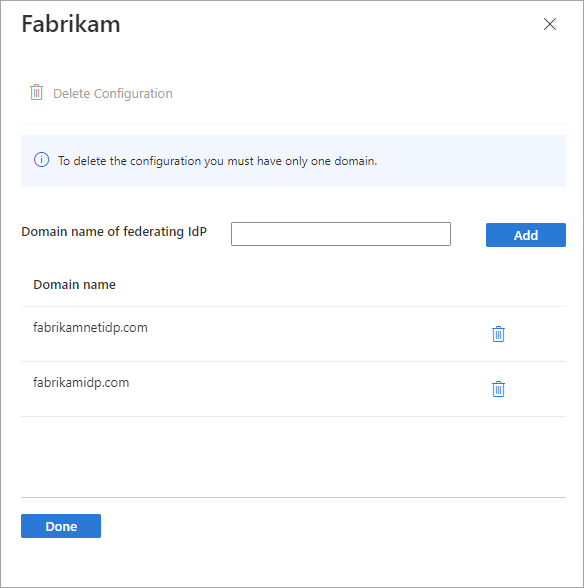
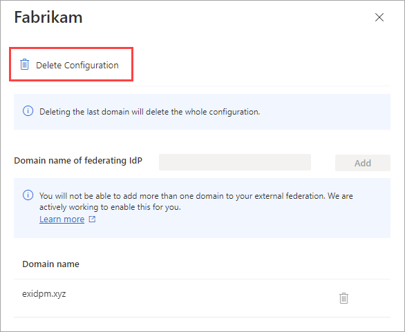

# Federation with SAML/WS-Fed identity providers for guest users

> [!NOTE]
>
>- *Direct federation* in Azure Active Directory is now referred to as *SAML/WS-Fed identity provider (IdP) federation*.

This article describes how to set up federation with any organization whose identity provider (IdP) supports the SAML 2.0 or WS-Fed protocol. When you set up federation with a partner's IdP, new guest users from that domain can use their own IdP-managed organizational account to sign in to your Azure AD tenant and start collaborating with you. There's no need for the guest user to create a separate Azure AD account.

> [!IMPORTANT]
>
>- We no longer support an allowlist of IdPs for new SAML/WS-Fed IdP federations. When you're setting up a new external federation, refer to [Step 1: Determine if the partner needs to update their DNS text records](#step-1-determine-if-the-partner-needs-to-update-their-dns-text-records).
>- In the SAML request sent by Azure AD for external federations, the Issuer URL is a tenanted endpoint. For any new federations, we recommend that all our partners set the audience of the SAML or WS-Fed based IdP to a tenanted endpoint. Refer to the [SAML 2.0](#required-saml-20-attributes-and-claims) and [WS-Fed](#required-ws-fed-attributes-and-claims) required attributes and claims sections. Any existing federations configured with the global endpoint will continue to work, but new federations will stop working if your external IdP is expecting a global issuer URL in the SAML request.
> - We've removed the single domain limitation. You can now associate multiple domains with an individual federation configuration.
> - We've removed the limitation that required the authentication URL domain to match the target domain or be from an allowed IdP. For details, see [Step 1: Determine if the partner needs to update their DNS text records](#step-1-determine-if-the-partner-needs-to-update-their-dns-text-records).

## When is a guest user authenticated with SAML/WS-Fed IdP federation?

After you set up federation with an organization's SAML/WS-Fed IdP, any new guest users you invite will be authenticated using that SAML/WS-Fed IdP. It’s important to note that setting up federation doesn’t change the authentication method for guest users who have already redeemed an invitation from you. Here are some examples:

 - Guest users have already redeemed invitations from you, and then later you set up federation with the organization's SAML/WS-Fed IdP. These guest users continue to use the same authentication method they used before you set up federation.
 - You set up federation with an organization's SAML/WS-Fed IdP and invite guest users, and then the partner organization later moves to Azure AD. The guest users who have already redeemed invitations continue to use the federated SAML/WS-Fed IdP, as long as the federation policy in your tenant exists.
 - You delete federation with an organization's SAML/WS-Fed IdP. Any guest users currently using the SAML/WS-Fed IdP are unable to sign in.

In any of these scenarios, you can update a guest user’s authentication method by [resetting their redemption status](reset-redemption-status.md).

SAML/WS-Fed IdP federation is tied to domain namespaces, such as contoso.com and fabrikam.com. When establishing federation with AD FS or a third-party IdP, organizations associate one or more domain namespaces to these IdPs.

## End-user experience

With SAML/WS-Fed IdP federation, guest users sign into your Azure AD tenant using their own organizational account. When they're accessing shared resources and are prompted for sign-in, users are redirected to their IdP. After successful sign-in, users are returned to Azure AD to access resources. If the Azure AD session expires or becomes invalid and the federated IdP has SSO enabled, the user experiences SSO. If the federated user's session is valid, the user isn't prompted to sign in again. Otherwise, the user is redirected to their IdP for sign-in.

## Sign-in endpoints

SAML/WS-Fed IdP federation guest users can now sign in to your multi-tenant or Microsoft first-party apps by using a [common endpoint](redemption-experience.md#redemption-process-and-sign-in-through-a-common-endpoint) (in other words, a general app URL that doesn't include your tenant context). During the sign-in process, the guest user chooses **Sign-in options**, and then selects **Sign in to an organization**. The user then types the name of your organization and continues signing in using their own credentials.

SAML/WS-Fed IdP federation guest users can also use application endpoints that include your tenant information, for example:

  * `https://myapps.microsoft.com/?tenantid=<your tenant ID>`
  * `https://myapps.microsoft.com/<your verified domain>.onmicrosoft.com`
  * `https://portal.azure.com/<your tenant ID>`

You can also give guest users a direct link to an application or resource by including your tenant information, for example `https://myapps.microsoft.com/signin/Twitter/<application ID?tenantId=<your tenant ID>`.

## Frequently asked questions

**Can I set up SAML/WS-Fed IdP federation with Azure AD verified domains?**

No, we block SAML/WS-Fed IdP federation for Azure AD verified domains in favor of native Azure AD managed domain capabilities. If you try to set up SAML/WS-Fed IdP federation with a domain that is DNS-verified in Azure AD, an error occurs.

**Can I set up SAML/WS-Fed IdP federation with a domain for which an unmanaged (email-verified) tenant exists?**
 
Yes, you can set up SAML/WS-Fed IdP federation with domains that aren't DNS-verified in Azure AD, including unmanaged (email-verified or "viral") Azure AD tenants. Such tenants are created when a user redeems a B2B invitation or performs self-service sign-up for Azure AD using a domain that doesn’t currently exist. If the domain hasn't been verified and the tenant hasn't undergone an [admin takeover](../enterprise-users/domains-admin-takeover.md), you can set up federation with that domain.

**How many federation relationships can I create?**

Currently, a maximum of 1,000 federation relationships is supported. This limit includes both [internal federations](/powershell/module/msonline/set-msoldomainfederationsettings) and SAML/WS-Fed IdP federations.

**Can I set up federation with multiple domains from the same tenant?**

Yes, we now support SAML/WS-Fed IdP federation with multiple domains from the same tenant.

**Do I need to renew the signing certificate when it expires?**

If you specify the metadata URL in the IdP settings, Azure AD automatically renews the signing certificate when it expires. However, if the certificate is rotated for any reason before the expiration time, or if you don't provide a metadata URL, Azure AD is unable to renew it. In this case, you need to update the signing certificate manually.

**If SAML/WS-Fed IdP federation and email one-time passcode authentication are both enabled, which method takes precedence?**

When SAML/WS-Fed IdP federation is established with a partner organization, it takes precedence over email one-time passcode authentication for new guest users from that organization. If a guest user redeemed an invitation using one-time passcode authentication before you set up SAML/WS-Fed IdP federation, they continue to use one-time passcode authentication.

**Does SAML/WS-Fed IdP federation address sign-in issues due to a partially synced tenancy?**

No, the [email one-time passcode](one-time-passcode.md) feature should be used in this scenario. A “partially synced tenancy” refers to a partner Azure AD tenant where on-premises user identities aren't fully synced to the cloud. A guest whose identity doesn’t yet exist in the cloud but who tries to redeem your B2B invitation isn't able to sign in. The one-time passcode feature would allow this guest to sign in. The SAML/WS-Fed IdP federation feature addresses scenarios where the guest has their own IdP-managed organizational account, but the organization has no Azure AD presence at all.

**Once SAML/WS-Fed IdP federation is configured with an organization, does each guest need to be sent and redeem an individual invitation?**

Setting up SAML/WS-Fed IdP federation doesn’t change the authentication method for guest users who have already redeemed an invitation from you. You can update a guest user’s authentication method by [resetting their redemption status](reset-redemption-status.md).

**Is there a way to send a signed request to the SAML identity provider?**

Currently, the Azure AD SAML/WS-Fed federation feature doesn't support sending a signed authentication token to the SAML identity provider.

**What permissions are required to configure a SAML/Ws-Fed identity provider?**

You need to be an [External Identity Provider Administrator](../roles/permissions-reference.md#external-identity-provider-administrator) or a [Global Administrator](../roles/permissions-reference.md#global-administrator) in your Azure AD tenant to configure a SAML/Ws-Fed identity provider.

## Step 1: Determine if the partner needs to update their DNS text records

Depending on the partner's IdP, the partner might need to update their DNS records to enable federation with you. Use the following steps to determine if DNS updates are needed.

> [!NOTE]
> We no longer support an allowlist of IdPs for new SAML/WS-Fed IdP federations.

1. Check the partner's IdP passive authentication URL to see if the domain matches the target domain or a host within the target domain. In other words, when setting up federation for `fabrikam.com`:

   - If the passive authentication endpoint is `https://fabrikam.com` or `https://sts.fabrikam.com/adfs` (a host in the same domain), no DNS changes are needed.
   - If the passive authentication endpoint is `https://fabrikamconglomerate.com/adfs` or `https://fabrikam.com.uk/adfs`, the domain doesn't match the fabrikam.com domain, so the partner needs to add a text record for the authentication URL to their DNS configuration.

1. If DNS changes are needed based on the previous step, ask the partner to add a TXT record to their domain's DNS records, like the following example:

   `fabrikam.com.  IN   TXT   DirectFedAuthUrl=https://fabrikamconglomerate.com/adfs`

## Step 2: Configure the partner organization’s IdP

Next, your partner organization needs to configure their IdP with the required claims and relying party trusts.

> [!NOTE]
> To illustrate how to configure a SAML/WS-Fed IdP for federation, we’ll use Active Directory Federation Services (AD FS) as an example. See the article [Configure SAML/WS-Fed IdP federation with AD FS](direct-federation-adfs.md), which gives examples of how to configure AD FS as a SAML 2.0 or WS-Fed IdP in preparation for federation.

### SAML 2.0 configuration

Azure AD B2B can be configured to federate with IdPs that use the SAML protocol with specific requirements listed in this section. For more information about setting up a trust between your SAML IdP and Azure AD, see  [Use a SAML 2.0 Identity Provider (IdP) for SSO](../hybrid/how-to-connect-fed-saml-idp.md).  

> [!NOTE]
> The target domain for SAML/WS-Fed IdP federation must not be DNS-verified in Azure AD. See the [Frequently asked questions](#frequently-asked-questions) section for details.

#### Required SAML 2.0 attributes and claims
The following tables show requirements for specific attributes and claims that must be configured at the third-party IdP. To set up federation, the following attributes must be received in the SAML 2.0 response from the IdP. These attributes can be configured by linking to the online security token service XML file or by entering them manually.

> [!NOTE]
> Ensure the value matches the cloud for which you're setting up external federation.

Required attributes for the SAML 2.0 response from the IdP:

|Attribute  |Value  |
|---------|---------|
|AssertionConsumerService     |`https://login.microsoftonline.com/login.srf`         |
|Audience     |`https://login.microsoftonline.com/<tenant ID>/` (Recommended) Replace `<tenant ID>` with the tenant ID of the Azure AD tenant you're setting up federation with.   In the SAML request sent by Azure AD for external federations, the Issuer URL is a tenanted endpoint (for example, `https://login.microsoftonline.com/<tenant ID>/`). For any new federations, we recommend that all our partners set the audience of the SAML or WS-Fed based IdP to a tenanted endpoint. Any existing federations configured with the global endpoint (for example, `urn:federation:MicrosoftOnline`) will continue to work, but new federations will stop working if your external IdP is expecting a global issuer URL in the SAML request sent by Azure AD.|
|Issuer     |The issuer URI of the partner's IdP, for example `http://www.example.com/exk10l6w90DHM0yi...`         |

Required claims for the SAML 2.0 token issued by the IdP:

|Attribute Name |Value  |
|---------|---------|
|NameID Format     |`urn:oasis:names:tc:SAML:2.0:nameid-format:persistent`         |
|`http://schemas.xmlsoap.org/ws/2005/05/identity/claims/emailaddress`      | emailaddress |

### WS-Fed configuration

Azure AD B2B can be configured to federate with IdPs that use the WS-Fed protocol. This section discusses the requirements. Currently, the two WS-Fed providers have been tested for compatibility with Azure AD include AD FS and Shibboleth. For more information about establishing a relying party trust between a WS-Fed compliant provider with Azure AD, see the "STS Integration Paper using WS Protocols" available in the [Azure AD Identity Provider Compatibility Docs](https://www.microsoft.com/download/details.aspx?id=56843).

> [!NOTE]
> The target domain for federation must not be DNS-verified on Azure AD. See the [Frequently asked questions](#frequently-asked-questions) section for details.

#### Required WS-Fed attributes and claims

The following tables show requirements for specific attributes and claims that must be configured at the third-party WS-Fed IdP. To set up federation, the following attributes must be received in the WS-Fed message from the IdP. These attributes can be configured by linking to the online security token service XML file or by entering them manually.

> [!NOTE]
> Ensure the value matches the cloud for which you're setting up external federation.

Required attributes in the WS-Fed message from the IdP:
 
|Attribute  |Value  |
|---------|---------|
|PassiveRequestorEndpoint     |`https://login.microsoftonline.com/login.srf`         |
|Audience     |`https://login.microsoftonline.com/<tenant ID>/` (Recommended) Replace `<tenant ID>` with the tenant ID of the Azure AD tenant you're setting up federation with.   In the SAML request sent by Azure AD for external federations, the Issuer URL is a tenanted endpoint (for example, `https://login.microsoftonline.com/<tenant ID>/`). For any new federations, we recommend that all our partners set the audience of the SAML or WS-Fed based IdP to a tenanted endpoint. Any existing federations configured with the global endpoint (for example, `urn:federation:MicrosoftOnline`) will continue to work, but new federations will stop working if your external IdP is expecting a global issuer URL in the SAML request sent by Azure AD.          |
|Issuer     |The issuer URI of the partner's IdP, for example `http://www.example.com/exk10l6w90DHM0yi...`         |

Required claims for the WS-Fed token issued by the IdP:

|Attribute  |Value  |
|---------|---------|
|ImmutableID     |`http://schemas.microsoft.com/LiveID/Federation/2008/05/ImmutableID`         |
|emailaddress     |`http://schemas.xmlsoap.org/ws/2005/05/identity/claims/emailaddress`         |

## Step 3: Configure SAML/WS-Fed IdP federation in Azure AD

Next, configure federation with the IdP configured in step 1 in Azure AD. You can use either the Azure portal or the [Microsoft Graph API](/graph/api/resources/samlorwsfedexternaldomainfederation?view=graph-rest-beta&preserve-view=true). It might take 5-10 minutes before the federation policy takes effect. During this time, don't attempt to redeem an invitation for the federation domain. The following attributes are required:

- Issuer URI of the partner's IdP
- Passive authentication endpoint of partner IdP (only https is supported)
- Certificate

### To configure federation in the Azure portal

[!INCLUDE [portal updates](~/articles/active-directory/includes/portal-update.md)]

1. Sign in to the [Azure portal](https://portal.azure.com) as an External Identity Provider Administrator or a Global Administrator.
2. In the left pane, select **Azure Active Directory**.
3. Select **External Identities** > **All identity providers**.
4. Select **New SAML/WS-Fed IdP**.

    

4. On the **New SAML/WS-Fed IdP** page, enter the following:
   - **Display name** - Enter a name to help you identify the partner's IdP.
   - **Identity provider protocol** - Select **SAML** or **WS-Fed**.
   - **Domain name of federating IdP** - Enter your partner’s IdP target domain name for federation. During this initial configuration, enter just one domain name. You can add more domains later.

    

5. Select a method for populating metadata. You can **Input metadata manually**, or if you have a file that contains the metadata, you can automatically populate the fields  by selecting **Parse metadata file** and browsing for the file.
   - **Issuer URI** - The issuer URI of the partner's IdP.
   - **Passive authentication endpoint** - The partner IdP's passive requestor endpoint.
   - **Certificate** - The signing certificate ID.
   - **Metadata URL** - The location of the IdP's metadata for automatic renewal of the signing certificate.

   

   > [!NOTE]
   > Metadata URL is optional, however we strongly recommend it. If you provide the metadata URL, Azure AD can automatically renew the signing certificate when it expires. If the certificate is rotated for any reason before the expiration time or if you do not provide a metadata URL, Azure AD will be unable to renew it. In this case, you'll need to update the signing certificate manually.

6. Select **Save**. The identity provider is added to the **SAML/WS-Fed identity providers** list.

   

7. (Optional) To add more domain names to this federating identity provider: 
   
   1. Select the link in the **Domains** column.

      

   1. Next to **Domain name of federating IdP**, type the domain name, and then select **Add**. Repeat for each domain you want to add. When you're finished, select **Done**.
   
      
   
### To configure federation using the Microsoft Graph API

You can use the Microsoft Graph API [samlOrWsFedExternalDomainFederation](/graph/api/resources/samlorwsfedexternaldomainfederation?view=graph-rest-beta&preserve-view=true) resource type to set up federation with an identity provider that supports either the SAML or WS-Fed protocol.

## Step 4: Test SAML/WS-Fed IdP federation in Azure AD
Now test your federation setup by inviting a new B2B guest user. For details, see [Add Azure AD B2B collaboration users in the Azure portal](add-users-administrator.md).
 
## How do I update the certificate or configuration details?

On the **All identity providers** page, you can view the list of SAML/WS-Fed identity providers you've configured and their certificate expiration dates. From this list, you can renew certificates and modify other configuration details.

1. Sign in to the [Azure portal](https://portal.azure.com) as an External Identity Provider Administrator or a Global Administrator.
2. In the left pane, select **Azure Active Directory**.
3. Select **External Identities**.
4. Select **All identity providers**.
5. Under **SAML/WS-Fed identity providers**, scroll to an identity provider in the list or use the search box.
6. To update the certificate or modify configuration details:
   - In the **Configuration** column for the identity provider, select the **Edit** link.
   - On the configuration page, modify any of the following details:
     - **Display name** - Display name for the partner's organization.
     - **Identity provider protocol** - Select **SAML** or **WS-Fed**.
     - **Passive authentication endpoint** - The partner IdP's passive requestor endpoint.
     - **Certificate** - The ID of the signing certificate. To renew it, enter a new certificate ID.
     - **Metadata URL** - The URL containing the partner's metadata, used for automatic renewal of the signing certificate.
   - Select **Save**.

   

1. To edit the domains associated with the partner, select the link in the **Domains** column. In the domain details pane:

   - To add a domain, type the domain name next to **Domain name of federating IdP**, and then select **Add**. Repeat for each domain you want to add.
   - To delete a domain, select the delete icon next to the domain.
   - When you're finished, select **Done**.

   

   > [!NOTE]
   > To remove federation with the partner, delete all but one of the domains and follow the steps in the [next section](#how-do-i-remove-federation).

## How do I remove federation?

You can remove your federation configuration. If you do, federation guest users who have already redeemed their invitations can no longer sign in. But you can give them access to your resources again by [resetting their redemption status](reset-redemption-status.md).
To remove a configuration for an IdP in the Azure portal:

1. Sign in to the [Azure portal](https://portal.azure.com). In the left pane, select **Azure Active Directory**.
1. Select **External Identities**.
1. Select **All identity providers**.
1. Under **SAML/WS-Fed identity providers**, scroll to the identity provider in the list or use the search box.
1. Select the link in the **Domains** column to view the IdP's domain details.
2. Delete all but one of the domains in the **Domain name** list.
3. Select **Delete Configuration**, and then select **Done**.

   

1. Select **OK** to confirm deletion.

You can also remove federation using the Microsoft Graph API [samlOrWsFedExternalDomainFederation](/graph/api/resources/samlorwsfedexternaldomainfederation?view=graph-rest-beta&preserve-view=true ) resource type.

## Next steps

Learn more about the [invitation redemption experience](redemption-experience.md) when external users sign in with various identity providers.
