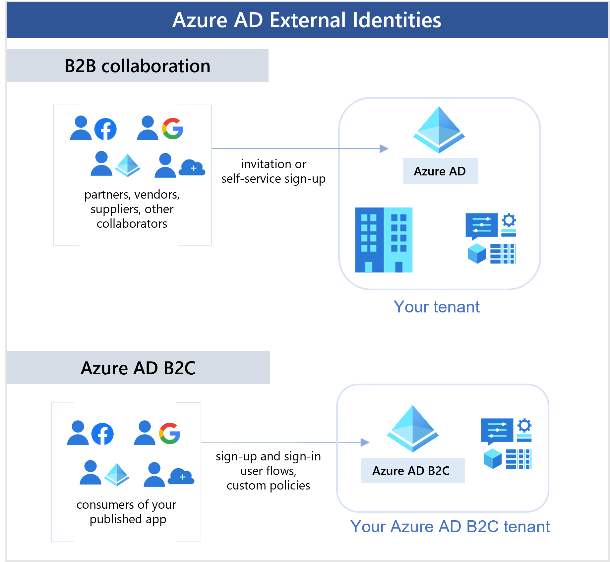

---

title: Microsoft Entra External ID overview
description: Microsoft Entra External ID allow you to collaborate with or publish apps to people outside your organization. Compare solutions for External Identities, including Microsoft Entra B2B collaboration, Microsoft Entra B2B collaboration, and Azure AD B2C.

services: active-directory
ms.service: active-directory
ms.subservice: B2B
ms.topic: overview
ms.date: 05/05/2023
ms.author: mimart
author: msmimart
manager: celestedg

ms.collection: M365-identity-device-management
---

# Overview of Microsoft Entra External ID

Microsoft Entra External ID refers to all the ways you can securely interact with users outside of your organization. If you want to collaborate with partners, distributors, suppliers, or vendors, you can share your resources and define how your internal users can access external organizations. If you're a developer creating consumer-facing apps, you can manage your customers' identity experiences.

With External ID, external users can "bring their own identities." Whether they have a corporate or government-issued digital identity, or an unmanaged social identity like Google or Facebook, they can use their own credentials to sign in. The external user’s identity provider manages their identity, and you manage access to your apps with Microsoft Entra ID or Azure AD B2C to keep your resources protected.

The following capabilities make up External Identities:

- **B2B collaboration** - Collaborate with external users by letting them use their preferred identity to sign in to your Microsoft applications or other enterprise applications (SaaS apps, custom-developed apps, etc.). B2B collaboration users are represented in your directory, typically as guest users.

- **B2B direct connect** - Establish a mutual, two-way trust with another Microsoft Entra organization for seamless collaboration. B2B direct connect currently supports Teams shared channels, enabling external users to access your resources from within their home instances of Teams. B2B direct connect users aren't represented in your directory, but they're visible from within the Teams shared channel and can be monitored in Teams admin center reports.

- **Azure AD B2C** - Publish modern SaaS apps or custom-developed apps (excluding Microsoft apps) to consumers and customers, while using Azure AD B2C for identity and access management.

- **Microsoft Entra multi-tenant organization** - Collaborate with multiple tenants in a single Microsoft Entra organization via cross-tenant synchronization.  

Depending on how you want to interact with external organizations and the types of resources you need to share, you can use a combination of these capabilities.

## B2B collaboration

With [B2B collaboration](what-is-b2b.md), you can invite anyone to sign in to your Microsoft Entra organization using their own credentials so they can access the apps and resources you want to share with them. Use B2B collaboration when you need to let external users access your Office 365 apps, software-as-a-service (SaaS) apps, and line-of-business applications, especially when the partner doesn't use Microsoft Entra ID or it's impractical for administrators to set up a mutual connection through B2B direct connect. There are no credentials associated with B2B collaboration users. Instead, they authenticate with their home organization or identity provider, and then your organization checks the guest user’s eligibility for B2B collaboration.

There are various ways to add external users to your organization for B2B collaboration:

- Invite users to B2B collaboration using their Microsoft Entra accounts, Microsoft accounts, or social identities that you enable, such as Google. An admin can use the Azure portal or PowerShell to invite users to B2B collaboration. The user signs into the shared resources using a simple redemption process with their work, school, or other email account.

- Use self-service sign-up user flows to let external users sign up for applications themselves. The experience can be customized to allow sign-up with a work, school, or social identity (like Google or Facebook). You can also collect information about the user during the sign-up process.

- Use [Microsoft Entra entitlement management](../governance/entitlement-management-overview.md), an identity governance feature that lets you manage [identity and access for external users at scale](../governance/entitlement-management-external-users.md#how-access-works-for-external-users) by automating access request workflows, access assignments, reviews, and expiration.

A user object is created for the B2B collaboration user in the same directory as your employees. This user object can be managed like other user objects in your directory, added to groups, and so on. You can assign permissions to the user object (for authorization) while letting them use their existing credentials (for authentication).

You can use [cross-tenant access settings](cross-tenant-access-overview.md) to manage B2B collaboration with other Microsoft Entra organizations and across Microsoft Azure clouds. For B2B collaboration with non-Azure AD external users and organizations, use [external collaboration settings](external-collaboration-settings-configure.md).

## B2B direct connect

B2B direct connect is a new way to collaborate with other Microsoft Entra organizations. This feature currently works with Microsoft Teams shared channels. With B2B direct connect, you create two-way trust relationships with other Microsoft Entra organizations to allow users to seamlessly sign in to your shared resources and vice versa. B2B direct connect users aren't added as guests to your Microsoft Entra directory. When two organizations mutually enable B2B direct connect, users authenticate in their home organization and receive a token from the resource organization for access. Learn more about [B2B direct connect in Microsoft Entra External ID](b2b-direct-connect-overview.md).

Currently, B2B direct connect enables the Teams Connect shared channels feature, which lets your users collaborate with external users from multiple organizations with a Teams shared channel for chat, calls, file-sharing, and app-sharing. Once you’ve set up B2B direct connect with an external organization, the following Teams shared channels capabilities become available:

- Within Teams, a shared channel owner can search for allowed users from the external organization and add them to the shared channel.

- External users can access the Teams shared channel without having to switch organizations or sign in with a different account. From within Teams, the external user can access files and apps through the Files tab. The user’s access is determined by the shared channel’s policies.

You use [cross-tenant access settings](cross-tenant-access-settings-b2b-collaboration.md) to manage trust relationships with other Microsoft Entra organizations and define inbound and outbound policies for B2B direct connect.

For details about the resources, files, and applications that are available to the B2B direct connect user via the Teams shared channel refer to [Chat, teams, channels, & apps in Microsoft Teams](/microsoftteams/deploy-chat-teams-channels-microsoft-teams-landing-page).

## Azure AD B2C

Azure AD B2C is a Customer Identity and Access Management (CIAM) solution that lets you build user journeys for consumer- and customer-facing apps. If you're a business or individual developer creating customer-facing apps, you can scale to millions of consumers, customers, or citizens by using Azure AD B2C. Developers can use Azure AD B2C as the full-featured CIAM system for their applications.

With Azure AD B2C, customers can sign in with an identity they've already established (like Facebook or Gmail). You can completely customize and control how customers sign up, sign in, and manage their profiles when using your applications. 

Although Azure AD B2C is built on the same technology as Microsoft Entra External ID, it's a separate service with some feature differences. For more information about how an Azure AD B2C tenant differs from a Microsoft Entra tenant, see [Supported Microsoft Entra features](/azure/active-directory-b2c/supported-azure-ad-features) in the [Azure AD B2C documentation](/azure/active-directory-b2c/).

## Comparing External Identities feature sets

The following table gives a detailed comparison of the scenarios you can enable with Microsoft Entra External ID. In the B2B scenarios, an external user is anyone who isn't homed in your Microsoft Entra organization.

|   | B2B collaboration | B2B direct connect |  Azure AD B2C  |
| ---- | --- |  --- | --- |
| **Primary scenario**  | Collaborate with external users by letting them use their preferred identity to sign in to resources in your Microsoft Entra organization. Provides access to Microsoft applications or your own applications (SaaS apps, custom-developed apps, etc.).    *Example:* Invite an external user to sign in to your Microsoft apps or become a guest member in Teams. | Collaborate with users from other Microsoft Entra organizations by establishing a mutual connection. Currently can be used with Teams shared channels, which external users can access from within their home instances of Teams.    *Example:* Add an external user to a Teams shared channel, which provides a space to chat, call, and share content.  | Publish apps to consumers and customers using Azure AD B2C for identity experiences. Provides identity and access management for modern SaaS or custom-developed applications (not first-party Microsoft apps). |
| **Intended for**  | Collaborating with business partners from external organizations like suppliers, partners, vendors. These users may or may not have Microsoft Entra ID or managed IT.   |  Collaborating with business partners from external organizations that use Microsoft Entra ID, like suppliers, partners, vendors. | Customers of your product. These users are managed in a separate Microsoft Entra directory. |
| **User management**  | B2B collaboration users are managed in the same directory as employees but are typically annotated as guest users. Guest users can be managed the same way as employees, added to the same groups, and so on. Cross-tenant access settings can be used to determine which users have access to B2B collaboration.   |  No user object is created in your Microsoft Entra directory. Cross-tenant access settings determine which users have access to B2B collaboration. direct connect. Shared channel users can be managed in Teams, and users’ access is determined by the Teams shared channel’s policies.    | User objects are created for consumer users in your Azure AD B2C directory. They're managed separately from the organization's employee and partner directory (if any). |
| **Identity providers supported**  | External users can collaborate using work accounts, school accounts, any email address, SAML and WS-Fed based identity providers, and social identity providers like Gmail and Facebook. |  External users collaborate using Microsoft Entra ID work accounts or school accounts.   | Consumer users with local application accounts (any email address, user name, or phone number), Microsoft Entra ID, various supported social identities, and users with corporate and government-issued identities via SAML/WS-Fed-based identity provider federation. |
| **Single sign-on (SSO)**  | SSO to all Microsoft Entra connected apps is supported. For example, you can provide access to Microsoft 365 or on-premises apps, and to other SaaS apps such as Salesforce or Workday.  |  SSO to a Teams shared channel. | SSO to customer owned apps within the Azure AD B2C tenants is supported. SSO to Microsoft 365 or to other Microsoft SaaS apps isn't supported. |
| **Licensing and billing**  | Based on monthly active users (MAU), including B2B collaboration and Azure AD B2C users. Learn more about [External Identities pricing](https://azure.microsoft.com/pricing/details/active-directory/external-identities/) and [billing setup for B2B](external-identities-pricing.md).  |  Based on monthly active users (MAU), including B2B collaboration, B2B direct connect, and Azure AD B2C users. Learn more about [External Identities pricing](https://azure.microsoft.com/pricing/details/active-directory/external-identities/) and [billing setup for B2B](external-identities-pricing.md).   | Based on monthly active users (MAU), including B2B collaboration and Azure AD B2C users. Learn more about [External Identities pricing](https://azure.microsoft.com/pricing/details/active-directory/external-identities/) and [billing setup for Azure AD B2C](/azure/active-directory-b2c/billing). |
| **Security policy and compliance**        | Managed by the host/inviting organization (for example, with [Conditional Access policies](authentication-conditional-access.md) and cross-tenant access settings). |  Managed by the host/inviting organization (for example, with [Conditional Access policies](authentication-conditional-access.md) and cross-tenant access settings). See also the [Teams documentation](/microsoftteams/security-compliance-overview).   | Managed by the organization via [Conditional Access and Identity Protection](/azure/active-directory-b2c/conditional-access-identity-protection-overview).         |
| **Multifactor authentication**   | If inbound trust settings to accept MFA claims from the user's home tenant are configured, and MFA policies have already been met in the user's home tenant, the external user can sign in. If MFA trust isn't enabled, the user is presented with an MFA challenge from the resource organization. [Learn more](authentication-conditional-access.md#mfa-for-azure-ad-external-users) about MFA for Microsoft Entra external users.  | If inbound trust settings to accept MFA claims from the user's home tenant are configured, and MFA policies have already been met in the user's home tenant, the external user can sign in. If MFA trust isn't enabled, and Conditional Access policies require MFA, the user is blocked from accessing resources. You *must* configure your inbound trust settings to accept MFA claims from the organization. [Learn more](authentication-conditional-access.md#mfa-for-azure-ad-external-users) about MFA for Microsoft Entra external users. | [Integrates directly](/azure/active-directory-b2c/multi-factor-authentication) with Microsoft Entra multifactor authentication.   |
| **Microsoft cloud settings**  | [Supported.](cross-cloud-settings.md)  | [Not supported.](cross-cloud-settings.md) | Not applicable.  |
| **Entitlement management**  | [Supported.](../governance/entitlement-management-overview.md)  | Not supported. | Not applicable. |
| **Line-of-business (LOB) apps**  | Supported.  | Not supported. Only B2B direct connect-enabled apps can be shared (currently, Teams Connect shared channels).  | Works with [RESTful API](/azure/active-directory-b2c/technical-overview#add-your-own-business-logic-and-call-restful-apis).   |
| **Conditional Access**        | Managed by the host/inviting organization. [Learn more](authentication-conditional-access.md) about Conditional Access policies. |  Managed by the host/inviting organization. [Learn more](authentication-conditional-access.md) about Conditional Access policies.   |  Managed by the organization via [Conditional Access and Identity Protection](/azure/active-directory-b2c/conditional-access-identity-protection-overview).        |
| **Branding**  | Host/inviting organization's brand is used.  | For sign-in screens, the user’s home organization brand is used. In the shared channel, the resource organization's brand is used. | Fully customizable branding per application or organization.   |
| **More information** | [Blog post](https://blogs.technet.microsoft.com/enterprisemobility/2017/02/01/azure-ad-b2b-new-updates-make-cross-business-collab-easy/), [Documentation](what-is-b2b.md)            |   [Documentation](b2b-direct-connect-overview.md)     | [Product page](https://azure.microsoft.com/services/active-directory-b2c/), [Documentation](/azure/active-directory-b2c/)       |

Based on your organization’s requirements you might use cross-tenant synchronization in multi-tenant organizations. For more information about this new feature, see the [multi-tenant organization documentation](../multi-tenant-organizations/index.yml) and the [feature comparison](../multi-tenant-organizations/overview.md#compare-multi-tenant-capabilities). 

## Managing External Identities features

Microsoft Entra B2B collaboration and B2B direct connect are features of Microsoft Entra External ID, and they're managed in the Azure portal through the Microsoft Entra service. To control inbound and outbound collaboration, you can use a combination of *cross-tenant access settings* and *external collaboration settings*.

### Cross-tenant access settings

Cross-tenant access settings let you manage B2B collaboration and B2B direct connect with other Microsoft Entra organizations. You can determine how other Microsoft Entra organizations collaborate with you (inbound access), and how your users collaborate with other Microsoft Entra organizations (outbound access). Granular controls let you determine the people, groups, and apps, both in your organization and in external Microsoft Entra organizations that can participate in B2B collaboration and B2B direct connect. You can also trust multifactor authentication and device claims (compliant claims and Microsoft Entra hybrid joined claims) from other Microsoft Entra organizations.

- **Default cross-tenant access settings** determine your baseline inbound and outbound settings for both B2B collaboration and B2B direct connect. Initially, your default settings are configured to allow all inbound and outbound B2B collaboration with other Microsoft Entra organizations and to block B2B direct connect with all Microsoft Entra organizations. You can change these initial settings to create your own default configuration.

- **Organization-specific access settings** let you configure customized settings for individual Microsoft Entra organizations. Once you add an organization and customize your cross-tenant access settings with this organization, these settings will take precedence over your defaults. For example, you could disable B2B collaboration and B2B direct connect with all external organizations by default, but enable these features only for Fabrikam.

For more information, see [Cross-tenant access in Microsoft Entra External ID](cross-tenant-access-overview.md).

Microsoft Entra ID has a feature for multi-tenant organizations called cross-tenant synchronization, which allows for a seamless collaboration experience across Microsoft Entra tenants. Cross-tenant synchronization settings are configured under the **Organization-specific access settings**. To learn more about multi-tenant organizations and cross-tenant synchronization see the [Multi-tenant organizations documentation](../multi-tenant-organizations/index.yml).

### Microsoft cloud settings for B2B collaboration

Microsoft Azure cloud services are available in separate national clouds, which are physically isolated instances of Azure. Increasingly, organizations are finding the need to collaborate with organizations and users across global cloud and national cloud boundaries. With Microsoft cloud settings, you can establish mutual B2B collaboration between the following Microsoft Azure clouds:

- Microsoft Azure global cloud and Microsoft Azure Government
- Microsoft Azure global cloud and Microsoft Azure operated by 21Vianet

To set up B2B collaboration between tenants in different clouds, both tenants need to configure their Microsoft cloud settings to enable collaboration with the other cloud. Then each tenant must configure inbound and outbound cross-tenant access with the tenant in the other cloud. See [Microsoft cloud settings](cross-cloud-settings.md) for details.

### External collaboration settings

External collaboration settings determine whether your users can send B2B collaboration invitations to external users and the level of access guest users have to your directory. With these settings, you can:

- **Determine guest user permissions**. Control what external guest users can see in your Microsoft Entra directory. For example, you can limit guest users' view of group memberships, or allow guests to view only their own profile information.

- **Specify who can invite guests**. By default, all users in your organization, including B2B collaboration guest users, can invite external users to B2B collaboration. If you want to limit the ability to send invitations, you can turn invitations on or off for everyone, or limit invitations to certain roles.

- **Allow or block domains**. Choose whether to allow or deny invitations to the domains you specify. For details, see [Allow or block domains](allow-deny-list.md).

For more information, see how to [configure B2B external collaboration settings](external-collaboration-settings-configure.md).

### How external collaboration and cross-tenant access settings work together

External collaboration settings work at the invitation level, whereas cross-tenant access settings work at the authentication level.

Cross-tenant access settings and external collaboration settings are used to manage two different aspects of B2B collaboration. Cross-tenant access settings control whether users can authenticate with external Microsoft Entra tenants, and they apply to both inbound and outbound B2B collaboration. By contrast, external collaboration settings control which of your users are allowed to send B2B collaboration invitations to external users from any organization.

When you're considering B2B collaboration with a specific external Microsoft Entra organization, you’ll want to assess whether your cross-tenant access settings allow B2B collaboration with that organization, and whether your external collaboration settings allow your users to send invitations to that organization's domain. Here are some examples:

- **Example 1**: You've previously added `adatum.com` (a Microsoft Entra organization) to the list of blocked domains in your external collaboration settings, but your cross-tenant access settings enable B2B collaboration for all Microsoft Entra organizations. In this case, the most restrictive setting applies. Your external collaboration settings will prevent your users from sending invitations to users at `adatum.com`.

- **Example 2**: You allow B2B collaboration with Fabrikam in your cross-tenant access settings, but then you add `fabrikam.com` to your blocked domains in your external collaboration settings. Your users won't be able to invite new Fabrikam guest users, but existing Fabrikam guests will be able to continue using B2B collaboration.

For B2B collaboration end-users who perform cross-tenant sign-ins, their home tenant branding appears, even if there isn't custom branding specified. In the following example, the company branding for Woodgrove Groceries appears on the left. The example on the right displays the default branding for the user's home tenant. 

:::image type="content" source="media/external-identities-overview/b2b-comparison.png" alt-text="Screenshots showing a comparison of the branded sign-in experience and the default sign-in experience.":::

### Azure Active Directory B2C management

Azure AD B2C is a separate consumer-based directory that you manage in the Azure portal through the Azure AD B2C service. Each Azure AD B2C tenant is separate and distinct from other Microsoft Entra ID and Azure AD B2C tenants. The Azure AD B2C portal experience is similar to Microsoft Entra ID, but there are key differences, such as the ability to customize your user journeys using the Identity Experience Framework.

For details about configuring and managing Azure AD B2C, see the [Azure AD B2C documentation](/azure/active-directory-b2c/).

## Related Microsoft Entra technologies

There are several Microsoft Entra technologies that are related to collaboration with external users and organizations. As you design your External Identities collaboration model, consider these other features.

### Microsoft Entra entitlement management for B2B guest user sign-up

As an inviting organization, you might not know ahead of time who the individual external collaborators are who need access to your resources. You need a way for users from partner companies to sign themselves up with policies that you control. If you want to enable users from other organizations to request access, and upon approval be provisioned with guest accounts and assigned to groups, apps, and SharePoint Online sites, you can use [Microsoft Entra entitlement management](../governance/entitlement-management-overview.md) to configure policies that [manage access for external users](../governance/entitlement-management-external-users.md#how-access-works-for-external-users).

### Microsoft Entra Microsoft Graph API for B2B collaboration

Microsoft Graph APIs are available for creating and managing External Identities features.

- **Cross-tenant access settings API**: The [Microsoft Graph cross-tenant access API](/graph/api/resources/crosstenantaccesspolicy-overview?view=graph-rest-beta&preserve-view=true) lets you programmatically create the same B2B collaboration and B2B direct connect policies that are configurable in the Azure portal. Using the API, you can set up policies for inbound and outbound collaboration to allow or block features for everyone by default and limit access to specific organizations, groups, users, and applications. The API also allows you to accept MFA and device claims (compliant claims and Microsoft Entra hybrid joined claims) from other Microsoft Entra organizations.

- **B2B collaboration invitation manager**: The [Microsoft Graph invitation manager API](/graph/api/resources/invitation) is available for building your own onboarding experiences for B2B guest users. You can use the [create invitation API](/graph/api/invitation-post?tabs=http) to automatically send a customized invitation email directly to the B2B user, for example. Or your app can use the inviteRedeemUrl returned in the creation response to craft your own invitation (through your communication mechanism of choice) to the invited user.

### Conditional Access

Organizations can enforce Conditional Access policies for external B2B collaboration and B2B direct connect users in the same way that they're enabled for full-time employees and members of the organization. For Microsoft Entra cross-tenant scenarios, if your Conditional Access policies require MFA or device compliance, you can now trust MFA and device compliance claims from an external user's home organization. When trust settings are enabled, during authentication, Microsoft Entra ID will check a user's credentials for an MFA claim or a device ID to determine if the policies have already been met. If so, the external user will be granted seamless sign-on to your shared resource. Otherwise, an MFA or device challenge will be initiated in the user's home tenant. Learn more about the [authentication flow and Conditional Access for external users](authentication-conditional-access.md).

### Multitenant applications

If you offer a Software as a Service (SaaS) application to many organizations, you can configure your application to accept sign-ins from any Microsoft Entra tenant. This configuration is called making your application multi-tenant. Users in any Microsoft Entra tenant will be able to sign in to your application after consenting to use their account with your application. See how to [enable multitenant sign-ins](../develop/howto-convert-app-to-be-multi-tenant.md).

### Multi-tenant organizations

A multi-tenant organization is an organization that has more than one instance of Microsoft Entra ID. There are various reasons for [multi-tenancy](../multi-tenant-organizations/overview.md#what-is-a-multi-tenant-organization), like using multiple clouds or having multiple geographical boundaries. Multi-tenant organizations use a one-way synchronization service in Microsoft Entra ID, called [cross-tenant synchronization](../multi-tenant-organizations/cross-tenant-synchronization-overview.md). Cross-tenant synchronization enables seamless collaboration for a multi-tenant organization. It improves user experience and ensures that users can access resources, without receiving an invitation email and having to accept a consent prompt in each tenant.

## Next steps

- [What is Microsoft Entra B2B collaboration?](what-is-b2b.md)
- [What is Microsoft Entra B2B direct connect?](b2b-direct-connect-overview.md)
- [About Azure AD B2C](/azure/active-directory-b2c/overview)
- [About Microsoft Entra multi-tenant organizations](../../active-directory/multi-tenant-organizations/overview.md)
