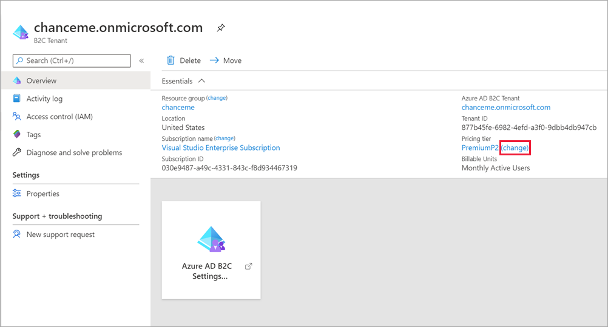

# Billing model for Azure AD External Identities

Azure Active Directory (Azure AD) External Identities pricing is based on monthly active users (MAU), which is the count of unique users with authentication activity within a calendar month. This billing model applies to both Azure AD B2C tenants and Azure AD guest user collaboration (B2B). MAU billing helps you reduce costs by offering a free tier and flexible, predictable pricing. To take advantage of MAU billing, your Azure AD tenant must be linked to an Azure subscription. If you have Azure AD B2C tenants that aren't already linked to a subscription, you'll need to do so to activate MAU billing. In this article, learn about MAU billing, linking your tenants to a subscription, and changing your pricing tier.

> [!IMPORTANT]
> This article does not contain pricing details. For the latest information about usage billing and pricing, see [Azure Active Directory B2C pricing](https://azure.microsoft.com/pricing/details/active-directory-b2c/).

## What do I need to do?

To take advantage of MAU billing, you'll need to make sure your tenant is linked to an Azure subscription. You might also need to switch your Azure AD B2C tenant to another pricing tier if you want to use Azure AD Premium P2 features, like risk-based Conditional Access.

|If your tenant is:  |You need to:  |
|---------|---------|
| An Azure AD tenant already linked to a subscription     | Do nothing. When you use External Identities features to collaborate with guest users, you'll be automatically billed using the MAU model.        |
| An Azure AD tenant not yet linked to a subscription     | [Link your Azure AD tenant to a subscription](#link-your-azure-ad-tenant-to-a-subscription) to activate MAU billing.        |
| An Azure AD B2C tenant already billed on a per-MAU basis     | Do nothing. When users authenticate to your Azure AD B2C tenant, you'll be automatically billed using the MAU-based billing model.        |
| An Azure AD B2C tenant not yet linked to a subscription     |  [Link your Azure AD B2C tenant to a subscription](#link-your-azure-ad-b2c-tenant-to-a-subscription) to activate MAU billing.     |
| An Azure AD B2C tenant that was linked to a subscription prior to November 1, 2019    | [Upgrade to MAU billing (recommended)](#azure-ad-b2c-pre-november-2019-tenants-switch-to-mau-billing-recommended), or stay on the per-authentication billing model.     |
| An Azure AD B2C tenant and you want to use premium features  (like risk-based Conditional Access)    | [Change to an Azure pricing tier](#change-your-azure-pricing-tier) that supports the features you want to use.        |
|  |  |

## About monthly active users (MAU) billing

Azure AD External Identities features, which include both Azure AD guest user collaboration (B2B) and Azure AD B2C, use MAU billing. Here's how the billing model works in each case.

- **Azure AD guest user collaboration (B2B)**: Within your Azure AD tenant, guest user collaboration usage is billed based on the count of unique guest users with authentication activity within a calendar month. This model replaces the 1:5 ratio billing model, which allowed up to 5 guest users for each Azure AD Premium license in your tenant. When your tenant is linked to a subscription and you use External Identities features to collaborate with guest users, you'll be automatically billed using the MAU-based billing model.
  
  The pricing tier that applies to your guest users is based on the highest pricing tier assigned to your Azure AD tenant. For example, if the highest pricing tier in your tenant is Azure AD Premium P1, the Premium P1 pricing tier also applies to your guest users. If the highest pricing is Azure AD Free, you'll be asked to upgrade to a premium pricing tier when you try to use premium features for guest users.

- **Azure AD B2C**: MAU billing went into effect for Azure AD B2C tenants on **November 1, 2019**. Any Azure AD B2C tenants that you created and linked to a subscription on or after that date have been billed on a per-MAU basis. If you have an Azure AD B2C tenant that hasn't been linked to a subscription, you'll need to do so now. If you have an existing Azure AD B2C tenant that was linked to a subscription prior to November 1, 2019, we recommend you upgrade to the monthly active users (MAU) billing model, or you can stay on the per-authentication billing model.
  
  Your Azure AD B2C tenant must also be linked to the appropriate Azure pricing tier based on the features you want to use. Premium features require Azure AD [Azure AD Premium P1 or P2 pricing](https://azure.microsoft.com/pricing/details/active-directory-b2c/). You might need to upgrade your pricing tier as you use new features. For example, if you want to use risk-based Identity Protection and Conditional Access, you’ll need to select the Azure AD Premium P2 pricing tier for your tenant.

## Link your Azure AD tenant to a subscription

An Azure AD tenant must be linked to an Azure subscription for proper billing and access to features included in the subscription.

1. Sign in to the [Azure portal](https://portal.azure.com/) with an Azure account that's been assigned at least the [Contributor](../role-based-access-control/built-in-roles.md) role within the subscription or a resource group within the subscription.

2. Select the directory that contains your subscription: In the Azure portal toolbar, select the **Directory + Subscription** icon, and then select the directory that contains your subscription.

    

3. Under **Azure Services**, select **Azure Active Directory**.

4. In the left menu, select **External Identities**.

5. Under **Subscriptions**, select **Linked subscriptions**.

6. In the tenant list, select the checkbox next to the tenant, and then select **Link subscription**.

    

7. In the Link a subscription pane, select a **Subscription** and a **Resource group**. Then select **Apply**.

    

After you complete these steps, your Azure subscription is billed in accordance with your Azure Direct or Enterprise Agreement details, if applicable.

## Link your Azure AD B2C tenant to a subscription

You need to explicitly link an Azure AD B2C tenant to an Azure subscription by creating an Azure AD B2C *resource* within the target Azure subscription. Several Azure AD B2C resources can be created in a single Azure subscription, along with other Azure resources like virtual machines, Storage accounts, and Logic Apps. However, the linked subscription can't be used to add other Azure license-based services or Office 365 licenses within the Azure AD B2C tenant. You can see all of the resources within a subscription by going to the Azure Active Directory (Azure AD) tenant that the subscription is associated with.

### Prerequisites

* [Azure subscription](https://azure.microsoft.com/free/)
* [Azure AD B2C tenant](tutorial-create-tenant.md) that you want to link to a subscription
  * You must be a tenant administrator
  * The tenant must not already be linked to a subscription

### Create the link

1. Sign in to the [Azure portal](https://portal.azure.com).
1. Select the **Directory + subscription** filter in the top menu, and then select the directory that contains the Azure subscription you'd like to use (*not* the directory containing the Azure AD B2C tenant).
1. Select **Create a resource**, enter `Active Directory B2C` in the **Search the Marketplace** field, and then select **Azure Active Directory B2C**.
1. Select **Create**
1. Select **Link an existing Azure AD B2C Tenant to my Azure subscription**.
1. Select an **Azure AD B2C Tenant** from the dropdown. Only tenants for which you are a global administrator and that are not already linked to a subscription are shown. The **Azure AD B2C Resource name** field is populated with the domain name of the Azure AD B2C tenant you select.
1. Select an active Azure **Subscription** of which you are an administrator.
1. Under **Resource group**, select **Create new**, and then specify the **Resource group location**. The resource group settings here have no impact on your Azure AD B2C tenant location, performance, or billing status.
1. Select **Create**.

    

After you complete these steps for an Azure AD B2C tenant, your Azure subscription is billed in accordance with your Azure Direct or Enterprise Agreement details, if applicable.

## Change your Azure pricing tier

A tenant must be linked to the appropriate Azure pricing tier based on the features you want to use with your Azure AD B2C tenant. <!--Premium features require an Azure AD Premium P1 or P2 features, as described in the [Azure Active Directory B2C pricing](https://azure.microsoft.com/pricing/details/active-directory-b2c/).--> In some cases, you'll need to upgrade your pricing tier as you use new features. For example, if you want to use Identity Protection, risk-based Conditional Access, and any future Premium P2 capabilities with Azure AD B2C, you’ll need to select the Azure AD Premium P2 pricing tier for your tenant.

To change your pricing tier, follow these steps.

1. Sign in to the [Azure portal](https://portal.azure.com).

1. Select the **Directory + subscription** filter in the top menu, and then select the directory that contains the Azure subscription you'd like to use (*not* the directory containing the Azure AD B2C tenant).

1. In the left menu, select **All resources**. Or, select **All services** and search for and select **All resources**.

1. Select the name of your Azure AD B2C tenant.

    

1. Under **Pricing tier**, select **change**.

1. Select the pricing tier that includes the features you want to enable.

## Upgrade to MAU billing (pre-November 2019 Azure AD B2C tenants)

If you linked your Azure AD B2C tenant to a subscription prior to **November 1, 2019**, the previous per-authentication billing model is being used. We recommend you upgrade to the monthly active users (MAU) billing model. Billing options are configured in your Azure AD B2C resource.

The switch to monthly active users (MAU) billing is **irreversible**. Once you convert an Azure AD B2C resource to the MAU-based billing model, you cannot revert that resource to the per-authentication billing model.

Here's how to make the switch to MAU billing for an existing Azure AD B2C resource:

1. Sign in to the [Azure portal](https://portal.azure.com) as the subscription owner with administrative access to the Azure AD B2C resource.

1. Select the **Directory + subscription** filter in the top menu, and then select the Azure AD B2C directory that you want to upgrade to MAU billing. 

    

2. In the left menu, select **Azure AD B2C**. Or, select **All services** and search for and select **Azure AD B2C**.

3. On the **Overview** page of the Azure AD B2C tenant, select the link under **Resource name**. You're directed to the Azure AD B2C resource in your Azure AD tenant. 

    

4. On the **Overview** page of the Azure AD B2C resource, under **Billable Units**, select the **Per Authentication (Change to MAU)** link. 

    

5. Select **Confirm** to complete the upgrade to MAU billing. 

    

### What to expect when you transition to MAU billing from per-authentication billing

MAU-based metering is enabled as soon as you, the subscription/resource owner, confirm the change. Your monthly bill will reflect the units of authentication billed until the change, and new units of MAU starting with the change.

Users are not double-counted during the transition month. Unique active users who authenticate prior to the change are charged a per-authentication rate in a calendar month. Those same users are not included in the MAU calculation for the remainder of the subscription's billing cycle. For example:

* The Contoso B2C tenant has 1,000 users. 250 users are active in any given month. The subscription administrator changes from per-authentication to monthly active users (MAU) on the 10th of the month.
* Billing for 1st-10th is billed using the per-authentication model.
  * If 100 users sign in during this period (1st-10th), those users are tagged as *paid for the month*.
* Billing from the 10th (the effective time of transition) is  billed at the MAU rate.
  * If an additional 150 users sign in during this period (10th-30th), only the additional 150 are billed.
  * The continued activity of the first 100 users does not impact billing for the remainder of the calendar month.

During the billing period of the transition, the subscription owner will likely see entries for both methods (per-authentication and per-MAU) appear in their Azure subscription billing statement:

* An entry for the usage until the date/time of change that reflects per-authentication.
* An entry for the usage after the change that reflects monthly active users (MAU).

For the latest information about usage billing and pricing for Azure AD B2C, see [Azure Active Directory B2C pricing](https://azure.microsoft.com/pricing/details/active-directory-b2c/).

### Manage your Azure AD B2C tenant resources

After you create the Azure AD B2C resource in an Azure subscription, you should see a new resource of the type "B2C tenant" appear with your other Azure resources.

You can use this resource to:

* Navigate to the subscription to review billing information
* Get the Azure AD B2C tenant's tenant ID in GUID format
* Go to your Azure AD B2C tenant
* Submit a support request
* Move your Azure AD B2C tenant resource to another Azure subscription or resource group

### Regional restrictions

If you've established regional restrictions for Azure resource creation in your subscription, that restriction may prevent you from creating the Azure AD B2C resource.

To mitigate this issue, relax your regional restrictions.

### Azure Cloud Solution Providers (CSP) subscriptions

Azure Cloud Solution Providers (CSP) subscriptions are supported in Azure AD B2C. The functionality is available using APIs or the Azure portal for Azure AD B2C and for all Azure resources. CSP subscription administrators can link, move, and delete relationships with Azure AD B2C as done with other Azure resources.

The management of Azure AD B2C using role-based access control is not affected by the association between the Azure AD B2C tenant and an Azure CSP subscription. Role-based access control is achieved by using tenant-based roles, not subscription-based roles.

### Change the Azure AD B2C tenant billing subscription

Azure AD B2C tenants can be moved to another subscription if the source and destination subscriptions exist within the same Azure Active Directory tenant.

To learn how to move Azure resources like your Azure AD B2C tenant to another subscription, see [Move resources to new resource group or subscription](../azure-resource-manager/management/move-resource-group-and-subscription.md).

Before you initiate the move, be sure to read the entire article to fully understand the limitations and requirements for such a move. In addition to instructions for moving resources, it includes critical information like a pre-move checklist and how to validate the move operation.

## Next steps

For the latest pricing information, see [Azure Active Directory B2C pricing](https://azure.microsoft.com/pricing/details/active-directory-b2c/).
