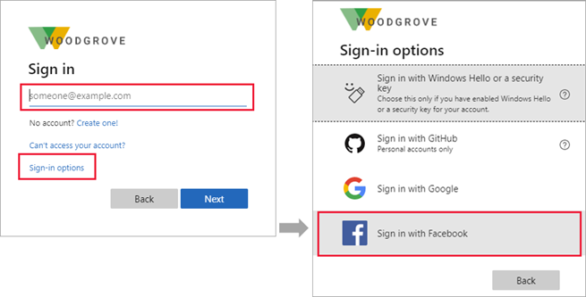

---

title: Add Facebook as an identity provider
description: Federate with Facebook to enable external users (guests) to sign in to your Azure AD apps with their own Facebook accounts.

services: active-directory
ms.service: active-directory
ms.subservice: B2B
ms.topic: how-to
ms.date: 01/20/2023

ms.author: mimart
author: msmimart
manager: celestedg
ms.custom: "it-pro, seo-update-azuread-jan"
ms.collection: engagement-fy23, M365-identity-device-management

# Customer intent: As a tenant administrator, I want to set up Facebook as an identity provider for guest user login. 
---

# Add Facebook as an identity provider for External Identities

You can add Facebook to your self-service sign-up user flows so that users can sign in to your applications using their own Facebook accounts. To allow users to sign in using Facebook, you'll first need to [enable self-service sign-up](self-service-sign-up-user-flow.md) for your tenant. After you add Facebook as an identity provider, set up a user flow for the application and select Facebook as one of the sign-in options.

After you've added Facebook as one of your application's sign-in options, on the **Sign in** page, a user can simply enter the email they use to sign in to Facebook, or they can select **Sign-in options** and choose **Sign in with Facebook**. In either case, they'll be redirected to the Facebook sign in page for authentication.

> [!NOTE]
> Users can only use their Facebook accounts to sign up through apps using self-service sign-up and user flows. Users cannot be invited and redeem their invitation using a Facebook account.

## Create an app in the Facebook developers console

To use a Facebook account as an [identity provider](identity-providers.md), you need to create an application in the Facebook developers console. If you don't already have a Facebook account, you can sign up at [https://www.facebook.com/](https://www.facebook.com).

> [!NOTE]  
> Use the following URLs in the steps 9 and 16 below.
> - For **Site URL** enter the address of your application, such as `https://contoso.com`.
> - For **Valid OAuth redirect URIs**, enter `https://login.microsoftonline.com/te/<tenant-id>/oauth2/authresp`. You can find your `<tenant-ID>` in the Azure Active Directory Overview blade.

1. Sign in to [Facebook for developers](https://developers.facebook.com/) with your Facebook account credentials.
2. If you haven't already done so, you need to register as a Facebook developer. To do this, select **Get Started** on the upper-right corner of the page, accept Facebook's policies, and complete the registration steps.
3. Select **My Apps** and then **Create App**.
1. **Select an app type** and then **Details**
1. **Add an app name** and a valid **App contact email**.
1. Select **Create app**. This may require you to accept Facebook platform policies and complete an online security check.
1. Select **Settings** > **Basic**.
1. Choose a **Category**, for example **Business and pages**. This value is required by Facebook, but not used for Azure AD.
1. At the bottom of the page, select **Add Platform**, and then select **Website**.
1. In **Site URL**, enter the appropriate URL (noted above).
1. In **Privacy Policy URL** at the top of the page, enter the URL for the page where you maintain privacy information for your application, for example `http://www.contoso.com`.
1. Select **Save changes**.
1. At the top of the page, copy the value of **App ID**.
1. At the top of the page, select **Show** and copy the value of **App secret**. You use both of them to configure Facebook as an identity provider in your tenant. **App secret** is an important security credential.
1. In the left menu select **Add Product** next to **Products**, and then select **Set up** under **Facebook Login**.
1. Under **Facebook Login** in the left, select **Settings**.
1. In **Valid OAuth redirect URIs**, enter the appropriate URL (noted above).
1. Select **Save changes** at the bottom of the page.
1. To make your Facebook application available to Azure AD, select the **App Mode** selector at the top of the page and turn it **Live** to make the Application public.
	
## Configure a Facebook account as an identity provider
Now you'll set the Facebook client ID and client secret, either by entering it in the Azure portal or by using PowerShell. You can test your Facebook configuration by signing up via a user flow on an app enabled for self-service sign-up.

### To configure Facebook federation in the Azure portal

[!INCLUDE [portal updates](~/articles/active-directory/includes/portal-update.md)]

1. Sign in to the [Azure portal](https://portal.azure.com) as an External Identity Provider Administrator or a Global Administrator.
2. Under **Azure services**, select **Azure Active Directory**.
3. In the left menu, select **External Identities**.
4. Select **All identity providers**, then select **Facebook**.
5. For the **Client ID**, enter the **App ID** of the Facebook application that you created earlier.
6. For the **Client secret**, enter the **App secret** that you recorded.

   :::image type="content" source="media/facebook-federation/add-social-identity-provider-page.png" alt-text="Screenshot showing the Add social identity provider page.":::

7. Select **Save**.
### To configure Facebook federation by using PowerShell
1. Install the latest version of the Azure AD PowerShell for Graph module ([AzureADPreview](https://www.powershellgallery.com/packages/AzureADPreview)).
2. Run the following command:
   `Connect-AzureAD`.
3. At the sign-in prompt, sign in with the managed Global Administrator account.  
4. Run the following command: 
   
   `New-AzureADMSIdentityProvider -Type Facebook -Name Facebook -ClientId [Client ID] -ClientSecret [Client secret]`
 
   > [!NOTE]
   > Use the client ID and client secret from the app you created above in the Facebook developer console. For more information, see the [New-AzureADMSIdentityProvider](/powershell/module/azuread/new-azureadmsidentityprovider?view=azureadps-2.0-preview&preserve-view=true) article. 

## How do I remove Facebook federation?
You can delete your Facebook federation setup. If you do so, any users who have signed up through user flows with their Facebook accounts will no longer be able to sign in. 

### To delete Facebook federation in the Azure portal: 

1. Sign in to the [Azure portal](https://portal.azure.com) as the global administrator of your Azure AD tenant.
2. Under **Azure services**, select **Azure Active Directory**.
3. In the left menu, select **External Identities**.
3. Select **All identity providers**.
4. Select the **Facebook** line, and then select **Delete**. 
5. Select **Yes** to confirm deletion.

### To delete Facebook federation by using PowerShell: 
1. Install the latest version of the Azure AD PowerShell for Graph module ([AzureADPreview](https://www.powershellgallery.com/packages/AzureADPreview)).
2. Run `Connect-AzureAD`.  
4. In the sign-in prompt, sign in with the managed Global Administrator account.  
5. Enter the following command:

    `Remove-AzureADMSIdentityProvider -Id Facebook-OAUTH`

   > [!NOTE]
   > For more information, see [Remove-AzureADMSIdentityProvider](/powershell/module/azuread/Remove-AzureADMSIdentityProvider?view=azureadps-2.0-preview&preserve-view=true). 

## Next steps

- [Add self-service sign-up to an app](self-service-sign-up-user-flow.md)
- [SAML/WS-Fed IdP federation](direct-federation.md)
- [Google federation](google-federation.md)
