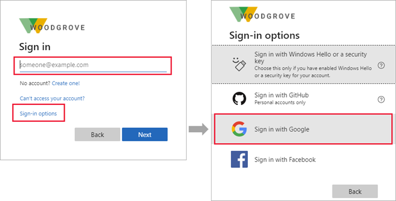
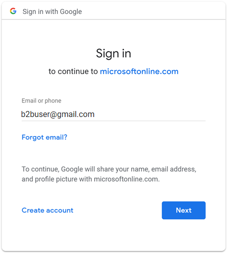
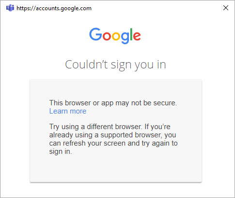
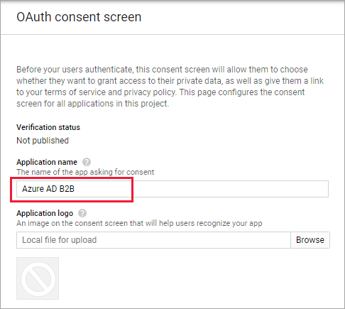
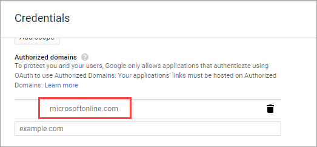
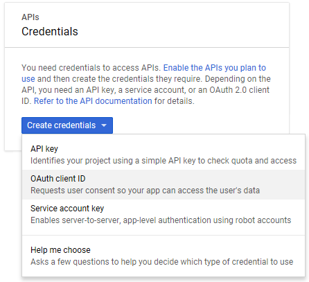
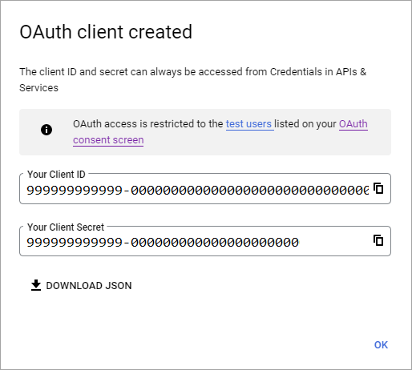
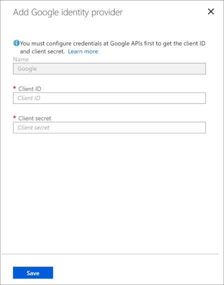
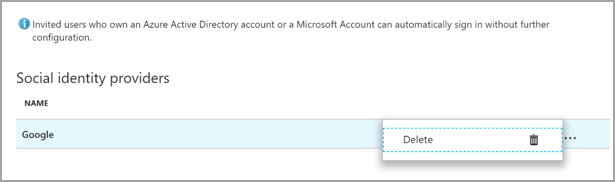

---

title: Add Google as an identity provider for B2B - Azure AD
description: Federate with Google to enable guest users to sign in to your Azure AD apps with their own Gmail accounts.

services: active-directory
ms.service: active-directory
ms.subservice: B2B
ms.topic: how-to
ms.date: 07/13/2021

ms.author: mimart
author: msmimart
manager: celestedg
ms.reviewer: mal
ms.custom: "it-pro, seo-update-azuread-jan"
ms.collection: M365-identity-device-management
---

# Add Google as an identity provider for B2B guest users

By setting up federation with Google, you can allow invited users to sign in to your shared apps and resources with their own Gmail accounts, without having to create Microsoft accounts.

After you've added Google as one of your application's sign-in options, on the **Sign in** page, a user can simply enter the email they use to sign in to Google, or they can select **Sign-in options** and choose **Sign in with Google**. In either case, they'll be redirected to the Google sign-in page for authentication.

> [!NOTE]
> Google federation is designed specifically for Gmail users. To federate with Google Workspace domains, use [SAML/WS-Fed identity provider federation](direct-federation.md).

> [!IMPORTANT]
>
> - **Starting July 12, 2021**, if Azure AD B2B customers set up new Google integrations for use with self-service sign-up or for inviting external users for their custom or line-of-business applications, authentication could be blocked for Gmail users (with the error screen shown below in [What to expect](#what-to-expect)). This issue occurs only if you create Google integration for self-service sign-up user flows or invitations after July 12, 2021 and Gmail authentications in your custom or line-of-business applications haven’t been moved to system web-views. Because system web-views are enabled by default, most apps will not be affected. To avoid the issue, we strongly advise you to move Gmail authentications to system browsers before creating any new Google integrations for self-service sign-up. Please refer to [Action needed for embedded web-views](#action-needed-for-embedded-frameworks).
> - **Starting September 30, 2021**, Google is [deprecating web-view sign-in support](https://developers.googleblog.com/2016/08/modernizing-oauth-interactions-in-native-apps.html). If your apps authenticate users with an embedded web-view and you're using Google federation with [Azure AD B2C](../../active-directory-b2c/identity-provider-google.md) or Azure AD B2B for external user invitations or [self-service sign-up](identity-providers.md), Google Gmail users won't be able to authenticate. [Learn more](#deprecation-of-web-view-sign-in-support).

## What is the experience for the Google user?

When a Google user redeems your invitation, their experience varies depending on whether they're already signed in to Google:

- Guest users who aren't signed in to Google will be prompted to do so.
- Guest users who are already signed in to Google will be prompted to choose the account they want to use. They must choose the account you used to invite them.

Guest users who see a "header too long" error can clear their cookies or open a private or incognito window and try to sign in again.

## Sign-in endpoints

Google guest users can now sign in to your multi-tenant or Microsoft first-party apps by using a [common endpoint](redemption-experience.md#redemption-and-sign-in-through-a-common-endpoint) (in other words, a general app URL that doesn't include your tenant context). During the sign-in process, the guest user chooses **Sign-in options**, and then selects **Sign in to an organization**. The user then types the name of your organization and continues signing in using their Google credentials.

Google guest users can also use application endpoints that include your tenant information, for example:

  * `https://myapps.microsoft.com/?tenantid=<your tenant ID>`
  * `https://myapps.microsoft.com/<your verified domain>.onmicrosoft.com`
  * `https://portal.azure.com/<your tenant ID>`

You can also give Google guest users a direct link to an application or resource by including your tenant information, for example `https://myapps.microsoft.com/signin/Twitter/<application ID?tenantId=<your tenant ID>`.

## Deprecation of web-view sign-in support

Starting September 30, 2021, Google is [deprecating embedded web-view sign-in support](https://developers.googleblog.com/2016/08/modernizing-oauth-interactions-in-native-apps.html). If your apps authenticate users with an embedded web-view and you're using Google federation with [Azure AD B2C](../../active-directory-b2c/identity-provider-google.md) or Azure AD B2B for [external user invitations](google-federation.md) or [self-service sign-up](identity-providers.md), Google Gmail users won't be able to authenticate.

The following are known scenarios that will impact Gmail users:
- Microsoft apps (e.g. Teams and PowerApps) on Windows 
- Windows apps that use the [WebView](/windows/communitytoolkit/controls/wpf-winforms/webview) control, [WebView2](/microsoft-edge/webview2/), or the older WebBrowser control, for authentication. These apps should migrate to using the Web Account Manager (WAM) flow.
- Android applications using the WebView UI element 
- iOS applications using UIWebView/WKWebview 
- [Apps using ADAL](../develop/howto-get-list-of-all-active-directory-auth-library-apps.md)

This change does not affect:
- Web apps
- Mobile apps using system web-views for authentication ([SFSafariViewController](https://developer.apple.com/documentation/safariservices/sfsafariviewcontroller) on iOS, [Custom Tabs](https://developer.chrome.com/docs/android/custom-tabs/overview/) on Android).  
- Google Workspace identities, for example when you’re using [SAML-based federation](direct-federation.md) with Google Workspace

We’re confirming with Google whether this change affects the following:
- Windows apps that use the Web Account Manager (WAM) or Web Authentication Broker (WAB).  

We’re continuing to test various platforms and scenarios, and will update this article accordingly.

### Action needed for embedded web-views

Modify your apps to use the system browser for sign-in. For details, see [Embedded vs System Web UI](../develop/msal-net-web-browsers.md#embedded-vs-system-web-ui) in the MSAL.NET documentation. All MSAL SDKs use the system web-view by default.

### What to expect

Before Google puts these changes into place on September 30, 2021, Microsoft will deploy a workaround for apps still using embedded web-views to ensure that authentication isn't blocked. Users who sign in with a Gmail account in an embedded web-view will be prompted to enter a code in a separate browser to finish signing in.

Alternatively, you can have your existing and new Gmail users sign in with email one-time passcode. To have your Gmail users use email one-time passcode:
1. [Enable email one-time passcode](one-time-passcode.md#enable-email-one-time-passcode)
2. [Remove Google Federation](google-federation.md#how-do-i-remove-google-federation)
3. [Reset redemption status](reset-redemption-status.md) of your Gmail users so they can use email one-time passcode going forward.

Applications that are migrated to an allowed web-view for authentication won't be affected, and users will be allowed to authenticate via Google as usual.

If applications are not migrated to an allowed web-view for authentication, then affected Gmail users will see the following screen.

We will update this document as dates and further details are shared by Google.

### Distinguishing between CEF/Electron and embedded web-views

In addition to the [deprecation of embedded web-view and framework sign-in support](#deprecation-of-web-view-sign-in-support), Google is also [deprecating Chromium Embedded Framework (CEF) based Gmail authentication](https://developers.googleblog.com/2020/08/guidance-for-our-effort-to-block-less-secure-browser-and-apps.html). For applications built on CEF, such as Electron apps, Google will disable authentication on June 30, 2021. Impacted applications have received notice from Google directly, and are not covered in this documentation.  This document pertains to the embedded web-views described above, which Google will restrict at a separate date on September 30, 2021.

### Action needed for embedded frameworks

Follow [Google’s guidance](https://developers.googleblog.com/2016/08/modernizing-oauth-interactions-in-native-apps.html) to determine if your apps are affected.

## Step 1: Configure a Google developer project

First, create a new project in the Google Developers Console to obtain a client ID and a client secret that you can later add to Azure Active Directory (Azure AD). 
1. Go to the Google APIs at https://console.developers.google.com, and sign in with your Google account. We recommend that you use a shared team Google account.
2. Accept the terms of service if you're prompted to do so.
3. Create a new project: In the upper-left corner of the page, select the project list, and then on the **Select a project** page, select **New Project**.
4. On the **New Project** page, give the project a name (for example, **Azure AD B2B**), and then select **Create**: 
   
   

4. On the **APIs & Services** page, select **View** under your new project.

5. Select **Go to APIs overview** on the APIs card. Select **OAuth consent screen**.

6. Select **External**, and then select **Create**. 

7. On the **OAuth consent screen**, enter an **Application name**:

   

8. Scroll to the **Authorized domains** section and enter **microsoftonline.com**:

   

9. Select **Save**.

10. Select **Credentials**. On the **Create credentials** menu, select **OAuth client ID**:

    

11. Under **Application type**, select **Web application**. Give the application a suitable name, like **Azure AD B2B**. Under **Authorized redirect URIs**, enter the following URIs:
    - `https://login.microsoftonline.com`
    - `https://login.microsoftonline.com/te/<tenant ID>/oauth2/authresp`  (where `<tenant ID>` is your tenant ID)
   
    > [!NOTE]
    > To find your tenant ID, go to the [Azure portal](https://portal.azure.com). Under **Azure Active Directory**, select **Properties** and copy the **Tenant ID**.

    

12. Select **Create**. Copy the client ID and client secret. You'll use them when you add the identity provider in the Azure portal.

    

## Step 2: Configure Google federation in Azure AD 

You'll now set the Google client ID and client secret. You can use the Azure portal or PowerShell to do so. Be sure to test your Google federation configuration by inviting yourself. Use a Gmail address and try to redeem the invitation with your invited Google account. 

**To configure Google federation in the Azure portal** 
1. Go to the [Azure portal](https://portal.azure.com). On the left pane, select **Azure Active Directory**. 
2. Select **External Identities**.
3. Select **All identity providers**, and then select the **Google** button.
4. Enter the client ID and client secret you obtained earlier. Select **Save**: 

   

**To configure Google federation by using PowerShell**
1. Install the latest version of the Azure AD PowerShell for Graph module ([AzureADPreview](https://www.powershellgallery.com/packages/AzureADPreview)).
2. Run this command:
   `Connect-AzureAD`
3. At the sign-in prompt, sign in with the managed Global Administrator account.  
4. Run the following command: 
   
   `New-AzureADMSIdentityProvider -Type Google -Name Google -ClientId <client ID> -ClientSecret <client secret>`
 
   > [!NOTE]
   > Use the client ID and client secret from the app you created in "Step 1: Configure a Google developer project." For more information, see [New-AzureADMSIdentityProvider](/powershell/module/azuread/new-azureadmsidentityprovider?view=azureadps-2.0-preview&preserve-view=true). 
 
## How do I remove Google federation?

You can delete your Google federation setup. If you do so, Google guest users who have already redeemed their invitation won't be able to sign in. But you can give them access to your resources again by [resetting their redemption status](reset-redemption-status.md).
 
**To delete Google federation in the Azure AD portal**
1. Go to the [Azure portal](https://portal.azure.com). On the left pane, select **Azure Active Directory**. 
2. Select **External Identities**.
3. Select **All identity providers**.
4. On the **Google** line, select the ellipsis button (**...**) and then select **Delete**. 
   
   

1. Select **Yes** to confirm the deletion. 

**To delete Google federation by using PowerShell** 
1. Install the latest version of the Azure AD PowerShell for Graph module ([AzureADPreview](https://www.powershellgallery.com/packages/AzureADPreview)).
2. Run `Connect-AzureAD`.  
4. In the sign-in prompt, sign in with the managed Global Administrator account.  
5. Enter the following command:

    `Remove-AzureADMSIdentityProvider -Id Google-OAUTH`

   > [!NOTE]
   > For more information, see [Remove-AzureADMSIdentityProvider](/powershell/module/azuread/Remove-AzureADMSIdentityProvider?view=azureadps-2.0-preview&preserve-view=true).
