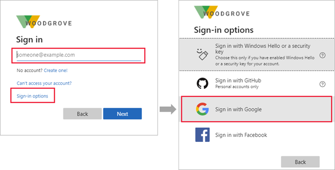

# Identity Providers for External Identities

> [!NOTE]
> Some of the features mentioned in this article are public preview features of Azure Active Directory. For more information about previews, see [Supplemental Terms of Use for Microsoft Azure Previews](https://azure.microsoft.com/support/legal/preview-supplemental-terms/).

An *identity provider* creates, maintains, and manages identity information while providing authentication services to applications. When sharing your apps and resources with external users, Azure AD is the default identity provider for sharing. This means when you invite external users who already have an Azure AD or Microsoft account, they can automatically sign in without further configuration on your part.

In addition to Azure AD accounts, External Identities offers a variety of identity providers.

- **Microsoft accounts** (Preview): Guest users can use their own personal Microsoft account (MSA) to redeem your B2B collaboration invitations. When setting up a self-service sign-up user flow, you can add [Microsoft Account (Preview)](microsoft-account.md) as one of the allowed identity providers. No additional configuration is needed to make this identity provider available for user flows.

- **Email one-time passcode** (Preview): When redeeming an invitation or accessing a shared resource, a guest user can request a temporary code, which is sent to their email address. Then they enter this code to continue signing in. The email one-time passcode feature authenticates B2B guest users when they can't be authenticated through other means. When setting up a self-service sign-up user flow, you can add **Email One-Time Passcode (Preview)** as one of the allowed identity providers. Some setup is required; see [Email one-time passcode authentication](one-time-passcode.md).

- **Google**: Google federation allows external users to redeem invitations from you by signing in to your apps with their own Gmail accounts. Google federation can also be used in your self-service sign-up user flows. See how to [add Google as an identity provider](google-federation.md).
   > [!IMPORTANT]
   > **Starting January 4, 2021**, Google is [deprecating WebView sign-in support](https://developers.googleblog.com/2020/08/guidance-for-our-effort-to-block-less-secure-browser-and-apps.html). If you’re using Google federation or self-service sign-up with Gmail, you should [test your line-of-business native applications for compatibility](google-federation.md#deprecation-of-webview-sign-in-support).

- **Facebook**: When building an app, you can configure self-service sign-up and enable Facebook federation so that users can sign up for your app using their own Facebook accounts. Facebook can only be used for self-service sign-up user flows and isn't available as a sign-in option when users are redeeming  invitations from you. See how to [add Facebook as an identity provider](facebook-federation.md).

- **Direct federation**: You can also set up direct federation with any external identity provider that supports the SAML or WS-Fed protocols. Direct federation allows external users to redeem invitations from you by signing in to your apps with their existing social or enterprise accounts. See how to [set up direct federation](direct-federation.md).
   > [!NOTE]
   > Direct federation identity providers can't be used in your self-service sign-up user flows.

## Adding social identity providers

Azure AD is enabled by default for self-service sign-up, so users always have the option of signing up using an Azure AD account. However, you can enable other identity providers, including social identity providers like Google or Facebook. To set up social identity providers in your Azure AD tenant, you'll create an application at the identity provider and configure credentials. You'll obtain a client or app ID and a client or app secret, which you can then add to your Azure AD tenant.

Once you've added an identity provider to your Azure AD tenant:

- When you invite an external user to apps or resources in your organization, the external user can sign in using their own account with that identity provider.
- When you enable [self-service sign-up](self-service-sign-up-overview.md) for your apps, external users can sign up for your apps using their own accounts with the identity providers you've added. They'll be able to select from the social identity providers options you've made available on the sign-up page:

   

For an optimal sign-in experience, federate with identity providers whenever possible so you can give your invited guests a seamless sign-in experience when they access your apps.  

## Next steps

To learn how to add identity providers for sign-in to your applications, refer to the following articles:

- [Add email one-time passcode authentication](one-time-passcode.md)
- [Add Google](google-federation.md) as an allowed social identity provider
- [Add Facebook](facebook-federation.md) as an allowed social identity provider
- [Set up direct federation](direct-federation.md) with any organization whose identity provider supports the SAML 2.0 or WS-Fed protocol. Note that direct federation is not an option for self-service sign-up user flows.
