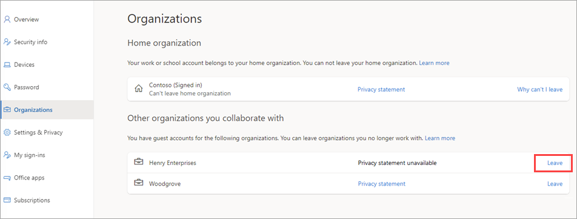

---

title: Leave an organization as a guest user - Azure Active Directory
description: Shows how an Azure AD B2B guest user can leave an organization by using the Access Panel.

services: active-directory
ms.service: active-directory
ms.subservice: B2B
ms.topic: how-to
ms.date: 05/09/2022

ms.author: mimart
author: msmimart
manager: celestedg
ms.reviewer: mal

ms.collection: M365-identity-device-management
---

# Leave an organization as a B2B collaboration user

An Azure Active Directory (Azure AD) B2B collaboration user can decide to leave an organization at any time if they no longer need to use apps from that organization or maintain any association.

- **B2B collaboration users** can usually leave an organization on their own without having to contact an administrator. This option won't be available if it's not allowed by the organization, or if the B2B collaboration user's account has been disabled. The user will need to contact the tenant admin, who can delete the account.

- **B2B direct connect users** don't currently have the option to leave the external organization. If you're a B2B direct connect user at an organization, you can contact your IT admin to submit a Data Subject Request, which is a request to remove the personal data associated with your B2B direct connect user account from the organization.
 
[!INCLUDE [GDPR-related guidance](../../../includes/gdpr-dsr-and-stp-note.md)]

## Leave an organization

In your My Account portal, on the Organizations page, you can view and manage the organizations you have access to:

- **Home organization**: Your home organization is listed first. This is the organization that owns your work or school account. Because your account is managed by your administrator, you're not allowed to leave your home organization. (If you don't have an assigned home organization, you'll just see a single heading that says Organizations with the list of your associated organizations.)
  
- **Other organizations you belong to**: You'll also see the other organizations that you've signed in to previously using your work or school account. You can leave any of these organizations at any time.

To leave an organization, follow these steps.

1. Go to your **My Account** page by doing one of the following:

   - If you're using a work or school account, go to https://myaccount.microsoft.com and sign in.
   - If you're using a personal account, go to https://myapps.microsoft.com and sign in, and then select your account icon in the upper right and select **View account**. Or, use a My Account URL that includes your tenant information to go directly to your My Account page (examples are shown in the following note).  
   > [!NOTE]
   > If you use the email one-time passcode feature when signing in, you'll need to use a My Account URL that includes your tenant name or tenant ID, for example: `https://myaccount.microsoft.com?tenantId=wingtiptoys.onmicrosoft.com` or `https://myaccount.microsoft.com?tenantId=ab123456-cd12-ef12-gh12-ijk123456789`.

1. Select **Organizations** from the left navigation pane or select the **Manage organizations** link from the **Organizations** block.

1. Under **Other organizations you belong to**, find the organization that you want to leave, and select **Leave organization**.

   
1. When asked to confirm, select **Leave**.

## Account removal

When a B2B collaboration user leaves an organization, the B2B collaboration user account is "soft deleted" in the directory. By default, the user object moves to the **Deleted users** area in Azure AD but isn't permanently deleted for 30 days. This soft deletion enables the administrator to restore the B2B collaboration user account, including groups and permissions, if the user makes a request to restore the account before it's permanently deleted.

If desired, a tenant administrator can permanently delete the account at any time during the soft-delete period:

1. In the [Azure portal](https://portal.azure.com), select **Azure Active Directory**.
2. Under **Manage**, select **Users**.
3. Select **Deleted users**.
4. Select the check box next to a deleted user, and then select **Delete permanently**.

If you permanently delete a B2B collaboration user account, this action is irrevocable.

## Next steps

- For an overview of Azure AD B2B, see [What is Azure AD B2B collaboration?](what-is-b2b.md)
