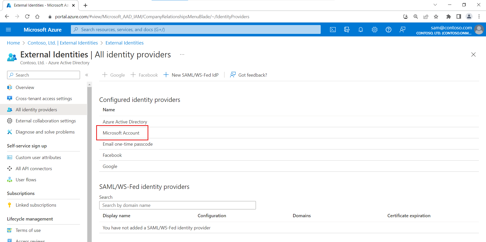
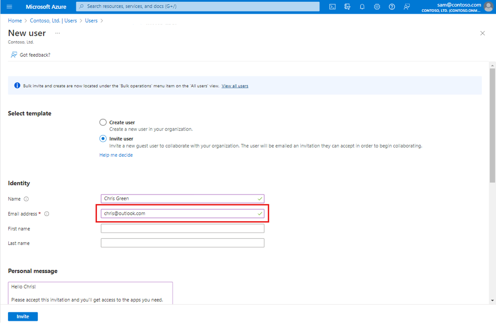
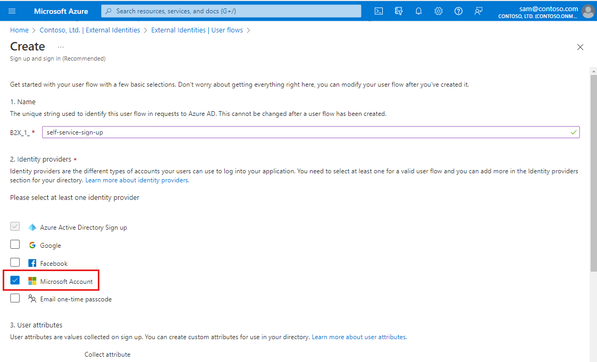

---

title: Microsoft account (MSA) identity provider in Azure AD
description: Use Azure AD to enable an external user (guest) to sign in to your Azure AD apps with their Microsoft account (MSA).

services: active-directory
ms.service: active-directory
ms.subservice: B2B
ms.topic: how-to
ms.date: 08/09/2021

ms.author: mimart
author: msmimart
manager: celestedg
ms.collection: M365-identity-device-management
---

# Microsoft account (MSA) identity provider for External Identities (Preview)

> [!NOTE]
> The Microsoft account identity provider is a public preview feature of Azure Active Directory. For more information about previews, see [Supplemental Terms of Use for Microsoft Azure Previews](https://azure.microsoft.com/support/legal/preview-supplemental-terms/).

Your B2B guest users can use their own personal Microsoft accounts for B2B collaboration without further configuration. Guest users can redeem your B2B collaboration invitations or complete your sign-up user flows using their personal Microsoft account.

Microsoft accounts are set up by a user to get access to consumer-oriented Microsoft products and cloud services, such as Outlook, OneDrive, Xbox LIVE, or Microsoft 365. The account is created and stored in the Microsoft consumer identity account system that's run by Microsoft.

## Guest sign-in using Microsoft accounts

Microsoft account is available in the list of External Identities identity providers by default. No further configuration is needed to allow guest users to sign in with their Microsoft account using either the invitation flow or a self-service sign-up user flow.

### Microsoft account in the invitation flow

When you [invite a guest user](add-users-administrator.md) to B2B collaboration, you can specify their Microsoft account as the email address they'll use to sign in.

### Microsoft account in self-service sign-up user flows

Microsoft account is an identity provider option for your self-service sign-up user flows. Users can sign up for your applications using their own Microsoft accounts. First, you'll need to [enable self-service sign-up](self-service-sign-up-user-flow.md) for your tenant. Then you can set up a user flow for the application and select Microsoft account as one of the sign-in options.

## Verifying the application's publisher domain
As of November 2020, new application registrations show up as unverified in the user consent prompt unless [the application's publisher domain is verified](../active-directory/develop/howto-configure-publisher-domain.md) ***and*** the company’s identity has been verified with the Microsoft Partner Network and associated with the application. ([Learn more](../active-directory/develop/publisher-verification-overview.md) about this change.) Note that for Azure AD user flows, the publisher’s domain appears only when using a Microsoft account or other [Azure AD tenant](azure-ad-account.md) as the identity provider. To meet these new requirements, do the following:

1. [Verify your company identity using your Microsoft Partner Network (MPN) account](../partner-center/verification-responses.md). This process verifies information about your company and your company’s primary contact.
1. Complete the publisher verification process to associate your MPN account with your app registration using one of the following options:
   - If the app registration for the Microsoft account identity provider is in an Azure AD tenant, [verify your app in the App Registration portal](../active-directory/develop/mark-app-as-publisher-verified.md).
   - If your app registration for the Microsoft account identity provider is in an Azure AD B2C tenant, [mark your app as publisher verified using Microsoft Graph APIs](../active-directory/develop/troubleshoot-publisher-verification.md#making-microsoft-graph-api-calls) (for example, using Graph Explorer).

## Next steps

- [Add Azure Active Directory B2B collaboration users](add-users-administrator.md)
- [Add self-service sign-up to an app](self-service-sign-up-user-flow.md)