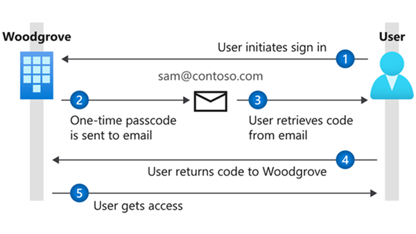
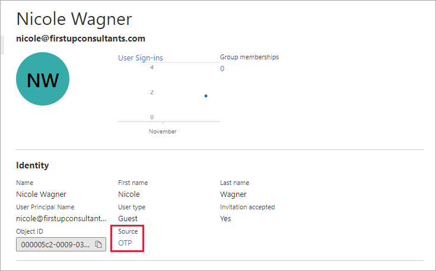
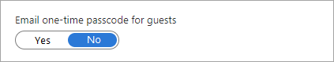
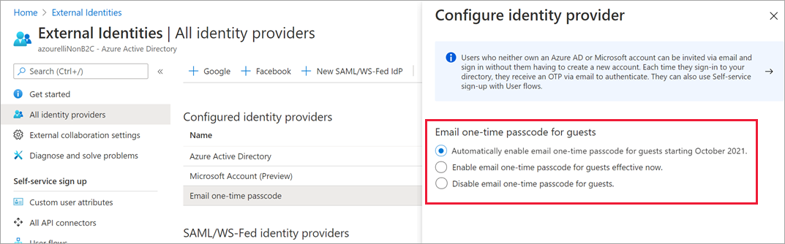

---

title: One-time passcode authentication for B2B guest users - Azure AD
description: How to use Email one-time passcode to authenticate B2B guest users without the need for a Microsoft account.

services: active-directory
ms.service: active-directory
ms.subservice: B2B
ms.topic: how-to
ms.date: 04/06/2021

ms.author: mimart
author: msmimart
manager: CelesteDG
ms.reviewer: mal
ms.custom: "it-pro, seo-update-azuread-jan, seoapril2019"
ms.collection: M365-identity-device-management
---

# Email one-time passcode authentication

This article describes how to enable email one-time passcode authentication for B2B guest users. The email one-time passcode feature authenticates B2B guest users when they can't be authenticated through other means like Azure AD, a Microsoft account (MSA), or Google federation. With one-time passcode authentication, there's no need to create a Microsoft account. When the guest user redeems an invitation or accesses a shared resource, they can request a temporary code, which is sent to their email address. Then they enter this code to continue signing in.

> [!IMPORTANT]
> - **Starting October 2021**, the email one-time passcode feature will be turned on for all existing tenants and enabled by default for new tenants. If you don't want to allow this feature to turn on automatically, you can disable it. See [Disable email one-time passcode](#disable-email-one-time-passcode) below.
> - Email one-time passcode settings have moved in the Azure portal from **External collaboration settings** to **All identity providers**.

> [!NOTE]
> One-time passcode users must sign in using a link that includes the tenant context (for example, `https://myapps.microsoft.com/?tenantid=<tenant id>` or `https://portal.azure.com/<tenant id>`, or in the case of a verified domain, `https://myapps.microsoft.com/<verified domain>.onmicrosoft.com`). Direct links to applications and resources also work as long as they include the tenant context. Guest users are currently unable to sign in using endpoints that have no tenant context. For example, using `https://myapps.microsoft.com`, `https://portal.azure.com` will result in an error.

## User experience for one-time passcode guest users

When the email one-time passcode feature is enabled, newly invited users [who meet certain conditions](#when-does-a-guest-user-get-a-one-time-passcode) will use one-time passcode authentication. Guest users who redeemed an invitation before email one-time passcode was enabled will continue to use their same authentication method.

With one-time passcode authentication, the guest user can redeem your invitation by clicking a direct link or by using the invitation email. In either case, a message in the browser indicates that a code will be sent to the guest user's email address. The guest user selects **Send code**:

   

A passcode is sent to the user’s email address. The user retrieves the passcode from the email and enters it in the browser window:

   

The guest user is now authenticated, and they can see the shared resource or continue signing in.

> [!NOTE]
> One-time passcodes are valid for 30 minutes. After 30 minutes, that specific one-time passcode is no longer valid, and the user must request a new one. User sessions expire after 24 hours. After that time, the guest user receives a new passcode when they access the resource. Session expiration provides added security, especially when a guest user leaves their company or no longer needs access.

## When does a guest user get a one-time passcode?

When a guest user redeems an invitation or uses a link to a resource that has been shared with them, they’ll receive a one-time passcode if:

- They do not have an Azure AD account
- They do not have a Microsoft account
- The inviting tenant did not set up Google federation for @gmail.com and @googlemail.com users

At the time of invitation, there's no indication that the user you're inviting will use one-time passcode authentication. But when the guest user signs in, one-time passcode authentication will be the fallback method if no other authentication methods can be used.

You can see whether a guest user authenticates using one-time passcodes by viewing the **Source** property in the user's details. In the Azure portal, go to **Azure Active Directory** > **Users**, and then select the user to open the details page.

> [!NOTE]
> When a user redeems a one-time passcode and later obtains an MSA, Azure AD account, or other federated account, they'll continue to be authenticated using a one-time passcode. If you want to update the user's authentication method, you can [reset their redemption status](reset-redemption-status.md).

### Example

Guest user teri@gmail.com is invited to Fabrikam, which does not have Google federation set up. Teri does not have a Microsoft account. They'll receive a one-time passcode for authentication.

## Disable email one-time passcode

Starting October 2021, the email one-time passcode feature will be turned on for all existing tenants and enabled by default for new tenants. At that time, Microsoft will no longer support the redemption of invitations by creating unmanaged ("viral" or "just-in-time") Azure AD accounts and tenants for B2B collaboration scenarios. We're enabling the email one-time passcode feature because it provides a seamless fallback authentication method for your guest users. However, you have the option of disabling this feature if you choose not to use it.

> [!NOTE]
>
> If the email one-time passcode feature has been enabled in your tenant and you turn it off, any guest users who have redeemed a one-time passcode will not be able to sign in. You can [reset their redemption status](reset-redemption-status.md) so they can sign in again using another authentication method.

### To disable the email one-time passcode feature

1. Sign in to the [Azure portal](https://portal.azure.com/) as an Azure AD global administrator.

2. In the navigation pane, select **Azure Active Directory**.

3. Select **External Identities** > **All identity providers**.

4. Select **Email one-time passcode**, and then select **Disable email one-time passcode for guests**.

   > [!NOTE]
   > Email one-time passcode settings have moved in the Azure portal from **External collaboration settings** to **All identity providers**.
   > If you see a toggle instead of the email one-time passcode options, this means you've previously enabled, disabled, or opted into the preview of the feature. Select **No** to disable the feature.
   >
   >

5. Select **Save**.

## Note for public preview customers

If you've previously opted in to the email one-time passcode public preview, the October 2021 date for automatic feature enablement doesn't apply to you, so your related business processes won't be affected. Additionally, in the Azure portal, under the **Email one-time passcode for guests** properties, you won't see the option to **Automatically enable email one-time passcode for guests starting October 2021**. Instead, you'll see the following **Yes** or **No** toggle:

However, if you'd prefer to opt out of the feature and allow it to be automatically enabled in October 2021, you can revert to the default settings by using the Microsoft Graph API [email authentication method configuration resource type](/graph/api/resources/emailauthenticationmethodconfiguration). After you revert to the default settings, the following options will be available under **Email one-time passcode for guests**:

- **Automatically enable email one-time passcode for guests starting October 2021**. (Default) If the email one-time passcode feature is not already enabled for your tenant, it will be automatically turned on starting October 2021. No further action is necessary if you want the feature enabled at that time. If you've already enabled or disabled the feature, this option will be unavailable.

- **Enable email one-time passcode for guests effective now**. Turns on the email one-time passcode feature for your tenant.

- **Disable email one-time passcode for guests**. Turns off the email one-time passcode feature for your tenant, and prevents the feature from turning on in October 2021.

## Note for Azure US Government customers

The email one-time passcode feature is disabled by default in the Azure US Government cloud. Your partners will be unable to sign in unless this feature is enabled. Unlike the Azure public cloud, the Azure US Government cloud doesn't support redeeming invitations with self-service Azure Active Directory accounts.

 

To enable the email one-time passcode feature in Azure US Government cloud:

1. Sign in to the [Azure portal](https://portal.azure.com) as an Azure AD global administrator.
2. In the navigation pane, select **Azure Active Directory**.
3. Select **Organizational relationships** > **All identity providers**.

   > [!NOTE]
   > - If you don't see **Organizational relationships**, search for "External Identities” in the search bar at the top.

4. Select **Email one-time passcode**, and then select **Yes**.
5. Select **Save**.

For more information about current limitations, see [Azure US Government clouds](current-limitations.md#azure-us-government-clouds).
